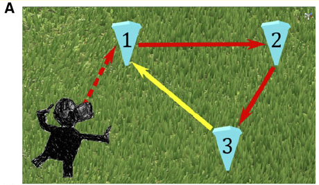
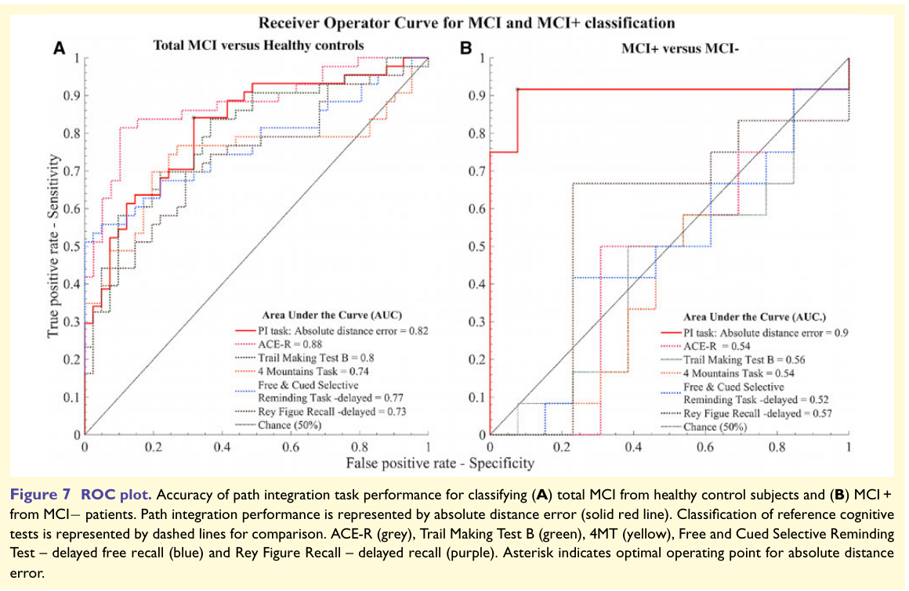

# 阿尔茨海默病与脑部训练的预防可能性

进行中 · 正文起草与数据审核并行。

目前新版正文去重计数：107,981 汉字 / 目标至少 100,000 汉字；不是已完成十万字报告。

新版正文汉字；排除代码、导航、来源列表、英文全文、计划标题和重复段落

用途：个人非商业研究与多端阅读；文献许可、原文与原创解析分别记录。

# 第一部分｜什么是阿尔茨海默病

从生活实例和基本概念开始，区分正常老化、MCI、痴呆与AD。先建立疾病、症状和病理不是同一个标签的理解。

阅读问题：读完应能解释：AD是什么，它与一般健忘、MCI和痴呆有什么关系？

## 01｜从一个生活例子理解阿尔茨海默病

先理解这是一种影响脑功能、进而影响日常独立生活的疾病，再讨论蛋白、脑区和预防。

状态：起草完成，审核进行中。

### 先用一句话理解

阿尔茨海默病是一种逐渐影响记忆、思考和行为能力的脑部疾病。它是痴呆的常见病因；“痴呆”描述的是认知下降已经明显影响生活的一种综合状态，“阿尔茨海默病”则是在解释这种状态由哪类疾病造成。这里沿用规范译名，并把“阿兹海默”作为检索别名。

依据：[S37](https://www.nia.nih.gov/health/alzheimers-and-dementia/what-alzheimers-disease), [S38](https://www.nia.nih.gov/health/alzheimers-and-dementia/what-dementia-symptoms-types-and-diagnosis)

### 生活例子：我们真正关心的是什么

下面是说明性例子，不是真实病例，也不是诊断测试。假设一位原本能独立安排生活的人，在一段时间内反复错过约定、忘记刚谈过的事情，后来连原本熟悉的缴费或出行安排也需要别人接手。研究者关心的并不是“这个人偶尔忘了一个词”，而是能力相对过去是否出现持续变化、变化涉及哪些过程，以及它怎样影响生活。

同样一个“忘了买东西”的结果，可以来自不同过程：有人根本没有听清购物要求，有人听清后被别的事情打断，有人记住了物品却忘了什么时候去，有人知道任务却难以安排路线。先把行为拆开，才有机会讨论脑功能；否则把所有失败都叫作“记忆力差”，会让研究问题从一开始就混乱。

这个例子的价值在于提醒我们观察一个人的变化轨迹。若只记录今天是否买到了东西，就丢失了原有能力、信息是否听清、是否获得帮助和生活条件等信息。它没有告诉我们疾病名称；疾病判断还要依赖专业评估。对于个人研究，先理解“表现”“变化”和“病因”不是同一个对象，比先记住十几个蛋白缩写更有用。

### 在深入之前｜脑部变化的基本词汇

疾病不只是记忆测试的分数下降。NIA的基础说明将异常蛋白、神经元连接丢失及细胞功能变化放在脑部过程内解释。Aβ斑块与tau缠结是重要病理特征，但详细机制不能简化为两种蛋白解释全部病例。

初读时可先把细胞、连接、回路和行为区分开：神经元是细胞，突触是细胞交流的连接部位，回路与网络描述许多细胞协同的组织，而行为是我们观察到的结果。后面的影像与临床章节会检查这些层次怎样联系。

| 词汇 | 初读时怎样理解 | 后续要继续核对 |
| --- | --- | --- |
| Aβ与tau | 与AD病理相关的蛋白变化 | 不同形式、位置与发展阶段 |
| 神经元 | 参与信息处理的细胞 | 功能异常与死亡不是同一状态 |
| 突触 | 细胞之间传递信息的连接部位 | 结构、功能与密度如何测量 |
| 海马与内嗅皮层 | 常见记忆相关早期受影响区域 | 不是每个人唯一受损位置 |
| 脑萎缩 | 组织体积减少的表现 | 不能单独确认AD病因 |

依据：[S116](https://www.nia.nih.gov/health/alzheimers-causes-and-risk-factors/what-happens-brain-alzheimers-disease)

### 看见表现、解释病因、测量脑部变化：三层问题

可以把研究资料放在三张不同的纸上。第一张记录发生了什么，例如反复提问、难以完成原有事务；第二张记录为什么发生，需要区分 AD 与其他病因；第三张记录有什么客观测量，例如影像、实验室指标或认知测验。三张纸相互补充，但任何一张都不能替代其他两张。

在阅读论文时，先问作者使用的是哪张纸。认知训练论文可能只报告一项测验变好了；这属于行为测量，不一定测过病理，也可能没有追踪临床诊断。影像论文可能描述两种指标的关系，却没有实施训练。只有先认清研究对象，才能避免把几篇论文拼成它们各自都没有证明的结论。

本专题之后会把临床表现、脑部测量与训练结果分栏显示。你可以从一个表现追到相关机制，也可以从一项干预追到它真正测量的终点；不需要在首次阅读时掌握所有技术细节。

### 为什么疾病名称不等于“所有人都会同样发展”

NIA 的基础说明强调表现存在差异，记忆问题常见，但语言、视觉空间、推理或判断方面的问题也可能较早出现；混合痴呆同样常见。这里不提供固定的个人时间表，也不把某个脑区变化当作所有病例的唯一解释。

依据：[S37](https://www.nia.nih.gov/health/alzheimers-and-dementia/what-alzheimers-disease)

### 从这里进入“训练可能有效”的问题

把训练加入上面的例子，需要更具体的目标。如果任务帮助一个人学会更好地记录约定，它可能改善某项生活安排；如果训练后在没有练过的测验上也有收益，研究的是认知迁移；如果长期随访中更少人达到预先规定的临床终点，才开始回答预防或延缓的问题。三个目标都值得研究，但它们需要不同的证据。

因此，本专题不会一开始就问“玩什么游戏可以预防”。先问我们希望改变的是任务技巧、独立能力、症状出现时间，还是疾病病理。这个问题决定后续需要选择什么人群、什么对照、多久随访，以及什么结果才算支持假设。

你提出的目标是长期研究问题：脑部训练是否可能让尚未明显受损的人保持功能更久，或者降低后来出现临床 AD 的可能性。我们会先解释疾病，再把这个宽问题拆为可检验的子问题，而不是用游戏等级或脑区标签代替答案。

### 读完这一节应能回答

- “AD”是病因名称，“痴呆”是临床综合状态；不能把两者完全画等号。
- 先观察相对过去的变化及生活影响，再讨论导致变化的病因。
- 行为表现、脑部指标、训练结果是不同层次的资料。
- 后续阅读先走概念与表现主线，再进入机制和干预数据。

### 该章原文来源

- [S37｜NIA：什么是阿尔茨海默病](https://www.nia.nih.gov/health/alzheimers-and-dementia/what-alzheimers-disease) · 正文检索快照。2025-03-04 复核日期；直接访问偶有 405，已取得正文检索快照。
- [S38｜NIA：痴呆的症状、类型与诊断](https://www.nia.nih.gov/health/alzheimers-and-dementia/what-dementia-symptoms-types-and-diagnosis) · 正文检索快照。年份为访问年份，不表示原始发布于 2026。
- [S116｜NIA｜What Happens to the Brain in Alzheimer’s Disease?](https://www.nia.nih.gov/health/alzheimers-causes-and-risk-factors/what-happens-brain-alzheimers-disease) · 官方正文检索索引；访问年份非发布年份。教学概述，不是独立训练试验

## 02｜正常老化、MCI、痴呆与 AD：四个词怎样区分

把临床严重程度和疾病病因分开，才不会误读预防论文中的人群与终点。

状态：起草完成，审核进行中。

### 先建立两个维度

“正常老化—轻度认知障碍—痴呆”主要在描述认知和日常功能状态；“阿尔茨海默病、血管性病变、路易体相关疾病”等在解释病因。两类词放在不同维度上，才能理解为什么同样处于 MCI 的人并不一定有相同病因，也为什么 AD 相关病理可以出现在不同临床状态中。关于生物学定义的具体争议，另见分期章节。

依据：[S38](https://www.nia.nih.gov/health/alzheimers-and-dementia/what-dementia-symptoms-types-and-diagnosis), [S40](https://www.nia.nih.gov/health/memory-loss-and-forgetfulness/what-mild-cognitive-impairment)

### MCI 的核心不是“轻微的 AD”

轻度认知障碍，简称 MCI，表示相对同龄预期存在可识别的记忆或思考问题，但日常独立能力大体保留。它不是一种单一病因，也不能只凭自己觉得记性不好或一项游戏低分认定。并非所有 MCI 都会进展为痴呆；部分人的状态可能稳定或改变。

依据：[S40](https://www.nia.nih.gov/health/memory-loss-and-forgetfulness/what-mild-cognitive-impairment)

### 用一张二维表组织资料

| 问题 | 在描述哪个维度 | 阅读时怎样使用 |
| --- | --- | --- |
| 是否出现认知问题、是否影响独立生活 | 临床状态与严重度 | 确定研究纳入的是正常、MCI 还是痴呆人群 |
| 问题由哪类疾病或多重因素造成 | 病因 | 判断论文是否针对 AD 而非全因痴呆 |
| 是否检出特定病理相关指标 | 生物学证据 | 看作者是否有病理支持及采用何种标准 |
| 一个人后续怎样变化 | 纵向结果 | 区分稳定、测验变化和诊断发生 |

### 说明性例子：为什么不能把四个词写成一条必然阶梯

设想资料中有三个人。甲主观觉得比以前容易忘事，但评估结果与独立生活仍处在正常范围；乙在评估中出现认知问题，却能独立处理日常事务；丙已经难以独立完成原来熟悉的事务。这个例子只是在演示状态差异，不是在为三个人确诊，也不能推出他们必然依次经过同一条路线。

若随后为乙取得了某种 AD 相关病理证据，新增的是病因/生物学信息，不是自动宣布乙与丙拥有同样的功能水平。若没有这种证据，也不能因为乙有认知问题就默认病因是 AD。读者可以把每个人放在“状态”和“病因证据”两栏里，而不是在一个从健康滑向 AD 的箭头上排位置。

这个二维组织方法也适合个人笔记。每读一篇论文，先写“谁被纳入”，再写“作者如何判断其病因”。如果原文只写没有痴呆，不能擅自补成所有人认知完全正常；如果只写 MCI，不能补成经病理证实的 AD 前期。

### 论文里最容易混淆的三个说法

“没有痴呆”是很宽的排除条件，不一定排除了 MCI 或所有病理改变。“认知正常”通常也依赖该研究采用的评估标准，不能从一句话推断所有脑部指标正常。“AD 及相关痴呆”是合并类别，结果可能包括不止一种病因。数据库会保留原论文的纳入与终点名称，避免在中文页面中替换成更强的 AD 特异性结论。

这并不是术语上的小区别。假设一个训练在一般认知正常老年人中改善了速度测验，把结论用于已影响独立生活的人群，改变了受试者；把速度测验改善改写为预防 AD，改变了结果；把数周训练改写为长期保护，又改变了时间范围。三种变化都需要额外证据。

### 读文献时的四行笔记

第一行：基线状态是正常、MCI、痴呆，还是混合人群？第二行：病因如何判断，是否有生物标志物支持？第三行：终点是测验、功能、临床诊断还是病理？第四行：谁没有被纳入，哪些人可能不适用？

这四行笔记可以显著减少“论文标题似乎支持我的想法，但正文其实研究了另一个问题”的情况。它也为后面所有训练研究建立共同语言：同一个积极结果只有在同样的人群和结果范围内才有直接解释，超出范围只能讨论可能性。

### 该章原文来源

- [S38｜NIA：痴呆的症状、类型与诊断](https://www.nia.nih.gov/health/alzheimers-and-dementia/what-dementia-symptoms-types-and-diagnosis) · 正文检索快照。年份为访问年份，不表示原始发布于 2026。
- [S40｜NIA：什么是轻度认知障碍](https://www.nia.nih.gov/health/memory-loss-and-forgetfulness/what-mild-cognitive-impairment) · 正文检索快照。年份为访问年份；没有采用统一个人转归百分比。

## 03｜病理变化与症状：为什么不是同一条时间线

从“今天是否看得出问题”到“脑部过程何时变化”，理解为什么预防研究需要较长时间。

状态：起草完成，审核进行中。

### 先把三只钟分开

第一只钟记录疾病相关生物过程，第二只钟记录认知测量的变化，第三只钟记录日常生活是否受到明显影响。早期研究框架已讨论临床前阶段；2012 年常染色体显性遗传 AD 队列也描述了症状出现前的多种标志物变化。但这些研究不能给一般读者提供精确的个人发病倒计时。

依据：[S55](https://pubmed.ncbi.nlm.nih.gov/21514248/), [S56](https://pubmed.ncbi.nlm.nih.gov/22784036/)

### 为什么“没有症状”不回答所有问题

“没有明显症状”是对某个时点临床表现的描述。它没有说明采用了哪些测量、有没有足够敏感的评估，也没有说明相关病理是否存在。反过来，有主观变化也不能直接确定病理。Jessen 等提出主观认知下降的研究框架，正是为了让相关研究使用更清楚的定义与报告特征，而不是把所有担忧都当作早期 AD。

依据：[S57](https://pubmed.ncbi.nlm.nih.gov/24798886/)

### 用一张示意时间表帮助理解

下面是概念示意，不是自然病程数据，也不是所有人必经的阶段。可以设想在某个研究中，第一次检出指标变化、第一次检出独立测验变化、第一次发现生活功能明显变化，发生在不同测量时间。若研究只在最后一个时间点才开始记录，就无法知道之前的变化如何出现；若只在第一个时间点记录，又无法知道后来临床发生了什么。

这种示意图的重点是测量时点，而不是把早期一定有多少年画得很精确。不同指标有不同检测门槛，同一指标也可能受平台、参照和人群影响。看见两条曲线开始变化的先后，需要知道曲线如何建立、每个人是否被反复测量，以及样本是否代表目标人群。

### 把横断面和纵向研究分开读

横断面研究在不同人身上测量不同状态，可能用模型把他们排列成一个过程。纵向研究在同一个人身上重复测量，能够观察个体变化，但也会遇到退出、死亡、测量变更和缺失。前者不是每个人的真实录像，后者也不是无条件完整的记录。

如果一篇文章用“距离预计症状出现还有多少年”组织样本，要检查预计时间如何得到。对具有特定遗传背景的家系，研究有机会使用家族信息建立模型；对普通散发病例，不能直接照搬这一时间标尺。这个区别决定模型能否用来说明一般人群，也决定我们应如何描述结论的适用范围。

### 为什么预防试验比短期训练试验难

若目标是观察临床诊断是否更少出现，研究需要有足够的人数、随访时间和终点事件。短期训练试验可以较快观察任务和测验变化，但疾病终点可能还没有机会发生。这里的难点不是把训练做得更久就一定有效，而是研究有没有条件观测想回答的问题。

可以用一个方法学例子说明：在一群基线表现良好的人中观察几周，即使所有人都没有达到临床终点，也不能推断训练阻止了疾病。没有事件可能是这段时间本来就很少发生、样本不足或评估方式不合适。因而“没有人患病”需要与对照组、基线风险和随访范围一起阅读。

### 对于个人研究，这意味着怎样整理资料

把每篇论文的时间信息至少拆成三格：干预持续多久、结果何时测量、临床随访多久。一次训练结束后的测验改善与多年后临床发生率是不同时间的结果；它们不应合并成一栏“长期有效”。

还要保存测量方法的版本。如果随访从面对面评估变成电话、病例记录或理赔数据，资料仍可能有价值，但比较时必须考虑定义和发现概率是否改变。后面的 ACTIVE 随访章节将具体展示这类问题。

### 原文表6｜临床阶段按表现与功能组织

2024框架的临床阶段并非仅按记忆分数排列。阶段1强调有标志物证据但没有近期变化；阶段2允许检测仍处预期范围，却存在相对个人基线的持续变化；阶段3已有客观受损并出现复杂活动效率影响。

下表为原创压缩导读，不代替原文完整定义。阶段0是特殊的确定性遗传背景类别，不能当作每个人普通老化的起点。

| 阶段 | 导读描述 | 功能重点 |
| --- | --- | --- |
| 0 | 无症状，确定性遗传背景 | 需考虑个人基线 |
| 1 | 标志物证据，无近期临床变化 | 无症状 |
| 2 | 相对基线持续轻微变化 | 仍完全独立 |
| 3 | 客观认知受损 | 复杂活动可能更慢但仍能完成 |
| 4 | 轻度痴呆相关功能影响 | 工具性活动下降，基本活动独立 |
| 5 | 中度功能影响 | 基本活动需要帮助 |
| 6 | 严重功能影响 | 基本活动完全依赖 |

依据：[S03](https://pmc.ncbi.nlm.nih.gov/articles/PMC11350039/)

### 阶段2为何不等于任何一次忘事

原文阶段2强调相对个人基线的变化、持续过程及功能条件，不是用一次主观担心替代判断。表现仍可处正常测验范围，所以群体阈值与个人变化不是同一问题。

同样，主观变化有多种解释。睡眠、情绪、感觉和其他健康背景需要考虑，不能因为表中允许主观报告就将所有担心命名为AD。这里的临床阶段还处在AD连续谱框架内，不是通用网页自测。

研究记录应保留时间和来源，区分本人描述、观察者资料和纵向测验。一个总分不能完全覆盖这些信息。

依据：[S03](https://pmc.ncbi.nlm.nih.gov/articles/PMC11350039/)

### 阶段3与4的功能区别

阶段3可仍独立完成日常活动，但复杂活动更费时或效率下降；阶段4则出现更明确工具性日常活动功能受损，基本活动仍独立。功能不是简单能做或不能做两个按钮。

教学例子中，自己安排账单但耗时增加，与需要他人实际接管安排，可能提示不同功能情况；这些例子不能单独诊断。真实判断需结合既往能力、环境和帮助方式。

训练研究应明确目标。提高复杂任务效率、减少帮助需求和改变疾病进展是不同结局，阶段差异帮助选择测量而不提供疗效。

依据：[S03](https://pmc.ncbi.nlm.nih.gov/articles/PMC11350039/)

### 原文表7｜两个轴不能合并

框架将生物学阶段与临床阶段并列，允许相同病理阶段出现不同临床表现。作者讨论共病理或储备等解释，说明典型轨迹之外存在个体差异。

因此不能从一个标志物直接读出功能阶段，也不能从需要帮助反推某个蛋白负荷。两个轴提供不同信息，合并成一个大脑年龄会丢掉疾病判断的重要层次。

未来数据库可以分别保存生物与临床字段，并关联检查时间。若资料缺失，保持未知而不是用另一轴猜填。

依据：[S03](https://pmc.ncbi.nlm.nih.gov/articles/PMC11350039/)

### 训练方案与分期的连接

认知正常但具有病理证据的人群、已有客观受损的人群及需要帮助的人群，任务负担和研究目标不同。不能将一款游戏在一个阶段的学习收益扩展到全部病程。

可用性设计也应区分独立使用与支持使用，但支持程度会影响成绩，需要记录。临床功能收益可以有价值，不要求每项结果都说明病理逆转。

本次补充来自原文表6和表7。它加强了分期解释，仍需与其他框架分歧及实际临床评估关联，不作为个人诊断工具。

依据：[S03](https://pmc.ncbi.nlm.nih.gov/articles/PMC11350039/)

### 本节结论

疾病相关过程、认知表现和生活影响可以在不同时间尺度上被发现。临床前研究让预防问题有了更明确的空间，但“更早有变化”本身并不证明训练能改变变化。研究需要找到可干预的过程，再用适合的终点和时间设计检验它。

### 该章原文来源

- [S55｜Sperling 等：临床前阿尔茨海默病研究框架](https://pubmed.ncbi.nlm.nih.gov/21514248/) · 摘要与元数据。历史研究框架，和 2024 标准分开；不是健康人的自我筛查指南。
- [S56｜Bateman 等：常染色体显性遗传 AD 的临床与标志物变化](https://pubmed.ncbi.nlm.nih.gov/22784036/) · 摘要/期刊概要与元数据。特殊遗传人群的时间模型不能直接用于散发性 AD 或个人倒计时。
- [S57｜Jessen 等：主观认知下降研究框架](https://pubmed.ncbi.nlm.nih.gov/24798886/) · 摘要。主观担忧不等于 AD；研究特征不是个人诊断规则。

## 04｜记忆、判断和独立生活：疾病影响的是什么

用一件日常事务拆解多个认知过程，理解为何不能只用记忆游戏分数描述疾病。

状态：起草完成，审核进行中。

### 日常功能为什么是重要的一层

临床痴呆概念包含认知下降对日常活动的影响。生活功能信息、认知评估和病史是评估中的不同资料；专业诊断建议也并不只依靠一项记忆分数。这里解释研究问题，不提供诊断阈值。

依据：[S38](https://www.nia.nih.gov/health/alzheimers-and-dementia/what-dementia-symptoms-types-and-diagnosis), [S41](https://www.nia.nih.gov/health/health-care-professionals-information/assessing-cognitive-impairment-older-patients), [S58](https://pubmed.ncbi.nlm.nih.gov/21514250/)

### 说明性任务：准备一次出门

假设一位成年人要去熟悉的地点办事。这项任务至少包括理解办事目的、记住时间、选择路线、带上资料、按照条件调整安排、发现错误并修正，以及在回来后记住已经完成了什么。这不是一个现成量表，而是为了说明日常任务通常同时使用多个过程。

若只记录是否到达目的地，很多不同原因会被混在一起：没有听清目的地、忘了时间、忘带资料、途中分心、走错路线、看不清路标，或者临时交通变化。若研究希望知道训练影响了哪一环，就需要更细的结果，而不是给整件事情贴一个“记忆好坏”标签。

### 能力和实际表现为何要分别观察

一个人在某种环境下完成了任务，不等于所有条件下都有同样表现。笔记、提醒、熟悉路线和他人协助可以帮助完成；不熟悉环境或新的操作界面又可能增加困难。对个人研究而言，记录支持条件不是在贬低成绩，而是让成绩有可解释的上下文。

这个原则也适用于认知游戏。电脑操作熟练的人可能更快理解按钮；触控目标变大后误点减少，分数可能上升；增加示范后规则更清楚，任务也可能更容易完成。这些变化都值得记录，但若研究的是认知过程本身，就必须与界面学习、感觉输入和外部帮助分开。

### 用三种结果描述同一个人

第一种结果是“在指定条件下是否能完成任务”，属于任务表现。第二种是“在生活中是否能持续独立处理相关事务”，属于功能层面。第三种是“相对过去的变化是否由某种疾病造成”，属于病因判断。三者不能只用一次实验回答。

例如，一项训练教会了更系统的记事策略，研究可能发现特定生活事务更容易管理。这是一项有价值的功能结果，未必意味着相关病理改变。反过来，一个实验室测验改善也未必自动改善复杂的生活事务，因为任务环境、策略和支持条件不同。

### 怎样把功能问题纳入文献提取

| 要记录的问题 | 原因 |
| --- | --- |
| 由本人、家属还是独立观察者报告 | 不同资料来源可能观察到不同范围 |
| 问的是过去一段时间还是当场任务 | 回顾报告与现场表现不是同一测量 |
| 是否记录所用提醒、帮助或替代方式 | 支持条件会改变可见表现 |
| 功能变化是否是预先规定的结果 | 减少事后选择有利指标 |
| 分组信息是否可能影响评分 | 降低期待和报告差异的影响 |
| 是否有生活条件或感觉/运动变化 | 避免把全部变化归因于认知 |

### 本研究为什么把生活功能放在任务成绩之后

任务成绩是离训练最近的结果，便于判断训练是否真的被执行和学会。独立认知测验能进一步观察是否离开原任务仍有变化。生活功能则更接近个人想要保留的能力，但通常更复杂、更依赖环境。三层都应保留，不能为了追求一个简单答案而删掉其中两层。

对于你的主问题，较理想的长期研究会同时记录任务、独立认知、功能和临床终点，从而发现训练是否只改变了技巧，是否支持了更广泛的表现，或者是否与更晚的临床变化相联系。当前每篇文献能够覆盖哪几层，将在证据卡中直接标明。

### 读者练习：重新描述一个“记忆变差”的观察

把“记忆变差”改写成四条具体信息：哪件事情没有完成；相对什么时候有变化；当时有哪些帮助或干扰；变化怎样影响实际生活。这是整理研究资料的练习，不是医疗自测。你会发现，具体描述通常比一个总标签更容易连接到文献和机制。

### 该章原文来源

- [S38｜NIA：痴呆的症状、类型与诊断](https://www.nia.nih.gov/health/alzheimers-and-dementia/what-dementia-symptoms-types-and-diagnosis) · 正文检索快照。年份为访问年份，不表示原始发布于 2026。
- [S41｜NIA：老年患者认知障碍评估](https://www.nia.nih.gov/health/health-care-professionals-information/assessing-cognitive-impairment-older-patients) · 正文检索可访问部分。详细临床流程仍需与专科指南全文核验。
- [S58｜McKhann 等：AD 痴呆临床诊断建议](https://pubmed.ncbi.nlm.nih.gov/21514250/) · 摘要与元数据。历史标准，用于解释临床问题；当前专科诊断还需与更新指南核对。

## 05｜记忆型与非典型表型：不是每个人都先忘事

先看表现模式，再追溯病因，避免只用记忆问题认识 AD。

状态：起草完成，审核进行中。

### 表型是什么

表型是疾病或状态在一个人身上可观察到的表现组合。AD 的病理相关过程可以对应不同的早期表现；常见记忆型表现之外，也存在以语言、后部视觉空间或其他功能为主的表型。IWG 建议把临床表型与病理相关证据一起考虑，不能把所有认知问题都归为同一种疾病。

依据：[S66](https://pubmed.ncbi.nlm.nih.gov/33933186/)

### 记忆型表现怎样组织

“记忆型”不只是忘记词语。研究会检查学习新信息、经过间隔后的保留、自由提取、提示和识别等过程，观察相对突出的问题模式。一个人可能还能使用多年积累的知识和熟悉技能，却较难保留近期事件；具体模式必须用适当测量判断，不能只凭家属一句描述确定。

对于个人阅读，我们要把“最近发生的事情”“长期知识”“熟悉动作”和“暂时维持的信息”分开。它们日常都可能被叫作记忆，却在任务要求和相关系统上有区别。下一章会用学习过程拆解这种差异。

### 后部皮质萎缩综合征的线索

2017 年 PCA 共识提出综合征层、其他综合征特征与病因层的分层分类。早期可突出视觉或其他后部皮质相关功能困难，部分人还可能以计算、书写或动作相关问题表现；综合征名称本身并未唯一确定 AD 病因。

依据：[S59](https://pubmed.ncbi.nlm.nih.gov/28259709/)

### 为什么“看不清”需要更具体描述

说明性例子：甲因为文字太小无法看清，放大后能够阅读；乙能看见单个字，却在复杂页面中难以找到目标；丙能识别某些元素，却难以把它们组织成空间关系。这些例子是为了区分问题层次，不是三种临床诊断。眼部输入、视觉搜索、识别和空间组织不能只用一句“视力差”概括。

如果研究使用密集的小图案任务，不同困难都可能表现为慢和错误。降低图案密度后表现改善，能够告诉我们环境负担改变了结果，却不直接证明某种病因或某个脑区状态。对临床表型研究，任务内容与感觉条件必须记录清楚。

### 语言为主的表型

原发性进行性失语 PPA 的国际分类包括非流利/语法缺失、语义和 logopenic 等类型，并区分临床、影像支持和病理层。logopenic 型与 AD 病理常有关联，但“失语”“PPA”和“AD”不能直接画等号。

依据：[S65](https://pmc.ncbi.nlm.nih.gov/articles/PMC3059138/), [S66](https://pubmed.ncbi.nlm.nih.gov/33933186/)

### 词找不到、词义改变和重复困难为什么不同

说明性例子：一个人知道物品是用来做什么的，却暂时说不出名称；另一个人对熟悉词语的含义也难以理解；还有一个人在复述较长句子时丢失部分信息。这些表现提出不同加工问题，不能都概括为“说话变差”。

任务需要分开看命名、理解、句子结构、复述和语音保持；也要检查听力、语言背景与教育。一个单词游戏可能同时使用词汇知识、搜索、输入和策略，对某一表型的低分并不意味着每一种语言过程同样受影响。

### 执行与行为为主的表现怎样看

若困难突出在计划、切换、判断或行为变化，应先描述哪些过程相对突出，再讨论潜在病因。类似表现可能出现在不同疾病和条件中，AD 的非典型表型也需要病因证据支持。不能因为“前额叶相关任务差”就直接给疾病名称。

生活中可以用较具体的问题整理观察：能否分解一件复杂事务，是否能根据新条件调整，是否识别错误，是否保持行动目标。我们关注变化模式及其功能影响，而不是把一个人的性格或一次决策作为脑部诊断。

### 同一病因为什么会有不同模式

一个研究问题是病理空间分布、网络差异、年龄、共病理和个体适应如何影响表现。另一个问题是同一任务是否对不同表型同样敏感。提出这些解释需要具体数据，不能把脑区图片上的颜色变化直接当作完整机制。

对个人数据库，表型记录需要与病理支持、影像、认知过程和时间相连接。由此才能比较“同样是 AD，为什么表现不同”以及“相似表现，为什么可能不是同一病因”，而不是只把条目分为记忆、语言、空间三个独立盒子。

### 不同表型怎样影响训练研究

训练可能要求阅读、视图、点击或复述。如果参与者在这些输入过程上存在突出困难，任务成绩和完成量就可能受到影响，而不仅仅反映我们想练习的目标过程。研究需要先考虑素材与操作负担，再判断训练是否形成适度挑战。

这不意味着要对所有人使用相同的简单任务。目标是让任务能够有效测量和练习预设过程，同时把输入障碍、规则理解和策略熟悉度分开。若试验只纳入一种表型，结论就保留这一范围；不能默认涵盖所有 AD。

### 保留残余能力的研究意义

表型不是列出一个人所有“做不到”的事项。描述相对保留的能力同样重要，它帮助理解任务结果和支持条件。若某种活动主要利用保留技能，参与可能很好，但这未必表示受影响过程被训练；若任务主要依赖突出困难的输入，低完成也未必说明没有参与价值。

因此，文献笔记会记录突出困难与相对保留过程。关于训练的效果，仍要分别看参与、目标能力、迁移、功能和临床结果，不能从“愿意做”或“能够完成”单独推导长期收益。

### 本章结论

AD 不是一种固定的忘事故事。表型描述帮助提出认知与网络问题，病因证据帮助解释表型，训练研究则需要对人群和任务条件作进一步规定。读后应能在看到语言或视觉空间文献时，辨认它研究的是综合征、病因，还是某一个操作过程。

### 该章原文来源

- [S59｜Crutch 等：后部皮质萎缩共识分类](https://pubmed.ncbi.nlm.nih.gov/28259709/) · 摘要。区分综合征层与病因层，详细表型全文待提取。
- [S65｜Gorno-Tempini 等：原发性进行性失语分类](https://pmc.ncbi.nlm.nih.gov/articles/PMC3059138/) · 可访问正文与摘要。分开临床综合征、影像支持与病理层；PPA 不等同 AD。
- [S66｜Dubois 等：IWG 2021 临床诊断建议](https://pubmed.ncbi.nlm.nih.gov/33933186/) · 摘要与可访问正文片段。与 AA 2024 生物学定义并列；论文强调临床表型与标志物结合。

## 06｜医生如何判断：病史、认知、功能与辅助检查

把诊断理解为逐层整理证据和排除竞争解释，而不是寻找一个能回答所有问题的测试。

状态：起草完成，审核进行中。

### 诊断想得到的不是一张分数单

DETeCD-ADRD 专科指南以分层方式描述认知功能状态、认知—行为综合征和可能病因。临床信息与进一步检查相互补充；不是只做一次测验，再由总分确定所有病因。下文用于理解文献与临床研究结构，不替代个体评估。

依据：[S60](https://pmc.ncbi.nlm.nih.gov/articles/PMC11772716/)

### 第一层：有没有相对过去的变化

病史首先建立时间背景：原来能够做什么，什么时候开始有变化，是持续出现还是只在某种条件下出现，变化是否进展，以及有哪些同时变化的生活或健康条件。若没有这个背景，一次较低分数不能告诉我们是新出现的问题还是既有差异。

个人研究读者可以用“事件—时间—条件—影响”整理案例报告。描述要具体，例如哪类信息容易丢失、哪项事务需要更多帮助，而不是只写“记忆下降”。本人和熟悉其日常情况者可能提供不同信息，两种资料均需要保留来源，不把不一致自动解释为其中一人说错。

### 第二层：哪些认知过程相对突出

评估通常需要覆盖多个过程。以记忆为例，初次学习、延迟回忆和提示/识别可以提供不同信息；语言、注意、执行与视觉空间资料也帮助描述模式。专业评估的价值在于将多项结果置于背景中解释，而非单独挑出一个最低分。

依据：[S60](https://pmc.ncbi.nlm.nih.gov/articles/PMC11772716/), [S67](https://pubmed.ncbi.nlm.nih.gov/20683186/)

### 一个总分为何不足以解释模式

说明性例子：两位参与者得到相同总分。甲在语言材料上困难明显，但在某些非语言任务中表现较好；乙语言理解较好，却在复杂空间任务中较弱。若只保留总分，两种不同模式就无法被研究。这个例子是测量逻辑演示，不是真实病例或量表阈值。

还有另一个问题：测验上的任务并非纯粹过程。阅读式记忆任务同时需要视觉和语言，口头任务需要听懂问题，快速点击需要操作。因此，评估需要考察任务条件，不能把所有错误直接定位为目标认知过程的缺陷。

### 第三层：日常功能受影响到什么程度

日常功能补充实验室任务的信息。一个人可能借助提示完成实验任务，却在复杂生活事务中需要更多支持；也可能在不熟悉的测验上表现不佳，但长期生活习惯与支持仍帮助维持日常活动。两种信息各自有意义，不能互相删去。

研究应说明功能资料来自本人、照护伙伴还是现场评估，评价的时间范围以及帮助条件。若某项临床终点将生活功能纳入标准，那么功能的定义和资料来源就是终点方法的一部分，而不是论文之外的补充故事。

### 第四层：哪些病因与这个模式相容

2011 年临床诊断建议与后续 IWG 框架都讨论综合征特征和病因证据。病理相关指标能够增加某些病因解释的信息，但临床表型、共病理与其他原因仍需要分别判断。相似表现可以有不同病因，同一病因也可以有不同表型。

依据：[S58](https://pubmed.ncbi.nlm.nih.gov/21514250/), [S66](https://pubmed.ncbi.nlm.nih.gov/33933186/)

### 为什么要有竞争解释

当我们看到一个结果时，通常存在不止一种解释。认知测量可能受到感觉输入、语言背景、教育、疲劳和其他健康因素影响；疾病病因也可能是混合的。研究不是把所有替代解释列完就放弃判断，而是获取能区分这些解释的资料。

例如，假设表现改善发生在增加示范之后，可以比较规则理解是否发生变化；若某项测验下降而其他资料稳定，要检查量表和实施条件；若功能变化不能由已测量过程解释，要考虑尚未测到的过程或环境条件。它们是研究设计的问题，而不是根据一个观察自行诊断。

### 结构影像在诊断资料中有什么角色

结构 MRI 可用于观察萎缩或其他脑部病变模式，并支持不同原因的鉴别；群体模式与单个病例的解释仍需区分。它不能仅凭“某个脑区小一些”回答一个人所有认知变化的病因，也不能把一张结构图当作记忆量表。

依据：[S62](https://pmc.ncbi.nlm.nih.gov/articles/PMC6159632/)

### 病理相关检查回答另一个问题

淀粉样蛋白、Tau 或液体指标的研究关注特定病理相关过程。是否使用某种检查、怎样解释结果、结果是否改变研究或临床决策，都依赖具体问题与条件。生物学框架与临床诊断流程不是同一份文件，因此需要分别阅读标准与实践指南。

这个区分对论文解读很有帮助。若论文把“标志物阳性”当作入组条件，我们应该按这一条件描述样本；若它把临床综合征作为入组条件，则不能在没有指标资料时擅自补成病理证实的 AD。

### 诊断准确性论文要看什么

诊断研究有一个待评价测试，还需要一个参考标准。比较的目的可能是识别病理、识别综合征或预测未来变化，三者不同。灵敏度、特异度、预测值和总体准确率也不同，必须保留具体指标名称。

以 Palmqvist 等 2024 年研究为例，参与者是 1213 名有认知症状并接受评估的患者，包含初级与专科场景，使用预先确定的界值评估血液指标。这种样本能研究相应诊疗场景，不能仅凭结果将同一性能赋给没有症状的一般人群。

依据：[S71](https://jamanetwork.com/journals/jama/fullarticle/2821669)

### 阳性预测值为何随人群改变

说明性计算：若一个测试的灵敏度和特异度固定，应用于目标病理很少见的人群时，阳性结果中可能有较大比例来自假阳性；应用于目标病理较常见的人群，阳性结果通常更容易代表目标状态。这里没有给出任何具体检测的真实数值，只是在解释概率条件。

因此，一篇诊断研究中的“准确率很高”必须与招募人群和参考标准一起保存。把专科门诊的结果直接推广为健康玩家筛查，会改变疾病先验水平和人群组成，也可能改变实际性能。

### 诊断一致、预测未来与发现训练效应不是同一验证

一个测量能够区分当前临床状态，并不表示它最适合测量短期变化；能够预测未来诊断，也不表示改变这个测量一定改变未来发病。研究训练时还需要看重复测量稳定性、练习效应、变化敏感性和与功能的关系。

这解释了为什么个人研究资料库会分开“诊断性能”“纵向预测”“训练结果”三个证据字段。某篇诊断研究很有价值，但不能被直接贴在一个认知游戏上当作预防有效性的依据。

### 一份有用的诊断研究笔记

| 字段 | 需要保存的内容 |
| --- | --- |
| 招募 | 人群、场景、转诊与排除条件 |
| 待评测试 | 版本、界值、实施、谁知道结果 |
| 参考标准 | 病理/临床/未来终点，如何确定 |
| 时间 | 测试与参照相隔多久，是否有随访 |
| 结果 | 灵敏度、特异度、预测值及区间 |
| 缺失 | 未完成测试、未获得参照的人 |
| 解释 | 病因、综合征与功能如何联系 |

### 本章结论

临床判断是整合时间、认知、功能和病因证据的过程。某一项检查能够回答重要的子问题，却不能代替所有其他资料。理解这一结构后，再读脑部成像和生物标志物论文，就能知道它们增加了哪一层信息，以及还留下什么未知。

### 该章原文来源

- [S60｜DETeCD-ADRD：专科认知与病因评估指南摘要](https://pmc.ncbi.nlm.nih.gov/articles/PMC11772716/) · 正文可访问部分与摘要。分层评估认知功能状态、综合征和可能病因；本专题不提供个体诊断操作。
- [S67｜Grober 等：自由与提示回忆识别轻微痴呆](https://pubmed.ncbi.nlm.nih.gov/20683186/) · 摘要可访问部分。比较自由回忆、总回忆与提示效率；阈值与具体准确性待全文提取。
- [S58｜McKhann 等：AD 痴呆临床诊断建议](https://pubmed.ncbi.nlm.nih.gov/21514250/) · 摘要与元数据。历史标准，用于解释临床问题；当前专科诊断还需与更新指南核对。
- [S66｜Dubois 等：IWG 2021 临床诊断建议](https://pubmed.ncbi.nlm.nih.gov/33933186/) · 摘要与可访问正文片段。与 AA 2024 生物学定义并列；论文强调临床表型与标志物结合。
- [S62｜Imaging Biomarkers in Alzheimer’s Disease: A Practical Guide for Clinicians](https://pmc.ncbi.nlm.nih.gov/articles/PMC6159632/) · 摘要与可访问正文部分。群体萎缩模式不自动形成单个病例的诊断。
- [S71｜Palmqvist 等：初级与专科诊疗中血液 AD 标志物](https://jamanetwork.com/journals/jama/fullarticle/2821669) · 摘要与可访问原文部分。1213 名有认知症状并接受评估的瑞典患者；不能直接推广为一般无症状筛查。

## 07｜临床诊断与生物学定义：两个框架的分歧

用相同资料回答不同问题，理解为何医学文献对“AD”名称和分期仍有讨论。

状态：起草完成，审核进行中。

### 先读清楚论文怎样定义 AD

2024 年 AA 工作组把 AD 定义为生物学过程，强调特定病理相关标志物。IWG 的临床—生物学建议则更强调特定临床表现与标志物结合，并区分无症状阳性者的风险状态。它们在疾病命名与临床使用上存在不同立场，不能假定所有文章中的 AD 完全相同。

依据：[S03](https://pmc.ncbi.nlm.nih.gov/articles/PMC11350039/), [S54](https://pmc.ncbi.nlm.nih.gov/articles/PMC12010406/), [S66](https://pubmed.ncbi.nlm.nih.gov/33933186/)

### 为什么生物学定义有吸引力

研究者若只等到明显症状出现才研究疾病，可能难以观察早期过程。生物学指标使研究可以在更早阶段定义与追踪相关变化，也有助于针对病理的干预研究选择参与者。这是一种研究框架的逻辑优势，不代表检测一项指标就知道某个人未来的全部经历。

当疾病名称建立在生物学标准上，症状状态就需要另行描述。一个样本可以在某个生物学维度符合定义，却在临床表现上仍较好；另一位临床受损者也可能有多重病因。框架的价值取决于这些维度是否被清楚记录。

### Core 1 与 Core 2 的概念

AA 2024 工作组区分较早改变、用于生物学诊断的 Core 1 与提供进一步分期/预后信息的 Core 2 指标。其文件涉及合适的淀粉样蛋白 PET、脑脊液及经过验证的血液指标；不是任意一项“Tau 检测”都能等效使用。具体平台、验证和人群条件须保留。

依据：[S03](https://pmc.ncbi.nlm.nih.gov/articles/PMC11350039/)

### 分期可以有生物学和临床两个坐标

生物学阶段描述相关指标或病理负担的程度，临床阶段描述症状与功能状态。研究使用两个坐标，是因为病理与表现并不总有固定的一一对应关系。共病理、储备和其他因素可能改变关系。

可以用一张概念表演示：横轴放生物学资料，纵轴放临床状态。相近生物学资料的人可能有不同表现；相似表现的人也可能有不同病因构成。这只是帮助组织资料的示意，不是在给每个组合提供个人预后概率。

### 临床—生物学立场关注什么

IWG 2021 和 2024 讨论无症状阳性者的临床命名与风险解释，强调病理相关指标并不总能确定谁在一生中出现临床综合征，也可能与其他疾病共存。因此，研究定义、生物学检测和临床诊断沟通的用途需要分别考虑。

依据：[S66](https://pubmed.ncbi.nlm.nih.gov/33933186/), [S54](https://pmc.ncbi.nlm.nih.gov/articles/PMC12010406/)

### 为什么这不是单纯的词语争论

不同定义改变研究的分母和终点。如果某试验在生物标志物阳性但认知正常者中开展，另一试验在已具有临床综合征者中开展，它们研究的阶段不同。若一篇论文使用生物学定义判断入组，另一篇用诊断记录判断结果，起点和终点也不是同一种定义。

这会影响我们怎样解释“预防 AD”。可能是希望阻止相关生物过程首次出现，可能是希望在已有病理的人中延缓临床表现，也可能是减少医疗记录中的诊断。只有写清定义，才能知道训练研究是否对齐目标。

### 测试指标与测试用途应分开

同一种检测可以在研究分层、病因解释、预后探索或干预监测中有不同用途。对一个用途的有效性验证，不自动完成其他用途的验证。比如，能识别某种病理相关状态，并不等于能作为短期训练效果的替代终点。

标准应用文章也指出无症状人群的研究使用与一般临床检测不同。本专题面向个人资料研究，不提供自我筛查方案，也不把文献中的研究界值复制成读者的个人诊断规则。

依据：[S72](https://pmc.ncbi.nlm.nih.gov/articles/PMC11694534/)

### 临界值附近的结果怎样组织

把连续指标转成阳性/阴性，通常需要某种判定界值。靠近界值的结果可能受测量误差、平台或前处理影响；不同研究的界值不一定一致。若只保存“阳性”，就可能丢掉连续数值、测量条件与不确定性。

因此，个人笔记会记录测试平台、分析标准、是否预先确定界值，以及是否存在不确定区间。没有读到这些细节时，就标记未核验。我们不把不同论文的阳性状态直接合并成一个统一数字。

### 共病理为何是关键问题

若一个人同时存在多类病理，某项 AD 相关指标阳性可以提供 AD 病理信息，却不必意味着它解释全部症状。临床表现可能受到多重因素影响；同一训练结果也可能由不同路径形成。

这要求研究同时保存针对 AD 的证据与其他病理/健康资料。若试验没有测量共病理，只能说明在其已知条件下的结果，不能把剩下的部分默认为不存在。越接近真实老年人群，越需要留意这种复杂性。

### 对训练研究的三种不同人群

第一种是一般认知正常人群，未按病理筛选；第二种是有特定生物学证据但临床状态较好的研究人群；第三种是已经具有明确临床受损的人群。三种人群的风险、任务适配、终点和时间范围可能不同。

一个训练在第一种人群中改善任务表现，不自动说明它对第二种人群的病理有作用；在第三种人群中支持某项生活目标，也不自动说明预防作用。数据库将把基线状态和病理支持分栏，不只用一个“AD 人群”标签。

### 怎样记录框架分歧

| 记录项目 | 为什么需要 |
| --- | --- |
| 框架名称与年份 | 术语和标准会更新 |
| 生物学入组条件 | 判断是否真正按病理定义 |
| 临床状态与功能 | 同一病理定义可含不同表现 |
| 检查平台与阈值 | 保证状态可比较 |
| 终点名称与判定 | 避免把诊断、病理和测验互换 |
| 无症状者如何命名 | 看作者选择的研究/临床立场 |
| 讨论中的不同意见 | 避免只呈现一种框架作为唯一共识 |

### 本章结论

生物学定义有助于研究早期过程，临床—生物学框架强调表现、病因与沟通。个人研究最实用的做法是保留两者的定义条件，而不是急着选一个名称作为所有论文的统一标签。对“训练预防可能有效”的论证，起点和终点定义清楚比术语看起来先进更重要。

### 原文Box 2｜Core 1与Core 2不是早晚症状标签

2024框架将较早变化的中段磷酸化Tau形式归为T1，较晚变化的体液Tau片段及Tau PET归为T2。Core 1包含A、T1及组合；Core 2包含Tau PET与T2体液。这是标志物分类，不是直接由记忆严重程度命名。

不同Tau形式的时间与检测意义不同，所以“Tau阳性”需要具体说明指标。血液p-tau217、某种晚期片段和Tau PET不能被一个字段无条件互换。

| 类别 | 框架内容 | 用途范围 |
| --- | --- | --- |
| Core 1 | A、T1及组合 | 具有足够准确性的特定检测用于生物学诊断 |
| Core 2 | Tau PET及较晚体液Tau | 与Core1结合研究生物严重程度 |
| 临床阶段 | 症状和功能 | 不能由一个标志物数值替代 |

依据：[S03](https://pmc.ncbi.nlm.nih.gov/articles/PMC11350039/)

### 不是任何Core 1检测都自动合格

作者明确并非所有可用Core 1检测具有足够准确性。框架强调相对于接受参考标准、在预期使用人群中的表现，不能只凭检测分子名称给予诊断资格。

预期人群重要，因为疾病比例和背景影响结果含义。某检测在有症状临床样本表现良好，不自动证明无症状普筛同样适用。

原文中关于血液检测监管状态的表述属于2024发表时点，不能直接用作2026现状。资料库讨论当时框架，当前产品批准情况需要另外核查。

依据：[S03](https://pmc.ncbi.nlm.nih.gov/articles/PMC11350039/)

### Core 2的阴性不能排除最初疾病

框架认为Core 2不检测疾病最初存在，因此阴性不能直接排除AD病理。它更适合与Core1结合讨论阶段和相关进展信息。

这一点解释为什么两个结果不一致时，必须先理解各工具的目标和时间。并不是所有阴性都代表同一种排除意义，所有阳性也不代表同一临床严重度。

临床状态仍需独立记录。生物学定义可能在症状之前适用，这是框架立场；与其他临床生物学框架的分歧已在专题保留，不能把它呈现为没有讨论的唯一观点。

依据：[S03](https://pmc.ncbi.nlm.nih.gov/articles/PMC11350039/)

### 怎样影响训练研究入组

若研究希望区分有无AD病理，应说明采用哪种合格检测和阈值，不能仅写“老年人”或“记忆差”。如果目标是认知正常但病理阳性，也需要临床与生物状态两个字段。

训练收益应在这样定义的人群中检验，而不是从某个临床样本推广到所有病理阶段。标志物帮助缩小人群，不会自己证明训练有效。

后续将逐表提取框架中的检测和分期，并结合实际试验核对入组规则。本次补充Box2原文分类，仍不提供个人自测诊断。

依据：[S03](https://pmc.ncbi.nlm.nih.gov/articles/PMC11350039/)

### 认知正常但病理阳性｜一项直接随访的证据

Ossenkoppele等2022年纳入七个队列的1325名认知未受损参加者，平均随访41.8个月。研究使用基线淀粉样蛋白与tau PET分组，再观察认知变化及临床进展。它说明病理检测与当前认知测量可以呈现不同层面的状态。

| 基线组 | 人数 | 进展至MCI的HR及95%CI |
| --- | --- | --- |
| A−T− | 843 | 参照 |
| A+T− | 328 | 2.4；1.4至4.3 |
| A+内侧颞叶T+ | 55 | 14.6；8.1至26.4 |
| A+颞叶新皮质T+ | 65 | 19.2；10.9至33.7 |
| A−T+ | 34 | 另列扩展分析，不能遗漏 |

依据：[S103](https://pubmed.ncbi.nlm.nih.gov/36357681/)

### 研究解读｜为什么临床正常与病理阳性并不矛盾

“认知未受损”是当前临床与认知测量的描述；PET分组反映某种分子影像信号是否超过研究阈值。两个标签既没有使用同一种工具，也没有回答同一个问题。一个人可能仍能独立生活，同时呈现病理相关信号。

这不表示任何正常测试都没有价值。测试描述此刻的能力与功能，病理检查提供另一层信息。个人复盘时应分别记录症状、客观表现、生活功能和标志物，而不是用一个标签覆盖所有层次。

判断未来风险还需要时间：何时出现什么临床结果、随访多久、哪些人未完成随访，都影响解释。用基线阳性直接宣告必然在某年失能，超出了群体研究提供的信息。

依据：[S103](https://pubmed.ncbi.nlm.nih.gov/36357681/)

### 研究解读｜高HR不能直接变成个人百分比

模型比较的是随访过程中的发生速率。HR为19.2不能写成19.2%的风险，也不能说每个人一定发生事件。绝对概率需要基线发生率、时间范围、模型假设及目标人群信息。

区间较宽也值得保留。阳性亚组样本小于阴性参照组，点估计的大差异不代表每个个体都得到精确预测。为了进一步解释，需要提取事件数、累计进展曲线、模型协变量和缺失数据处理。

当前数据库保留原始HR但不计算个人概率。未来若添加风险示意，应明确是教学情境，不能将假定基础风险代替原研究实际数据。

依据：[S103](https://pubmed.ncbi.nlm.nih.gov/36357681/)

### 研究解读｜病理位置与训练靶点之间的证据缺口

tau影像按不同区域分组，有助于研究病理范围与临床进展的关联。这里的区域是影像测量定义，而不是一个孤立的认知功能开关；某项记忆任务通常涉及多个过程和网络。

更重要的是，这项研究没有随机安排训练。即使某一区域阳性者更易进展，也不能推断锻炼该区域可以逆转风险。需要证明干预改变了什么、是否持续，以及临床结局是否随之改变。

因此它适合放在疾病自然进程与研究分层的证据中，而不计入游戏预防有效性的直接证据。对本项目的作用，是帮助提出更具体的人群与结局问题，而不是为脑区训练菜单赋予疗效。

依据：[S103](https://pubmed.ncbi.nlm.nih.gov/36357681/)

### 该章原文来源

- [S03｜Jack 等：修订诊断与分期标准](https://pmc.ncbi.nlm.nih.gov/articles/PMC11350039/) · 全文或正文。生物学定义框架；不是面向健康用户的筛查操作指南。
- [S54｜Dubois 等：IWG 临床—生物学定义](https://pmc.ncbi.nlm.nih.gov/articles/PMC12010406/) · 摘要与元数据检索快照。全文提取待完成；与 AA 2024 生物学定义立场并列。
- [S66｜Dubois 等：IWG 2021 临床诊断建议](https://pubmed.ncbi.nlm.nih.gov/33933186/) · 摘要与可访问正文片段。与 AA 2024 生物学定义并列；论文强调临床表型与标志物结合。
- [S72｜AA 修订标准的临床与药物开发应用](https://pmc.ncbi.nlm.nih.gov/articles/PMC11694534/) · 摘要与可访问正文片段。解释 Core1 与临床用途；不把无症状研究分层转为日常自我检测。
- [S103｜Ossenkoppele 2022｜Amyloid and tau PET-positive cognitively unimpaired individuals are at high risk for future cognitive decline](https://pubmed.ncbi.nlm.nih.gov/36357681/) · 原始摘要及PMC正文索引的样本、主要模型已核对；完整表格与补充材料待审。不是干预研究；进展至MCI与AD发病需区分

## 08｜预防、延缓与风险降低：先定义想改变什么

同一个“有效”可以指不同结果；本研究需要事先规定哪一种结果能支持目标。

状态：起草完成，审核进行中。

### 一句“预防”包含哪些不同目标

从研究设计上看，至少可以提出四种不同目标：减少某段时间内临床诊断出现的人数；让诊断更晚出现；让认知或日常功能下降更慢；改变疾病相关生物过程。它们可能有关联，却不能用其中一个结果自动回答全部问题。这里先定义问题，不预设训练能够达到任何一种目标。

### 为什么临床出现时间与病理不同

生物学指标与临床状态是不同维度，病理负担、共病理与认知储备等可能使它们并不完全同步。一个干预即使改善表现，也要另外研究它是否改变了病理；相反，某个病理指标变化也需要结合临床结果判断意义。

依据：[S03](https://pmc.ncbi.nlm.nih.gov/articles/PMC11350039/), [S12](https://www.nature.com/articles/s41582-022-00642-9)

### 把目标写成可观察句子

| 目标表述 | 需要观察 | 不能用来代替 |
| --- | --- | --- |
| 任务更熟练 | 训练任务的正确、速度、策略 | 疾病发病率 |
| 认知维持更好 | 没有训练过的独立测验与随访 | 同一游戏反复刷分 |
| 生活功能维持 | 预设且独立评估的功能结果 | 登录天数 |
| 临床发病更少或更晚 | 预设标准下的诊断与发生时间 | 短期脑活动信号 |
| 病理过程改变 | 合适的病理/生物学测量 | 表现变化的推测 |

### 说明性例子：如果两个组都变好了

假设训练组与对照组的测验分数都上升，训练组稍多一些。我们首先比较的是两组变化差，而不是训练组“前后有提升”这一事实。两组都上升可能与重复测试、一般活动或其他共同因素有关。只有组间差异与研究条件结合，才更接近干预的贡献。这个例子是方法演示，不是任何试验的实际数据。

即使组间差异可信，也需要继续问：分数差在什么量表上、能否保持、是否超过测量波动、是否能在生活中察觉。把一个标准化分数变化直接写成“大脑年轻了几年”，还需要额外模型和验证。单项测验上的积极结果值得记录，但它只是论证链的一段。

### 如果临床诊断更晚出现，意味着什么

这里有两个需要区分的解释。一个解释是相关病理过程本身受到影响；另一个解释是人在相同病理负担下能够保持功能更久。二者都可能对生活有价值，但机制不同，需要不同测量。还有第三种可能：评估方式、接触频率或失访使诊断记录发生变化。研究要尽量排除这个解释，而不能把所有“更晚记录诊断”都当作疾病变化。

因此，长期训练研究需要同时说明如何确定诊断、是否由不知道分组的人员评估、死亡和退出怎样处理、不同组是否同样容易被发现有症状。数据库会单独记录这些方法字段，而不是只展示一个风险比。

### 怎样使用“可能有效”这个结论

“可能有效”不是无条件肯定，也不只是泛泛地说还有希望。它应指出：哪一种训练、什么人群、对什么结果、在什么时间范围内有支持，以及哪些关键问题未解决。如果支持只在某类速度训练和某个痴呆终点中出现，就保留这一范围；如果对 AD 特异性发病仍没有足够证据，就把这项缺口明确写出。

在研究笔记中，可以给结论附一个限制性句子。例如：“这支持继续研究该训练对长期临床表现的作用，但不能证明所有经典游戏改变 AD 病理。”这样的句子是在保护结论的精确含义，不是在否定它的研究价值。

### 本专题的判断顺序

- 先确认终点，再读效应，不根据论文标题或新闻用词判断。
- 将功能维持与病理改变分别记录；没有测量就不能补推。
- 将临床 AD、全因痴呆和合并诊断分别记录。
- 在全文提取与证据综合完成前，结论属于阶段性判断。

### A4试验｜风险状态与干预成功是两个问题

A4研究在脑淀粉样蛋白升高、基线未有认知受损的人群中检验solanezumab。原始报告纳入65至85岁、CDR为0、MMSE至少25分者，随机1169人，药物578人、安慰剂591人。主要终点为240周的PACC认知综合分数变化。

| 字段 | 原始结果 | 解释 |
| --- | --- | --- |
| 药物组变化 | −1.43 | 认知分数下降 |
| 安慰剂组变化 | −1.13 | 认知分数下降 |
| 组间差异 | −0.30 | 药物减安慰剂 |
| 95%置信区间 | −0.82至0.22 | 包含零 |
| P值 | 0.26 | 没有检测到显著减缓 |
| 干预性质 | 靶向单体淀粉样蛋白的药物 | 不是游戏训练 |

依据：[S105](https://pubmed.ncbi.nlm.nih.gov/37458272/)

### 研究解读｜为什么选择高风险人群仍可能没有收益

选择高风险人群可以帮助在有限随访内观察更多下降，但它并不保证干预改变相关过程。风险标志物告诉我们哪些人更可能出现结果，干预试验则检验某一种操作能否改变结果。两个问题不能互相替代。

例如一种指标与下降相关，并不意味着所有影响该指标的操作都具有同样临床效果。作用对象、程度、时机、持续时间及其他病理都会影响解释。要判断原因，需要结合实验中的靶点变化与临床结果，不能仅凭机制名称推断成功。

同样，预临床阶段不代表所有参加者病理程度完全相同。当前能力、病理范围和其他健康因素可能不同；完整结果需要进一步审查这些分层及随访数据。本库目前保留总体主要结果，不用未核验的亚组替换它。

依据：[S105](https://pubmed.ncbi.nlm.nih.gov/37458272/)

### 研究解读｜阴性试验不等于否定整个病理理论

这项试验检验具体药物、剂量方案、人群和时间内的效果。它提供该方案未显示预定认知减缓的重要证据，但不能直接否定所有淀粉样蛋白干预，也不能证明所有其他预防途径有效。

更不能把药物阴性反转成游戏必然更好的论据。不同干预需要自己的比较研究。将一个领域的失败用作另一个领域的成功证据，会绕开本专题真正需要验证的核心问题。

个人研究可以把失败试验当作校准推理的材料：哪些机制预测经过验证，哪些终点未改善，哪些解释仅是后续假设。记录这些差别，比把文献只分成支持与反对两列更有帮助。

依据：[S105](https://pubmed.ncbi.nlm.nih.gov/37458272/)

### 研究解读｜预防终点如何与脑训练研究对齐

这里检验的是已有病理而临床认知未受损者的下降轨迹。健康大众的第一次病理出现、MCI进展、AD痴呆发生和生活功能保持，都属于不同的预防或延缓问题。试验名称含有早期干预，不意味着它测量了全部这些结果。

脑训练研究同样必须明确入组状态。没有检测病理的认知正常样本，不能直接称为病理阴性；MCI样本也不能自动视为全部由AD导致。若在综合时混用人群，会得到看似广泛却难以解释的结论。

未来的游戏研究需要先选定可检验层次：任务学习、独立认知、功能或临床发生。早期可行性可以从较近的结果开始，但报告必须保留距离，不能将早期分数改善提前命名为疾病预防。

依据：[S105](https://pubmed.ncbi.nlm.nih.gov/37458272/)

### 该章原文来源

- [S03｜Jack 等：修订诊断与分期标准](https://pmc.ncbi.nlm.nih.gov/articles/PMC11350039/) · 全文或正文。生物学定义框架；不是面向健康用户的筛查操作指南。
- [S12｜病理负担下的认知韧性](https://www.nature.com/articles/s41582-022-00642-9) · 摘要与可访问概要。
- [S105｜Sperling 2023｜Trial of Solanezumab in Preclinical Alzheimer’s Disease](https://pubmed.ncbi.nlm.nih.gov/37458272/) · 原始摘要与PMC方法索引；全文与补充材料待审。A4药物试验；不能计入游戏训练疗效

# 第二部分｜分析疾病：原因、表现与发展

分析风险、机制、症状、临床阶段与个体差异，为理解大脑变化建立背景。

阅读问题：读完应能解释：哪些属于机制、哪些只是风险关联，病理与症状如何在时间上联系？

## 01｜原因、机制与风险：为何不能写成单一病因

分别理解疾病过程、罕见致病变异和多因素风险，再判断训练可能作用在哪一层。

状态：起草完成，审核进行中。

### 对“为什么发病”的直接回答

NIA 对病因的概括是：多数人的 AD 没有一个单独的原因，年龄相关脑变化、遗传、健康和生活环境等因素共同参与；一些罕见 APP、PSEN1 或 PSEN2 变异具有明确的致病作用，而 APOE ε4 是风险相关变异，并不意味着携带者必然发病。

依据：[S39](https://www.nia.nih.gov/health/alzheimers-causes-and-risk-factors/what-causes-alzheimers-disease)

### 四种“原因”问题其实不同

第一种问疾病中出现什么过程，例如特定蛋白、突触或细胞变化，这是病理机制问题。第二种问什么因素使某个人更容易出现这些过程，是风险问题。第三种问一项特定遗传变化是否能强烈驱动疾病，是特殊病因问题。第四种问已经发生的生活表现由哪类疾病解释，是临床病因鉴别问题。

这些问题关联很紧密，却不能用同一句话回答。“某项风险因素与发病相关”并不说明它是所有病例的必要条件；“病理中有一种蛋白异常”也不说明改变日常行为就一定改变这种异常。对训练研究尤其如此：训练操作最直接改变的是人在任务中的活动，不是已经测得它改变了所有上游病理。

### 用一个原创因果图组织笔记

可以先画一个待检验的模型：遗传、年龄、健康与环境条件影响生物过程；生物过程、其他病理和个体适应共同影响认知；认知与环境支持共同影响日常功能。箭头在这里表示研究问题，不是每一条都已被证明，也没有规定所有人遵循相同路径。

把一篇论文放到这张图上，先标记它测了哪些节点、比较了哪些关系。观察研究可能只测到两个节点的相关；干预试验可能操纵了一个条件，却没有测量病理；细胞或动物实验可能提供了特定通路的因果信息，但不直接给出人类长期疾病结果。这种标注能避免把不同层次的证据无缝拼成一个确定故事。

### 风险因素可以改变，不等于改变它就一定达到某个终点

如果两种特征相关，改变其中一个特征是否会改变另一个，需要干预研究或更强的因果证据。还要问何时改变、改变多少、对什么人、是否与其他条件同时变化。即使干预改善了某项健康状态，它对认知、功能和临床发病的效应也可能不一样。

这正是后面会单独阅读多领域、血压和听力干预试验的原因。它们可以帮助理解多因素风险的可干预部分，也可以展示不同终点和人群的差异；它们不是单独脑部训练的疗效证据，不能把整个方案的结果分给其中一个游戏。

### 为什么观察到“经常动脑者更好”还不够

设想一个观察研究发现常参加复杂活动的人后来更少出现认知问题。可能的解释包括活动的作用，也包括原有能力、教育、健康、资源和兴趣的差异。还存在反方向：早期变化使人先减少活动，于是低活动看起来像原因。这个例子描述常见的研究逻辑问题，不是对某一篇研究做未核验的结论。

因此，数据库会保存活动如何测量、测量时是否可能已有早期变化、随访多长、调整了什么变量，以及能否观察到改变活动后的结果。不能只记录“有相关”就把它当作游戏预防的依据。

### 训练可能在哪一层发挥作用：三个待检验假设

假设一是任务学习：更熟练的编码、注意或策略让特定任务表现改善。假设二是更广泛的适应：收益离开训练任务后仍存在，支持认知或功能维持。假设三是疾病相关过程改变：训练影响某个生物学过程，并进一步影响临床发展。三者的证据要求逐步增加，目前不能因为前两层有某些线索就自动认定第三层成立。

同一训练还可能与社交、规律活动或身体活动同时发生。若这些因素没有被分离，就需要把结果描述成组合方案的效应。对于个人研究，保留这种归因边界能使假设越来越具体，而不是越来越夸大。

### 本节的研究结论

多数 AD 的病因需要多层、多因素框架。训练预防的研究并不要求先找出唯一原因，但需要说明希望影响哪个过程、是否有可观测指标，以及什么结果可以支持或否定这条路径。后续章节会逐项展开遗传、血管、感觉、睡眠、活动和储备证据。

### 该章原文来源

- [S39｜NIA：阿尔茨海默病的原因](https://www.nia.nih.gov/health/alzheimers-causes-and-risk-factors/what-causes-alzheimers-disease) · 正文检索快照。年份为访问年份；区分多因素风险与罕见致病变异。

## 02｜APP、PSEN 与 APOE：致病变异和风险变异

用家系研究与大型关联研究解释两类遗传证据，理解为什么“携带”不是同一个含义。

状态：起草完成，审核进行中。

### 先区分基因、变异和等位形式

基因可以理解为遗传信息中的一个功能单位。不同人的序列可能在某些位置不同，这些差异称为变异；同一位置或同一区域的不同形式可称等位形式。疾病研究真正需要解释的是具体变异及其证据，不是只看到一个基因名称就认定有病。这里的说明帮助阅读论文，不构成任何个人检测报告的解释。

如果把“存在 APP 基因”写成“存在 AD 基因”，就混淆了普通生物学组成与某些特定变异。每个人都有许多参与正常细胞功能的基因；只有明确到变异、功能和疾病关系，研究陈述才有意义。

### 罕见家族性研究提供了什么

Goate 等在 1991 年报告 APP 特定变异与家族性 AD 的共分离；1995 年的相关研究进一步识别早发家族性 AD 相关的 presenilin 基因。它们为疾病的分子机制提供强线索，但不能把某个家系的发现扩展成所有病例均由相同变异造成。

依据：[S68](https://pubmed.ncbi.nlm.nih.gov/1671712/), [S69](https://pubmed.ncbi.nlm.nih.gov/7596406/), [S70](https://pubmed.ncbi.nlm.nih.gov/7651536/)

### “共分离”怎样帮助研究

家系研究检查某个变异是否与疾病在亲属中一同出现，利用亲属关系来判断遗传位置与疾病关系。它和普通人群里“携带某变异者病例更多”的比较不同。若证据同时包括序列、家系、功能和其他研究，就能对某些具体变异形成较强的致病判断。

仍需注意家系大小、受影响者如何确定、未发病亲属的年龄、变异是否真正解释家系现象，以及是否存在其他共同背景。这个研究逻辑并不意味着家系分析只凭“父母得病”就能解释一位子女的个人风险。家族史与检测到经过验证的致病变异是不同信息。

### APOE ε4 的含义

APOE ε4 与 AD 风险增加相关；它不是每一位携带者必然发病的判决。研究中的风险关系还依赖年龄、人群、其他条件与具体结果定义。相比罕见强致病变异，它属于不同的遗传证据类别，不能用同一种语言描述。

依据：[S39](https://www.nia.nih.gov/health/alzheimers-causes-and-risk-factors/what-causes-alzheimers-disease)

### 新研究与更正｜APOE4双拷贝需要单独审核

Fortea等2024年提出APOE4纯合子可研究为独特遗传形式。原始摘要确认病理研究3297人、临床研究10039人；这些是总体样本，不能当作全部都是APOE4双拷贝。

原始图1图注另列APOE4纯合子症状出现分析240人、MCI分析55人、AD痴呆分析48人。不同结局有不同分母，不应把总体样本与这些子分析混在一起。摘要的症状出现年龄65.1属于研究统计，不能用于预测每一位携带者。

出版商更正的可检索全文说明：图4标题原误写APOE3纯合子，现更改为APOE4纯合子。更正处理的是该标题；不能据此推断论文全部统计已重新审核或被推翻。

本轮读取原始PubMed摘要与图注、出版商更正索引文字。完整队列选择、年龄分层分母、统计模型和更正PDF仍未完成核查。生物学外显、症状和痴呆继续分开记录；研究也没有检验训练能否抵消这一遗传背景。

| 范围 | 原记录人数 | 解读 |
| --- | --- | --- |
| 病理研究总体 | 3297 | 不是全部双拷贝 |
| 临床研究总体 | 10039 | 不同队列与指标需细分 |
| 双拷贝症状出现分析 | 240 | Fig.1图注 |
| 双拷贝MCI分析 | 55 | 与症状出现分母不同 |
| 双拷贝AD痴呆分析 | 48 | 不能推成总体终身发生率 |

依据：[S98](https://doi.org/10.1038/s41591-024-02931-w), [S99](https://doi.org/10.1038/s41591-024-03127-y)

### 祖源与推广｜不能把一个样本当作所有人

作者公开版本讨论研究主要反映欧洲祖源人群中的APOE4关系，并提出需要更多多样人群资料。因而不能把该研究的病理或临床比例无条件用于中国或其他背景个人。

祖源不是个人价值或能力分类，它在遗传研究中帮助描述背景及样本。环境、教育、医疗和研究招募也影响实际结果，不能把人群差异全部归为一个基因。

推广需要核对基因分布、疾病定义、年龄和选择过程，并寻找独立资料。仅将文章翻译成中文不会使原样本自动适用于中文使用者。

依据：[S98](https://doi.org/10.1038/s41591-024-02931-w)

### 遗传外显与临床表达要分开

如果研究讨论接近完整的生物学外显，需要说明具体病理指标和年龄。它不等于所有人都会在相同时间出现影响生活的症状，也不能从一个平均起病年龄给个人倒计时。

临床表达还涉及寿命、其他病理、储备和测量。研究观察到有症状者的平均年龄，不代表全部携带者的终身发生概率。病例来源与一般社区样本也可能不同。

病理、标志物、症状和痴呆应分别保存分母。当前已有总体与部分图注分母，完整年龄分层和模型仍待核，不能用题名或摘要比例填入个人风险。

依据：[S98](https://doi.org/10.1038/s41591-024-02931-w), [S03](https://pmc.ncbi.nlm.nih.gov/articles/PMC11350039/), [S93](https://pubmed.ncbi.nlm.nih.gov/30222945/)

### 为什么风险比不能变成个人倒计时

假设某人群中的一个变异与较高疾病发生相关，研究给出的通常是相对比较。一个人的绝对概率需要基线发生水平、年龄、观察时间、其他因素及模型验证。把一个群体关联直接转换成“你几年后会发病”，跨越了这些条件。

同样，两个携带者可能有不同的生活经历、健康状态和其他遗传背景。这个差异不证明任何单一生活方式能消除遗传效应，但说明群体估计与个人预言不相同。对个人研究，保存人群和年龄范围比只保存一个倍数更重要。

### 大规模GWAS｜样本定义不能省略

Bellenguez2022原始报告的两阶段研究包含111326名临床或代理病例以及677663名对照。临床与代理病例被题名中AD概括，但数据库必须保留这两类来源，不能写成全部经同一种临床病理流程确认。

代理表型通常帮助扩大可用样本，但具体构建需要原方法核查。样本大可以提高发现信息，却不能消除表型定义差异，也不保证每一个关联都具有相同机制含义。

| 项目 | 原始范围 | 解释 |
| --- | --- | --- |
| 设计 | 两阶段GWAS | 关联发现与后续检验 |
| 病例 | 111326，临床/代理 | 不等于统一病理确认 |
| 对照 | 677663 | 需核对招募和定义 |
| 位点 | 75，42个新位点 | 不是75个确定致病基因 |

依据：[S63](https://www.nature.com/articles/s41588-022-01024-z)

### 位点、基因与分子机制

一个关联位点可以包含相互相关的遗传变异，附近基因只是候选之一。关联信号的位置并不保证最靠近的基因就是作用原因。

后续需要细定位、功能注释和实验等资料，判断哪些变异、哪些组织及哪些过程相关。表达关联也不能单独证明改变该基因就能改善疾病。

因此资料库记录75个位点，不能改写成75个大脑部位或75种确定原因。基因发现为机制研究提供方向，不直接生成游戏训练菜单。

依据：[S63](https://www.nature.com/articles/s41588-022-01024-z)

### 代理病例、表型和人群如何影响关联

大型研究常需要在样本量与病例确定性之间权衡。代理病例可以增加信息，但和经临床评估的病例不完全相同；不同人群的遗传结构、年龄分布与病例定义也会影响结果。该研究的原始分层、质量控制和各样本组成仍需全文提取。

我们不会因为样本很多就省略表型核验。对主假设尤其重要：如果遗传研究的结果涉及 AD 及相关痴呆，而训练研究又使用另一个合并终点，二者之间的连接需要逐步说明，不能只因为标题中都有 AD 就直接拼接。

### 为什么病例和对照仍需要审核

对照年龄、随访和病理状态可能影响比较。一名当前没有临床诊断的人，不必然终身不会出现疾病，也可能已有未测病理。

病例来源和祖源差异也影响推广。统计模型需要处理相应结构，但不能认为调整以后所有背景都完全相同。

后续提取将按队列记录样本、表型和祖源，再核对各阶段结果。当前原始摘要数字已确认，完整功能验证并未全部复核。

依据：[S63](https://www.nature.com/articles/s41588-022-01024-z)

### 训练研究中的遗传分层

遗传资料可以用于理解风险或提出训练分层假设。研究仍要预先定义基因背景与干预作用的交互，使用足够样本和独立结局。高遗传风险不保证更大训练收益，也不能直接换成更高游戏剂量。

某一亚组显著而另一组不显著，不能证明两个亚组的干预效果不同。还应检查是否预设、分层人数、直接交互检验和其他条件。没有测量基因的试验，不应被事后补上遗传机制解释。

疾病通路的遗传关联为机制研究提供方向；要证明训练改变这条通路及临床风险，需要直接干预和测量。这里提出的是未来研究问题，未提供按个人基因选择游戏的已验证方案。

### 本章的阅读结论

基因名称、特定致病变异、风险等位形式和统计关联位点属于不同层次。家系发现帮助理解强遗传病因，群体关联帮助探索复杂风险；两类资料都不能单独完成脑训练预防的论证。后续研究需要连接具体机制、干预和独立结果，并保留遗传研究自身的适用人群与限制。

### 该章原文来源

- [S39｜NIA：阿尔茨海默病的原因](https://www.nia.nih.gov/health/alzheimers-causes-and-risk-factors/what-causes-alzheimers-disease) · 正文检索快照。年份为访问年份；区分多因素风险与罕见致病变异。
- [S63｜Bellenguez 等：AD 及相关痴呆的遗传关联](https://www.nature.com/articles/s41588-022-01024-z) · 摘要、元数据与研究机构原文存档概要。临床病例与代理病例混合；风险位点不等于已证明的单一致病基因。全文许可仍待核验。
- [S68｜Goate 等：APP 变异与家族性 AD 共分离](https://pubmed.ncbi.nlm.nih.gov/1671712/) · 摘要与元数据。历史发现，不代表所有 APP 变异均致病。
- [S69｜Sherrington 等：早发家族性 AD 相关基因](https://pubmed.ncbi.nlm.nih.gov/7596406/) · 摘要与元数据。历史 PSEN1 发现；变异解释须区分具体变异的证据。
- [S70｜Rogaev 等：染色体1相关家族性 AD 基因](https://pubmed.ncbi.nlm.nih.gov/7651536/) · 摘要与元数据。用于 PSEN2 历史线索；不提供个人遗传咨询或检测解读。
- [S98｜Fortea 等（2024）：APOE4纯合子作为独特遗传形式的研究](https://doi.org/10.1038/s41591-024-02931-w) · 原始PubMed摘要与Fig.1等图注；出版商/PMC直连本轮不可完整读取。DOI 10.1038/s41591-024-02931-w；PMID38710950。总体病理3297/临床10039与各子分析分母分开；完整方法、年龄分层及推广仍待审。
- [S99｜Fortea2024出版商更正](https://doi.org/10.1038/s41591-024-03127-y) · 出版商检索索引给出更正全文文字；直连授权页不可读，更正PDF未核。2024-06-17更正Fig.4标题：APOE3纯合子改为APOE4纯合子。更正范围为标题，不扩展为全篇数据裁决。

## 03｜年龄与老化：重要风险因素，不是必然命运

区分年龄、病理、症状与群体统计，明确老化研究到训练预防之间需要的证据。

状态：起草完成，审核进行中。

### 年龄增加风险不等于每个人必然患病

NIA将年龄列为重要已知风险因素。风险描述群体中发生疾病的可能性随年龄变化，不是对某个人的必然结局。疾病也不能被简单称为正常老化的另一种名字。

日常忘记一个词、暂时找不到物品与进行性影响独立生活的改变，需要不同判断。年龄可以提供背景，但不能用来忽略持续症状，也不能让每次小错误都被解释为AD。

依据：[S92](https://www.nia.nih.gov/alzheimers/topics/risk-factors-prevention), [S03](https://pmc.ncbi.nlm.nih.gov/articles/PMC11350039/)

### 年龄包含多种过程

日历年龄是容易记录的变量，却不能完整描述每个人的细胞、血管、健康和经历。相同年龄的人可以有不同疾病、教育、感觉功能与生活条件。研究因此需要具体指标，而不是把年龄当作所有机制的替代词。

讨论老化机制时，应分别检查蛋白处理、免疫环境、血管、突触和网络等层面。每个候选过程需要原始资料支持，不能从年龄关联直接推定某一个过程是唯一原因。

本章建立问题框架；细胞老化具体通路、指标与干预证据仍需后续专题原始研究扩充，不在没有测量时使用大脑年轻化承诺。

依据：[S92](https://www.nia.nih.gov/alzheimers/topics/risk-factors-prevention), [S77](https://doi.org/10.15252/emmm.201606210), [S81](https://pubmed.ncbi.nlm.nih.gov/36513730/)

### 患病比例与新发风险

某年龄组中正在患病的人所占比例，与该组在一定时间内出现新病例的风险不同。患病比例还受到病程、生存和诊断影响；不能将它直接解释为每个人未来一年发病概率。

跨年龄组比较也不等于同一批人逐年追踪。不同出生年代的教育、医疗和生活环境可能不同，因此年龄差异与年代背景可能交织。

资料库引用任何比例时，应保留国家、人群、年龄、年份和诊断定义。缺少这些背景的数字不适合用于个人预防计算，也不宜作为游戏宣传依据。

依据：[S92](https://www.nia.nih.gov/alzheimers/topics/risk-factors-prevention)

### 为什么训练研究需要清楚年龄范围

正常老年人、较年轻风险人群与已患病高龄人群，在基线能力、病理和完成任务方面不同。某年龄范围的训练结果不能直接推广到全部生命周期。

年龄还可能与感觉输入、操作速度及设备熟悉共同影响成绩。研究需要分开这些解释，避免把操作较慢全部称为认知衰退。

若探索年龄与干预作用差异，应说明是否预设并检查交互，不能仅因为一个年龄亚组显著、另一个不显著就认定疗效不同。

依据：[S44](https://pubmed.ncbi.nlm.nih.gov/25405755/), [S45](https://www.cochrane.org/evidence/CD012277_computerised-cognitive-training-maintaining-cognitive-function-cognitively-healthy-people-late-life), [S48](https://pubmed.ncbi.nlm.nih.gov/28359749/)

### 病程时间与介入时间

同样年龄的参与者可能处于不同病理或临床状态。预防研究应说明目标是在尚无病理、已有病理但无症状，还是已有认知困难阶段。不同阶段需要不同结局。

开始训练较早是否更好，是值得检验的假说；不能仅从疾病进展漫长就认定任何早期游戏必然有效。还需研究实际训练作用、保持和风险变化。

若任务改善只来自策略学习，也可能对当下生活有价值，却不自动说明年龄相关病理速度被改变。时间尺度必须与结论一致。

依据：[S03](https://pmc.ncbi.nlm.nih.gov/articles/PMC11350039/), [S45](https://www.cochrane.org/evidence/CD012277_computerised-cognitive-training-maintaining-cognitive-function-cognitively-healthy-people-late-life)

### 老化资料的记录方式

下表是研究库建议字段，用于避免年龄概念混用。

| 字段 | 需要说明 |
| --- | --- |
| 年龄 | 范围、均值和分布 |
| 临床状态 | 正常、MCI或痴呆 |
| 病理资料 | 是否有AD相关确认 |
| 健康背景 | 共病及感觉运动条件 |
| 研究设计 | 横断面或纵向 |
| 结局 | 测验、功能或发生率 |
| 时间 | 实际随访与竞争事件 |
| 分层 | 预设年龄分析及交互 |

依据：[S92](https://www.nia.nih.gov/alzheimers/topics/risk-factors-prevention), [S03](https://pmc.ncbi.nlm.nih.gov/articles/PMC11350039/), [S44](https://pubmed.ncbi.nlm.nih.gov/25405755/)

### 对个人研究与项目目标的意义

年龄因素帮助判断研究样本和风险背景，但不能提供一个统一脑龄分数。未来界面应突出测量对象和研究范围，而不是将游戏表现换算成看似精确的年龄。

脑部训练预防AD仍需直接证据。老化机制提供研究问题，群体风险提供背景，任务练习提供行为观察；三者不能未经验证地拼成完整预防结论。

后续会补充具体老化机制及原始队列资料，并与储备、血管和生活方式章节关联。当前这一章明确年龄风险的概念边界，不宣称完成细胞老化专家综述。

依据：[S92](https://www.nia.nih.gov/alzheimers/topics/risk-factors-prevention), [S03](https://pmc.ncbi.nlm.nih.gov/articles/PMC11350039/), [S77](https://doi.org/10.15252/emmm.201606210), [S81](https://pubmed.ncbi.nlm.nih.gov/36513730/)

### 该章原文来源

- [S92｜NIA：阿尔茨海默病风险的五个问题](https://www.nia.nih.gov/alzheimers/topics/risk-factors-prevention) · 官方页面。年份为访问年份；风险概念导读，不以页面群体比例预测个人。
- [S03｜Jack 等：修订诊断与分期标准](https://pmc.ncbi.nlm.nih.gov/articles/PMC11350039/) · 全文或正文。生物学定义框架；不是面向健康用户的筛查操作指南。
- [S77｜Selkoe 与 Hardy（2016）：淀粉样蛋白假说二十五年后的讨论](https://doi.org/10.15252/emmm.201606210) · 开放全文 · CC BY 4.0。讨论模型及反对意见；不是训练试验。
- [S81｜Tzioras 等：阿尔茨海默病中的突触退变](https://pubmed.ncbi.nlm.nih.gov/36513730/) · 摘要及参考文献。DOI 10.1038/s41582-022-00749-z；在线发表于2022年。摘要关于疗法的表述具有发表时代背景。
- [S44｜Lampit 等：正常老年人计算机认知训练元分析](https://pubmed.ncbi.nlm.nih.gov/25405755/) · 出版商正文：纳入、筛选、偏倚规则、模型、相关性假设、离群处理与主要结果已核对；补充数据及逐试验复算待审。51篇文章、52个数据集；CC BY，允许在署名与标注修改的条件下使用与翻译。
- [S45｜Gates 等：正常老年人至少12周计算机训练](https://www.cochrane.org/evidence/CD012277_computerised-cognitive-training-maintaining-cognitive-function-cognitively-healthy-people-late-life) · 官方技术摘要、Main results与通俗说明；逐试验全文及风险偏倚表未完整审核。纳入时长限定影响适用范围；不能代表所有短期或长期训练。
- [S48｜Andrieu 等：MAPT 三年随机试验](https://pubmed.ncbi.nlm.nih.gov/28359749/) · 原始论文摘要检索快照；全文待逐表审核。主要效应及调整P值已从PubMed原始摘要核对；亚组方案和补充分析待核。

## 04｜记忆表现：编码、保存与提取如何区分

以一个具体学习过程解释“记不住”，再连接到临床测量与候选训练。

状态：起草完成，审核进行中。

### 记忆是多个过程的共同结果

记住新信息需要先获取并组织信息，在间隔中保留，再在需要时提取。注意、理解和感觉输入影响最初学习；提取还受线索与任务方式影响。AD 神经心理学综述讨论情景记忆受影响的模式及快速遗忘等线索，但临床解释不能只依赖一项成绩。

依据：[S64](https://pmc.ncbi.nlm.nih.gov/articles/PMC3312395/)

### 说明性学习过程：人物、物品和位置

设想我们让一个研究参与者学习“某个人把某件物品放在某个位置”。随后马上询问，再过一段时间询问，必要时提供不同程度的提示。这不是一份经过验证的诊断量表，而是为了说明可以怎样把一个笼统的记忆结果拆成可研究的问题。

第一次回答不出时，要检查是否看清、听懂和注意到信息；第一次能回答但延迟后回答不出，提出了保留或后续干扰问题；在提示后能回答，说明线索改变了结果。不同步骤的结果组合，比仅问“记住几件”更有解释力。

### 编码：信息是否真正进入学习过程

编码阶段需要把刺激转成可以在之后使用的表征。任务说明是否清晰、刺激是否被识别、是否有足够注意以及是否使用组织策略，都影响学习结果。一个人可能因为没有理解规则而答错，此时增加复习次数并不能自动说明我们在训练记忆储存。

在研究设计上，编码过程应该有可观察检查，例如参与者是否正确辨认或组织材料，以及是否需要额外教学。不同人得到不同程度的编码支持，会改变之后结果的含义。若这些信息没有保存，延迟回忆差可能混合了初次学习不足和后续保留问题。

### 保存：学习之后还保留了什么

研究中的保留通常通过不同时间间隔、重复学习和干扰条件观察。它不是简单地在脑中找到一个存放物品的抽屉。一个较长间隔不仅增加时间，还可能增加其他活动与干扰，因此需要描述间隔里发生了什么。

若参与者可以反复查看材料，结果与一次学习后完全不再接触的任务不同；若间隔中出现类似材料，又改变了干扰条件。比较论文时，应同时保存学习机会、间隔和干扰，避免把不同任务中的延迟成绩直接放在同一尺度上。

### 提取：自由回忆、提示回忆与识别

自由回忆要求自行产生内容；提示回忆提供一定线索；识别要求从呈现的选择中判断先前内容。它们可以形成不同结果，也会有不同猜测、熟悉性和策略成分。Grober 等临床研究比较自由回忆、总回忆和提示效率，说明这些指标不能简单互换。

依据：[S67](https://pubmed.ncbi.nlm.nih.gov/20683186/)

### 提示帮助意味着什么，不意味着什么

在说明性任务中，提示后表现提高告诉我们提示改变了信息访问条件，但不能仅凭这一点确定病因。提示本身可能包含部分答案、减少搜索空间或增加熟悉性；提示程度不同，结果含义也不同。一个“提示有用”的结论必须说明提示是什么、比较条件如何。

同样，“提示没有帮助”也可能与材料、规则理解或提示不合适有关。临床研究会把这些现象放在标准化测量、病史和其他指标中判断；个人资料库不会把某一次提示结果转换成诊断。

### 情景、语义、程序与工作记忆

情景记忆涉及具体经历及内容关系；语义记忆涉及知识和词义；程序学习涉及通过实践形成的技能；工作记忆涉及短时间维持与操作。它们共同支持生活，但不应因为中文都包含“记忆”就假设由一项任务完整测量。

例如，位置序列重现主要要求短时间保持顺序；填字可能主要使用长期词汇知识；学会某个固定解法可能涉及技能熟练；延迟回忆人物—物品—位置关系提出另一种学习要求。具体分类必须根据规则和测量条件，而不是根据游戏是否看起来“用脑”。

### 为什么一个总分可能掩盖不同变化

设想两个参与者获得相同总分。甲初次学习慢，重复后掌握较好；乙初次学习快，但延迟后遗忘较多。若只保留最后一次总分，这种差异就消失了。再设想一个训练改变的是组织策略，它可能提高初次学习，却没有改变延迟保留。

因此，研究需要保留学习曲线、延迟结果、提示与错误类型，尽可能让结果对应明确过程。总分便于概括，但不能代替过程分析。对训练效应的解释，要问发生变化的到底是哪一部分。

### 训练材料与评价材料需要怎样分开

若每天练习同一套人物、物品和位置，成绩上升可能来自记住具体内容。若换新材料但规则相同，开始检验对新素材的推广。若换成另一种任务形式，进一步研究是否离开原操作仍有收益。若希望讨论生活功能，就还需要独立的生活结果。

这几个层次都应单独设计和记录。不能把更换图案但结构完全相同的任务叫作广泛远迁移，也不能因为参与者觉得记性更好就跳过独立测量。候选训练的有效性取决于具体比较，而不是名字。

### 适用于个人研究的提取表

| 字段 | 具体问题 |
| --- | --- |
| 材料 | 词语、图像、位置、事件还是关联？ |
| 编码 | 学习几次、是否验证理解、提供何种组织支持？ |
| 间隔 | 多长、期间是否复习或存在干扰？ |
| 提取 | 自由、提示还是识别，提示程度怎样？ |
| 错误 | 遗漏、错误识别、顺序或关联错误？ |
| 评价 | 与训练材料/结构有多大重叠？ |
| 人群 | 临床状态、语言、教育与感觉条件？ |

### 本章与预防问题的连接

记忆训练首先要说明练的是哪个过程，并证明变化不只是材料或操作熟悉。即使获得可靠的独立记忆收益，是否支持功能维持、是否改变病理或发病仍需要另外的结果。记忆机制知识帮助我们提出好任务，但不能凭机制名称完成长期预防结论。

### 该章原文来源

- [S64｜Weintraub 等：AD 神经心理学表现](https://pmc.ncbi.nlm.nih.gov/articles/PMC3312395/) · 可访问正文检索片段。用于记忆与网络表现的背景；原始实验需要继续追溯。
- [S67｜Grober 等：自由与提示回忆识别轻微痴呆](https://pubmed.ncbi.nlm.nih.gov/20683186/) · 摘要可访问部分。比较自由回忆、总回忆与提示效率；阈值与具体准确性待全文提取。

## 05｜语言、理解与词义：不同的说不出来意味着什么

把命名、语义、语音保持、语法与表达分开，理解 AD 相关语言表现和测量。

状态：起草完成，审核进行中。

### 语言不是一个单独按钮

表达一件事通常需要识别对象或概念、找到词、组织句子、保持相关信息并完成说或写的动作；理解又需要处理听到或看到的形式及其含义。某一个步骤困难可以使整件事情失败，外表都像“说不出来”。因此，先描述过程比直接给一个总标签更有用。

临床分类依据表现组合，而不只依据一处停顿。PPA 共识将不同语言主导表现分型，并把临床、影像和病理层分开。疾病名称与语言模式之间不是简单的一对一关系。

依据：[S65](https://pmc.ncbi.nlm.nih.gov/articles/PMC3059138/)

### 命名：知道东西，却找不到名称

说明性例子：一个人看见钥匙，能演示如何开门，却暂时找不到“钥匙”这个词。研究可以检查是否识别物品、是否理解用途、是否因词频或视觉复杂度不同而改变，以及不同线索是否帮助。这个例子只是用于理解过程，不表示一种具体病因。

若任务使用罕见或文化差异很大的图片，命名低分还可能与熟悉度有关。不同研究的刺激和语言版本不一样，不能把命名正确率直接当成跨文化通用的脑部测量。

### 语义：词和概念的知识

另一个说明性例子是：一个人能够读出一个词，却难以解释其含义或把它与相关对象联系。这提出语义知识或加工问题，与暂时找不到一个熟悉名称不同。研究需要用多个任务检查概念关系，而不是只看一个命名错误。

例如，可以分别观察词—图匹配、概念分类和属性判断，但任务仍包含阅读、视觉识别与选择等要求。若所有任务都用同一批材料，结果之间的一致性也可能受到素材熟悉度影响。

### 语音保持与句子复述

2008 年 logopenic 型 PPA 病例系列研究了六个病例，观察到找词停顿、句子重复及语音跨度等困难，而某些语法、发音与单词层理解相对保留。小型病例研究帮助提出加工假设，不能单独给出一般人群诊断准确率。

依据：[S73](https://pmc.ncbi.nlm.nih.gov/articles/PMC2676989/)

### 为什么句子长一些会改变任务

说明性例子：复述一个短词只需暂时保留少量信息；复述长句还需要维持多个成分、顺序和句意。长度、结构复杂度、熟悉度和背景噪声都可能改变结果。单词复述较好、长句较差提出不同负荷问题，但没有排除听力、理解或注意因素。

在研究中，需要控制哪些属性随长度一起变化。如果长句还使用更难词汇，就不能只把差异归因于短时保持；如果提供文字，输入通道又变了。把条件列清楚，才能看到研究究竟操纵了什么。

### 语法、发音与表达为什么要分开

一个人说话慢，可能与找词、句子组织、动作执行或其他条件相关；“慢”并没有唯一解释。若研究区分语法结构与言语动作，就需要相应任务和专业评分，而不是用录音中总时长代表全部语言能力。

这一点对数字化任务尤其重要。语音识别系统的错误不是参与者的全部语言错误，设备噪声和模型对口音的适应也可能改变结果。个人研究资料中，应将人工判断、自动识别和原始声音条件分别记录。

### 言语流畅性在测什么

常见任务要求在规定条件下产生一组词，例如属于某类别的词，或满足某种语音规则的词。它涉及知识、检索、策略、监控和规则保持；不同任务的需求不同。Henry 等元分析比较 AD 型痴呆患者与健康对照的语义和音素流畅性表现，纳入 153 项研究、15990 人。

依据：[S74](https://pubmed.ncbi.nlm.nih.gov/15178173/)

### 为什么流畅性不能只看总词数

说明性任务中，参与者可能先产生一组相关词，再切换到另一组；也可能重复先前词语或偏离规则。总词数相同的人可以采用不同策略，有不同的重复与切换模式。若训练提升的是搜索策略，结果就不能自动解释为全部语义知识改善。

研究需要记录类别、时间、规则、错误与评分方法。频繁使用同一个类别也可能让参与者提前准备答案，影响重复测量。总数方便概括，但过程资料能够帮助解释发生了什么变化。

### 中文材料为什么需要本地验证

英语按字母开头产生词的任务，不能直接改成某个汉字或偏旁就默认完全等效。词首音、文字结构、教育和地区语言背景可能改变难度与搜索方式。翻译说明是第一步，测量等值和常模还需要另外研究。

同样，动物或水果类别看似简单，也可能受生活经验、词汇习惯和文化影响。个人数据库会保存原始语言、译法和版本，不把不同语言研究中的分数差直接合并。

### 语言困难怎样影响其他认知测验

如果一个记忆任务以口头词表实施，语言理解和词汇会影响最初学习；如果推理任务说明很复杂，规则理解可能成为主要门槛。于是，某个非语言目标的低分可能混合语言条件。

研究训练时应检查参与者是否理解规则，并考虑合适的示范或替代输入。提供更多解释可能使表现提高，但首先说明的是任务可访问性改善；是否存在目标认知收益，需要在相应条件下另行验证。

### 从语言练习到疾病预防有多远

学习词汇、练习命名或使用交流策略可能形成具体技能收益；若研究关注日常交流，还需要与真实交流结果连接。若研究关注认知迁移，需要新的材料和独立形式。AD 临床或病理终点则属于另一个层次。

因此，填字或词语游戏不能仅因为使用语言系统就称为预防 AD。机制背景使它成为候选任务，任务效度和干预结果才决定它能支持哪一类结论。

### 本章的文献提取要点

| 对象 | 记录重点 |
| --- | --- |
| 命名 | 刺激熟悉度、用途理解、提示与错误 |
| 理解 | 单词/句子、听/读、复杂度 |
| 复述 | 长度、语法、输入与保持要求 |
| 流畅性 | 类别/规则、时间、重复和切换 |
| 表达 | 语法、找词、动作与评分 |
| 数字工具 | 设备、噪声、识别模型与人工核验 |
| 临床关联 | 表型、病理支持与其他认知状态 |

### 该章原文来源

- [S65｜Gorno-Tempini 等：原发性进行性失语分类](https://pmc.ncbi.nlm.nih.gov/articles/PMC3059138/) · 可访问正文与摘要。分开临床综合征、影像支持与病理层；PPA 不等同 AD。
- [S73｜Gorno-Tempini 等：logopenic/语音型 PPA 的认知与影像](https://pmc.ncbi.nlm.nih.gov/articles/PMC2676989/) · 摘要与可访问正文片段。6 个病例，提供表型机制线索；不能视为一般人群疗效或诊断概率。
- [S74｜Henry 等：AD 型痴呆言语流畅性元分析](https://pubmed.ncbi.nlm.nih.gov/15178173/) · 摘要与元数据。153 项研究、15990 人；原文效应与测量差异待进一步提取。

## 06｜规划、注意与判断：怎样理解执行功能表现

用目标保持、抑制、更新、切换和监控解释复杂事务中的困难。

状态：起草完成，审核进行中。

### 执行功能首先是一组过程

执行功能通常指支持有目的行为的控制过程，例如保持目标、更新相关信息、抑制不合适反应、切换策略与监控结果。它不是一种单独的“聪明程度”，也不是某个脑叶独占的能力。实际任务往往同时要求注意、记忆、语言和操作，因此需要拆开观察。

如果把一次复杂任务失败都叫作“执行力差”，我们就无法知道是哪一步出问题。研究的价值在于从总结果追到具体条件，而不是给行为贴一个听起来高级的标签。

### 说明性事务：按条件安排购物

假设一项研究任务要求按预算购买几样物品，先检查家中已有物品，再根据商店营业时间安排路线。它同时需要维持目的、更新库存、比较价格、安排顺序和检查是否遗漏。这个例子是过程分析，不是一份诊断量表。

失败可以出现在多个环节：没有记住预算，忘记更新清单，继续使用已经不合适的路线，或完成后没有发现重复购买。若只记录总完成时间，几种原因可能看起来相同。若想研究训练改变了什么，应记录错误发生的位置与性质。

### 目标保持与注意选择

保持目标意味着在过程中仍知道为什么做这件事；注意选择意味着把处理资源放在当前相关信息上。任务中的干扰可能使目标短暂丢失，也可能使无关内容占据操作。一个人面对密集页面找不到按钮，结果不一定只是一般注意下降，还可能与界面结构或视觉条件有关。

研究可以逐步改变干扰、规则数或信息呈现方式，但每次变化必须说明增加了什么要求。若同时缩小文字、增加题目和加快节奏，就无法单独解释哪种负荷产生差异。

### 更新：旧信息怎样被新条件替代

说明性例子：清单原本写着需要买某件物品，检查后发现家中已有，任务要求取消它。继续按旧清单行动可能反映更新、记忆、理解或习惯干扰等多种原因。我们需要不同条件的比较，才能更具体地解释。

更新任务也不能只按序列长度命名。保持相同信息与不断替换信息，要求不同；知道最终答案与记住更新顺序，也可能不同。若训练只让人熟悉某一组固定更新规则，就需要新规则或新材料检验推广。

### 抑制并不是一个统一机制

Amieva 等综述区分工作记忆、选择注意、切换及运动/言语反应中的抑制，并检查速度减慢等替代解释。这个研究问题提醒我们：不能把某种抑制任务结果推广为所有抑制过程都相同受损。

依据：[S75](https://pubmed.ncbi.nlm.nih.gov/14645147/)

### 从一种冲突任务理解测量

说明性任务可以要求对一个目标特征作答，同时忽略与答案冲突的另一特征。研究会比较一致与冲突条件。但若冲突条件使用更陌生内容、阅读更难或按键更多，差异就混合了其他要求。

还要注意速度—准确率权衡。有人为了少犯错选择慢答，有人更快却错误更多。若只看平均时间或只看正确率，就可能得到不同解释。任务研究需要保存两者及错误类型，必要时分析不同策略。

### 切换：变化发生时能否调整

切换任务通常要求从一种规则转到另一种规则。它包括理解新的指令、保持规则、抑制旧反应并执行新操作。一次切换慢不等于所有认知灵活性都差；任务熟悉度、提示和操作也会影响结果。

如果游戏允许多种策略，但玩家可以一直使用一种策略，任务未必真正要求切换。设计研究应明确什么时候必须变换、旧规则何时不再适用，以及如何判断切换是否发生。单看玩家最后赢了，无法知道它用了哪种过程。

### 监控和错误意识

监控指检查当前行动是否符合目的，并利用结果调整。说明性任务中，参与者可能犯了错但随后修正，也可能重复相同错误而不改变策略。两种过程在最终分数上可能相近，却对训练设计有不同意义。

研究需要区分任务是否提供外部反馈、反馈是否包含答案，以及参与者是自己发现错误还是依赖提示。提供即时解释可以减少重复错误，但首先说明反馈在当前条件下有帮助；是否形成离开反馈后的自主监控，还需要另外测量。

### 临床研究为何不能只叫“额叶型”

Ossenkoppele 等 2015 年研究将行为/执行主导 AD 与其他组比较。其摘要描述相应病例的萎缩可主要涉及颞顶区域，而不只是额叶；作者据此讨论“行为/执行型”命名。行为过程与一个脑区标签并不等效。

依据：[S76](https://pubmed.ncbi.nlm.nih.gov/26141491/)

### 从这个研究学到怎样解释定位

如果一个过程依赖多个系统协作，任何一个相关系统或连接改变都可能影响结果。临床标签告诉我们哪类表现突出，影像告诉我们某种测量在哪些区域改变；要解释二者关系，需要具体网络与任务证据。

因此，不能因为推箱子要求规划，就认定它是在选择性训练前额叶；也不能因为患者规划困难，就认定其病理只发生在前额叶。我们可以把这些联系作为研究背景，并提出比较任务与测量，而不能直接当作结论。

### 生活表现与标准任务之间的距离

在生活中，人能够利用熟悉环境、提示、外部工具和经验策略；标准任务则试图控制条件。两者互有价值。复杂事务中的困难可能更贴近功能意义，但难以控制所有因素；实验任务更可比较，却未必直接代表生活。

对于训练研究，需要在控制条件下检查目标过程，也要用独立功能结果观察实际意义。若训练教会的是某种清单或规划策略，可以明确研究策略是否帮助对应事务；它不必被包装成全部执行系统得到改善。

### 提取执行研究的具体字段

| 过程 | 任务和结果要点 |
| --- | --- |
| 目标保持 | 规则是否理解、过程是否偏离目标 |
| 更新 | 新旧信息如何替换、顺序与错误 |
| 抑制 | 冲突条件、输入负担、速度和准确 |
| 切换 | 切换何时发生、提示与旧规则干扰 |
| 规划 | 步骤、死锁、重启与策略 |
| 监控 | 自发修正、外部反馈和重复错误 |
| 临床背景 | 表型、感觉/语言条件、病理支持与共病理 |

### 本章结论

执行功能是一组可进一步拆解的过程。临床表现、实验任务、网络测量和生活功能需要建立具体连接；它们不会因为共享“执行”或“额叶”字样就自动一致。训练研究应明确操作和结果，再检查它们是否在独立任务和生活中有可保持的作用。

### 该章原文来源

- [S75｜Amieva 等：AD 中的抑制功能](https://pubmed.ncbi.nlm.nih.gov/14645147/) · 摘要。区分多种抑制机制，并检查速度等其他缺陷的解释；全文逐任务提取待完成。
- [S76｜Ossenkoppele 等：AD 行为/执行型表型](https://pubmed.ncbi.nlm.nih.gov/26141491/) · 摘要与可访问原文部分。症状标签不能直接等同额叶主要萎缩；不同表型与对照定义待逐表核验。

## 07｜定向与视觉空间表现：看见、定位和找路不同

通过教学例子理解空间表现的多种来源，连接导航研究和临床综合评估。

状态：起草完成，审核进行中。

### 先区分感觉与空间加工

看不清标牌与看清标牌却不能利用它找路，不是同一个问题。前者可能涉及输入条件，后者需要继续检查理解、记忆、方向和策略。这里的例子用于教学，不能单独用作诊断。

空间活动还包括判断物体关系、理解场景、协调动作及寻找目标。日常语言中的空间感很宽，研究必须明确测量哪一部分。

依据：[S11](https://www.nature.com/articles/s41582-018-0031-x), [S88](https://pubmed.ncbi.nlm.nih.gov/31121601/), [S51](https://pmc.ncbi.nlm.nih.gov/articles/PMC10529382/)

### 熟悉路线与新环境

在熟悉路线依靠地标与习惯，到新环境建立关系，要求不同。某人熟悉路线尚可，不代表所有导航过程都保持；一次在陌生场所迷路，也不能直接推断AD。

临床更关心相对既往变化、重复性、进行性和生活影响。应记录何时开始、在哪些条件下出现以及是否需要他人帮助，而不是只问会不会迷路。

教学情境可以帮助整理描述，实际评估还需要认知测验、感觉和身体条件及相关检查。

依据：[S88](https://pubmed.ncbi.nlm.nih.gov/31121601/), [S03](https://pmc.ncbi.nlm.nih.gov/articles/PMC11350039/)

### 定向问题不只是一张地图

时间、地点和人物相关定向属于不同内容。不能从某一项错误推出全部情景记忆失效，也不能从一个测验题直接定位损伤。

方向估计、距离更新和地标记忆也可能分别受到影响。研究导航时要保留具体错误，如返回位置偏差或错误转弯，避免只用通关失败概括。

Howett的VR研究是评估资料，提供特定人群比较；它不证明迷宫训练能够改善病理或预防疾病。

依据：[S88](https://pubmed.ncbi.nlm.nih.gov/31121601/)

### 视觉空间表型与病因

AD并非每个人都首先突出记忆问题，非典型表型可能突出其他加工。行为表现与病理关系需要综合确认，不能按一个脑区名称直接给出病因。

视觉空间问题也可能受到其他神经、感觉或身体条件影响。发现某种症状与某类表型相似，是进一步评估入口，不是自我诊断结论。

本资料库会把症状描述、表型研究和病理确认分层关联，使读者看到推断过程。

依据：[S03](https://pmc.ncbi.nlm.nih.gov/articles/PMC11350039/), [S65](https://pmc.ncbi.nlm.nih.gov/articles/PMC3059138/)

### 任务设计中的非目标负担

二维迷宫可能需要按键操作、读图和规则理解；VR还可能涉及设备适应和不适。若不记录这些条件，低分可能被错误地解释为导航能力差。

未来游戏可设置练习说明和输入确认，并记录设备及动作要求。任务难度应尽量围绕目标加工调节，而不是同时让按钮更难用。

这些属于可用性与测量建议，不是疾病干预效果。界面改善减少障碍，与空间能力迁移需要分别研究。

依据：[S88](https://pubmed.ncbi.nlm.nih.gov/31121601/), [S51](https://pmc.ncbi.nlm.nih.gov/articles/PMC10529382/)

### 临床表现的研究记录

下表是文献与教学描述字段，不是个人诊断清单。

| 维度 | 记录内容 |
| --- | --- |
| 变化 | 相对既往及出现时间 |
| 输入 | 视力、听力和材料可见性 |
| 空间过程 | 地标、关系、距离或方向 |
| 场景 | 熟悉或陌生环境 |
| 操作 | 动作与设备理解 |
| 功能 | 是否影响实际独立活动 |
| 证据 | 临床、任务、影像及病理资料 |

依据：[S88](https://pubmed.ncbi.nlm.nih.gov/31121601/), [S03](https://pmc.ncbi.nlm.nih.gov/articles/PMC11350039/)

### 如何连接到训练预防问题

可以用空间任务检验某种加工，并研究新环境中的迁移。不能仅因为任务涉及早期易损网络，就认定反复练习保护了相关组织。

若生活导航改善，应按功能收益报告；若病理或疾病终点没有测量，就保留缺口。研究目标可以逐层推进，不需要把每次学习都称为防病。

后续会补充非典型视觉空间表型的原始研究和更详细神经心理测量。目前本章完成症状分解与研究入口。

依据：[S88](https://pubmed.ncbi.nlm.nih.gov/31121601/), [S11](https://www.nature.com/articles/s41582-018-0031-x), [S03](https://pmc.ncbi.nlm.nih.gov/articles/PMC11350039/)

### 该章原文来源

- [S11｜Coughlan 等：空间导航与阿尔茨海默病](https://www.nature.com/articles/s41582-018-0031-x) · 摘要与可访问概要。
- [S88｜Howett 等（2019）：使用虚拟现实导航区分轻度认知障碍](https://pubmed.ncbi.nlm.nih.gov/31121601/) · 摘要及 PMC 原文入口。正确DOI 10.1093/brain/awz116；45名MCI与41名对照，26名MCI有脑脊液标志物资料。不是训练试验。
- [S51｜Lin 等：ACHIEVE 听力干预试验](https://pmc.ncbi.nlm.nih.gov/articles/PMC10529382/) · 原文可访问部分与摘要。总体主要结果和按招募来源的分析须分开；不是脑训练试验。
- [S03｜Jack 等：修订诊断与分期标准](https://pmc.ncbi.nlm.nih.gov/articles/PMC11350039/) · 全文或正文。生物学定义框架；不是面向健康用户的筛查操作指南。
- [S65｜Gorno-Tempini 等：原发性进行性失语分类](https://pmc.ncbi.nlm.nih.gov/articles/PMC3059138/) · 可访问正文与摘要。分开临床综合征、影像支持与病理层；PPA 不等同 AD。

## 08｜情绪、动机与行为：不能只用记忆分数解释

区分行为变化、参与负担和环境因素，建立研究观察字段与设计边界。

状态：起草完成，审核进行中。

### 行为变化有多种来源

AD相关变化可以涉及情绪与行为，但同样表现也可能受到身体不适、感觉、睡眠和环境影响。NIA强调需要考虑疾病之外的因素，不能将所有变化都视为同一病理直接结果。

这意味着描述应具体：何时出现、持续多久、在哪种环境、伴随什么情况。一个行为标签不能替代过程记录，更不能由一次表现给脑区定位。

依据：[S96](https://www.nia.nih.gov/health/alzheimers-changes-behavior-and-communication/alzheimers-caregiving-managing-personality-and)

### 动机与能力不同

没有开始任务、开始后很快退出，以及理解目标但无法完成，是不同现象。研究需要区分意愿、理解、执行和任务负担。

教学例子中，一个人不愿继续拼图，可能觉得无趣、疲劳、看不清或难度过高；不能仅凭退出推断记忆下降。这些例子不是临床诊断，实际原因需要进一步评估。

反过来，愿意完成很多任务也不证明广泛认知保持。参与指标与能力指标必须分别记录。

依据：[S96](https://www.nia.nih.gov/health/alzheimers-changes-behavior-and-communication/alzheimers-caregiving-managing-personality-and), [S51](https://pmc.ncbi.nlm.nih.gov/articles/PMC10529382/)

### 环境如何影响表现

噪声、同时出现的提示和不熟悉流程可能增加负担。界面设计若要求快速理解多条规则，就可能把非目标压力加入任务。

本项目建议使用清楚指令、可预测步骤和适当暂停，记录体验及错误。这样的调整服务使用者，不构成疾病修饰证据。

突然而明显的行为变化也不适合只由应用解释，尤其伴随身体或药物变化时，应由临床人员评估。研究库不提供替代检查的游戏判断。

依据：[S96](https://www.nia.nih.gov/health/alzheimers-changes-behavior-and-communication/alzheimers-caregiving-managing-personality-and)

### 奖励与压力要研究

连续打卡、排行和限时可能提高参与，也可能使部分用户急躁、挫败或采用冒险策略。不能假定一个机制对所有年龄和临床状态都有相同体验。

可用性研究应观察理解、选择、负担和退出，尊重参与者实际反馈。长期使用时长不一定是满意度，更不等于有效剂量。

对多邻国及Keep体验的借鉴应落在可测试设计，而非直接复制所有压力机制。认知收益仍需独立测量。

依据：[S96](https://www.nia.nih.gov/health/alzheimers-changes-behavior-and-communication/alzheimers-caregiving-managing-personality-and), [S44](https://pubmed.ncbi.nlm.nih.gov/25405755/)

### 情绪与认知测量的关系

焦虑、低落或疲劳可能影响测试表现，也可能与疾病共同出现。单次分数需结合背景，不能把变化全部归于神经损伤。

研究若测量情绪，应记录使用什么量表、谁报告、什么时候，以及它是结局还是需要考虑的背景。不同分析角色不能混用。

情绪改善本身可以有意义，但不能替代AD病理或发生终点。将各类收益分别展示，可以避免一个积极自评覆盖全部问题。

依据：[S96](https://www.nia.nih.gov/health/alzheimers-changes-behavior-and-communication/alzheimers-caregiving-managing-personality-and), [S46](https://www.cochrane.org/evidence/CD012279_computerised-cognitive-training-preventing-dementia-people-mild-cognitive-impairment)

### 行为观察字段

下表为研究记录建议，不是自诊清单。

| 领域 | 需记录 |
| --- | --- |
| 表现 | 具体行为而非笼统标签 |
| 时间 | 起始、持续及波动 |
| 场景 | 任务、家庭或社交 |
| 输入 | 感觉和规则理解 |
| 身体背景 | 不适、睡眠及相关变化 |
| 任务负担 | 难度、提示和节奏 |
| 报告者 | 本人、观察者或评估者 |
| 结局 | 体验、功能或认知 |

依据：[S96](https://www.nia.nih.gov/health/alzheimers-changes-behavior-and-communication/alzheimers-caregiving-managing-personality-and)

### 后续深入研究

本章建立行为与参与的基础说明。后续需加入动机及神经精神症状的原始研究，核对临床定义、量表和网络证据，而不是按一个脑区图解释全部变化。

游戏设计可以研究怎样支持开始和完成有意义活动，但不能把奖励依赖或高频打开当作病理改善。

对个人资料库而言，行为资料应与症状、临床评估和体验研究关联，同时保留证据范围。当前不宣称任何游戏已经治疗这些症状或预防AD。

依据：[S96](https://www.nia.nih.gov/health/alzheimers-changes-behavior-and-communication/alzheimers-caregiving-managing-personality-and), [S44](https://pubmed.ncbi.nlm.nih.gov/25405755/), [S46](https://www.cochrane.org/evidence/CD012279_computerised-cognitive-training-preventing-dementia-people-mild-cognitive-impairment)

### 该章原文来源

- [S96｜NIA：理解阿尔茨海默病人格与行为变化](https://www.nia.nih.gov/health/alzheimers-changes-behavior-and-communication/alzheimers-caregiving-managing-personality-and) · 官方页面。2026为访问年份；不是游戏干预效果研究。
- [S51｜Lin 等：ACHIEVE 听力干预试验](https://pmc.ncbi.nlm.nih.gov/articles/PMC10529382/) · 原文可访问部分与摘要。总体主要结果和按招募来源的分析须分开；不是脑训练试验。
- [S44｜Lampit 等：正常老年人计算机认知训练元分析](https://pubmed.ncbi.nlm.nih.gov/25405755/) · 出版商正文：纳入、筛选、偏倚规则、模型、相关性假设、离群处理与主要结果已核对；补充数据及逐试验复算待审。51篇文章、52个数据集；CC BY，允许在署名与标注修改的条件下使用与翻译。
- [S46｜Gates 等：MCI 人群训练与痴呆预防](https://www.cochrane.org/evidence/CD012279_computerised-cognitive-training-preventing-dementia-people-mild-cognitive-impairment) · 官方技术摘要、Main results与通俗说明；逐试验全文及风险偏倚表未完整审核。8 项试验、660 人；无试验提供痴呆发生数据。

## 09｜血管、血脑屏障与混合病理：疾病不只有两种蛋白

以APOE4相关血脑屏障研究及血管干预试验，区分机制线索、认知预测和预防结果。

状态：起草完成，审核进行中。

### 血脑屏障不是完全封闭的墙

血脑屏障帮助调节血液与脑内环境之间的交换，其完整性涉及多个细胞和结构。理解屏障功能，需要关注选择性、调节和组织环境，而不是认为正常大脑完全不与血液交换物质。

血管相关问题也有不同层次：供血、血管病变、屏障通透和与神经活动的协调，不能统一叫作脑供血不足。每一种解释都需要相应测量。

本章先建立这些问题之间的区别，再讨论已核查研究，不将笼统的血管健康直接等同于AD病理改变。

依据：[S10](https://www.nature.com/articles/s41586-020-2247-3), [S91](https://www.nia.nih.gov/health/alzheimers-symptoms-and-diagnosis/how-biomarkers-help-diagnose-dementia)

### Montagne 2020观察到什么

原始摘要报告APOE4携带者在海马及内侧颞叶出现血脑屏障相关异常，认知受损者更明显；相关发现与研究中测得的Aβ和Tau病理不相联系。脑脊液周细胞损伤相关指标sPDGFRβ还与APOE4携带者后续认知下降有关。

研究提出屏障变化可能参与APOE4相关认知下降。这里的独立性来自具体测量与统计条件，不能扩展成屏障与所有AD过程毫无关系，更不能解释为已经找到所有APOE4风险的唯一机制。

本轮出版商入口仅提供摘要、图题和参考文献，正文为订阅预览。详细人数、模型及补充分析仍待提取，资料库已修正访问范围，不声称完成全文审核。

依据：[S10](https://www.nature.com/articles/s41586-020-2247-3)

### 预测线索与干预靶点

一个基线指标预测以后下降，说明它可能提供预后线索；改变这个指标是否改善结局，需要干预研究。预测变量也可能标记更广的损伤过程，而不一定是可单独改变的原因。

作者提出候选治疗靶点，属于研究方向。它不等于已经验证治疗，更不等于通过某种认知任务能够修复屏障。未来游戏研究若讨论这条机制，需要直接测量和合适对照。

不能将脑脊液指标关联转换成个人血管风险分数，也不能从某个任务表现反推屏障损伤。测量尺度和结论尺度应一致。

依据：[S10](https://www.nature.com/articles/s41586-020-2247-3)

### 血管干预与认知结局

SPRINT-MIND提供血压干预认知终点，MCI与可能痴呆结果不同；preDIVA则报告六年血管照护的痴呆发生主要结果未显著。这些资料让我们看到合理机制与实际干预结果之间需要试验连接。

两项试验的人群、方案、对照和终点不同，不能直接以显著或不显著比较哪一种理论正确。更不能把它们合成认知游戏的预防证据。

疾病解释可以同时包含病理与血管因素，干预效果仍按具体试验评价。机制复杂不意味着任何综合方案必然有效。

依据：[S50](https://pubmed.ncbi.nlm.nih.gov/30688979/), [S49](https://pubmed.ncbi.nlm.nih.gov/27474376/)

### 混合病理怎样改变症状解释

同一个人的认知表现可能受到AD相关变化及其他因素共同影响。因此发现AD病理并不要求忽略血管、感觉或其他共病，发现血管改变也不自动排除AD。

执行、速度或记忆任务的错误可以形成评估线索，不能仅凭行为定位某一病理。影像与临床资料需要综合判断，避免用一个熟悉机制解释所有表现。

研究入组应记录共病和排除标准，否则不同研究的结果可能来自不同混合背景。对真实老年使用者，这种异质性也是产品负担与测量的重要来源。

依据：[S03](https://pmc.ncbi.nlm.nih.gov/articles/PMC11350039/), [S91](https://www.nia.nih.gov/health/alzheimers-symptoms-and-diagnosis/how-biomarkers-help-diagnose-dementia), [S49](https://pubmed.ncbi.nlm.nih.gov/27474376/), [S50](https://pubmed.ncbi.nlm.nih.gov/30688979/)

### 血管研究的提取卡

下表为资料库审核字段。

| 层面 | 需要核查 |
| --- | --- |
| 人群 | 基因、年龄、临床及病理背景 |
| 测量 | 通透、结构、血压或其他指标 |
| 空间 | 具体脑区及参照 |
| 时间 | 横断面、预测或干预 |
| 调整 | Aβ/Tau等如何测量与处理 |
| 结局 | 认知、功能或疾病事件 |
| 靶点 | 是否直接干预过 |
| 训练关系 | 是否有实际任务干预证据 |

依据：[S10](https://www.nature.com/articles/s41586-020-2247-3), [S49](https://pubmed.ncbi.nlm.nih.gov/27474376/), [S50](https://pubmed.ncbi.nlm.nih.gov/30688979/)

### 对游戏设计保留什么

血管与屏障研究支持多层疾病模型，提醒我们不能把项目只建立在某个脑区参与图上。它为后续机制研究提供候选变量，但没有给经典游戏分配屏障修复作用。

后续将取得原文和补充材料，核对S10样本、纵向模型及机制实验，再补充混合病理原始研究。当前章节清楚区分已核实摘要与尚待审核方法。

项目最终需要检验具体训练的独立收益和疾病终点。健康管理证据可以提供背景与比较，不能借用为游戏疗效。

依据：[S10](https://www.nature.com/articles/s41586-020-2247-3), [S49](https://pubmed.ncbi.nlm.nih.gov/27474376/), [S50](https://pubmed.ncbi.nlm.nih.gov/30688979/)

### 混合病理｜来自社区临床—尸检队列的数据

Schneider等分析Rush Memory and Aging Project首批141例尸检，参加者生前接受年度临床评估。研究检查AD、脑梗死和帕金森病/路易体病相关病理。50名痴呆者中，19人有AD与梗死、15人为研究定义的纯AD、6人为血管性痴呆、6人为AD合并帕金森病/路易体病。上述列举不是全部分类。

| 分母 | 原始观察 | 怎样理解 |
| --- | --- | --- |
| 全部141例 | AD病理80；梗死52；PD/LBD24 | 可重叠，不能相加成病例总数 |
| 痴呆50例 | AD与梗死19例，38% | 这个尸检子群的比例 |
| 痴呆50例 | 纯AD15例，30% | 依据当时检查与分类范围 |
| 非痴呆91例 | 纯AD22例，24.2% | 病理与临床状态并非一一对应 |

依据：[S104](https://pubmed.ncbi.nlm.nih.gov/17568013/)

### 研究解读｜分类重叠与百分比的分母

一个人同时有两种病理时，会出现在多个病理计数中。这种重叠不是数据错误，而是研究需要解释的现象。数据库若强迫每人只能归入单一病因，就可能丢失疾病共同作用的信息。

但混合分类也需要明确规则。什么程度算有病理，病灶位置如何记录，微小病灶是否检查，以及哪些病理没有测量，都影响分类。因此“纯AD”更准确地说是按该研究测量范围没有列入其他诊断；不能推断脑中绝无其他变化。

比例的分母同样重要。痴呆者中的病理构成与所有社区老年人的发病概率不同，尸检参加者中的比例也不等于全国人群患病率。个人研究笔记应保存分母，避免把一个小队列的构成误用成普遍概率。

依据：[S104](https://pubmed.ncbi.nlm.nih.gov/17568013/)

### 研究解读｜尸检让我们知道什么，也留下什么

尸检可以直接检查组织，但它通常发生在生命末期。生前某一次测试与死亡时病理之间可能有时间间隔。病理在这段时间内是否进展、临床状态如何改变，都影响二者的联系。

同意捐脑、能够长期随访和最终获得尸检的人，也可能不同于未参加者。年度评估有助于建立过程信息，却不能自动消除选择因素。后续需要核对死亡者与整个队列的年龄、健康和随访差异。

这种研究对于理解临床症状的多种来源很重要，但不能直接回答改变某病理是否改善认知。病理与症状关联需要与干预、机制及长期观察一起综合。

依据：[S104](https://pubmed.ncbi.nlm.nih.gov/17568013/)

### 从混合病理重新审视预防结局

研究设计推演：若一种生活方式方案降低血管事件，可能影响部分认知下降或全因痴呆，即使尚未证明改变AD特异性病理。反过来，某种AD靶向操作对混合原因的全部认知问题也未必同样有效。

因此训练研究中的全因痴呆结果值得保留，同时应明确它包含不同临床原因。不能将全因结果自动改写成AD预防，也不能因为缺少AD特异性结果就把功能收益完全删掉。两种结论对应不同问题。

未来本项目的证据提取将分别记录临床发病判定、病理或标志物依据、血管因素与生活功能。游戏是否参与其中，需要直接训练比较；本项尸检研究提供的是疾病复杂性的背景，而不是游戏效应。

依据：[S104](https://pubmed.ncbi.nlm.nih.gov/17568013/)

### 该章原文来源

- [S10｜Montagne 等：APOE4 与血脑屏障失调](https://www.nature.com/articles/s41586-020-2247-3) · 出版商摘要、图题及公开参考文献；正文订阅预览。2026-10-10核查：不能声称全文已读；详细样本与模型待提取。
- [S91｜NIA：生物标志物如何帮助诊断痴呆](https://www.nia.nih.gov/health/alzheimers-symptoms-and-diagnosis/how-biomarkers-help-diagnose-dementia) · 官方页面。用于检查概念导读；2026为访问记录年份，不代表原始发表年；研究结论需另查原始文献。
- [S03｜Jack 等：修订诊断与分期标准](https://pmc.ncbi.nlm.nih.gov/articles/PMC11350039/) · 全文或正文。生物学定义框架；不是面向健康用户的筛查操作指南。
- [S49｜Moll van Charante 等：preDIVA 六年试验](https://pubmed.ncbi.nlm.nih.gov/27474376/) · 原始摘要及作者机构研究记录。六年全因痴呆结果；作者机构记录可核对样本与HR。全文和亚组审核待完成。
- [S50｜Williamson 等：SPRINT-MIND 认知终点](https://pubmed.ncbi.nlm.nih.gov/30688979/) · 摘要。血压干预；MCI 和可能痴呆的统计结果不同。
- [S104｜Schneider 2007｜Mixed brain pathologies account for most dementia cases in community-dwelling older persons](https://pubmed.ncbi.nlm.nih.gov/17568013/) · 原始摘要；完整尸检方法与模型待审。首次141例尸检；不是总体人群患病率，也不是训练研究

## 10｜听力、视力与感觉输入：先确认信息被接收到

区分感觉障碍、任务操作与认知表现，连接听力试验及未来界面研究。

状态：起草完成，审核进行中。

### 信息输入是任务的一部分

记忆任务首先要求接收到材料。听不清词语或看不清图像，会减少可用于编码的信息；后来答不出不能全部解释为记忆保存失败。研究因此要确认输入条件，而不是只分析最后分数。

注意、理解规则和操作也会影响表现。一个人按错按钮可能是手部动作或界面理解问题，而不是忘记答案。数据库应记录任务的感觉和动作需求，避免把多个环节压缩成认知能力一个标签。

依据：[S51](https://pmc.ncbi.nlm.nih.gov/articles/PMC10529382/), [S71](https://jamanetwork.com/journals/jama/fullarticle/2821669)

### 听力干预与疾病预防需要分开

ACHIEVE研究提供直接听力干预资料，但其总体三年认知主要结果未显著，并存在值得继续核查的人群差异。它提醒我们不能从听力与认知关联推定所有人接受干预就会有相同认知收益。

改善沟通本身可以成为目标，研究需要用相应结局评价。即使沟通改善，没有疾病终点也不能称为AD预防；认知主要结果不显著，也不能否定全部听力服务价值。

对游戏项目而言，听力资料支持重视输入和使用环境，不提供游戏疗效数字。

依据：[S51](https://pmc.ncbi.nlm.nih.gov/articles/PMC10529382/)

### 视力需求需要写进任务档案

图片大小、对比度、相似程度和显示时间改变任务可见性。若难度调节同时改变这些条件，成绩变化可能涉及视觉辨别，而不只是记忆负担。

本项目建议先保证基本可读和指令理解，再调节目标认知要求。研究可以记录视力辅助与显示设置，使不同设备上的结果更可比较。

这个建议属于界面和测量设计，不意味着已经证实改善视觉输入能够预防AD。视觉相关干预的原始疾病证据需另行提取，不能借用听力试验。

依据：[S51](https://pmc.ncbi.nlm.nih.gov/articles/PMC10529382/)

### 跨端访问也有测量差异

手机与大屏幕在视野、字体和操作方式上不同。网页适合多端阅读，不表示在不同设备上完成同一游戏会产生完全可比的研究数据。

若未来收集任务数据，应记录设备、屏幕及输入方式，限定或校准关键条件。阅读资料库可以灵活响应式布局，实验测量则需要更明确控制。

速度任务尤其要区分认知反应与设备延迟。仅凭网页计时无法直接等同专业实验系统，具体可靠性需要测试。

依据：[S44](https://pubmed.ncbi.nlm.nih.gov/25405755/), [S51](https://pmc.ncbi.nlm.nih.gov/articles/PMC10529382/)

### 可访问性与训练效果

更清楚的按钮、文字替代、可重复指令和适当节奏可以减少不必要障碍。它们服务参与者完成目标，也是减少测量噪声的设计方向。

但使用方便并不保证训练迁移。界面研究可报告理解、完成、负担和错误；疗效研究仍需独立认知、功能或疾病结局。将两者分别评价，才能知道产品究竟改善了什么。

连胜、排行榜和限时奖励可能改变行为策略或压力，是否适合某类参与者应研究，而不默认年轻用户的体验机制适用于所有老年人。

依据：[S44](https://pubmed.ncbi.nlm.nih.gov/25405755/), [S45](https://www.cochrane.org/evidence/CD012277_computerised-cognitive-training-maintaining-cognitive-function-cognitively-healthy-people-late-life), [S51](https://pmc.ncbi.nlm.nih.gov/articles/PMC10529382/)

### 感觉与操作审核字段

下面为项目建议字段，具体临床判断仍需专业评估。

| 领域 | 需登记 |
| --- | --- |
| 听觉输入 | 指令、材料及辅助方式 |
| 视觉输入 | 大小、对比、相似度、显示时间 |
| 操作 | 触控、键盘及动作要求 |
| 理解 | 练习环节和规则确认 |
| 设备 | 屏幕及计时条件 |
| 负担 | 不适、疲劳和退出原因 |
| 结局 | 输入改善或独立认知变化 |

依据：[S44](https://pubmed.ncbi.nlm.nih.gov/25405755/), [S51](https://pmc.ncbi.nlm.nih.gov/articles/PMC10529382/)

### 后续研究计划

感觉章节将继续补充视力原始研究、听力亚组及沟通结局，并核对它们与认知和疾病终点的关系。当前已有听力试验入口，尚不能完成全部感觉干预证据综合。

未来游戏设计可以先开展小规模可用性评估，再以清楚对照验证目标任务收益。这样能避免把看得清、按得准与记得更好混为一谈。

个人资料库的页面应优先让你读得清楚、查得到出处；医学和训练结论仍按实际证据呈现，不由页面体验推定。

依据：[S51](https://pmc.ncbi.nlm.nih.gov/articles/PMC10529382/), [S44](https://pubmed.ncbi.nlm.nih.gov/25405755/), [S45](https://www.cochrane.org/evidence/CD012277_computerised-cognitive-training-maintaining-cognitive-function-cognitively-healthy-people-late-life)

### 该章原文来源

- [S51｜Lin 等：ACHIEVE 听力干预试验](https://pmc.ncbi.nlm.nih.gov/articles/PMC10529382/) · 原文可访问部分与摘要。总体主要结果和按招募来源的分析须分开；不是脑训练试验。
- [S71｜Palmqvist 等：初级与专科诊疗中血液 AD 标志物](https://jamanetwork.com/journals/jama/fullarticle/2821669) · 摘要与可访问原文部分。1213 名有认知症状并接受评估的瑞典患者；不能直接推广为一般无症状筛查。
- [S44｜Lampit 等：正常老年人计算机认知训练元分析](https://pubmed.ncbi.nlm.nih.gov/25405755/) · 出版商正文：纳入、筛选、偏倚规则、模型、相关性假设、离群处理与主要结果已核对；补充数据及逐试验复算待审。51篇文章、52个数据集；CC BY，允许在署名与标注修改的条件下使用与翻译。
- [S45｜Gates 等：正常老年人至少12周计算机训练](https://www.cochrane.org/evidence/CD012277_computerised-cognitive-training-maintaining-cognitive-function-cognitively-healthy-people-late-life) · 官方技术摘要、Main results与通俗说明；逐试验全文及风险偏倚表未完整审核。纳入时长限定影响适用范围；不能代表所有短期或长期训练。

## 11｜睡眠与疾病：长期关联和双向关系

以长期队列数据区分关联、预测及干预作用，不将睡眠时长变成预防AD处方。

状态：起草完成，审核进行中。

### 睡眠不只等于多少小时

时长、连续性、规律、主观质量和具体睡眠问题是不同测量对象。一个时长研究不能回答全部睡眠机制。研究记录必须说明是自报、设备记录还是其他方法。

睡眠与认知之间也可能有双向关系。睡眠问题可能影响当下注意和表现，疾病变化也可能改变睡眠。要解释长期风险，需要时间顺序与相应研究，而不是一次问卷和一次测验。

依据：[S94](https://www.nature.com/articles/s41467-021-22354-2)

### 原始队列的数据卡

Sabia研究使用Whitehall II资料，分析7959人，报告521例痴呆。较长随访有助于研究中年睡眠与晚年结局的联系，但仍是观察研究。

相对于7小时，50及60岁时不超过6小时的睡眠与较高痴呆风险相关；70岁估计区间跨1。下表保留各年龄结果，避免把它们统一写成确定效应。

| 测量年龄 | HR | 95%CI |
| --- | --- | --- |
| 50岁 | 1.22 | 1.01—1.48 |
| 60岁 | 1.37 | 1.10—1.72 |
| 70岁 | 1.24 | .98—1.57 |

依据：[S94](https://www.nature.com/articles/s41467-021-22354-2)

### 长期随访如何帮助，也如何受限

更早测量可以减少临近诊断时疾病已影响睡眠的部分解释，但不能彻底排除漫长前临床变化。还需要考虑健康、工作和其他背景。

模型调整用于处理测得的因素，不能保证没有未测混杂。自报时长与实际睡眠也可能不同。不同年龄的资料可用人数和随访长度需要全文逐项登记。

因此不能将关联的HR直接改写成延长睡眠以后风险就降低相同比例。改变暴露需要干预证据，观察分类的比较不是处方试验。

依据：[S94](https://www.nature.com/articles/s41467-021-22354-2)

### 参考组不是个人最佳睡眠证明

研究以7小时作为参考，不表示所有人必须精确睡7小时。分组用于统计比较，不是针对个人需求的优化实验。

同样，不能从短睡眠关联推出睡得越久越好。不同类别、健康背景和原因都需要分别研究。

资料库会保留原分类与人群，不生成统一预防剂量；若未来讨论干预，将另外核查实际方案和结局。

依据：[S94](https://www.nature.com/articles/s41467-021-22354-2)

### 当下成绩与多年疾病结局

休息不足时游戏成绩下降，可能涉及注意、疲劳或操作，也不等于AD病理突然增加。反过来，当天精神更好、分数更高，也不证明长期病程改变。

训练研究应记录测试时间、睡眠及疲劳背景，减少测量噪声。若训练安排改变了作息，还需单独记录，避免把综合变化都归为游戏认知机制。

这些是研究设计建议，不是本队列证明的游戏作用。

依据：[S94](https://www.nature.com/articles/s41467-021-22354-2), [S44](https://pubmed.ncbi.nlm.nih.gov/25405755/)

### 后续审核与项目边界

下一步提取睡眠测量版本、诊断方式、样本流向和敏感性分析，并加入睡眠干预试验。机制研究与人类临床终点将分层组织。

当前结论是中年短睡眠与后续痴呆存在队列关联，不能单独证明睡眠调整预防AD，更不能借用为脑训练有效的证据。

游戏体验可考虑合理时段与负担，避免过度占用休息，但这种可用性安排与疾病预防效果仍需分别评价。

依据：[S94](https://www.nature.com/articles/s41467-021-22354-2), [S44](https://pubmed.ncbi.nlm.nih.gov/25405755/)

### 睡眠清除机制｜先看原始实验测量了什么

Xie等2013年在活体小鼠中使用扩散测量与双光子影像，报告睡眠或麻醉与间质空间扩大及交换增强相关，并报告睡眠时Aβ清除增加。其同鼠麻醉比较中，间质空间体积分数从13.6%至22.7%，样本为10只。这里是体积分数变化，不能改写成脑体积增加。

依据：[S110](https://pubmed.ncbi.nlm.nih.gov/24136970/)

### 相反实验｜测量入口与出口的区别

Miao等2024年在雄性小鼠中测量荧光分子的移动和清除，报告睡眠与麻醉时清除降低。作者指出局部染料浓度受到到达、离开和重新分布共同影响，并说明较大分子可能不同。论文的更正内容与部分后续讨论现已读取，详见本章版本核对；修订源数据与正式回复版本尚待审核。

依据：[S111](https://www.nature.com/articles/s41593-024-01638-y)

### 研究解读｜为什么不应把争议压成一句口号

“进入更多”与“清除更多”不是同一个量。某区域浓度升高，既可能来自进入增加，也可能来自离开减少；解释需要结合注入位置、示踪物性质、时间曲线与模型。

因此读机制论文时，先保存实际观测，再记录作者的过程解释。若不同研究使用不同物质、不同位置与分析方法，结果可能不直接等价。需要核对测量定义，而不能只比较标题方向。

这里也不能将一种小鼠染料实验当作所有人体代谢物的结论。分子大小、运输途径、物种与状态会影响推广；后续应逐项审查补充资料、独立重复及争议回复。

依据：[S110](https://pubmed.ncbi.nlm.nih.gov/24136970/), [S111](https://www.nature.com/articles/s41593-024-01638-y)

### 研究解读｜睡眠与麻醉不能作为同一生活干预

即使一个实验在两种状态观察到相似现象，也不说明自然睡眠与麻醉在所有生理过程上等同。实验操作提供受控比较，但个人生活中的睡眠质量、节律和疾病情况是另外的层次。

没有理由根据这些数据自行追求药物镇静以清除病理。机制研究的剂量或状态并不是临床处方；若要证明安全有效，必须进行相应人体研究。

对于本项目，睡眠记录可以帮助理解疲劳和任务表现。它不应被当作未经验证的脑清除指数，也不能根据游戏分数判断用户睡眠时清除了多少Aβ。

依据：[S110](https://pubmed.ncbi.nlm.nih.gov/24136970/), [S111](https://www.nature.com/articles/s41593-024-01638-y)

### 研究解读｜争议如何影响预防假设

睡眠与长期痴呆的观察关联，可以与机制研究相互提供线索，但两者仍不能合成为已经完成的因果链。即便清除机制被进一步确认，还需要证明改善睡眠能够改变临床结果。

机制争议也不能反过来证明睡眠毫无价值。睡眠涉及多种过程，清除只是其中一种待研究解释。当前资料库保留不同结果，并将临床关联、机制实验与干预分列。

游戏方案应避免占用休息时间和诱发疲劳，这属于体验与可行性考虑。其是否降低AD风险仍需直接证据，不能借用睡眠机制作为游戏预防承诺。

依据：[S94](https://www.nature.com/articles/s41467-021-22354-2), [S110](https://pubmed.ncbi.nlm.nih.gov/24136970/), [S111](https://www.nature.com/articles/s41593-024-01638-y)

### 版本核对｜2024更正改变了什么

2024年6月14日更正说明，Figure 3b源数据的Mean Wake 3h列原有错误，修订文件已经上传。更正说明没有给出本库可直接复算的全部差异；当前不把这项更正描述成撤稿，也不自行判断所有结果均不受影响。

研究解读：更正内容的读取与重新分析修订数据是不同完成状态。当前前者已完成，后者仍待处理。未来提取图3数据必须使用修订版本，并保留文件日期与原论文的对应关系。

依据：[S112](https://www.nature.com/articles/s41593-024-01698-0)

### 争议双方｜保留具体方法问题

Plá等2025年的批评涉及清除定义、模型与实际流动、脑状态及统计分析。Franks与Wisden的机构回复稿反对这些批评，并强调脑内示踪物保留与脑脊液流入不是同一个指标；回复讨论了经验清除项、给药状态和数据分析。这里记录的是双方主张，不是本库已经裁决争议。

研究解读：解决方法争议需要把同一个问题的两种论证放在一起，再核对数据与公式。只引用批评会遗漏回复，只引用回复也不能消除批评提出的问题。文章发表顺序不能代替验证。

依据：[S113](https://www.nature.com/articles/s41593-025-01897-3), [S114](https://www.nature.com/articles/s41593-025-01898-2)

### 个人复盘｜如何使用这一组资料

建议先读原实验实际测量，再读更正范围，随后按测量定义、脑状态、示踪物、统计模型四项对照批评与回复。对每项记录双方依据、可公开数据及尚未复算的部分。

这是一种研究阅读方法，不能把争论双方的强烈措辞当成客观确定性。对于本专题的核心结论，睡眠清除争议提供背景机制问题；它尚不构成游戏训练预防AD的直接正面或负面试验。

依据：[S110](https://pubmed.ncbi.nlm.nih.gov/24136970/), [S111](https://www.nature.com/articles/s41593-024-01638-y), [S112](https://www.nature.com/articles/s41593-024-01698-0), [S113](https://www.nature.com/articles/s41593-025-01897-3), [S114](https://www.nature.com/articles/s41593-025-01898-2)

### 该章原文来源

- [S94｜Sabia 等（2021）：中晚年睡眠时长与痴呆发生](https://www.nature.com/articles/s41467-021-22354-2) · 原始摘要与正文可访问部分。DOI10.1038/s41467-021-22354-2；非随机睡眠干预，终点为痴呆。
- [S44｜Lampit 等：正常老年人计算机认知训练元分析](https://pubmed.ncbi.nlm.nih.gov/25405755/) · 出版商正文：纳入、筛选、偏倚规则、模型、相关性假设、离群处理与主要结果已核对；补充数据及逐试验复算待审。51篇文章、52个数据集；CC BY，允许在署名与标注修改的条件下使用与翻译。
- [S110｜Xie 2013｜Sleep drives metabolite clearance from the adult brain](https://pubmed.ncbi.nlm.nih.gov/24136970/) · 原始摘要与PMC结果索引；完整方法待审。睡眠、麻醉与间质交换；不是人体AD预防试验
- [S111｜Miao 2024｜Brain clearance is reduced during sleep and anesthesia](https://www.nature.com/articles/s41593-024-01638-y) · 出版商摘要与正文方法讨论；补充数据待审。2024更正已读：图3b源数据列修订；2025批评与机构回复部分已读。修订数据复算与正式版本核对仍待完成。
- [S112｜Miao 2024｜Author Correction: Brain clearance is reduced during sleep and anesthesia](https://www.nature.com/articles/s41593-024-01698-0) · 更正全文已读取。Figure 3b源数据Mean Wake 3h列更正；修订数据未重新计算
- [S113｜Plá 2025｜A curious concept of CNS clearance](https://www.nature.com/articles/s41593-025-01897-3) · 出版商与PMC原文预览、索引；全文逐条验证待审。批评文章不是独立临床预防试验
- [S114｜Franks与Wisden 2025｜Reply to: A curious concept of CNS clearance](https://www.nature.com/articles/s41593-025-01898-2) · 机构公开接受稿已读取相关方法回复；正式版本差异待审。机构稿：https://spiral.imperial.ac.uk/server/api/core/bitstreams/b49833aa-38ee-4878-92e1-4e882a929c44/content

## 12｜教育、活动与社交：有价值的经历不自动等于预防证据

将储备背景、社交测量和直接干预分开，建立因果与使用体验的研究问题。

状态：起草完成，审核进行中。

### 教育不是一次晚年训练

教育经历可能与许多认知及健康背景关联，但它跨越长期生活，不能直接模拟为几周游戏课程。教育年数也涉及机会、资源和社会条件，不只是脑部练习量。

储备研究可以使用教育作为代理变量，但不能把它当成直接测得的保护容量，更不能由群体关联推定个人一定不会患病。

依据：[S93](https://pubmed.ncbi.nlm.nih.gov/30222945/)

### 社交联系、孤立和孤独不同

联系频率描述接触多少，孤立涉及客观网络，孤独涉及主观体验。它们可能相关，却不能互换。任务中加入聊天并不保证改变每一种状态。

研究需要说明接触对象、形式、质量及时间。一个人每天收到应用提醒，不能被算作同等的人际交流；排行榜互动也不等于有意义支持。

对产品设计而言，可以研究合作、交流和支持如何改善参与，但疾病效果必须使用对应研究。

依据：[S95](https://journals.plos.org/plosmedicine/article?id=10.1371/journal.pmed.1002862)

### 长期观察研究的入口

Sommerlad研究分析Whitehall II的长期社交与痴呆资料。论文强调不同测量年龄的结果并非都稳健显著，因此不能概括成所有年龄增加联系必然降低风险。

它是观察性资料，并没有将人随机分配到增加社交与不增加社交。原始效应、调整及事件判定仍需逐表提取，本章不填入未经核实的预防比例。

本队列也出现在睡眠研究中。来源重叠意味着它们提供不同暴露信息，不是两个完全独立人群重复验证同一机制。

依据：[S95](https://journals.plos.org/plosmedicine/article?id=10.1371/journal.pmed.1002862), [S94](https://www.nature.com/articles/s41467-021-22354-2)

### 为什么需要关注反向关系

早期能力变化可能让人减少外出、学习或联系，造成活动与疾病之间的关联。另一方面健康、经济和感觉条件也可能同时影响活动及认知。

较长随访帮助研究时间顺序，但不能自动消除全部混杂。模型调整处理已测因素，仍需要敏感性和独立资料。

不能把做得少解释成个人不努力，也不能用观察关联给已患病者增加责任感。研究关注的是机制和可改善条件。

依据：[S95](https://journals.plos.org/plosmedicine/article?id=10.1371/journal.pmed.1002862), [S93](https://pubmed.ncbi.nlm.nih.gov/30222945/)

### 直接干预怎样补充

Synapse新技能试验让持续学习与较少挑战参与之间的比较更接近干预问题，但积极记忆结果不能推广到所有社交活动或疾病终点。

POINTER综合方案也包括社交和认知挑战，整体收益不等于每一组成独立有效。若想确认社交支持的增量，需要额外设计。

因此资料库分别保存长期关联、直接活动试验和综合方案，不把它们混成一个预防数字。

依据：[S52](https://pubmed.ncbi.nlm.nih.gov/24214244/), [S15](https://pmc.ncbi.nlm.nih.gov/articles/PMC12305445/)

### 研究字段与体验问题

下表为项目建议。

| 维度 | 需区分 |
| --- | --- |
| 教育 | 年数、质量、背景及时代 |
| 活动 | 新技能或熟悉娱乐 |
| 社交 | 频率、对象、支持及主观体验 |
| 时间 | 早期暴露或临近诊断 |
| 设计 | 观察或随机干预 |
| 结局 | 参与、认知、功能或疾病 |
| 组成 | 能否隔离特定作用 |

依据：[S93](https://pubmed.ncbi.nlm.nih.gov/30222945/), [S95](https://journals.plos.org/plosmedicine/article?id=10.1371/journal.pmed.1002862), [S52](https://pubmed.ncbi.nlm.nih.gov/24214244/), [S15](https://pmc.ncbi.nlm.nih.gov/articles/PMC12305445/)

### 对本项目保留的结论

教育、活动和社交提供重要研究背景，也可能让日常方案更可坚持。但理论和观察关联不能替代游戏预防AD试验。

未来界面可以围绕有意义目标和可接受支持设计，再分别测量参与与独立收益。连续打卡和社交功能应当服务用户，而不是被视为疾病保护的量表。

下一步将提取社交原文效应和模型，补充教育及活动的独立队列和干预资料。当前章节完成概念与研究路径，明确保留数据缺口。

依据：[S95](https://journals.plos.org/plosmedicine/article?id=10.1371/journal.pmed.1002862), [S93](https://pubmed.ncbi.nlm.nih.gov/30222945/), [S52](https://pubmed.ncbi.nlm.nih.gov/24214244/), [S15](https://pmc.ncbi.nlm.nih.gov/articles/PMC12305445/)

### 认知活动与AD发生｜支持可能性的观察线索

Wilson等2007年跟踪700多名老年人，进行最长五年的年度临床评估。原始摘要报告，更频繁的认知活动与较低AD发生相关，HR为0.58，95%置信区间0.44至0.77。102名死亡并接受尸检者中，摘要未报告活动水平与所测全脑或区域病理之间的关联。HR所对应量表变化和完整模型仍需阅读全文核对。

依据：[S107](https://pubmed.ncbi.nlm.nih.gov/17596582/)

### 研究解读｜活动关联与训练疗效的距离

这类研究没有随机指定活动。更活跃的人可能在教育、身体健康、社交支持、经济条件及既有认知方面不同。模型调整能处理部分已测因素，但无法保证未测因素不影响结果。

活动记录还可能受到早期疾病影响。人在诊断之前就可能减少阅读、复杂任务或外出，导致低活动成为疾病过程的表现。基线无痴呆不能完全排除这种反向路径，因为临床诊断不是病理开始的时间。

因此需要核对排除早期事件、调整基线认知、使用长期重复活动记录等分析。若关联在这些分析中保持，会增加可信度，却仍不能等同于随机训练试验。当前数据库保留支持线索，同时保留因果不确定性。

依据：[S107](https://pubmed.ncbi.nlm.nih.gov/17596582/)

### 研究解读｜没有检测到病理关联如何解释

临床结果相关而尸检病理未见关联，可以为储备或其他路径的解释提供讨论空间，但不能证明活动完全不影响病理。子群选择、样本量、病理指标和测量时点都可能影响检出能力。

死亡后病理与生前多年活动之间也存在时间距离。活动是否改变临床阈值、是否关联其他健康因素，需要直接的数据和模型支持。不能把未显著关联自动翻译成“已经证实只增加储备”。

反过来，临床发病较少也不必然意味着异常蛋白减少。我们需要分别保存病理与临床结果，这样才能判断后续论文补充的是哪一段证据。

依据：[S107](https://pubmed.ncbi.nlm.nih.gov/17596582/)

### 从日常活动到可检验游戏方案

研究设计推演：观察性活动类别可能包含阅读、讨论和多种休闲行为。若将其转成某一款游戏，需要先明确共同认知过程与差异；活动量表的高低不能直接换成每天游戏分钟数。

一个可检验方案应描述任务规则、实际完成量、难度变化、对照活动和独立结果。将这些字段保存，才可能比较不同游戏，而不只比较“积极活动”与“不积极”的笼统标签。

这项研究让脑训练预防假设具有值得检验的背景，但最终需要直接干预研究来缩小因果距离。个人资料库将把观察性支持放在独立层次，不与随机试验人数或效应量混加。

依据：[S107](https://pubmed.ncbi.nlm.nih.gov/17596582/)

### 该章原文来源

- [S95｜Sommerlad 等（2019）：社交联系与痴呆及认知的长期关联](https://journals.plos.org/plosmedicine/article?id=10.1371/journal.pmed.1002862) · 原始摘要及开放原文入口。PMID31374073；Whitehall II；详细效应表待提取，与睡眠队列存在来源重叠。
- [S93｜Stern 等：认知储备、脑储备与脑维持白皮书](https://pubmed.ncbi.nlm.nih.gov/30222945/) · 摘要及 PMC 原文入口。DOI10.1016/j.jalz.2018.07.219；在线版本2018，正式卷期2020；共识框架不是训练疗效试验。
- [S94｜Sabia 等（2021）：中晚年睡眠时长与痴呆发生](https://www.nature.com/articles/s41467-021-22354-2) · 原始摘要与正文可访问部分。DOI10.1038/s41467-021-22354-2；非随机睡眠干预，终点为痴呆。
- [S52｜Park 等：Synapse 新技能学习项目](https://pubmed.ncbi.nlm.nih.gov/24214244/) · 原始摘要及PMC正文样本、对照、认知分析与多重校正已读取；补充表及效应量定义待审。不是 AD 发病试验；全文尚未提取。
- [S15｜US POINTER：结构化多领域干预](https://pmc.ncbi.nlm.nih.gov/articles/PMC12305445/) · 全文或正文。结构化与自主多领域方案比较，不能隔离游戏组分；两年认知终点。
- [S107｜Wilson 2007｜Relation of cognitive activity to risk of developing Alzheimer disease](https://pubmed.ncbi.nlm.nih.gov/17596582/) · 原始摘要；完整模型与量表待审。活动关联不等于随机训练效应；尸检子群102人

## 13｜储备、维持与补偿：同样病理为何表现不同

区分解释病理与认知关系的概念，避免把教育或活动关联直接写成训练增加保护。

状态：起草完成，审核进行中。

### 从不一致现象开始

病理、脑结构和认知表现不是完全一一对应。一些人在相当病理负荷下仍维持较好表现，这推动研究储备与韧性。现象本身有价值，但需要说明如何测量病理和能力，不能只根据某个高分判断具有保护。

韧性用于讨论在老化或损伤背景下相对保持的表现。它不是一个人永远不会患病的保证，也不意味着当前病理不存在。研究更关心哪些过程解释差异。

依据：[S93](https://pubmed.ncbi.nlm.nih.gov/30222945/), [S12](https://www.nature.com/articles/s41582-022-00642-9)

### 认知储备与脑储备

白皮书区分认知储备、脑储备与脑维持，帮助研究者明确变量和假说。概念区分让我们不必把所有较好表现都归给同一种保护。

脑储备关注可用神经资源的差异，认知储备则讨论处理方式与适应性如何使人应对变化。它们可以相互联系，但不能用一个体积值完整衡量认知储备。

这些定义为研究提出要求，而不是提供现成处方。一个共识文献并没有验证某种游戏可以增加多少储备，更没有给出AD预防比例。

依据：[S93](https://pubmed.ncbi.nlm.nih.gov/30222945/)

### 脑维持与补偿

脑维持关注随时间较少出现相关脑变化；补偿关注在改变背景下采用其他资源或方式支持表现。两者的证据需求不同。

如果影像活动增加而成绩保持，可以提出补偿假说，但还需证明增加确实有助于表现。活动增加也可能来自困难或效率下降，不能仅凭方向就命名为补偿。

若结构与病理变化较少，同时表现较好，可以研究维持，但需纵向资料和其他解释。一次横断面测量不能充分证明一个人的脑一直维持不变。

依据：[S93](https://pubmed.ncbi.nlm.nih.gov/30222945/), [S12](https://www.nature.com/articles/s41582-022-00642-9)

### 教育与活动是代理信息

教育、职业和活动经历常用于研究储备相关背景，但这些变量也与健康、资源和机会有关。一个关联不能完全隔离认知经验的因果贡献。

自报活动还可能受当前能力影响。早期疾病变化可能让人减少活动，因此活动少与下降相关，可能同时包含反向关系。需要时间设计和多种分析检验。

资料库应保留代理变量名称，不把教育年数改名为直接测到的储备容量。概念看起来抽象，更需要具体测量说明。

依据：[S93](https://pubmed.ncbi.nlm.nih.gov/30222945/), [S13](https://www.nature.com/articles/s41467-024-53360-9)

### 储备与病理作用的统计问题

如果储备假说关注同样病理下表现差异，研究需要同时有病理和认知资料，而不只是活动与高分关联。还可检验相关背景是否改变病理与认知的关系。

从认知分数中扣除模型预测后剩余的部分，有时被用于研究韧性。但剩余也可能包含测量误差、遗漏变量和模型设定影响，不能把全部残差都称为生物保护。

若某个指标由认知成绩构建，再用相近成绩验证，会有循环解释风险。独立样本、独立结局与明确模型有助于检验概念。

依据：[S93](https://pubmed.ncbi.nlm.nih.gov/30222945/), [S12](https://www.nature.com/articles/s41582-022-00642-9)

### 怎样检验训练增加储备

训练可能改善任务策略，这是值得研究的行为收益。要进一步说增加储备，需要定义储备指标及在老化或病理背景下的适应表现，不能仅凭训练结束分数上升命名。

要区分训练使病理变化更少、相同病理下功能更好，以及只提高相同题型成绩。这三种路径需要不同测量和时间。它们可能都值得研究，但不能共享同一个结论。

未来项目可以先验证独立任务和生活收益，再探索机制；同时记录病理状态及其他背景。储备理论提供候选解释，直接训练试验才检验具体方案。

依据：[S93](https://pubmed.ncbi.nlm.nih.gov/30222945/), [S45](https://www.cochrane.org/evidence/CD012277_computerised-cognitive-training-maintaining-cognitive-function-cognitively-healthy-people-late-life), [S46](https://www.cochrane.org/evidence/CD012279_computerised-cognitive-training-preventing-dementia-people-mild-cognitive-impairment)

### 资料库提取卡

下表是研究记录建议。

| 字段 | 目的 |
| --- | --- |
| 概念定义 | 储备、维持、补偿或韧性 |
| 代理变量 | 教育、活动等实际测量 |
| 脑指标 | 结构、病理或功能 |
| 认知/生活结局 | 是否独立于构建指标 |
| 时间 | 横断面或纵向 |
| 交互/模型 | 如何检验病理关系 |
| 混杂 | 健康、资源与机会 |
| 干预 | 是否直接随机检验 |

依据：[S93](https://pubmed.ncbi.nlm.nih.gov/30222945/)

### 对本项目的结论

储备与韧性帮助解释为何病理与症状并不完全同步，也使脑训练的潜在作用路径更清楚。但理论不能替代AD预防证据。

后续将逐篇提取S12及S13的人群、测量和模型，并加入训练研究的直接资料。当前章节完成概念与审核框架，仍不宣称某种活动能够保证不患病。

设计页面应让读者看到测量和证据层级，而不是只使用提升认知储备的口号。这样能够更准确判断一个训练方案究竟改变了什么。

依据：[S93](https://pubmed.ncbi.nlm.nih.gov/30222945/), [S12](https://www.nature.com/articles/s41582-022-00642-9), [S13](https://www.nature.com/articles/s41467-024-53360-9)

### 该章原文来源

- [S93｜Stern 等：认知储备、脑储备与脑维持白皮书](https://pubmed.ncbi.nlm.nih.gov/30222945/) · 摘要及 PMC 原文入口。DOI10.1016/j.jalz.2018.07.219；在线版本2018，正式卷期2020；共识框架不是训练疗效试验。
- [S12｜病理负担下的认知韧性](https://www.nature.com/articles/s41582-022-00642-9) · 摘要与可访问概要。
- [S13｜记忆形成活动与认知储备](https://www.nature.com/articles/s41467-024-53360-9) · 全文或正文。
- [S45｜Gates 等：正常老年人至少12周计算机训练](https://www.cochrane.org/evidence/CD012277_computerised-cognitive-training-maintaining-cognitive-function-cognitively-healthy-people-late-life) · 官方技术摘要、Main results与通俗说明；逐试验全文及风险偏倚表未完整审核。纳入时长限定影响适用范围；不能代表所有短期或长期训练。
- [S46｜Gates 等：MCI 人群训练与痴呆预防](https://www.cochrane.org/evidence/CD012279_computerised-cognitive-training-preventing-dementia-people-mild-cognitive-impairment) · 官方技术摘要、Main results与通俗说明；逐试验全文及风险偏倚表未完整审核。8 项试验、660 人；无试验提供痴呆发生数据。

## 14｜风险数字与群体归因：为什么不能把预防比例给个人

理解风险因素频率、关联和群体模型，明确它们与训练试验效应不同。

状态：起草完成，审核进行中。

### 风险因素不是全部病因清单

Lancet2024报告讨论14项潜在可改变风险因素，提供跨生命阶段研究框架。它不是说只有这些因素导致痴呆，也不表示每个因素都具有相同直接干预证据。

有些因素涉及教育、环境和服务机会，不能全部写成个人意志或习惯。研究和设计需要考虑资源及实施条件，不把患病归咎于个人没有努力。

依据：[S19](https://doi.org/10.1016/S0140-6736(24)01296-0)

### 群体归因回答哪个问题

群体归因估计结合风险关联与暴露分布，在一定因果及模型假设下讨论若减少相关暴露，群体病例可能怎样变化。它不是一个人的未来发病概率，也不是某个应用的疗效。

相同风险关联，在暴露频率不同的人群中会产生不同群体估计。因素之间还可能重叠，不能把每项比例简单相加。

因此资料库应同时记录相对风险来源、暴露频率、重叠处理和假设，而不只收藏最终一个醒目百分比。

依据：[S19](https://doi.org/10.1016/S0140-6736(24)01296-0)

### 潜在可改变与已验证方案

一个因素可能理论上可改变，但实际干预能改变多少、能持续多久、是否影响疾病，需要研究。模型中的消除暴露与现实减少暴露也不同。

听力试验的总体及亚组结果、血管照护未显著主要结果，都说明候选风险路径与具体试验效果必须分别评价。

不能把群体归因估计中的潜力转成游戏预防比例。认知游戏也无法直接消除全部相关暴露，其作用需自己的研究证据。

依据：[S19](https://doi.org/10.1016/S0140-6736(24)01296-0), [S51](https://pmc.ncbi.nlm.nih.gov/articles/PMC10529382/), [S49](https://pubmed.ncbi.nlm.nih.gov/27474376/)

### 全因痴呆与AD特异性

报告讨论痴呆风险，项目核心问题则特别关注AD。两者有重叠，但不能完全互换。血管及其他过程可能影响全因结局，而AD相关病理需要另外定义。

引用时应保留原终点，不把痴呆模型中的比例改名为AD预防成功率。若后续论文单列AD，也要核对诊断标准。

这是研究综合的基本字段，不是文字上的小区别；它决定哪些结果真正回答核心假说。

依据：[S19](https://doi.org/10.1016/S0140-6736(24)01296-0), [S03](https://pmc.ncbi.nlm.nih.gov/articles/PMC11350039/)

### 预测模型与干预模型

预测模型可以利用多种变量估计未来结局，即使某个变量不是可改变原因也可能有预测价值。干预模型则问改变某过程会发生什么，需要更强因果依据。

一个风险评分很准确，不表示修改评分里的每个数值都能产生预期收益。也不能根据游戏进步改变自制风险评分，再宣称疾病风险降低。

未来项目若加入风险信息，应明确用途、验证人群及不确定性；当前资料库以理解研究为目标，不生成未经验证的个人预防分数。

依据：[S19](https://doi.org/10.1016/S0140-6736(24)01296-0), [S93](https://pubmed.ncbi.nlm.nih.gov/30222945/)

### 风险报告审核卡

下表是项目提取建议。

| 项目 | 核查内容 |
| --- | --- |
| 终点 | 全因痴呆或AD |
| 暴露 | 具体定义和生命阶段 |
| 效应 | 观察关联或干预结果 |
| 频率 | 国家、人群、年份 |
| 重叠 | 多个因素怎样处理 |
| 假设 | 因果及消除暴露条件 |
| 不确定性 | 区间与敏感性 |
| 实施 | 现实可减少程度 |

依据：[S19](https://doi.org/10.1016/S0140-6736(24)01296-0)

### 如何用于项目路线

风险框架可以帮助选择综合方案背景和研究人群，但不能替代认知任务设计和独立结局。若目标是游戏增量收益，应控制或记录其他支持。

下一步将逐项提取Lancet原始风险表与引用研究，区分每个因素的观察、试验和实施证据。目前章节完成概念解释，不宣称所有风险因素均有相同确定性。

个人阅读页面应让风险数字旁边始终可见人群、终点与假设。这比将潜力比例放在首页当作产品承诺更有研究价值。

依据：[S19](https://doi.org/10.1016/S0140-6736(24)01296-0), [S49](https://pubmed.ncbi.nlm.nih.gov/27474376/), [S51](https://pmc.ncbi.nlm.nih.gov/articles/PMC10529382/)

### 该章原文来源

- [S19｜Lancet 2024：痴呆预防、干预与照护](https://doi.org/10.1016/S0140-6736(24)01296-0) · 全文或正文。
- [S03｜Jack 等：修订诊断与分期标准](https://pmc.ncbi.nlm.nih.gov/articles/PMC11350039/) · 全文或正文。生物学定义框架；不是面向健康用户的筛查操作指南。
- [S49｜Moll van Charante 等：preDIVA 六年试验](https://pubmed.ncbi.nlm.nih.gov/27474376/) · 原始摘要及作者机构研究记录。六年全因痴呆结果；作者机构记录可核对样本与HR。全文和亚组审核待完成。
- [S51｜Lin 等：ACHIEVE 听力干预试验](https://pmc.ncbi.nlm.nih.gov/articles/PMC10529382/) · 原文可访问部分与摘要。总体主要结果和按招募来源的分析须分开；不是脑训练试验。
- [S93｜Stern 等：认知储备、脑储备与脑维持白皮书](https://pubmed.ncbi.nlm.nih.gov/30222945/) · 摘要及 PMC 原文入口。DOI10.1016/j.jalz.2018.07.219；在线版本2018，正式卷期2020；共识框架不是训练疗效试验。

# 第三部分｜大脑发生了什么变化 · 重点

重点深入蛋白病理、突触与细胞、海马回路、脑网络、影像和临床认知。将生物变化与记忆、导航、判断和功能联系起来。

阅读问题：读完应能解释：变化发生在哪些层次，怎样影响认知；哪些联系已有直接证据，哪些仍是假设？

## 00｜脑部临床表现总导读：五类资料各自看见什么

把临床认知表现、结构影像、病理成像、生物标志物和细胞病理放在同一张研究地图上。

状态：起草完成，审核进行中。

### 先解释“脑部临床表现”这个问题

这里需要同时讨论两件事：脑部过程怎样反映为记忆、语言、判断和生活功能变化；医生和研究者又怎样用不同方法观察相关过程。前一件是人的表现，后一件是测量资料。后面的章节会按这两条线组织，而不是只列海马、前额叶或蛋白名称。

一个人出现同一项生活困难，并不表示我们已经看到了对应脑区的病变；一张脑部图像出现异常，也不等于它能解释这个人的所有困难。把表现与测量建立关联是研究工作，不能只用一个名称跳过这一步。

先读紧接着的三个生活例子，再读五类检查资料。每个例子都保留一个尚未回答的训练问题：第三部分提供机制与测量依据，第四部分才评估干预证据。

### 从生活困难走到脑部证据：三个可继续追踪的例子

读者最需要追踪的是一条具体链：遇到什么困难→涉及什么认知过程→研究测量了什么脑部指标→训练试验实际检验了什么。以下生活情境是说明性例子，不是三项研究招募标准，也不是仅凭症状给人定位病变。研究结果和下一步训练假设分别列出。

| 说明性生活情境 | 先拆解的过程 | 已经观察到的脑部或任务资料 | 训练研究仍需回答 |
| --- | --- | --- | --- |
| 刚介绍过的内容很快记不清 | 信息理解、学习、保留与提取 | Chen等小样本SV2A PET研究观察到AD相关组海马结合指标较低，并报告该指标与记忆表现相关；它没有实施训练 | 新材料记忆是否改善，能否迁移到生活；不能凭训练分数推断突触数量恢复 |
| 转过几个弯后不清楚起点方向 | 路径整合、视觉线索与空间表征 | Howett等用实际行走虚拟环境测路径整合，比较MCI亚组及脑部资料；它是识别差异的研究 | 导航练习能否改善未练过的路线和独立外出，是否有长期收益 |
| 一边行走一边注意提示时容易顾此失彼 | 分配注意、保持目标与处理干扰 | NeuroRacer随机训练研究观察到部分独立任务及EEG指标改变；样本为健康老年人，未测AD发病 | 变化是否可重复、持续并帮助日常双任务；AD风险降低须另做长期研究 |

依据：[S82](https://pubmed.ncbi.nlm.nih.gov/30014145/), [S88](https://pubmed.ncbi.nlm.nih.gov/31121601/), [S97](https://www.mrc-cbu.cam.ac.uk/wp-content/uploads/www/sites/3/2019/07/HowettEtAl_B_19_VR_MCI.pdf), [S100](https://pubmed.ncbi.nlm.nih.gov/24005416/)

### 临床评估在回答哪三件事

DETeCD-ADRD 专科指南将认知功能状态、认知—行为综合征和可能的病因分层评估，并在需要时使用进一步的认知、影像和实验室检查。这个结构帮助读者区分“受损到什么程度”“哪种模式受到影响”与“由什么疾病造成”。

依据：[S60](https://pmc.ncbi.nlm.nih.gov/articles/PMC11772716/)

### 第一类：认知和行为资料

例如，一个学习任务可以观察初次学习、延迟回忆、提示后提取和识别；不同结果帮助描述表现模式。语言、注意、执行和视觉空间任务也提供不同侧面的资料。这里说的是测量维度，不是某种模式就能独立诊断 AD；选择与解释还需要病史、功能和背景条件。

依据：[S60](https://pmc.ncbi.nlm.nih.gov/articles/PMC11772716/)

### 第二类：结构 MRI

MRI 提供脑部结构和病变相关资料。研究可观察萎缩模式、白质或血管性改变，并用于不同原因的鉴别；但群体中常见的模式不能直接成为每个人的结论。图像采集、分析方法、年龄及其他病理都会影响解释。

依据：[S62](https://pmc.ncbi.nlm.nih.gov/articles/PMC6159632/)

### 第三类：不同 PET 不是同一张“脑活动图”

淀粉样蛋白 PET、Tau PET 与葡萄糖代谢 PET 针对不同过程。它们可用于研究病理分布、神经退行相关变化和认知之间的关系；“PET 阳性”必须说明是哪种示踪剂与哪种判定，不能把不同 PET 结果合成一个脑健康分数。

依据：[S61](https://www.nature.com/articles/s41583-018-0067-3)

### 第四、第五类：液体指标与病理资料

血液或脑脊液中的特定指标为病理相关过程提供线索；解释依赖检测平台、验证与人群。细胞/组织病理则观察脑组织中的相关变化，和活体行为测验属于不同证据层。生物学分期、临床评估和组织病理之间需要建立联系，但不能假定它们在每个人身上完全同步。

依据：[S03](https://pmc.ncbi.nlm.nih.gov/articles/PMC11350039/)

### 把五类资料放到一张表中

| 资料类型 | 主要研究问题 | 读文献必须保存 |
| --- | --- | --- |
| 认知/行为/功能 | 哪种表现改变、程度怎样 | 任务、支持条件、常模与时间 |
| 结构 MRI | 结构、萎缩或病变模式 | 序列、分析、人群与对照 |
| 不同 PET | 对应标靶或代谢分布 | 示踪剂、参照区、阈值与时间 |
| 血液/脑脊液 | 对应指标与病理相关性 | 平台、验证与适用人群 |
| 组织病理 | 细胞与组织层面的改变 | 取材、分期、共病理与样本来源 |

### 说明性例子：同一个“记不住”问题怎样展开

设想一个人没有记住刚介绍的信息。研究者可以先检查信息是否被理解，再观察经过学习后能保留多少、延迟后能否提取、提示或识别是否帮助。这一过程产生行为资料。如果再获得结构和病理相关指标，研究问题是这些资料怎样与行为模式关联。不是先看到“海马”两个字，就认定所有忘事均由同一种海马病变导致。

若一个训练让这个人在同类学习任务上表现提高，还要问是否只是规则或策略更熟悉，是否能在新材料和不同任务形式下保持，是否影响生活功能。只有在研究另外测量了病理和影像时，才有依据讨论脑部指标的变化；没有测量的部分保持未知。

### 为什么不能根据激活高低直接下结论

活体功能信号、结构体积、病理结合和行为成绩是不同测量。一个结果提高并不意味着所有脑指标都往同一方向变化。更强的活动可能有多种解释，较弱活动也可能有多种解释。研究要规定任务对比、指标与竞争解释，不能用“亮了更多”替代机制判断。

对于个人研究，这意味着每张图都要有图例和测量说明。看颜色之前先看图展示的是哪种量、比较了什么人或条件、统计尺度是什么。后面的 EEG/fMRI、PET 与 MRI 章节会逐一扩展这套读图方法。

### 这张地图如何帮助检验训练预防

行为训练首先提供任务和认知层面的结果。若希望论证更广泛功能维持，需要功能测量；若希望论证病理过程受到影响，需要相应生物学指标；若希望论证临床发病减少，需要长期且定义明确的诊断终点。五类资料不是竞赛，越贵的测量也不自动回答越重要的问题。关键是测量是否与研究假设对齐。

### 本节之后的阅读路径

先读蛋白与突触机制，再读记忆和其他网络；接着读 MRI、PET 与液体指标的专章，最后回到病理—行为不一致的解释。机制旧稿在本章下方另列为待扩展资料，尚未重写的内容不计入十万字专题正文。

### 该章原文来源

- [S60｜DETeCD-ADRD：专科认知与病因评估指南摘要](https://pmc.ncbi.nlm.nih.gov/articles/PMC11772716/) · 正文可访问部分与摘要。分层评估认知功能状态、综合征和可能病因；本专题不提供个体诊断操作。
- [S61｜Imaging the evolution and pathophysiology of Alzheimer disease](https://www.nature.com/articles/s41583-018-0067-3) · 摘要与可访问概要。不同成像指标测量不同层次，不能相互替代。
- [S62｜Imaging Biomarkers in Alzheimer’s Disease: A Practical Guide for Clinicians](https://pmc.ncbi.nlm.nih.gov/articles/PMC6159632/) · 摘要与可访问正文部分。群体萎缩模式不自动形成单个病例的诊断。
- [S03｜Jack 等：修订诊断与分期标准](https://pmc.ncbi.nlm.nih.gov/articles/PMC11350039/) · 全文或正文。生物学定义框架；不是面向健康用户的筛查操作指南。

## 01｜Aβ 与 Tau：从蛋白变化到疾病模型

从蛋白的正常角色出发，区分产生、聚集、组织病理、实验因果与人的临床结果；最后检验这条机制链是否已经连接到脑部训练。

状态：起草完成，审核进行中。

### 先从正常结构理解，而不是从“脑内垃圾”开始

大脑细胞依赖蛋白维持结构、运输和信息传递。疾病中的问题往往涉及蛋白的位置、形态、修饰、数量与处理过程；不能把一个蛋白的名称直接等同于有毒物质。APP 是跨膜蛋白，Aβ 是其加工产生的一类片段，Tau 则是与细胞内部微管相关的蛋白。它们处在不同的生物学位置，不能视为同一种沉积物。

为了读懂论文，可以先建立三个尺度：分子尺度问某种蛋白如何改变；细胞尺度问改变如何影响运输、突触与存活；系统尺度问大量细胞的变化如何影响网络与生活能力。一个分子实验即使回答得很扎实，也不会自动回答一个人几年以后能否独立生活。这里的教学顺序不是疾病必然按同样次序发生，而是便于理解不同证据之间的连接。

依据：[S77](https://doi.org/10.15252/emmm.201606210), [S79](https://pubmed.ncbi.nlm.nih.gov/3088567/)

### APP 加工与 Aβ：产生、清除和聚集是三个问题

APP 可以经不同酶切路径加工。涉及 β 分泌酶及 γ 分泌酶的加工能够产生 Aβ；片段长度并非只有一种，常见研究对象包括 Aβ40 与 Aβ42。讨论长度时要避免把“长两个氨基酸”理解成毒性已经由单个数字完整决定。构象、浓度、聚集状态、周围环境以及测量方法都影响我们实际观察的对象。

产生得更多、清除得更少、聚集得更容易，是不同机制。实验测到总量升高时，不能仅凭这个结果判断是哪一个过程改变。类似水池水位上升的教学比喻可以提醒我们同时检查入口和出口，但真实脑内并不是一个均匀水池：不同细胞、胞内外空间、血管周围环境与时间尺度会使局部变化不同。

聚集也是连续而异质的过程。单体、可溶性寡聚体、原纤维与较大沉积物是帮助分类的名称，并不保证不同实验室使用同一个名称时检测的是完全相同的分子组合。阅读“寡聚体有毒”时，至少应追问材料来源、分离方法、实际剂量、暴露时间和实验终点。把一类材料的结果泛化成所有 Aβ 都有同样作用，会丢掉重要信息。

依据：[S77](https://doi.org/10.15252/emmm.201606210), [S78](https://pubmed.ncbi.nlm.nih.gov/18568035/)

### 斑块不是记忆丢失的直接照片

组织切片可以显示细胞外淀粉样沉积，淀粉样 PET 则提供与示踪剂结合相关的活体信号。两者让研究者观察病理的一部分，却没有直接拍下一个记忆如何形成或失败。影像上看见某种病理，不能据此读出个人当天的记忆水平，更不能从某个颜色区块推算某种游戏的疗效。

一个人出现症状与否还取决于 Tau、突触、血管及其他共病理、网络状态和储备等因素。这里不是说淀粉样病理没有意义，而是说明疾病的解释需要多层证据。若把斑块当成唯一变量，就难以解释病理负荷与症状严重度并不完全一致的现象，也难以合理解释某种干预改变标志物却未出现预期功能改善的情况。

依据：[S03](https://pmc.ncbi.nlm.nih.gov/articles/PMC11350039/), [S77](https://doi.org/10.15252/emmm.201606210)

### 一项机制实验怎样增强因果解释

Shankar 等使用阿尔茨海默病脑组织来源的可溶性材料，在啮齿动物体系中研究突触和行为。论文报告 Aβ 二聚体相关的长期增强受损、长期抑制增强及树突棘减少，并通过免疫去除、抗体和受体相关操作检验解释。它的价值在于将人的病理材料与可操纵实验结合，而不是仅报告两种现象共同出现。

长期增强与长期抑制是突触反应随刺激历史改变的实验现象。它们是理解可塑性的重要窗口，但不是“记忆力”的同义词。树突棘数量是结构指标，行为任务是另一个尺度；多类结果方向一致使解释更有说服力，却仍需分别判断每种测量的含义。

原文图注的切片数量不是患者数量，多只动物也不是多名患者。实验单位决定统计信息有多独立；同一供体材料用于多块切片，不能被读成许多独立人脑都重复了相同结论。研究使用正常动物接受材料暴露，也不同于一个人在漫长老化中同时经历多种病理。因而本研究支持特定实验条件下的突触毒性解释，不提供游戏预防人类阿尔茨海默病的效应量。

依据：[S78](https://pubmed.ncbi.nlm.nih.gov/18568035/)

### Tau：从微管相关蛋白到异常聚集

微管参与细胞内部结构与运输，神经元的长突起尤其依赖精细的运输安排。Tau 与微管相关；疾病研究关心它的修饰、定位、聚集和不同分子形态。磷酸化是正常细胞调节也会使用的过程，因此不能把任何磷酸化 Tau 都叫作疾病，关键是具体状态、位点、背景及其与病理的关系。

早期组织与生化研究帮助确认神经原纤维病理与异常 Tau 有关。这解决了病理结构由什么组成的部分问题，但并不单独解释为何某个区域更早受影响、某个人进展更快，或者一个临床血液检测数值应如何解释。组织中的聚集 Tau、血液中的特定磷酸化 Tau 与 Tau PET 信号是相关却不同的测量对象，不能随意相互替代。

神经原纤维缠结通常讨论细胞内病理，淀粉样斑块通常讨论细胞外病理。这个空间差异有助于初学者区分两者，却不足以建立“两种沉积分别负责两个症状”的地图。一个认知活动需要多个细胞与网络协同，症状也受损伤程度和补偿影响。

依据：[S79](https://pubmed.ncbi.nlm.nih.gov/3088567/), [S03](https://pmc.ncbi.nlm.nih.gov/articles/PMC11350039/)

### “传播”是模型中的机制词，不是传染病结论

de Calignon 等在以内嗅皮层相关神经元表达异常 Tau 为起点的转基因模型中，观察到病理后来出现在连接相关区域及没有可检测转基因表达的细胞。这样的空间与时间模式支持研究细胞间传播及网络联系的机制，而不只是局部表达量的解释。

需要分开两个命题：异常蛋白或其诱导过程能够在实验体系中沿联系扩展；人的疾病进展完全由这一机制决定。前者可以受到实验支持，后者仍需要更多人类纵向、病理和干预资料。模型的基因构建、表达范围和时间安排本身会影响结果，不能把鼠脑的进展速度直接换算成人脑年份。

本章所说传播不意味着通过日常社交接触感染阿尔茨海默病。它描述的是研究中的组织或细胞层面机制。为避免误解，阅读时应保留原论文的对象和条件，不把一个机制词扩展成公共卫生意义上的传染判断。

依据：[S80](https://pubmed.ncbi.nlm.nih.gov/22365544/)

### 淀粉样级联模型是可检验的解释，不是唯一完整答案

级联模型把 Aβ 相关变化放在病程较上游，提出它与下游 Tau、突触和神经元损伤之间存在因果联系。模型的用途是形成可检验预测：改变某个过程以后，后续病理或临床结果是否随之改变。模型如果只用来把所有观察都解释成“符合”，却从不说明什么结果会削弱它，就失去科学检验的作用。

Selkoe 与 Hardy 的综述同时讨论支持材料和反对意见。阅读这类论证文章时，应把作者的理论立场、所引用的原始结果和本资料库的分析分开。综述有助于建立问题框架，原始研究才是核对某个样本、终点或实验结果的入口。

还应区分一种病理参与疾病与某种干预足以改变疾病。即使上游机制成立，在症状阶段介入时，已经形成的下游变化、治疗剂量和副作用等也可能限制临床获益；反过来，某个疗法失败也不必然证明目标机制完全无关。判断需要具体说明试验是否真正影响了目标、何时介入、观察多久及用什么结局。

依据：[S77](https://doi.org/10.15252/emmm.201606210)

### 人的干预研究能把机制讨论推进到哪里

在已经收录的 lecanemab 试验中，研究对象是具有相关病理证据的早期有症状患者，主要比较的是随访中的临床变化。它提供了对人进行目标干预后观察疾病相关结局的证据，比单纯横断面关联更接近疾病修饰问题。但其人群、药物和结局仍有明确范围，不能读成健康人通过任何方式减少 Aβ 都有相同效果。

理解药物研究在这里的作用，是帮助建立“机制—干预—临床”的证据链，而不是给游戏寻找一个可以借用的结果。药物改变一个分子相关过程，认知训练主要改变学习经验和任务行为；两者的作用路径必须分别测量。不能把抗体试验的相对减缓比例写进游戏产品介绍，更不能把它当成游戏试验的先验疗效。

依据：[S34](https://www.nejm.org/doi/full/10.1056/NEJMoa2212948)

### 本章如何承接下一步研究

Aβ与Tau研究解释了疾病的重要分子过程；接下来要看这些过程如何连接到易损细胞、突触和网络。关于训练如何从任务收益推进到临床预防，集中在第四部分“可塑性与疾病修饰”和“任务学习、迁移与生活功能”讨论。本章保留的边界是：机制依据还没有独立证明某个游戏改变Aβ或Tau病程。

依据：[S77](https://doi.org/10.15252/emmm.201606210), [S78](https://pubmed.ncbi.nlm.nih.gov/18568035/), [S80](https://pubmed.ncbi.nlm.nih.gov/22365544/), [S34](https://www.nejm.org/doi/full/10.1056/NEJMoa2212948)

### 该章原文来源

- [S77｜Selkoe 与 Hardy（2016）：淀粉样蛋白假说二十五年后的讨论](https://doi.org/10.15252/emmm.201606210) · 开放全文 · CC BY 4.0。讨论模型及反对意见；不是训练试验。
- [S78｜Shankar 等（2008）：人脑来源 Aβ 二聚体的突触实验](https://pubmed.ncbi.nlm.nih.gov/18568035/) · 摘要、图注与 PMC 原文入口。PMID 18568035；DOI 10.1038/nm1782。
- [S79｜Grundke-Iqbal 等（1986）：阿尔茨海默病细胞骨架病理中的异常 Tau 磷酸化](https://pubmed.ncbi.nlm.nih.gov/3088567/) · 摘要与 PMC 原文入口。PMID 3088567；DOI 10.1073/pnas.83.13.4913；全文复用许可待核。
- [S80｜de Calignon 等（2012）：早期阿尔茨海默病小鼠模型中的 Tau 病理传播](https://pubmed.ncbi.nlm.nih.gov/22365544/) · 摘要与 PMC 原文入口。PMID 22365544；DOI 10.1016/j.neuron.2011.11.033；模型外推须谨慎。
- [S03｜Jack 等：修订诊断与分期标准](https://pmc.ncbi.nlm.nih.gov/articles/PMC11350039/) · 全文或正文。生物学定义框架；不是面向健康用户的筛查操作指南。
- [S34｜Lecanemab：早期阿尔茨海默病试验](https://www.nejm.org/doi/full/10.1056/NEJMoa2212948) · 摘要与可访问正文。

## 02｜选择性易损与分期：为什么不是整脑均匀衰退

区分区域、细胞亚群、病理类型和临床功能；以Braak病理分期及单核研究说明地图的价值与限制。

状态：起草完成，审核进行中。

### 从“整个大脑退化”走向具体问题

阿尔茨海默病并不是所有脑区、所有细胞以相同速度发生相同变化。选择性易损描述的是相对差异：在一定疾病背景和测量条件下，某些区域或细胞群更容易受到影响。这里的“易损”不是一张永久不变的名单，也不代表其他区域完全安全。

初学者可以把问题拆成四层：在哪里出现改变，哪类细胞发生改变，出现的是何种病理，以及什么时候能够影响认知与生活。每一层有自己的资料。MRI提供空间结构信息，组织切片提供细胞与蛋白信息，转录组提供分子特征，认知测验提供行为信息。任何一张图都不足以代替其他层。

同一个脑区内部也有不同层次和细胞亚群。把整个内嗅皮层写成一个均匀单位，会忽略细胞类别之间的差异；把一类细胞表达的分子当成整个脑区的功能，也会跨越证据尺度。本章的目标是建立这种尺度意识，而不是制作简单的损伤排行榜。

依据：[S84](https://pubmed.ncbi.nlm.nih.gov/1759558/), [S85](https://www.nature.com/articles/s41593-020-00764-7)

### 分期为什么有用

病理分期将复杂分布整理成有序描述，便于比较不同组织样本及讨论疾病进展。Braak框架的重要性在于把神经原纤维相关改变的空间分布组织起来，而不是只报告“有”或“没有”。它使研究可以讨论内侧颞叶相关区域与更广皮层之间的不同分布。

分期不是仅按沉积总量排列，更不是依据记忆测验分数直接计算。研究需要按照相应组织标准识别结构和分布。因此，临床报告中的轻度、重度与病理研究的阶段编号不能机械互换。轻度临床症状的人可以具有相当病理负荷，功能表现也会受到储备及共病理影响。

分期提供的是一种组织观察框架。研究者可以据此提出随时间扩展的假说，但尸检样本本身多为不同人的终点资料，并非在同一个人身上逐年观察每个细胞。用横断面排列重建病程需要假设，不能把每个阶段的平均图像看成所有患者必然经过的个人时间表。

依据：[S84](https://pubmed.ncbi.nlm.nih.gov/1759558/), [S03](https://pmc.ncbi.nlm.nih.gov/articles/PMC11350039/)

### 原始分期怎样读：I—VI描述的是分布，不是六种生活能力

Braak与Braak（1991）的摘要将神经原纤维相关改变整理为六期，并概括成三组。下表仅转述摘要能够确认的区域分布；没有据此补写逐期细胞丢失比例、个人发病年龄或游戏处方。

| 原始分期组 | 摘要描述的分布重点 | 帮助理解的问题 |
| --- | --- | --- |
| I—II：跨内嗅区阶段 | 跨内嗅区域特定层的改变 | 病理可以首先呈现区域与层次差异 |
| III—IV：边缘系统阶段 | 跨内嗅区及内嗅皮层相关层明显受累 | 与内侧颞叶记忆系统有关的区域值得进一步研究 |
| V—VI：等皮层阶段 | 广泛等皮层联合区受到严重影响 | 更广皮层分布需结合语言、视空间和执行等表现研究 |

依据：[S84](https://pubmed.ncbi.nlm.nih.gov/1759558/)

### 两类蛋白地图不能合并成一个数字

Aβ 与 Tau 的病理分布和测量方式不同。讨论一个人的病理时，应说明资料来自哪一种蛋白、哪一种方法和哪个时间点。淀粉样阳性不能告诉我们每个区域的Tau负荷，Tau相关分布也不能独自说明血管损伤或其他蛋白病理。

常见误读是把任何阳性标志物写成“脑部已经全面萎缩”。病理存在、组织损伤、网络功能异常与临床症状是相互关联的层面，彼此不能任意替代。若资料库展示一张脑图，标题必须说明它显示的是病理结合、结构体积、代谢还是统计关联，否则颜色容易被误读成统一的损伤程度。

对未来训练而言，这种区别尤其重要。任务涉及某区域，不表示训练改变了该区域的蛋白病理；影像活动变化也不等于病理负荷减少。一个关于行为过程的实验和一个关于病理分布的实验可以建立研究联系，却不能只凭区域名称相同就合并为干预有效的结论。

依据：[S03](https://pmc.ncbi.nlm.nih.gov/articles/PMC11350039/), [S77](https://doi.org/10.15252/emmm.201606210), [S84](https://pubmed.ncbi.nlm.nih.gov/1759558/)

### 单核转录组让脑区地图更细

Leng 等研究使用人类尸检脑组织的单核RNA测序，并结合定量病理方法验证。研究识别出内嗅皮层中表达RORB的某些兴奋性神经元亚群具有选择性易损特征。这使讨论从“某个脑区受损”进一步推进到“脑区内部哪些细胞群更易损”。

发现阶段的组织来自10名男性、APOE ε3/ε3供体，覆盖所研究的不同Tau病理阶段。这样的样本设计可以减少部分背景差异，却也限制直接推广到所有性别、基因背景和临床人群。它是一项重要的人类组织研究，但不是覆盖全部阿尔茨海默病多样性的普查。

论文中的许多细胞核不等于许多独立患者。大量核可以帮助识别细胞亚群，却不能消除供体数较少的限制。评价这类研究时，需要同时报告供体人数、组织区域、分期和技术步骤，不能用“分析了很多细胞”替代对人的代表性判断。

依据：[S85](https://www.nature.com/articles/s41593-020-00764-7)

### 标志物、原因与治疗靶点不能画等号

RORB作为亚群标志可以帮助识别一类细胞，但标志物未必就是易损的原因。假设某种标志表达较高的细胞更易损，可能是这个分子参与机制，也可能是它标记了同时具有其他特征的细胞群。两种解释需要不同实验去区分。

从关联到原因，可以进一步研究基因操作、细胞模型、分子网络及独立人类资料。即使某分子具有因果作用，要成为可干预靶点，还需判断改变它是否安全、是否影响其他正常功能、能否在合适病程阶段发挥作用。发现一个易损标志不是发现了立即可用的治疗按钮。

同理，资料库不能把RORB写成“需要通过某种游戏锻炼的细胞”。行为任务不是针对一个分子标志的精准操作，现有研究没有建立某款经典游戏与该细胞亚群保护之间的因果联系。保留这个结论范围并不会削弱研究价值，而是让后续问题更清楚。

依据：[S85](https://www.nature.com/articles/s41593-020-00764-7)

### 细胞比例降低如何解释

单核研究中某亚群比例降低可能与细胞丢失有关，但还需要考虑样本取材、核提取、质量控制和表达变化。若某个标志在疾病中改变，细胞的分类结果也可能发生变化。定量组织病理验证的价值就在于使用另一种方法检查解释，而不是只依赖测序分类。

不同方法可以互相补充，却并不天然拥有相同偏差。组织计数关心区域边界、切片选择和标记识别；转录组关心RNA质量与分析模型。充分的证据往往来自多方法方向一致，以及对不一致结果作出合理说明，而不是把每个方法的结果机械累加。

个人研究记录应保留原论文中的方法细节和作者的解释层级。尚未阅读补充方法时，可以先登记待核查项目，不应补写一个看似精确的细胞丢失百分比。本章已核实的是研究设计与选择性易损结论，详细供体与亚群表仍应以原文和补充材料逐项提取。

依据：[S85](https://www.nature.com/articles/s41593-020-00764-7)

### 区域联系可以解释扩展，但不是唯一机制

脑区之间存在结构与功能联系，病理分布与连接关系因而成为重要研究方向。Tau动物模型也支持讨论沿联系扩展的可能机制。不过，相互连接的区域可能同时共享细胞性质、代谢需求或基因表达背景；空间相近或连接相关的变化不必然只有传播一种解释。

研究需要区分连接提供传播路径、相同细胞特征造成共同易损，以及损伤后的网络重组。一个连接组模型能够拟合病理分布，说明它具有解释或预测价值，但不能仅凭拟合结果证明全部生物过程。模型输出也受到起始区域、连接数据和假设影响。

因此，本资料库把区域地图用于形成可检验问题：特定联系是否预测后续变化？这种预测在独立样本是否重复？控制组织结构与其他因素以后是否仍成立？这比根据一张图直接推断“增加该区域使用就能阻止扩展”更接近研究工作。

依据：[S80](https://pubmed.ncbi.nlm.nih.gov/22365544/), [S07](https://www.nature.com/articles/s41467-025-61497-4), [S85](https://www.nature.com/articles/s41593-020-00764-7)

### 患者之间的异质性不能被平均地图抹掉

以记忆为主的表型常让人首先想到内侧颞叶相关网络，但部分患者最初突出语言、视觉空间或行为执行问题。群体平均图能显示常见模式，却可能掩盖少数但重要的不同路径。若资料库只放一个标准脑图，读者容易以为所有人都必须按同样顺序出现症状。

还应考虑混合病理。AD相关病理与血管、其他蛋白或系统健康问题可以共同影响症状。一个人出现执行困难，不能仅凭行为表现认定前额叶是唯一损伤位置；同样，语言问题也不能只按一个传统脑区名称判断病因。临床综合评估需要病史、测验和辅助资料。

这对游戏研究的含义是，人群需要清楚定义。认知正常老年人、MCI患者与已确诊痴呆患者的能力、任务负担和研究结局不同；同一诊断内部也存在差异。若把不同人混在一起只报告平均分，有可能同时忽略受益、无效或无法完成任务的群体。

依据：[S65](https://pmc.ncbi.nlm.nih.gov/articles/PMC3059138/), [S73](https://pmc.ncbi.nlm.nih.gov/articles/PMC2676989/), [S76](https://pubmed.ncbi.nlm.nih.gov/26141491/), [S03](https://pmc.ncbi.nlm.nih.gov/articles/PMC11350039/)

### 从易损研究到训练设计：保留正确的桥梁

选择性易损资料可以帮助决定关注哪些功能、如何选择独立测量和如何划分研究人群。它不能单独说明练习相应任务会保护那类细胞，也没有提供可以按脑区分配游戏剂量的地图。任务需要某种加工过程与任务改变疾病过程是两个不同命题。

未来若设计导航或情景记忆任务，可以先说明它涉及的表征、关联、注意和策略要求，再在研究中检验学习及迁移。是否影响某个病理过程需要另外的测量与时间尺度，不能从玩家成绩提高反推选择性易损已经被逆转。

读完本章应能够用完整句子描述一个结果：在什么人或模型、哪个区域、哪种细胞或指标、使用什么方法，观察到了何种改变。只要这些要素缺失，“锻炼某脑区预防AD”就仍然是未经证实的跳跃。下一步将从区域进入回路，解释记忆需要怎样的协作。

依据：[S84](https://pubmed.ncbi.nlm.nih.gov/1759558/), [S85](https://www.nature.com/articles/s41593-020-00764-7), [S80](https://pubmed.ncbi.nlm.nih.gov/22365544/)

### 该章原文来源

- [S84｜Braak 与 Braak（1991）：阿尔茨海默病相关改变的神经病理分期](https://pubmed.ncbi.nlm.nih.gov/1759558/) · 摘要与出版商入口。DOI 10.1007/BF00308809；组织病理分期不等同于个人临床功能阶段。
- [S85｜Leng 等（2021）：选择性易损神经元的分子特征](https://www.nature.com/articles/s41593-020-00764-7) · 正文可访问部分及 PMC 入口。PMID 33432193；发现阶段10名男性APOE ε3/ε3供体；标志物不等于已证实的致病原因。
- [S03｜Jack 等：修订诊断与分期标准](https://pmc.ncbi.nlm.nih.gov/articles/PMC11350039/) · 全文或正文。生物学定义框架；不是面向健康用户的筛查操作指南。
- [S77｜Selkoe 与 Hardy（2016）：淀粉样蛋白假说二十五年后的讨论](https://doi.org/10.15252/emmm.201606210) · 开放全文 · CC BY 4.0。讨论模型及反对意见；不是训练试验。
- [S80｜de Calignon 等（2012）：早期阿尔茨海默病小鼠模型中的 Tau 病理传播](https://pubmed.ncbi.nlm.nih.gov/22365544/) · 摘要与 PMC 原文入口。PMID 22365544；DOI 10.1016/j.neuron.2011.11.033；模型外推须谨慎。
- [S07｜Luan 等：连接组、p-tau 与突触损失](https://www.nature.com/articles/s41467-025-61497-4) · 全文或正文。
- [S65｜Gorno-Tempini 等：原发性进行性失语分类](https://pmc.ncbi.nlm.nih.gov/articles/PMC3059138/) · 可访问正文与摘要。分开临床综合征、影像支持与病理层；PPA 不等同 AD。
- [S73｜Gorno-Tempini 等：logopenic/语音型 PPA 的认知与影像](https://pmc.ncbi.nlm.nih.gov/articles/PMC2676989/) · 摘要与可访问正文片段。6 个病例，提供表型机制线索；不能视为一般人群疗效或诊断概率。
- [S76｜Ossenkoppele 等：AD 行为/执行型表型](https://pubmed.ncbi.nlm.nih.gov/26141491/) · 摘要与可访问原文部分。症状标签不能直接等同额叶主要萎缩；不同表型与对照定义待逐表核验。

## 03｜突触、胶质细胞与炎症：连接为何会失效

从信息传递的结构与功能差别出发，理解突触退变、免疫相关机制和活体测量；区分“连接变化”与“训练建立保护”。

状态：起草完成，审核进行中。

### 突触是连接处，不是储存一个知识点的小盒子

神经元通过突触影响其他细胞的活动。典型化学突触涉及发送端的递质释放、接收端的受体和局部信号过程。学习与记忆依赖连接的可塑性，但不能把一个词、一张照片或一个人生事件定位成某一个突触的内容。事件表征由多个细胞及其联系共同参与，连接的变化发生在更广的网络背景中。

讲“训练突触”容易产生两种误解：一是认为训练必然增加连接数量；二是认为数量越多就越健康。真实研究需要区分连接的形成、清除、强度、释放概率、受体构成和网络协调。一种策略学得更有效，未必表现为突触总体数目增加；不合适的活动模式也不能因为更强就被称为保护。

依据：[S81](https://pubmed.ncbi.nlm.nih.gov/36513730/), [S78](https://pubmed.ncbi.nlm.nih.gov/18568035/)

### 结构丢失与功能失调是不同的观察

结构研究可以数树突棘、突触标志物或显微镜下符合定义的连接。功能研究可以记录刺激后的电生理反应，或观察网络活动与行为。一个仍然存在的连接也可能传递失调；反过来，一部分连接减少并不意味着其余网络没有补偿。因此“有多少”“怎样工作”和“人表现如何”应当分开测量。

本资料库使用突触退变作为涵盖多种变化的讨论入口，不把它简化成单一计数。当论文使用“突触密度”时，应该继续读方法：这是单位体积下的组织计数、某种蛋白信号，还是与示踪剂结合相关的影像参数？不同方法的结果可以互相支持，但没有一个通用换算公式可以把它们直接转换成生活能力分数。

如果某种行为任务成绩改善，仅凭这一现象无法判断是哪类突触过程改变。它可能涉及更好的注意分配、熟悉的反应规则或其他策略。行为改善本身有价值，但解释其生物学基础需要增加相应测量，不能把“学会了”自动写成“修复了突触”。

依据：[S81](https://pubmed.ncbi.nlm.nih.gov/36513730/), [S82](https://pubmed.ncbi.nlm.nih.gov/30014145/)

### 胶质细胞不是神经元旁边的被动填充物

神经元周围还有多类胶质细胞。讨论阿尔茨海默病时，小胶质细胞与星形胶质细胞常出现在免疫、清除及组织环境的研究中。不同细胞类别、不同状态和不同病程阶段可能产生不同作用。把所有变化统称为“胶质激活”，会遮蔽实际测量的是形态、基因表达、蛋白还是功能。

“炎症”同样不是一个单一开关。它可能包含细胞状态、信号分子、受体通路和对损伤的应答。研究观察到炎症相关信号升高，可以说明这套系统发生变化，却不能凭此判断每个变化都是疾病起因，或者把所有应答抑制掉就一定更好。对损伤的反应与造成新损伤的过程也可能同时存在。

阅读时可以建立一张问题清单：哪一种细胞，在什么位置，什么阶段，接受什么信号，执行什么行为，最后影响什么结局？这比一句“脑发炎导致痴呆”更接近可检验的机制。尤其对于训练研究，需要证明训练确实改变了相关过程，而不是借用炎症这个词增加解释的吸引力。

依据：[S81](https://pubmed.ncbi.nlm.nih.gov/36513730/), [S08](https://pubmed.ncbi.nlm.nih.gov/27033548/), [S83](https://pubmed.ncbi.nlm.nih.gov/23150934/)

### 补体与突触清除：机制实验具体回答什么

Hong 等研究的是阿尔茨海默病小鼠模型中的早期突触丢失，关注补体与小胶质细胞的作用。研究通过相关通路操作，为补体参与突触清除的解释提供实验支持。它将免疫相关机制与连接损失联系起来，帮助提出后续人类研究问题。

动物研究的干预可让某个通路更容易被隔离检验，这是其优势。但隔离出来的机制不能立即当作整个人类病程的唯一答案。模型的遗传背景、病理负荷、脑区、年龄与终点都限定结果；突触指标受到改善，也不等于证明多年后人类阿尔茨海默病发病率降低。

这个例子最适合帮助我们理解“改变机制后，连接指标是否变化”的因果问题。它不适合用于给扫雷、数独或记忆游戏标上抗炎疗效。若未来训练试验真的加入免疫相关指标，也需预先说明它们是探索性机制测量还是确认性终点，避免在许多指标中选择一个有利结果就宣布机制成立。

依据：[S08](https://pubmed.ncbi.nlm.nih.gov/27033548/)

### TREM2 遗传资料为何有意义，也为何不直接给出处方

Guerreiro 等研究发现 TREM2 某些变异与阿尔茨海默病关联。遗传资料使免疫相关机制不再只是病理出现后的伴随观察，而成为值得进一步研究的风险路径。论文使用发现与验证等步骤，支持具体变异的关联，而不是说所有免疫系统差异都有同一种效应。

关联到一个基因以后，还需要解释变异如何影响细胞功能、在哪些人群可重复，以及怎样与其他风险因素共同作用。基因可能具有多种生物学作用，变异也可能改变表达、受体功能或其他过程。不能从“某个免疫相关基因关联疾病”跳到“所有炎症都应被抑制”。

对个人研究而言，这类结果适合放进机制证据表，与细胞和动物实验进行交叉核对。它不是一份生活方式剂量表，也没有给出通过某个游戏抵消某个遗传风险的办法。若资料库将来增加遗传风险章节，应保留变异与基因、关联与致病、群体估计与个人预测之间的差别。

依据：[S83](https://pubmed.ncbi.nlm.nih.gov/23150934/)

### SV2A PET：在活体中接近突触，但仍通过代理指标

SV2A 是突触囊泡相关蛋白，研究可使用与其结合的示踪剂观察脑部信号。Chen 等使用 11C-UCB-J PET 比较10名具有AD相关病理的受试者和11名认知正常者。AD组包括5名遗忘型MCI与5名轻度痴呆者，不能把整个样本写成同一严重程度的患者。

论文摘要报告海马结合参数在组间不同，并在部分容积校正后仍存在差异。这里需要特别小心：未校正与校正后的参数不是同一个数值体系，不能选择一个百分比后把它宣布为所有AD患者真实丢失的突触比例。影像结合参数需要通过模型和参照处理解释；它不是显微镜直接数出的全部功能连接。

这是一项横断面比较，意味着在一个研究时间窗口比较不同人，而不是观察同一个人训练前后改变。它支持活体研究突触相关异常的可行性和组间差异，并没有测量游戏效果，更不能说明影像参数较低的人应该进行哪一种具体训练。

依据：[S82](https://pubmed.ncbi.nlm.nih.gov/30014145/)

### 研究数据卡｜Chen 2018

下表摘录可复核的事实与数值，位置为论文摘要的设计及结果部分。数值不代表个人阈值，也不表示训练效果。SD是标准差，描述样本分散程度；P值不是疾病概率。

| 项目 | 认知正常组 | AD相关组 | 解释范围 |
| --- | --- | --- | --- |
| 人数 | 11 | 10 | 小样本横断面比较 |
| 淀粉样状态 | 11人阴性 | 10人阳性 | 病理状态与临床组别同时不同 |
| 临床构成 | 认知正常 | 5名遗忘型MCI；5名轻度痴呆 | 不能统称相同严重程度 |
| 年龄均值（SD），岁 | 72.9（8.7） | 72.7（6.3） | 均值相近不能排除其他混杂 |
| 海马BPND均值（SD），未校正 | 1.47（0.37） | 0.87（0.50） | 组间P=.005 |
| 海马BPND均值（SD），部分容积校正 | 2.71（0.46） | 2.15（0.55） | 组间P=.02；勿混用两种分析 |
| 全样本记忆复合分数关联 | R=.56；P=.01 | 与左列同一全样本结果 | 不是组内独立验证，也不是干预效果 |

依据：[S82](https://pubmed.ncbi.nlm.nih.gov/30014145/)

### 对数据卡的分析｜关联可能来自什么

全样本相关把不同临床组别一起放入分析。假如一个组同时具有较低影像参数和较低记忆分数，组间差异本身可以对总体相关贡献很大。不能仅凭总体相关认定在每个临床组内，影像参数都同样可靠地预测个体记忆。需要检查分组结果、调整模型及独立验证。

这里也没有同一个人的时间变化。某人在一次扫描时参数更低，与该人以后下降更快，是不同命题；某项干预让参数变化，与这个变化导致生活功能改善，也是不同命题。记录横断面设计能防止在后续引用中把关联逐渐改写成预测，再改写成治疗机制。

研究可支持进一步开发突触相关活体测量，并提供与认知联系的线索。要作为训练结局，还需核对重测可靠性、测量误差、目标人群、分析规范及变化的临床意义。不能因为有一个可测指标，就认为它已经是被确认的替代临床终点。

依据：[S82](https://pubmed.ncbi.nlm.nih.gov/30014145/)

### 把原始数字放在方法旁边读

摘要中未校正的海马 BPND 均值为认知正常组1.47、AD组0.87；部分容积校正后的均值分别为2.71和2.15。两组均值的方向一致，但数值变化说明组织萎缩与影像测量处理的重要性。读者不应把两个处理版本的百分比混用，也不应将组平均差异用作个人诊断阈值。

样本量很小，疾病状态与淀粉样状态也在本研究两组中同时不同。即使差异具有统计意义，也不能将疾病、年龄、结构及其他因素的作用完全分离。更大的重复研究、不同病程阶段和纵向数据，才能逐步回答这种信号如何随疾病发展以及是否能预测功能变化。

从本研究抽取数据时，资料库记录单位应是“研究中的一组受试者和一种分析方法”。若未来加入更多SV2A研究，应并列记录示踪剂、脑区、参照区、校正方法、疾病定义和认知终点，不能简单把所有数字汇成一个突触减少百分比。

依据：[S82](https://pubmed.ncbi.nlm.nih.gov/30014145/)

### 为什么相关性重要，却不等于训练的作用路径

机制综述强调突触损失与认知下降的联系，这让突触成为重要研究对象。但同一种疾病可能同时影响突触与认知；观察两者关联，并不能排除共同上游原因。若要证明某种训练通过保护突触改善功能，应观察训练分配、突触相关变化和功能结果之间的关系，并考虑其他解释。

即使出现“训练组影像更好、认知也更好”，中介解释仍需谨慎。影像变化可能受到测量误差、结构变化、分析选择或其他过程影响；认知变化可能包含练习效应。随机分配能够帮助检验训练总体效果，却不会自动使每一个事后机制解释都成为因果结论。

这提示未来研究必须提前定义任务、独立认知结局和机制指标，并说明分析顺序。可以先验证可靠的行为收益，再将昂贵或复杂的机制测量作为深入研究；不必为了研究显得高级就把无法解释的生物标志物堆到页面里。

依据：[S81](https://pubmed.ncbi.nlm.nih.gov/36513730/), [S82](https://pubmed.ncbi.nlm.nih.gov/30014145/)

### 给本项目留下怎样的设计依据

突触研究支持一个基本方向：关注学习、连接功能与网络协调，而不是用一个脑区名称包装游戏。设计层面可以记录刺激材料、学习规则、难度变化、策略需求和反馈时机，使以后能够比较哪一种任务真的产生可保持的认知收益。

研究层面应分别问：参与者是否完成训练；训练任务是否进步；独立任务是否变化；生活功能是否改善；病理或疾病终点是否改变。突触与胶质机制为最后几层提供候选解释，却不能省略中间验证步骤。适合日常使用与有疾病预防证据，也是两个需要分别回答的问题。

本章不把突触密度最大化当作目标，不把胶质细胞统一视为敌人，也不把一次影像相关当作训练处方。它建立的研究基础是辨认具体机制与测量，保留人类证据的范围，并将游戏训练的潜在收益转化成可以检验的假设。

依据：[S81](https://pubmed.ncbi.nlm.nih.gov/36513730/), [S08](https://pubmed.ncbi.nlm.nih.gov/27033548/), [S82](https://pubmed.ncbi.nlm.nih.gov/30014145/), [S83](https://pubmed.ncbi.nlm.nih.gov/23150934/)

### 补体与突触｜从一个原始实验读懂机制证据

Hong等2016年的研究对象是小鼠模型。作者报告，明显斑块出现之前，C1q已经增加并与突触相关；干预C1q、C3或小胶质细胞补体受体CR3，能够减少实验中的吞噬活动和早期突触丢失。这为补体参与某些模型的突触损伤提供实验支持。

阅读时先拆开三个问题：某种分子是否出现，改变它是否改变结果，以及结果能否推广到人。观察到共定位回答空间关联；阻断后结果改变增加机制依据；人体疗效仍需要另外的研究。不能用最后一步尚缺的证据倒推前两步无意义，也不能把前两步直接写成人体预防成功。

依据：[S08](https://pubmed.ncbi.nlm.nih.gov/27033548/)

### 如何理解实验中的必要性

在特定条件下去掉一个环节，损伤随之减少，支持该环节对这个实验过程的重要作用。这个结论带有条件：模型、年龄、刺激方式、观察时间和测量指标都属于结论的一部分。

必要性与充分性不同。若去掉一个环节使损伤减轻，不能自动推断单独增加这个环节就足以复制完整疾病。阿尔茨海默病有长期病理、不同细胞反应和临床功能变化；一次机制操作通常只覆盖其中一段。

遗传操作和药物操作也应分栏阅读。长期缺失可能改变发育与代偿，短期阻断则需要考虑时机、作用范围与对照。若两种操作指向相似结果，会增加解释的连贯性，但仍要核对各自测量的是同一个终点。

依据：[S08](https://pubmed.ncbi.nlm.nih.gov/27033548/)

### 给个人研究笔记的机制核对框架

读一张机制图，可以逐条问：箭头代表观察关联、实验干预，还是作者提出的解释？实验中的结果是分子变化、突触结构、电生理还是行为？这些层次可以相互支持，但不应合并成一个笼统的“脑功能改善”。

例如结构指标增加不必然等于信息传递恢复；电生理改善也不必然等于生活功能恢复。若论文只有其中一层，笔记应保留该层的名称，另列尚未测量的结果。这样以后加入新论文时，可以看出它补上了哪一段证据。

将这项研究连接到游戏设计，目前需要保留一个明确缺口：尚不能据此判断某种游戏会改变人脑补体活动，或降低阿尔茨海默病发病率。游戏的任务选择可以参考认知过程研究，预防假设则需要独立干预与长期结局来检验。

依据：[S08](https://pubmed.ncbi.nlm.nih.gov/27033548/)

### 该章原文来源

- [S81｜Tzioras 等：阿尔茨海默病中的突触退变](https://pubmed.ncbi.nlm.nih.gov/36513730/) · 摘要及参考文献。DOI 10.1038/s41582-022-00749-z；在线发表于2022年。摘要关于疗法的表述具有发表时代背景。
- [S82｜Chen 等（2018）：使用 SV2A PET 评估阿尔茨海默病突触密度](https://pubmed.ncbi.nlm.nih.gov/30014145/) · 摘要、图注及 PMC 原文入口。DOI 10.1001/jamaneurol.2018.1836；10名AD相关受试者与11名认知正常受试者，非训练试验。
- [S83｜Guerreiro 等（2013）：TREM2 变异与阿尔茨海默病](https://pubmed.ncbi.nlm.nih.gov/23150934/) · 摘要及 PMC 原文入口。DOI 10.1056/NEJMoa1211851；遗传关联不等于抑制全部免疫反应有效。
- [S08｜Hong 等：补体与小胶质细胞介导突触丢失](https://pubmed.ncbi.nlm.nih.gov/27033548/) · 摘要与研究概要。
- [S78｜Shankar 等（2008）：人脑来源 Aβ 二聚体的突触实验](https://pubmed.ncbi.nlm.nih.gov/18568035/) · 摘要、图注与 PMC 原文入口。PMID 18568035；DOI 10.1038/nm1782。

## 04｜海马与情景记忆回路：事件如何被区分和联系

从具体生活例子解释关系绑定、相似事件区分、线索提取和网络协作；明确功能影像与训练预防证据的距离。

状态：起草完成，审核进行中。

### 先明确要解释的记忆是什么

情景记忆关注事件及其时空背景。例如记得昨天与谁在哪里见面，以及对方说了什么，需要把人物、地点、时间和内容联系起来。这与知道一个城市名称、掌握骑车动作或短暂记住一个验证码并不完全相同。所有活动都可能被日常语言叫作记忆，但研究必须明确具体对象。

一个任务中也可能同时使用多类过程。记住一组图片需要看清图像、投入注意、理解规则、形成表征并在测试时作出判断。成绩下降并不自动说明事件保存失败；视觉输入、注意或反应规则的问题也可能降低成绩。研究设计要尽量分开这些解释，而不是把所有错误写成海马退化。

本章使用的生活情境都是教学例子，并非来自临床个案。它们用于帮助提出可测问题，不能当作个人诊断标准。临床评估还需要变化时间、基线能力、功能影响和其他检查。

依据：[S06](https://www.nature.com/articles/s41582-026-01189-9), [S65](https://pmc.ncbi.nlm.nih.gov/articles/PMC3059138/)

### 海马不是一个独立的记忆硬盘

海马与内嗅皮层及其他内侧颞叶结构参与相互连接的系统，事件表征又需要更广皮层提供内容和背景。理解这个系统，应关注输入如何被联系、表征如何区分、线索如何帮助提取，而不是假定所有人生记忆都完整存放在一块组织里。

病例损伤研究为内侧颞叶与新记忆的重要关系提供了历史证据。但手术切除涉及具体解剖范围、疾病背景及个体，不能被简化成单一结构完全控制全部记忆。历史病例与慢性、多病理的阿尔茨海默病也不是同一种自然实验。

如果一个人能够维持短暂对话却随后忘记发生过什么，可以帮助我们理解不同时间尺度和任务条件的差别。它不意味着短时与长时记忆之间存在一个只有海马管理的机械开关，也不意味着任何短时任务练习都能改善长期事件记忆。

依据：[S87](https://pubmed.ncbi.nlm.nih.gov/13406589/), [S06](https://www.nature.com/articles/s41582-026-01189-9)

### 关系绑定：记住元素与记住组合不同

设想看到三个人、三个地点和三项活动。能够辨认这些元素，不代表知道谁在哪个地点做了什么。关系绑定强调组合信息，而不只是单个项目熟悉。例如在研究任务中，项目辨认正确而配对判断错误，提示需要另外检查关联加工。

训练设计可以据此区分材料量与关系复杂度。增加图片数量、增加每张图片的相似程度、增加人物地点配对以及增加测试延迟，改变的是不同负担。若所有难度变化都汇成一个总等级，就难以知道玩家到底学会了哪一种策略。

测量也需避免只用相同组合反复训练。玩家可能记住固定题库，而非提升处理新关系的能力。独立材料、不同组合和适当延迟能够帮助检查收益的范围，但即使迁移存在，也仍未回答疾病病理和发病率的问题。

依据：[S06](https://www.nature.com/articles/s41582-026-01189-9), [S86](https://pubmed.ncbi.nlm.nih.gov/18356518/)

### 模式分离：让相似经历能够被区分

模式分离是一种理论加工概念，指相似输入被转化为更可区分的表征。日常例子是两天在同一家店停车，却需要记住今天停在哪个位置。两次事件共享许多元素，单纯熟悉感可能不足以分辨具体一次。

模式分离不等于视觉上找不同。视觉辨别可能参与任务，但实验需要说明要求区分的是刺激、事件还是记忆表征。若图片本身太难看清，错误可能来自感觉层面；若测试规则不明，错误可能来自决策。把任务名称写成模式分离，并不能保证它只测一种神经计算。

Bakker 等使用高分辨率功能影像研究人类海马相关加工，为CA3/齿状回联合区域参与模式分离提供证据。重要限制是功能影像通过间接信号推断活动，并且研究中的区域分辨率不等于逐个细胞记录。论文名称同时写CA3和齿状回，不能改写成已经精确证明某一单独细胞群的全部功能。

依据：[S86](https://pubmed.ncbi.nlm.nih.gov/18356518/)

### 研究数据卡｜Bakker 2008：相似图片为什么提供回路线索

这项研究的关键不在于让参与者努力背图，而在于用首次出现、完全重复和相似变体三种刺激，比较区域对相似信息的响应。参与者只判断物品通常属于室内还是室外；影像测到的是这项任务中的间接活动差异，不是每一次记忆表征是否已经被成功分离。

想象先看一只杯子，再看到完全相同的照片或外观略有不同的杯子。相似变体可能被当作旧物，也可能引发更接近新信息的响应。研究由这种条件对比推断加工倾向。生活例子用于理解比较逻辑，并非论文原刺激或临床测试。

未达到显著差异不证明两种响应严格相等。因此，不能只凭相似项目与新项目的P值大于阈值就宣布机制完全成立。应同时查看相似项目与重复项目的差异、整体响应模式、区域定义和其他解释。原文也指出该方法不能排除已在其他区域完成分离后再传入海马的可能。

| 字段 | 原研究记录 | 解释范围 |
| --- | --- | --- |
| 样本 | 18名参与者 | 非AD训练或发病研究 |
| 刺激 | 144组略有差别的日常物品图片，另有无关物品 | 偶然编码：室内/室外判断 |
| 区域 | CA3/DG联合区域，包括无法明确分开的亚区 | 不能把结果单独分配给齿状回 |
| 相似变体 vs 完全重复 | 右t(17)=−5.147；左t(17)=−6.463；均P<.001 | 条件对比，不是训练效应量 |
| 相似变体 vs 首次出现 | 右t(17)=1.89，P=.075；左t(17)=−.165，P=.871 | 未显著不等于等效 |
| 原偏向指数 | CA3/DG 0.15；其他所列区域0.59至0.83 | 越接近0，原定义越偏向分离；非准确率 |
| 方法边界 | BOLD间接测量；功能ROI基于同一任务条件差异 | 不是神经元级记录或疾病因果证明 |

依据：[S86](https://pubmed.ncbi.nlm.nih.gov/18356518/)

### 老化研究对照｜分辨相似经历与整体记忆不能混称

Yassa等的老化研究报告相似项目辨别下降，并出现相关CA3/DG活动升高。图2图注给出相似项目正确辨认比例：年轻组59%、老年组33%；重复及新项目表现相近。图7的感知/工作记忆对照未见年龄组差异。

研究解读：同一个人可能熟悉某件物品，却难以判断它是否属于刚刚发生的那次事件。若任务只统计“见过没有”，就可能遗漏这种困难。未来游戏应分别记录完全重复、相似干扰和新项目的错误，而不是把三者混成一个记忆分数。这个建议是本项目的测量推演，并非该论文已验证的训练方案。

研究解读：对照任务有助于审查输入辨认这一竞争解释，但不使任务成为纯粹的海马测量。视觉、注意、策略、决策和生理信号仍可能共同参与。尤其不能因为成像活动升高，就把更强激活定为训练目标；应先问它是否伴随更好表现、在哪种条件下出现，以及是否有其他合理解释。

资料范围：本轮读取原始摘要与图注，尚未完成样本纳入、各实验人数、组间效应区间及完整方法审核。59%与33%保留为该图注明示的行为比例，不能当作疾病发生概率。研究对象与设计也不足以证明这些表现来自AD病理，更没有检验训练预防AD。

依据：[S117](https://pubmed.ncbi.nlm.nih.gov/20865732/)

### 模式补全与区分之间的平衡

模式补全用于描述通过部分线索恢复较完整表征的过程。只听到一句话的开头就想起某次会面，是便于理解的例子；但如果线索同时接近多次经历，恢复错误事件也可能导致混淆。研究关心何时需要区分、何时需要利用已形成联系。

这两个概念不能分别贴上好与坏的标签。过度依赖熟悉线索可能增加相似事件混淆，过度要求每次都完全独立又可能降低有效利用经验的能力。任务效果取决于线索、相似度和目标，不能用越强越好概括。

在游戏中，可以改变相似干扰项目与线索完整程度，记录不同错误类型。只看通关速度会丢掉这些信息：更快可能来自更准确的表征，也可能来自更冒险的判断。至少应同时记录准确率和反应时间，解释速度与准确性之间的权衡。

依据：[S06](https://www.nature.com/articles/s41582-026-01189-9), [S86](https://pubmed.ncbi.nlm.nih.gov/18356518/)

### 编码、保持与提取是分析问题的阶段

编码时需要把输入处理成可用表征；保持涉及时间与干扰条件；提取则需要在测试中利用线索和目标。它们相互影响，不能把实验阶段当成彼此独立的器官。首次学习不充分会影响之后的保持，提取任务太难也可能使仍然存在的信息无法被表现出来。

假设一名参与者自由回忆较差，但在充分线索下改善，这与无论线索怎样都表现差需要不同解释。仍要检查线索是否实际上重新呈现答案、是否降低任务难度，以及个体是否理解规则。某个行为模式可以提示机制假说，不等于单独完成脑区定位。

这也说明延迟成绩应该与初始学习一起分析。如果训练组最初就学得更多，延迟时记得更多可能来自编码收益；若想研究保存速度或抗干扰，应采用合适比较和指标。研究问题不清楚时，漂亮的进步曲线也难以提供可靠机制解释。

依据：[S06](https://www.nature.com/articles/s41582-026-01189-9), [S87](https://pubmed.ncbi.nlm.nih.gov/13406589/)

### 更多活动不必然代表更健康的回路

功能影像中更高信号可能表示投入更多资源，也可能与任务困难、低效率或异常兴奋性有关。较低信号可能表示较少投入，也可能是更有效处理。解释依赖任务成绩、基线、区域、疾病阶段和测量方法，不能给所有变化套用统一方向。

在训练前后比较时，还要考虑参与者对刺激和任务越来越熟悉。某区域活动下降与成绩提高可以形成效率假说，但如果没有合适对照和独立材料，也可能仅仅反映重复暴露。反过来，活动增强也不能被直接称为神经再生。

本项目研究页应把活动指标与结构、病理和行为分开展示。回路参与提供机制线索，回路变化提供新的研究问题；只有与合适干预设计及临床结局连接，才能逐步判断其意义。

依据：[S06](https://www.nature.com/articles/s41582-026-01189-9), [S14](https://pmc.ncbi.nlm.nih.gov/articles/PMC8477304/), [S86](https://pubmed.ncbi.nlm.nih.gov/18356518/)

### 疾病如何影响回路，不能仅靠一张箭头图回答

Aβ、Tau、突触变化及其他病理可以共同影响信息传递。一个区域局部受损可能改变其向其他区域的输入，网络也可能重新分配处理。因此，一个任务失败不一定只对应局部细胞损失，一个区域体积改变也不能完整解释网络行为。

回路图通常画出典型联系，帮助读者理解路径。但实际脑内有并行联系、反馈和状态变化，图中的箭头不是疾病一定依次经过的道路。解释病程时需要观察证据，解释训练时需要干预证据，不能让教学示意图代替实验。

个人资料库可以为每条重要联系设置证据入口：解剖联系来自哪里，功能解释来自何种任务，病理关系来自什么人群，训练作用有没有直接检验。这样在后续加入新文献时，可以更新某条关系而不必推翻整个页面结构。

依据：[S06](https://www.nature.com/articles/s41582-026-01189-9), [S80](https://pubmed.ncbi.nlm.nih.gov/22365544/), [S81](https://pubmed.ncbi.nlm.nih.gov/36513730/)

### 给未来游戏建立可检验的任务档案

一份情景记忆任务档案应包括刺激类别、事件组合、相似干扰、重复次数、延迟、线索、作答形式和反馈。相同的游戏名称下面可能隐藏不同加工要求；仅按“记忆游戏”分类不足以进行研究比较。

还需记录辅助需求，例如阅读、听觉、视力、手部操作和技术熟悉程度。对老年参与者而言，这些需求可能影响成绩及参与体验。提高界面可读性可以减少测量噪声并改善使用，但界面优化本身不等于认知能力提升。

独立结局应提前安排。训练内成绩用于了解学习过程，未训练的关联任务用于检查迁移，日常功能用于检查生活意义，长期临床终点用于检查疾病问题。每层都可产生有价值结果，却不能用某层的成功宣称下一层已经成立。

依据：[S86](https://pubmed.ncbi.nlm.nih.gov/18356518/), [S06](https://www.nature.com/articles/s41582-026-01189-9)

### LEV-AD｜检验异常活动假设的人体实验

LEV-AD是34名AD成人参加的双盲、安慰剂交叉试验。治疗每期四周，中间四周洗脱；研究剂量为左乙拉西坦125毫克、每日两次。主要终点是NIH-EXAMINER执行功能综合分数。剂量在此仅用于记录实验，不能作为个人用药建议。

| 层次 | 原报告结果 | 解释 |
| --- | --- | --- |
| 总体主要终点 | 差异0.07分；95%CI −0.18至0.32；P=0.55 | 没有检测到显著总体改善 |
| 有癫痫样活动亚组的Stroop | 差异7.4分；95%CI 0.2至14.7；P=0.046 | 亚组线索，不能替代主要结果 |
| 亚组虚拟路线学习 | P=0.02 | 任务表现，不是临床预防 |
| 研究阶段 | 已患AD者的短期干预 | 不同于健康者发病预防 |

依据：[S14](https://pmc.ncbi.nlm.nih.gov/articles/PMC8477304/)

### 研究解读｜为什么主要终点不能被亚组取代

若研究总体的主要终点没有显著差异，同时某亚组的部分测试改善，应将两种结果同时写出。主要终点代表事先确定的核心检验；亚组可以帮助形成更具体的假设，却不能事后把整项试验改写成普遍成功。

这里的执行功能综合分数和路线学习并非相同测量。一个过程可能对干预较敏感，另一个不敏感，但也可能出现偶然波动。需要继续核对亚组预设情况、交互、多个终点调整、样本人数及区间，再决定是否足以支持后续试验。

总体区间同时包含负值、零与正值，说明当前数据没有精确确定总体方向。它不能证明严格无效，也不能作为有效证据。对于个人研究笔记，最有帮助的写法是同时保存估计值、区间、单位和研究目标，而不是只记录P值。

依据：[S14](https://pmc.ncbi.nlm.nih.gov/articles/PMC8477304/)

### 研究解读｜交叉试验的优势与条件

交叉设计使同一个人经历两种条件，有助于减少个体间稳定差异对比较的影响。但时期、顺序和残留作用仍需要处理。假如第一期干预影响持续到第二期，第二期结果就不能被视作完全独立的新起点。

洗脱期是设计上的措施，不是残留作用必然为零的保证。资料库应核对研究者如何检验顺序效应、处理基线变化和未完成两期的人。对于进展性疾病，还应考虑两个时期之间疾病自身的变化。

游戏学习也可能产生持续策略，通常无法像某些药物那样通过等待完全撤销。未来若比较两种游戏，交叉设计可能让第一种学到的策略影响第二种。是否采用该设计，应依据学习的可逆性和研究终点决定。

依据：[S14](https://pmc.ncbi.nlm.nih.gov/articles/PMC8477304/)

### 从网络异常到训练｜还缺少哪些证据

机制研究推演：药物实验与游戏训练使用不同操作。即使某药物在特定亚组改善任务，也不能推断游戏通过相同分子或网络途径起效。需要直接测量游戏是否改变目标过程，再检查改变是否对应独立结果。

同样，异常活动与任务激活不能简单等同。完成一项难题引起的活动变化，和疾病相关的癫痫样放电，涉及不同测量与意义。将两者都称为“大脑更活跃”，容易导致方向相反的解释。

这项试验对本专题的贡献，是提醒我们回路健康不等于活动越强越好，并提供一种人群分层的研究思路。它没有给出游戏剂量，没有测量健康者AD发生，也没有证明通过游戏抑制异常活动可以预防疾病。

依据：[S14](https://pmc.ncbi.nlm.nih.gov/articles/PMC8477304/)

### 本章的证据结论与待查事项

海马相关回路对事件记忆的重要性，有损伤研究、行为实验和功能影像等不同证据支持。模式分离与关系加工提供了理解任务的理论工具，但它们不能变成经典游戏预防阿尔茨海默病的已证实标签。

下一轮应进一步提取原始影像研究的参与者人数、刺激安排、统计对比和区域定义，核对任务是否真正区分相似事件；还应比较老化、MCI与正常年轻样本的不同结果。未提取的数据会保留为待核查项，不凭理论补写效应量。

对本项目最有用的产出，是把笼统的“锻炼记忆”变成清楚的问题：练习哪种关系，在什么材料和时间条件下，对哪些未练习结局产生多大且可保持的变化？在回答这些问题以后，才能继续讨论是否可能延缓认知下降和改变疾病风险。

依据：[S86](https://pubmed.ncbi.nlm.nih.gov/18356518/), [S87](https://pubmed.ncbi.nlm.nih.gov/13406589/), [S06](https://www.nature.com/articles/s41582-026-01189-9)

### 该章原文来源

- [S86｜Bakker 等（2008）：人类海马 CA3 与齿状回的模式分离](https://pubmed.ncbi.nlm.nih.gov/18356518/) · PMC作者稿主文：任务、18人样本、条件统计与讨论限制已读取；补充方法仍待核。DOI 10.1126/science.1152882；PMCID PMC2829853。数据来自偶然编码成像实验，非训练。BOLD/ROI比较不能分开CA3与DG；补充材料、年龄与完整采集方法待核。
- [S87｜Scoville 与 Milner（1957）：双侧海马相关损伤后的近期记忆丧失](https://pubmed.ncbi.nlm.nih.gov/13406589/) · 元数据与 PMC 扫描原文入口。DOI 10.1136/jnnp.20.1.11；无PubMed摘要；历史病例与AD病程不能等同。
- [S06｜Düzel 与 Kreutz：情景记忆网络失调](https://www.nature.com/articles/s41582-026-01189-9) · 摘要、正文可访问部分与参考文献。回路利用框架是理论提案，不能作为已验证游戏处方。
- [S14｜LEV-AD：左乙拉西坦交叉试验](https://pmc.ncbi.nlm.nih.gov/articles/PMC8477304/) · 原始摘要、正文索引与部分正文；完整统计及补充材料待审。总体主要终点不显著；亚组结果与总体分别记录。
- [S80｜de Calignon 等（2012）：早期阿尔茨海默病小鼠模型中的 Tau 病理传播](https://pubmed.ncbi.nlm.nih.gov/22365544/) · 摘要与 PMC 原文入口。PMID 22365544；DOI 10.1016/j.neuron.2011.11.033；模型外推须谨慎。
- [S81｜Tzioras 等：阿尔茨海默病中的突触退变](https://pubmed.ncbi.nlm.nih.gov/36513730/) · 摘要及参考文献。DOI 10.1038/s41582-022-00749-z；在线发表于2022年。摘要关于疗法的表述具有发表时代背景。
- [S65｜Gorno-Tempini 等：原发性进行性失语分类](https://pmc.ncbi.nlm.nih.gov/articles/PMC3059138/) · 可访问正文与摘要。分开临床综合征、影像支持与病理层；PPA 不等同 AD。
- [S117｜Yassa 等（2011）：无痴呆老年人的模式分离表现与CA3/DG活动](https://pubmed.ncbi.nlm.nih.gov/20865732/) · 原始PubMed摘要及图2、3、7图注；完整方法与统计表待审。DOI 10.1002/hipo.20808；2010在线、2011卷期。PMC访问本轮遇验证页，未绕过。图注数据不等于已审核完整样本流程。

## 05｜空间导航：路线、地图与路径整合

用不同导航方式理解空间认知，阅读虚拟现实原始研究，并区分筛查线索、训练收益与疾病预防。

状态：起草完成，审核进行中。

### 导航不是一种单一能力

沿着熟悉商店和路口走，记住连续转弯动作，利用地图寻找新路线，以及在缺少地标时估计自己距离起点多远，要求并不相同。一个人在其中一种任务表现较好，并不能保证其他方式也一样好。资料库应把导航任务拆成明确操作，而不是给所有迷宫游戏统一标上空间训练。

以自身为参照的方向描述，例如左转或前方，随身体朝向改变；环境中地点之间的关系则可以保持相对稳定。日常导航常混合这些方式。学习一条路线并不必然建立可从新起点使用的环境表征，因此从另一入口进入后能否找到目的地，是一个不同研究问题。

依据：[S11](https://www.nature.com/articles/s41582-018-0031-x), [S88](https://pubmed.ncbi.nlm.nih.gov/31121601/)

### 路径整合测量什么

路径整合指根据移动相关信息更新位置估计。教学例子是走过几段路以后，在没有明显地标的情况下判断起点方向。方向与距离误差都可能累积，实际导航通常还利用视觉地标及环境边界进行校正。

虚拟现实任务可以控制线索并记录返回位置，但设备提供的视觉移动、身体移动和前庭信息取决于具体设置。坐着用手柄移动与在空间中实际行走，不是同一种感觉条件。比较不同研究时必须登记设备和动作方式，否则“同为VR”也可能隐藏重要差异。

这种任务与内嗅皮层相关理论有联系，但并不意味着只由一个脑区完成。视觉、运动、注意、工作记忆及策略都可能参与。任务成绩可以成为有意义的行为指标，仍需要通过研究确认它与病理及其他认知过程的关系。

依据：[S88](https://pubmed.ncbi.nlm.nih.gov/31121601/), [S11](https://www.nature.com/articles/s41582-018-0031-x)

### Howett研究的人群和比较

研究包括45名MCI参与者和41名健康对照。26名MCI参与者具有脑脊液AD标志物资料，其中12名阳性、14名阴性。这个分层很重要：并非所有MCI都有AD病理，也不是全部45名MCI都接受了相同的标志物确认。

研究使用沉浸式虚拟现实路径整合任务，并将行为表现与内嗅皮层体积及其他认知测验进行比较。它提供的是区分相关人群和探讨行为影像关系的资料，不是将参与者随机分配到训练组后观察改善的试验。

本资料库登记论文时使用DOI 10.1093/brain/awz116。检索页面也可能混入评论或其他条目的DOI，因此引用前必须核对作者、题名、卷页及标识符，而不是直接复制搜索片段中的第一个编号。

依据：[S88](https://pubmed.ncbi.nlm.nih.gov/31121601/)

### 研究数据卡｜Howett 2019

样本、任务流程、平台阈值及分类结果已分别核对，下表给出索引。原PDF方法和结果、视觉核对与版本差异在后文展开；独立外部验证及完整方法审核尚未完成。

| 项目 | 已核实内容 | 核对范围与剩余问题 |
| --- | --- | --- |
| 比较样本 | 45名MCI；41名健康对照 | 招募流程与排除原因 |
| MCI生物标志物子样本 | 26人有脑脊液数据 | 来自临床检查；子样本选择影响仍需评估 |
| 标志物分层 | 12人阳性；14人阴性 | 平台阈值已视觉核对，见后文 |
| 任务 | 沉浸式VR路径整合 | 真实步行、27正式试次和距离误差已提取 |
| 关联测量 | 内嗅皮层MRI体积 | 体积测量与区域方法仍需完整审核 |
| 研究性质 | 评估/分类比较 | 分类模型与区间已提取；外部验证尚未完成 |

依据：[S88](https://pubmed.ncbi.nlm.nih.gov/31121601/)

### 能区分样本不等于可直接用于个人筛查

分类表现取决于比较人群、病例定义、阈值与验证方式。研究中的病理阳性MCI与病理阴性MCI比较，与普通社区中寻找未来病例不同。后者病理比例、其他疾病和能力分布可能不同，即使某个准确性指标看起来相近，阳性结果的实际含义也可能改变。

若阈值在同一小样本上选择并评价，表现还可能过于乐观。独立外部验证、前瞻随访和临床流程比较是后续需要的证据。这里不将论文任务变成个人自测诊断，也不把游戏中迷路解释为AD。

视力、运动、晕动不适、技术熟悉程度和任务理解也应记录。排除无法完成设备任务的人可以提高研究可控性，却可能减少对真实使用人群的代表性。研究可行性与社区可用性需要分别检验。

依据：[S88](https://pubmed.ncbi.nlm.nih.gov/31121601/)

### 风险关联、预测与预防是三个命题

导航表现与某种病理或风险因素相关，说明它可能提供线索；表现预测以后下降，需要纵向资料；练习导航降低以后疾病风险，需要干预研究。这三个命题不能由同一个横断面结果一次性证明。

即使提高导航成绩，也可能来自熟悉环境、学习地标或掌握操作。要检验迁移，需要新的环境、不同线索安排和独立结局。要检验生活意义，可以研究实际定向、出行能力及适当功能指标；要检验AD预防，则需明确病理或诊断终点及足够长的随访。

任务接近早期易损功能，是合理的研究出发点，但不能推出练得越多就越能保护相关组织。这种推断还缺少训练是否改变病程的直接桥梁。

依据：[S88](https://pubmed.ncbi.nlm.nih.gov/31121601/), [S11](https://www.nature.com/articles/s41582-018-0031-x)

### 如何把导航游戏变成可研究的方案

应记录地图规模、地标数量、线索是否稳定、起点变化、目标可见性和是否允许重复探索。不同条件可以改变路线记忆、环境关系学习和位置更新的相对需求。每次只提高一个明确维度，有助于解释玩家进步来自哪里。

指标也应比通关时间丰富。返回距离误差、方向误差、绕行距离、错误转弯和提示使用，回答不同问题。若允许速度和准确度互相交换，必须解释这种策略，而不是把所有变化汇成一个“大脑年龄”。

日常研究界面应让读者看到任务说明、原文、样本和结论范围，再连接到训练假设。导航研究的价值在于更精确地定义可测试过程；目前收录的这项原始研究并未证明导航游戏预防AD。

依据：[S88](https://pubmed.ncbi.nlm.nih.gov/31121601/)

### 原文任务流程｜不是坐着看迷宫

研究使用真实步行对应虚拟移动的沉浸式VR，在约3.5米见方的追踪空间内进行。参与者按顺序走到三个位置标记，再返回记忆中的第一个位置，按控制器记录估计位置。

练习包含熟悉环境与五次有反馈试次，正式任务在三个环境中各九次，共27次。返回阶段分别保持环境、移除边界或移除地面细节。这个流程与屏幕迷宫的感觉和动作条件不同，不能直接视为同一种训练。

| 环节 | 原文安排 |
| --- | --- |
| 动作 | 真实步行与虚拟移动对应 |
| 路径 | 顺序到三个标记，返回第一个位置 |
| 练习 | 熟悉环境及五次反馈 |
| 正式试次 | 三环境各九次，共27次 |
| 条件 | 不变、移除边界、移除表面细节 |
| 主要测量 | 估计与实际位置的欧氏距离 |

依据：[S97](https://www.mrc-cbu.cam.ac.uk/wp-content/uploads/www/sites/3/2019/07/HowettEtAl_B_19_VR_MCI.pdf)

### 误差分解的价值

主要距离误差汇总最后估计位置偏离多少。角度和线性相关误差则尝试区分转向与距离估计。它们不完全相同，因此只用总通关时间会丢掉研究关心的信息。

环境线索移除是任务操作，目的在改变可利用的信息。它不保证只有内嗅皮层参与，更不是直接对脑区施加精准训练。研究者的网络解释需要与操作及测量分开。

如果未来设计网页任务，可以借鉴误差记录，却不能借用该VR版本的诊断性能。动作、设备和线索改变后，应重新验证。

依据：[S97](https://www.mrc-cbu.cam.ac.uk/wp-content/uploads/www/sites/3/2019/07/HowettEtAl_B_19_VR_MCI.pdf)

### 研究盲法与病理分层

26名MCI的脑脊液资料来自临床诊断流程，其余19名没有进行相应检查。实施VR测试者不知道脑脊液状态，这有助于减少分层信息对任务实施的影响。

没有检测的19人不能被填成阴性，也不能让26人分层结果代表全部45人。研究排除严重影响任务的视觉与行动问题，因此可完成VR的样本与真实社区全部人群仍有差距。

原PDF脑脊液阈值中的大小关系符号已视觉核对，见下方阈值表。对不同平台或人群是否适用，仍需另行验证。

依据：[S97](https://www.mrc-cbu.cam.ac.uk/wp-content/uploads/www/sites/3/2019/07/HowettEtAl_B_19_VR_MCI.pdf)

### AUC如何解释

原文摘要报告标志物阳性与阴性MCI区分的导航AUC为.90，最佳比较认知测试AUC为.57。AUC评价排序区分表现，不等于90%的个人未来会发病，也不是某个固定阈值的阳性预测值。

分类模型调整项、十折交叉验证、bootstrap及AUC区间已经核对，后文同时记录其宽区间与参考测试图文差异。内部验证仍不能代替新样本的外部验证。

本页研究图的开放许可已核实并保留归属。图和模型用于解释识别研究，不能将分类结果当作训练疗效。

依据：[S97](https://www.mrc-cbu.cam.ac.uk/wp-content/uploads/www/sites/3/2019/07/HowettEtAl_B_19_VR_MCI.pdf)

### PDF视觉核对｜原文第1753页阈值

已将开放PDF页面渲染并视觉检查，确认原文不是文本抽取中的乱码数值：脑脊液amyloid小于550 pg/ml、Tau大于375 pg/ml，Tau与amyloid比值大于0.8。原文使用特定ELISA平台，不能移作其他平台或个人自诊阈值。

这次核对同时确认Hachinski缺血评分排除条件为大于4。研究还排除严重影响VR的视觉或行动问题，因此分类结果适用范围需要保留这些选择条件。

这次核对排除了文本抽取中大小关系符号被误读为数字的问题；分类模型与区间见后文。图文差异与平台适用性仍分别保留，不因一个符号核对完成而宣布整个研究全部验证。

| 原文变量 | 视觉核实表达 | 范围 |
| --- | --- | --- |
| CSF amyloid | <550 pg/ml | 该研究平台与流程 |
| CSF Tau | >375 pg/ml | 该研究平台与流程 |
| Tau:amyloid | >0.8 | 原文分层条件 |
| Hachinski评分 | >4为排除条件 | 研究入组限制 |

依据：[S97](https://www.mrc-cbu.cam.ac.uk/wp-content/uploads/www/sites/3/2019/07/HowettEtAl_B_19_VR_MCI.pdf)

### 原始PDF｜AUC区间与模型核对

原文第1757页说明分类模型调整年龄、性别和教育，并采用十折交叉验证；交叉验证后的概率用于ROC分析，区间采用1000次bootstrap。第1761页报告，按绝对距离误差区分标志物阳性与阴性MCI的AUC为0.90，区间0.59至1。

研究解读：点估计较高，但区间宽，提醒我们样本精度有限。交叉验证帮助检查同一资料内的模型表现，不能代替独立中心或新参加者的外部验证。

这也不同于随访预测未来AD发生。模型识别的是研究内的分组，不是一个人未来患病的百分比，更没有实施训练。导航任务与相关脑区的联系为后续任务设计提供依据，预防效果需要另行验证。

| 字段 | 原始PDF记录 | 解释 |
| --- | --- | --- |
| 分类对象 | 标志物阳性 vs 阴性MCI | 不是健康大众终身风险 |
| 指标 | AUC0.90；CI0.59至1 | 点估计与不确定性同时记录 |
| 模型调整 | 年龄、性别、教育 | 不表示全部背景一致 |
| 内部验证 | 十折交叉验证 | 不等同于外部重复 |
| 区间生成 | 1000次bootstrap | 仍受小样本与模型影响 |

依据：[S88](https://pubmed.ncbi.nlm.nih.gov/31121601/), [S97](https://www.mrc-cbu.cam.ac.uk/wp-content/uploads/www/sites/3/2019/07/HowettEtAl_B_19_VR_MCI.pdf)

### 结果页视觉核对｜阈值和图文差异

直接查看原PDF第1761页，标志物阳性与阴性MCI比较的距离误差阈值为≥196厘米，对应敏感度与特异度均为0.92。页面上方的≥157厘米属于全部MCI与健康对照的另一项比较，不能用于前者。

同一页图7图例与正文对某些参考测试AUC列值不同。例如图7B图例TMT-B为0.56，正文为0.57；图7A图例ACE-R为0.88，正文为0.86。本库记录该版本差异，不擅自选择更有利数值。路径整合的0.90在该页正文与图7B一致。

研究解读：阈值是在该研究资料和模型下选定的操作点。它不是可以直接应用于手机游戏或个人自测的通用诊断标准。任务设备、真实行走、样本与建模条件改变后，需要重新验证。

| 比较 | 视觉核对阈值 | 报告表现 |
| --- | --- | --- |
| MCI+ vs MCI− | 绝对距离误差≥196厘米 | 敏感度0.92；特异度0.92 |
| 全部MCI vs 健康对照 | 误差≥157厘米 | 敏感度0.84；特异度0.68 |
| 图7B TMT-B | 图例0.56／正文0.57 | 图文差异待裁决 |
| 图7A ACE-R | 图例0.88／正文0.86 | 图文差异待裁决 |

依据：[S88](https://pubmed.ncbi.nlm.nih.gov/31121601/), [S97](https://www.mrc-cbu.cam.ac.uk/wp-content/uploads/www/sites/3/2019/07/HowettEtAl_B_19_VR_MCI.pdf)

### 原文任务图｜路径整合

Howett等（2019），Figure 1A，CC BY 4.0。由原文页面裁取A面板，其余面板省略。红箭头为引导外出路径，黄箭头为没有位置标记的返回路径。此图解释测量流程，不证明导航训练有效。

来源：[S97](https://www.mrc-cbu.cam.ac.uk/wp-content/uploads/www/sites/3/2019/07/HowettEtAl_B_19_VR_MCI.pdf)

### 原文结果图｜ROC与两种分类比较

Howett等，2019，Brain，Figure 7；CC BY 4.0。仅裁剪原PDF的图及原图注，未改变图中数据。A：全部MCI与健康对照；B：标志物阳性与阴性MCI。部分参考测试图例与正文AUC存在差异，见本章视觉核对说明。此图属于识别研究，不证明训练预防有效。

来源：[S97](https://www.mrc-cbu.cam.ac.uk/wp-content/uploads/www/sites/3/2019/07/HowettEtAl_B_19_VR_MCI.pdf)

### 该章原文来源

- [S88｜Howett 等（2019）：使用虚拟现实导航区分轻度认知障碍](https://pubmed.ncbi.nlm.nih.gov/31121601/) · 摘要及 PMC 原文入口。正确DOI 10.1093/brain/awz116；45名MCI与41名对照，26名MCI有脑脊液标志物资料。不是训练试验。
- [S11｜Coughlan 等：空间导航与阿尔茨海默病](https://www.nature.com/articles/s41582-018-0031-x) · 摘要与可访问概要。
- [S97｜Howett2019导航研究：作者机构保存的开放PDF](https://www.mrc-cbu.cam.ac.uk/wp-content/uploads/www/sites/3/2019/07/HowettEtAl_B_19_VR_MCI.pdf) · 开放PDF · CC BY4.0。PDF首页核实CC BY 4.0，与S88同一研究。2026-10-10读取任务与盲法，视觉核对1753页平台阈值和1761页分类阈值；1757/1761页模型及AUC区间已提取。保留图7参考测试AUC与正文差异；外部验证与完整方法审核未完成。

## 06｜注意与执行网络：规划不是一个脑区独自完成

将目标维持、选择、转换和监控分解，连接临床执行表型及训练测量。

状态：起草完成，审核进行中。

### 执行功能是一组协作过程

完成一个多步骤活动，需要维持目标、选择行动、抵抗干扰、检查结果并在情况改变时调整。它们常被归入执行功能，但不能由一个总标签解释全部错误。

注意也有不同任务要求，例如持续投入、选择相关刺激或在任务间转换。反应慢可以来自感觉、动作、理解或策略，不能只从时间推断执行网络损伤。

依据：[S76](https://pubmed.ncbi.nlm.nih.gov/26141491/), [S51](https://pmc.ncbi.nlm.nih.gov/articles/PMC10529382/), [S65](https://pmc.ncbi.nlm.nih.gov/articles/PMC3059138/)

### 网络观点修正单点对应

前额叶在许多控制任务中重要，但任务还需要其他区域提供内容、空间及感觉信息。网络联系与状态影响结果，不能把规划能力完全装进一个脑区。

临床行为或执行型AD研究提醒我们，突出执行表现并不必然意味着病理只集中前额叶。已收录Ossenkoppele研究讨论了相关表型与空间模式，具体结果需按原论文解释。

因此“任务需要控制”不能被改写成“它精准训练某一部位并预防该处退化”。参与、训练变化和疾病作用需要分开验证。

依据：[S76](https://pubmed.ncbi.nlm.nih.gov/26141491/)

### 转换错误与规则理解

教学例子中，规则从按颜色分类改为按形状分类后出现错误，可能涉及保持旧规则、没有理解新指令或无法看清材料。研究需要安排确认和独立条件，才能解释目标过程。

同一任务反复练习后更熟悉转换提示，也可能提高成绩。要讨论一般灵活性，需要不同材料和规则的独立结局。

游戏可以通过清楚记录规则与错误成为研究候选，但不会因为有多种规则就自动证明认知灵活性迁移。

依据：[S44](https://pubmed.ncbi.nlm.nih.gov/25405755/), [S45](https://www.cochrane.org/evidence/CD012277_computerised-cognitive-training-maintaining-cognitive-function-cognitively-healthy-people-late-life)

### 监控与反馈

监控要求判断当前表现是否符合目标，反馈则为下一次调整提供信息。立即显示答案与延迟提示可能产生不同学习经验，需要研究，而不是认为反馈越多必然更好。

提示也可能代替了部分目标加工。若玩家在大量帮助下通关，成绩不能与独立完成直接比较。记录提示使用能够帮助解释收益。

在老年用户体验中，反馈应可理解且可接受；评价完成与负担之后，再检验独立认知结果。

依据：[S44](https://pubmed.ncbi.nlm.nih.gov/25405755/), [S45](https://www.cochrane.org/evidence/CD012277_computerised-cognitive-training-maintaining-cognitive-function-cognitively-healthy-people-late-life)

### 活动强弱不是健康等级

训练前后某个区域活动增加或减少，需要结合任务、成绩和方法。更强可能是更多努力或低效率，更低也可能是熟悉或减少投入。

补偿解释需要证明相应活动有助于表现，不能凭方向命名。储备与维持框架提供问题，但不替代具体数据。

本项目会分别记录活动、结构和行为，避免一个影像结果覆盖全部认知和病理判断。

依据：[S93](https://pubmed.ncbi.nlm.nih.gov/30222945/), [S06](https://www.nature.com/articles/s41582-026-01189-9)

### 控制任务记录卡

下表为设计与文献提取建议。

| 过程 | 记录内容 |
| --- | --- |
| 目标维持 | 目标及延迟 |
| 选择 | 干扰和刺激相关性 |
| 转换 | 规则、提示及次数 |
| 抑制 | 错误类型及反应要求 |
| 监控 | 反馈与自我检查 |
| 输入操作 | 感觉、动作及设备 |
| 独立结局 | 不同规则和材料 |
| 机制 | 网络测量及设计 |

依据：[S44](https://pubmed.ncbi.nlm.nih.gov/25405755/), [S45](https://www.cochrane.org/evidence/CD012277_computerised-cognitive-training-maintaining-cognitive-function-cognitively-healthy-people-late-life), [S76](https://pubmed.ncbi.nlm.nih.gov/26141491/)

### 如何支持游戏研究

扫雷、数独和推箱子可能要求不同规划与检查，但规则差异意味着它们不能仅按同一逻辑标签共享疗效。每项任务需要具体档案。

未来研究可以检验错误减少来自策略还是更广能力变化，并安排独立功能结局。是否预防AD仍需疾病终点。

本章建立网络与任务分析基础；后续将补充控制网络原始影像及病理研究，核对具体区域和模型，不宣称完成专家级网络综述。

依据：[S76](https://pubmed.ncbi.nlm.nih.gov/26141491/), [S44](https://pubmed.ncbi.nlm.nih.gov/25405755/), [S45](https://www.cochrane.org/evidence/CD012277_computerised-cognitive-training-maintaining-cognitive-function-cognitively-healthy-people-late-life)

### 该章原文来源

- [S76｜Ossenkoppele 等：AD 行为/执行型表型](https://pubmed.ncbi.nlm.nih.gov/26141491/) · 摘要与可访问原文部分。症状标签不能直接等同额叶主要萎缩；不同表型与对照定义待逐表核验。
- [S51｜Lin 等：ACHIEVE 听力干预试验](https://pmc.ncbi.nlm.nih.gov/articles/PMC10529382/) · 原文可访问部分与摘要。总体主要结果和按招募来源的分析须分开；不是脑训练试验。
- [S65｜Gorno-Tempini 等：原发性进行性失语分类](https://pmc.ncbi.nlm.nih.gov/articles/PMC3059138/) · 可访问正文与摘要。分开临床综合征、影像支持与病理层；PPA 不等同 AD。
- [S44｜Lampit 等：正常老年人计算机认知训练元分析](https://pubmed.ncbi.nlm.nih.gov/25405755/) · 出版商正文：纳入、筛选、偏倚规则、模型、相关性假设、离群处理与主要结果已核对；补充数据及逐试验复算待审。51篇文章、52个数据集；CC BY，允许在署名与标注修改的条件下使用与翻译。
- [S45｜Gates 等：正常老年人至少12周计算机训练](https://www.cochrane.org/evidence/CD012277_computerised-cognitive-training-maintaining-cognitive-function-cognitively-healthy-people-late-life) · 官方技术摘要、Main results与通俗说明；逐试验全文及风险偏倚表未完整审核。纳入时长限定影响适用范围；不能代表所有短期或长期训练。
- [S93｜Stern 等：认知储备、脑储备与脑维持白皮书](https://pubmed.ncbi.nlm.nih.gov/30222945/) · 摘要及 PMC 原文入口。DOI10.1016/j.jalz.2018.07.219；在线版本2018，正式卷期2020；共识框架不是训练疗效试验。
- [S06｜Düzel 与 Kreutz：情景记忆网络失调](https://www.nature.com/articles/s41582-026-01189-9) · 摘要、正文可访问部分与参考文献。回路利用框架是理论提案，不能作为已验证游戏处方。

## 07｜MRI：结构变化不是病理和认知的同义词

解释结构影像在诊断与研究中的作用，建立区域、时间、测量方法和结论范围的阅读框架。

状态：起草完成，审核进行中。

### MRI首先提供哪种信息

MRI可以观察脑部结构，并帮助识别可能解释症状的其他异常。NIA强调检查可以支持诊断和排查其他原因。影像结果需要与病史、认知和功能一起理解，不能独立完成所有病因判断。

普通结构MRI不是直接拍摄Aβ或Tau的检查。组织体积、蛋白病理和功能活动是不同测量对象。如果一张图显示萎缩，不能据此直接写成该处有多少蛋白沉积，或推算个人记忆下降比例。

依据：[S91](https://www.nia.nih.gov/health/alzheimers-symptoms-and-diagnosis/how-biomarkers-help-diagnose-dementia), [S03](https://pmc.ncbi.nlm.nih.gov/articles/PMC11350039/)

### 萎缩描述的是结构，不直接给出原因

某区域体积较小可能引发对组织损伤的研究，但单次检查还需考虑个体原本差异和测量条件。与年龄相关的变化、其他疾病及共病理也影响解释。区域模式可以提供线索，却不应被视为完全特异的疾病指纹。

海马相关体积与记忆研究有联系，但“海马小”不能替代AD病理确认。也不能把正常范围内的个体差异直接解释成患病或需要某种脑区游戏。临床报告与研究中群体统计图使用不同判断过程。

依据：[S91](https://www.nia.nih.gov/health/alzheimers-symptoms-and-diagnosis/how-biomarkers-help-diagnose-dementia), [S03](https://pmc.ncbi.nlm.nih.gov/articles/PMC11350039/), [S85](https://www.nature.com/articles/s41593-020-00764-7)

### 横断面与纵向测量

横断面比较不同人的体积，纵向比较同一个人随时间的变化。前者可以寻找群体差异，后者更接近变化过程，但仍需要处理扫描和分割误差。两次数据不同不必然全部来自真实生物改变。

研究应记录扫描设备、序列、时间间隔、处理流程及区域定义。软件或设备变化可能影响可比性，不能把不同处理版本直接连成疾病进展曲线。

如果训练研究使用MRI，应在分析前定义关注区域和方法，并设置合适对照。仅从众多区域中挑出一个有利变化，不能证明训练普遍保护脑部。

依据：[S91](https://www.nia.nih.gov/health/alzheimers-symptoms-and-diagnosis/how-biomarkers-help-diagnose-dementia), [S82](https://pubmed.ncbi.nlm.nih.gov/30014145/)

### 疾病变化的具体例子｜一年海马体积损失

Morra等对490名ADNI参与者进行基线及一年后MRI，使用自动海马分割和表面模型。摘要报告以下组均体积损失率，并报告其与MMSE、CDR及变化的关联。

| 研究分组 | 参与者人数 | 摘要年海马体积损失率 |
| --- | --- | --- |
| 健康对照 | 148 | 0.66% |
| MCI | 245 | 3.12% |
| AD | 97 | 5.59% |

依据：[S119](https://pubmed.ncbi.nlm.nih.gov/19041724/)

### 数字的含义｜体积变化怎样连接到认知问题

研究解读：这张表把“萎缩”变成了一个可比较的纵向量。它描述各组在这项研究中的平均测量变化，不是每个人的固定下降速度，也不是每年遗忘了相同比例的信息。个体分布、分割方法和临床定义仍需要原始方法与图表核查。

纯算术说明：若基线测量记为100个单位，损失5.59%意味着一年后约为94.41个单位。这帮助理解百分比单位，不是在预测某位读者的海马体积。认知分数不能使用这个百分比直接换算。

该研究没有训练分配。要研究游戏是否减缓这种变化，需设置干预对照并测量前后结构、独立认知及功能。作者提出药物试验替代指标用途，也不等于该指标已被验证能替代AD发病结果；游戏试验更须建立自己的证据桥梁。

依据：[S119](https://pubmed.ncbi.nlm.nih.gov/19041724/)

### 白质和血管改变要单独记录

脑影像还能提供血管相关异常等信息，它们可能与认知问题共同出现。AD相关病理与其他改变可以共存，不能因为已经发现一种病理就忽略其他解释。

资料库应分开记录灰质结构、白质表现和血管相关发现。各字段需要具体方法及报告标准，而不是统一汇成“大脑损伤值”。

若一个人执行或速度任务较差，研究可以考虑多种结构与网络因素，但不能仅凭行为反推白质损伤，也不能仅凭影像位置判断一个经典游戏将产生保护。

依据：[S91](https://www.nia.nih.gov/health/alzheimers-symptoms-and-diagnosis/how-biomarkers-help-diagnose-dementia), [S50](https://pubmed.ncbi.nlm.nih.gov/30688979/), [S49](https://pubmed.ncbi.nlm.nih.gov/27474376/)

### 群体热图怎样阅读

研究热图往往展示组间统计差异或关联，而不一定是某个患者的实际损伤图。颜色代表什么、阈值如何选择、是否校正多重比较，都应与图片一起说明。

一个没有显著颜色的区域不等于完全正常；它可能是效应小、噪声高或研究没有足够信息。显著区域也不自动是全部症状的原因。

将来引用截图时，本项目会保留图题、图例和出处，并注明它是群体比较、代表病例还是模型。缺少这些信息的漂亮脑图不适合作为游戏设计的疗效依据。

依据：[S91](https://www.nia.nih.gov/health/alzheimers-symptoms-and-diagnosis/how-biomarkers-help-diagnose-dementia), [S85](https://www.nature.com/articles/s41593-020-00764-7)

### 结构结局与训练效应

如果训练组出现某种结构变化，还需问独立认知和功能是否同时改善，变化是否可靠保持，以及是否存在其他解释。结构是候选机制结局，不能仅因它与脑有关就成为疾病预防的替代终点。

相反，没有观察到MRI结构变化，也不能单独排除行为策略收益。训练可能改变如何使用已有资源，而不产生可测体积差。不同结局回答不同问题，应各自评价。

研究方案应把任务、行为、结构和疾病终点分别列出，明确哪些是主要确认性问题、哪些是探索。这样能够保留有价值的小范围收益，又不扩大为未经验证的防病结论。

依据：[S82](https://pubmed.ncbi.nlm.nih.gov/30014145/), [S45](https://www.cochrane.org/evidence/CD012277_computerised-cognitive-training-maintaining-cognitive-function-cognitively-healthy-people-late-life), [S03](https://pmc.ncbi.nlm.nih.gov/articles/PMC11350039/)

### MRI文献提取模板

下表是资料库的审核字段建议，不是个人影像诊断流程。

| 字段 | 目的 |
| --- | --- |
| 临床与病理定义 | 确认比较的是哪些人 |
| 扫描与序列 | 判断测量对象 |
| 区域和分割方法 | 明确结构边界 |
| 横断面或纵向 | 区分群体差异与个人变化 |
| 校正与统计模型 | 判断体积和混杂处理 |
| 效应及区间 | 避免只看颜色或P值 |
| 认知及功能关系 | 检查生活意义 |
| 训练分配与对照 | 若为干预，判断因果范围 |

依据：[S91](https://www.nia.nih.gov/health/alzheimers-symptoms-and-diagnosis/how-biomarkers-help-diagnose-dementia), [S82](https://pubmed.ncbi.nlm.nih.gov/30014145/)

### 原始训练实例｜八周记忆策略与MRI

Engvig等研究随机分配45名健康中老年志愿者，训练为八周地点法记忆策略，对照维持生活。MRI分析42人；表2行为分析列21名训练者与19名对照，与正文样本叙述及交互自由度不能完全对齐，当前保留待核。

依据：[S118](https://pubmed.ncbi.nlm.nih.gov/20580844/)

### 结果层级｜区域改变、全脑改变与记忆得分

来源记忆比值为顺序判断正确数除以识别命中数。原文结果区分了以下层次；这里不将未校正区域与校正后发现等量并列。

| 结局 | 原文报告 | 原文位置 |
| --- | --- | --- |
| 来源记忆比值 | 训练约0.52→0.73，对照0.57→0.62；组×时间F(1,39)=14.8，P<0.001 | 第1671页Results；Table 2列示样本及更精细均值 |
| 右侧岛叶区域厚度 | 组×时间比较：多重比较校正后P<0.05 | 第1671页Regional brain changes；图2 |
| 全脑总体结构 | 总体脑体积交互P=0.098；皮层总体积变化P=0.44，平均厚度变化P=0.36 | 第1671页Global brain changes |

依据：[S118](https://pubmed.ncbi.nlm.nih.gov/20580844/)

### 研究分析｜这怎样支持训练可能性

研究解读：这是一项把认知策略训练与前后结构测量连接起来的实例，支持进一步检验老年期训练相关可塑性。它的积极价值是提出可验证的短期机制线索，不能凭区域厚度把“防止疾病发生”视为已经完成的结论。

被动对照无法充分分离策略、课程接触、期待和日常活动差异；后续可设置等时主动对照。测验接近所练习的顺序记忆，后续还需不同材料、不同形式、日常功能及更长追踪。MRI估计也不能直接告诉我们新增了多少神经元或突触。

本库目前未核补充资料及人数差异，不将该研究登记为完整提取。下一步保留逐阶段分母，并检查区域统计与重测可靠性。第四部分的机制可能性可引用它，AD特异发病证据栏仍为空。

依据：[S118](https://pubmed.ncbi.nlm.nih.gov/20580844/)

### 当前结论与后续工作

本章建立结构影像阅读基础，帮助区分结构、病理和行为。尚未完成各种MRI方法的专家级技术综述，也不为个人影像提供诊断。

下一步继续提取AD病程中的萎缩和白质原始资料；已加入记忆策略训练的短期MRI实例，但样本流程及补充材料仍有待核项目。其他训练影像研究也需逐篇审查时间、对照和多重比较。

对游戏设计而言，MRI最适合帮助形成机制问题，而不是生成“针对某脑区”的疗效标签。明确任务和独立结局仍然是研究起点。

依据：[S91](https://www.nia.nih.gov/health/alzheimers-symptoms-and-diagnosis/how-biomarkers-help-diagnose-dementia), [S82](https://pubmed.ncbi.nlm.nih.gov/30014145/), [S85](https://www.nature.com/articles/s41593-020-00764-7)

### 该章原文来源

- [S91｜NIA：生物标志物如何帮助诊断痴呆](https://www.nia.nih.gov/health/alzheimers-symptoms-and-diagnosis/how-biomarkers-help-diagnose-dementia) · 官方页面。用于检查概念导读；2026为访问记录年份，不代表原始发表年；研究结论需另查原始文献。
- [S03｜Jack 等：修订诊断与分期标准](https://pmc.ncbi.nlm.nih.gov/articles/PMC11350039/) · 全文或正文。生物学定义框架；不是面向健康用户的筛查操作指南。
- [S82｜Chen 等（2018）：使用 SV2A PET 评估阿尔茨海默病突触密度](https://pubmed.ncbi.nlm.nih.gov/30014145/) · 摘要、图注及 PMC 原文入口。DOI 10.1001/jamaneurol.2018.1836；10名AD相关受试者与11名认知正常受试者，非训练试验。
- [S85｜Leng 等（2021）：选择性易损神经元的分子特征](https://www.nature.com/articles/s41593-020-00764-7) · 正文可访问部分及 PMC 入口。PMID 33432193；发现阶段10名男性APOE ε3/ε3供体；标志物不等于已证实的致病原因。
- [S50｜Williamson 等：SPRINT-MIND 认知终点](https://pubmed.ncbi.nlm.nih.gov/30688979/) · 摘要。血压干预；MCI 和可能痴呆的统计结果不同。
- [S49｜Moll van Charante 等：preDIVA 六年试验](https://pubmed.ncbi.nlm.nih.gov/27474376/) · 原始摘要及作者机构研究记录。六年全因痴呆结果；作者机构记录可核对样本与HR。全文和亚组审核待完成。
- [S45｜Gates 等：正常老年人至少12周计算机训练](https://www.cochrane.org/evidence/CD012277_computerised-cognitive-training-maintaining-cognitive-function-cognitively-healthy-people-late-life) · 官方技术摘要、Main results与通俗说明；逐试验全文及风险偏倚表未完整审核。纳入时长限定影响适用范围；不能代表所有短期或长期训练。

## 08｜PET：不同示踪剂看见不同问题

连接蛋白病理、代谢与突触相关测量，避免把影像阳性和训练作用混为一谈。

状态：起草完成，审核进行中。

### PET不是一种固定内容的脑照片

PET使用不同示踪剂观察相应结合或生理过程，具体内容取决于示踪剂和分析方法。检查名称相同，不表示测量对象相同。淀粉样蛋白、Tau、代谢与突触相关成像应分别记录。

影像颜色通常需要模型、参照和显示范围解释。更红不是通用的更健康或更严重；读图必须知道图例和测量对象。不同论文采用不同色标时，不能凭颜色深浅直接比较。

依据：[S91](https://www.nia.nih.gov/health/alzheimers-symptoms-and-diagnosis/how-biomarkers-help-diagnose-dementia), [S03](https://pmc.ncbi.nlm.nih.gov/articles/PMC11350039/), [S82](https://pubmed.ncbi.nlm.nih.gov/30014145/)

### 淀粉样成像回答的是病理线索

淀粉样检查帮助评价相关病理，而不直接测量当天记忆力。阳性结果需要放在临床状态、诊断框架和其他资料中理解。它不能仅凭存在病理就给出一个人多久以后出现症状的确定时间。

若作为干预结局，病理变化与临床变化仍应分别报告。减少相关信号不能自动叫作恢复独立生活，也不能把一个药物试验的病理作用外推到游戏训练。

依据：[S03](https://pmc.ncbi.nlm.nih.gov/articles/PMC11350039/), [S34](https://www.nejm.org/doi/full/10.1056/NEJMoa2212948), [S91](https://www.nia.nih.gov/health/alzheimers-symptoms-and-diagnosis/how-biomarkers-help-diagnose-dementia)

### Tau相关成像与空间分布

Tau成像可用于研究病理分布与临床表现的关系，但具体示踪剂、信号特异性和病程都会影响解释。组织病理、影像结合和血液特定Tau指标不是可任意互换的量。

某个脑区信号与认知表型相联系，可以支持机制假说；要证明训练改变该过程，需要干预前后及合适对照。任务涉及同一区域，不构成这条桥梁。

数据库应记录区域定义、阈值、参照区和临床人群，避免只保存一个阳性标签。后续不同研究结果不一致时，这些字段可能帮助解释差异。

依据：[S03](https://pmc.ncbi.nlm.nih.gov/articles/PMC11350039/), [S84](https://pubmed.ncbi.nlm.nih.gov/1759558/), [S77](https://doi.org/10.15252/emmm.201606210)

### 代谢成像不等于任务参与图

代谢相关PET与任务功能影像使用不同方法和时间尺度。区域代谢模式能够提供信息，却不能直接告诉我们某个人在某局游戏中使用了哪种策略。

代谢降低与结构损伤、网络输入或其他因素可能关联，需结合研究具体条件解释。不能用统一的“越高越好”规则评价全部区域和病程。

本项目后续将单列原始代谢研究的病例定义、模式及结局，不把一张代表图当成所有患者的共同地图。

依据：[S91](https://www.nia.nih.gov/health/alzheimers-symptoms-and-diagnosis/how-biomarkers-help-diagnose-dementia), [S03](https://pmc.ncbi.nlm.nih.gov/articles/PMC11350039/)

### 突触相关PET的实例

Chen研究使用SV2A相关示踪剂比较AD相关组与认知正常组。资料库突触章节已经列出未校正及部分容积校正参数，强调它们是不同处理版本。

这说明同一个生物学目标也需要测量模型。结构萎缩、参照处理和分析定义都会影响数值解释。影像参数不是直接数出全部功能连接，更不是个人游戏剂量表。

横断面组间差异支持进一步研究活体突触测量，不能直接说明训练后能够恢复同样比例的突触。

依据：[S82](https://pubmed.ncbi.nlm.nih.gov/30014145/)

### 研究变化与个人诊断的界线

群体研究可能比较均值和统计关联，临床判断则需要可靠阈值、检查质量和个体背景。某个研究中两组平均不同，不代表每个人都能够被同样准确分类。

阈值附近的结果也需要考虑测量不确定性。资料库应保留连续值和定义，不能把研究中的二分标签误当成绝对自然边界。

如果用于训练试验，生物标志物可以帮助定义样本或探索机制，但其临床意义和替代终点资格需要独立证据。

依据：[S03](https://pmc.ncbi.nlm.nih.gov/articles/PMC11350039/), [S82](https://pubmed.ncbi.nlm.nih.gov/30014145/)

### PET提取卡应包含什么

下面是研究记录建议，不是个人选择检查的医疗建议。

| 字段 | 目的 |
| --- | --- |
| 示踪剂与目标 | 确认到底测什么 |
| 样本和病理定义 | 区分正常、MCI及痴呆 |
| 扫描和分析时间 | 理解信号获取 |
| 参数及参照区 | 避免不同量互换 |
| 萎缩/部分容积处理 | 检查结构影响 |
| 区域与统计 | 核对多重比较 |
| 结局关联 | 区分病理与行为 |
| 纵向或干预设计 | 判断变化和因果范围 |

依据：[S03](https://pmc.ncbi.nlm.nih.gov/articles/PMC11350039/), [S82](https://pubmed.ncbi.nlm.nih.gov/30014145/), [S91](https://www.nia.nih.gov/health/alzheimers-symptoms-and-diagnosis/how-biomarkers-help-diagnose-dementia)

### 如何服务个人研究与游戏设计

阅读页可以并列展示原文图例、目标、样本和解释范围，使截图成为理解工具。未经许可的完整图表不会被简单当作开放资源；许可材料会保留归属和说明。

游戏设计可用PET资料提出病理与功能关系的问题，却不能仅凭图像位置给游戏分配疾病疗效。先验证任务和独立收益，再考虑机制指标，才有清楚研究顺序。

本章完成测量概念导读。后续仍需逐篇扩充不同示踪剂的原始数据、局限和标准，不宣称已经完成PET专家级技术综述。

依据：[S03](https://pmc.ncbi.nlm.nih.gov/articles/PMC11350039/), [S82](https://pubmed.ncbi.nlm.nih.gov/30014145/), [S91](https://www.nia.nih.gov/health/alzheimers-symptoms-and-diagnosis/how-biomarkers-help-diagnose-dementia)

### 该章原文来源

- [S03｜Jack 等：修订诊断与分期标准](https://pmc.ncbi.nlm.nih.gov/articles/PMC11350039/) · 全文或正文。生物学定义框架；不是面向健康用户的筛查操作指南。
- [S34｜Lecanemab：早期阿尔茨海默病试验](https://www.nejm.org/doi/full/10.1056/NEJMoa2212948) · 摘要与可访问正文。
- [S77｜Selkoe 与 Hardy（2016）：淀粉样蛋白假说二十五年后的讨论](https://doi.org/10.15252/emmm.201606210) · 开放全文 · CC BY 4.0。讨论模型及反对意见；不是训练试验。
- [S84｜Braak 与 Braak（1991）：阿尔茨海默病相关改变的神经病理分期](https://pubmed.ncbi.nlm.nih.gov/1759558/) · 摘要与出版商入口。DOI 10.1007/BF00308809；组织病理分期不等同于个人临床功能阶段。
- [S82｜Chen 等（2018）：使用 SV2A PET 评估阿尔茨海默病突触密度](https://pubmed.ncbi.nlm.nih.gov/30014145/) · 摘要、图注及 PMC 原文入口。DOI 10.1001/jamaneurol.2018.1836；10名AD相关受试者与11名认知正常受试者，非训练试验。
- [S91｜NIA：生物标志物如何帮助诊断痴呆](https://www.nia.nih.gov/health/alzheimers-symptoms-and-diagnosis/how-biomarkers-help-diagnose-dementia) · 官方页面。用于检查概念导读；2026为访问记录年份，不代表原始发表年；研究结论需另查原始文献。

## 09｜血液与脑脊液：检测信号如何连接到疾病

从样本、平台和临床人群出发，理解病理标志物与诊断准确性的范围。

状态：起草完成，审核进行中。

### 体液指标不是从大脑取出的一张直接照片

血液和脑脊液检测提供与相关生物学过程有关的信号。具体测什么分子、哪种形式、使用什么平台及阈值，决定结果含义。不能把所有Tau相关数值视为同一个指标，也不能把不同实验室数值直接连成变化曲线。

诊断框架把部分指标与AD病理联系起来，但它们并不独自描述全部认知、功能和共病理。病理证据与临床评估需要结合，不能以一个阳性结果替代全部判断。

依据：[S03](https://pmc.ncbi.nlm.nih.gov/articles/PMC11350039/), [S91](https://www.nia.nih.gov/health/alzheimers-symptoms-and-diagnosis/how-biomarkers-help-diagnose-dementia)

### 血液研究的适用人群

已收录Palmqvist等2024年研究涉及有症状临床人群，而非向所有无症状社区居民普筛。研究中的准确性结论应保留这个场景，不能把临床比较自动推广到普通人日常自测。

当病理比例和其他疾病构成变化时，阳性结果含义也会变化。检测性能可以很有价值，但是否适用于另一个人群，需要独立验证及相应流程。

依据：[S71](https://jamanetwork.com/journals/jama/fullarticle/2821669)

### 原始研究数据卡｜Palmqvist 2024

研究评价1213名因认知症状接受临床评估的瑞典患者，采用预先定义阈值。总体APS2准确率90%，95%区间88%至92%；单独p-tau217百分比准确率90%，区间88%至91%。这些是该研究中的诊断表现，不是个人未来发病概率。

APS2结合p-tau217相关比例与Aβ42/Aβ40血浆比例；不能将它简称为任何一种通用Tau检测。不同平台或指标的结果需要各自验证。

| 项目 | 原始报告 | 限制 |
| --- | --- | --- |
| 样本 | 1213名有认知症状患者 | 瑞典临床场景 |
| APS2准确率 | 90%；95%CI88%—92% | 相对研究参考定义 |
| p-tau217百分比准确率 | 90%；95%CI88%—91% | 不是所有Tau指标 |
| 阈值 | 预先定义 | 具体规则及参考标准待全文提取 |
| 问题 | 当前临床检测 | 不是训练作用或无症状终身预测 |

依据：[S71](https://jamanetwork.com/journals/jama/fullarticle/2821669)

### 准确性之外，还要研究检测改变了什么

一个检测能够区分参考状态，不等于已经改善患者生活或减少疾病发生。临床使用还需要研究它是否改变判断、减少不必要检查、帮助合适照护，以及结果披露带来什么影响。检测准确性与实施收益属于不同研究问题。

预先定义阈值有助于减少在当前样本中反复调参数得到最好结果的风险，但仍需要检查阈值的来源、外部验证和平台适用性。一个固定阈值若在不同人群中性能变化，也应如实报告。

本项目将把此论文登记为诊断证据，而非预防证据。未来若用它帮助训练试验分层，应明确研究入组目的，并将生物学状态与临床能力分别记录。不能把诊断工具的成功计入脑部训练有效的支持票数。

依据：[S71](https://jamanetwork.com/journals/jama/fullarticle/2821669)

### 准确率与个人未来风险不是同一数字

诊断准确性评价将检测与某个参考定义比较；未来发病预测则需要时间与纵向结局。检测在当前临床样本中区分病理状态，不代表已经确定每个阳性者何时出现痴呆。

还需核对参考标准。若比较的是另一种生物标志物，结论与病理一致性有关；若比较临床诊断，判断对象不同。不能只写“准确率高”而省略到底准确识别了什么。

灵敏度、特异度和预测值也回答不同问题。资料库后续会同时登记定义、阈值、人群及区间，不用一个总体百分比代替全部性能。

依据：[S71](https://jamanetwork.com/journals/jama/fullarticle/2821669), [S03](https://pmc.ncbi.nlm.nih.gov/articles/PMC11350039/)

### 阈值不是没有误差的自然界线

连续测量需要阈值形成分类，阈值附近结果更应注意不确定性。平台、采样和质量控制都需要记录。研究可能设置不确定区间或后续确认流程，这些安排不能在引用中省略。

同一个人两次结果不同，需要检查测量和背景变化，不能立即解释为训练使病理增加或减少。若要研究变化，还需了解重测可靠性和临床意义。

本资料库不会将某个检验值换算成大脑年龄或游戏剂量；这种换算需要直接验证，目前不能由检测存在本身推导。

依据：[S03](https://pmc.ncbi.nlm.nih.gov/articles/PMC11350039/), [S71](https://jamanetwork.com/journals/jama/fullarticle/2821669)

### 疾病标志物与一般损伤信号

不同标志物可能对应病理、神经损伤或其他过程。一般损伤相关信号未必对AD特异，疾病相关信号也未必说明当前功能损害严重程度。读者需要明确每项指标回答哪一个问题。

未来训练研究如果选择体液指标，应说明它是入组标准、探索机制还是主要结局，并提供依据。增加生物指标不能自动让试验结论升级为疾病预防。

认知改善、病理变化和生活收益若不一致，应保留分别报告，继续检验机制；不能挑选最积极的一类替代全部结果。

依据：[S03](https://pmc.ncbi.nlm.nih.gov/articles/PMC11350039/), [S91](https://www.nia.nih.gov/health/alzheimers-symptoms-and-diagnosis/how-biomarkers-help-diagnose-dementia)

### 体液文献的审核字段

下表是资料库的研究提取建议。

| 字段 | 核查内容 |
| --- | --- |
| 样本 | 血液或脑脊液，采集条件 |
| 指标 | 具体分子和形式 |
| 平台 | 分析方法及质量控制 |
| 人群 | 有无症状及临床场景 |
| 参考标准 | 病理、影像或临床定义 |
| 阈值 | 预设、验证及不确定区间 |
| 性能 | 各指标与置信区间 |
| 时间 | 横断面诊断或纵向预测 |
| 用途 | 入组、机制或临床结局 |

依据：[S03](https://pmc.ncbi.nlm.nih.gov/articles/PMC11350039/), [S71](https://jamanetwork.com/journals/jama/fullarticle/2821669), [S91](https://www.nia.nih.gov/health/alzheimers-symptoms-and-diagnosis/how-biomarkers-help-diagnose-dementia)

### 对个人阅读与项目研究的意义

体液资料有助于理解疾病定义的变化，也帮助研究更清楚选择人群。它不能单独提供训练处方，更不能据此宣称一款游戏针对某种蛋白有效。

本章建立概念入口，后续将逐表核查血液研究的样本、平台和参考标准，并扩充脑脊液原始资料。尚未完成的技术审核会保持明确标记。

项目核心问题仍是具体训练能否产生可重复的独立收益，以及是否影响疾病终点。检测工具可以服务这个问题，但不能替代干预证据。

依据：[S03](https://pmc.ncbi.nlm.nih.gov/articles/PMC11350039/), [S71](https://jamanetwork.com/journals/jama/fullarticle/2821669), [S91](https://www.nia.nih.gov/health/alzheimers-symptoms-and-diagnosis/how-biomarkers-help-diagnose-dementia)

### 该章原文来源

- [S03｜Jack 等：修订诊断与分期标准](https://pmc.ncbi.nlm.nih.gov/articles/PMC11350039/) · 全文或正文。生物学定义框架；不是面向健康用户的筛查操作指南。
- [S71｜Palmqvist 等：初级与专科诊疗中血液 AD 标志物](https://jamanetwork.com/journals/jama/fullarticle/2821669) · 摘要与可访问原文部分。1213 名有认知症状并接受评估的瑞典患者；不能直接推广为一般无症状筛查。
- [S91｜NIA：生物标志物如何帮助诊断痴呆](https://www.nia.nih.gov/health/alzheimers-symptoms-and-diagnosis/how-biomarkers-help-diagnose-dementia) · 官方页面。用于检查概念导读；2026为访问记录年份，不代表原始发表年；研究结论需另查原始文献。

## 10｜EEG、fMRI与兴奋性：更多活动未必更健康

区分测量信号、任务表现和病理机制，避免将激活图视为锻炼处方。

状态：起草完成，审核进行中。

### 不同工具记录不同信号

EEG与fMRI采用不同方法观察脑活动相关信息，空间、时间及信号来源不同。它们不是彼此可以直接换算的脑活力计。

解释任何结果，应先看任务、区域、参数和分析条件。静息测量与任务测量也不同，不能将两者画在同一张图上后假定颜色具有相同含义。

依据：[S06](https://www.nature.com/articles/s41582-026-01189-9), [S91](https://www.nia.nih.gov/health/alzheimers-symptoms-and-diagnosis/how-biomarkers-help-diagnose-dementia)

### 激活与功能需要一起看

活动增加可能伴随更多资源投入，也可能涉及任务困难或效率下降；活动减少可能来自熟悉，也可能是投入不足。方向本身不能决定健康意义。

补偿假说需要检验活动是否有助于保持表现。只观察到更多激活，不能自动声称神经元更强或病理被阻止。

研究库会并列活动和行为结果，并记录基线差异、任务难度与测量误差。

依据：[S93](https://pubmed.ncbi.nlm.nih.gov/30222945/), [S06](https://www.nature.com/articles/s41582-026-01189-9)

### 兴奋性不是越高越好

回路需要适当协调，单一增强不能概括正常功能。疾病相关过度活动与学习中的有效活动需要不同解释。

已收录的小型LEV-AD研究提醒我们，应保留主要总体结果与探索性亚组的层级，不能挑选某类信号就宣称已经证明回路干预普遍有效。

更不能把药物相关研究外推成游戏减少异常兴奋性的证据。具体干预路径与终点必须重新检验。

依据：[S14](https://pmc.ncbi.nlm.nih.gov/articles/PMC8477304/), [S06](https://www.nature.com/articles/s41582-026-01189-9)

### 训练前后的图像

重复任务后信号改变可能反映熟悉、策略或表现差异。若两次任务难度实际上不同，就不能将信号差直接命名为训练效率改善。

合适对照、独立材料和预设区域分析有助于理解变化。研究还应记录设备、运动及质量控制，避免测量条件影响结果。

即使影像变化可靠，疾病意义仍需临床和病理资料。活动结局不能自行替代痴呆发生终点。

依据：[S45](https://www.cochrane.org/evidence/CD012277_computerised-cognitive-training-maintaining-cognitive-function-cognitively-healthy-people-late-life), [S06](https://www.nature.com/articles/s41582-026-01189-9)

### 连接指标也有推断限制

功能联系常通过信号之间关系进行估计，不等于直接看到一条新结构连接。共同输入、测量处理和状态都可能影响关系。

如果某种联系与记忆相关，可以形成机制问题；若要证明训练通过这条联系产生收益，需要干预及相应分析。

模型更复杂并不自动更接近因果。结果是否可重复及对独立样本有效，仍然重要。

依据：[S06](https://www.nature.com/articles/s41582-026-01189-9), [S13](https://www.nature.com/articles/s41467-024-53360-9)

### 活动研究记录卡

以下为项目提取建议。

| 字段 | 核查内容 |
| --- | --- |
| 工具 | EEG、fMRI或其他方法 |
| 状态 | 静息或具体任务 |
| 表现 | 准确率、速度和策略 |
| 参数 | 频率、信号或连接定义 |
| 区域 | 预设或探索 |
| 处理 | 质量控制与统计 |
| 设计 | 横断面、纵向或随机干预 |
| 结局 | 行为、功能和疾病关系 |

依据：[S06](https://www.nature.com/articles/s41582-026-01189-9), [S13](https://www.nature.com/articles/s41467-024-53360-9), [S14](https://pmc.ncbi.nlm.nih.gov/articles/PMC8477304/)

### 具体影像例子｜Synapse子研究的活动调节

Synapse影像子研究记录39名原项目参加者，在干预前后接受认知测试与fMRI。作者报告，高挑战环境后，语义判断任务的活动调节增强，相关变化包含简单判断时活动减少；部分区域变化在一年时仍有保持线索，另一些区域回到更接近基线的状态。

依据：[S115](https://pmc.ncbi.nlm.nih.gov/articles/PMC4927925/)

### 研究解读｜调节能力与绝对活动大小

这个例子提示，积极结果可以表现为容易任务时活动减少，而不是所有区域更亮。调节指标比较不同任务要求下的反应，它与某一次测量的绝对信号大小不同。

要将结果解释为效率，需要同时检查准确率、速度、任务难度、组间差异与影像处理。作者的机制解释不能自动代替这些检验；当前本库保留该解释的来源，完整区域统计与质量控制仍待提取。

39人的子研究也不能与原Synapse完整样本相加成为两项独立干预证据。影像参加者可能有选择性，长期保持需要核对回访人数和缺失。其贡献是为认知挑战与脑活动适应提供实验线索，不是证明AD病理清除或新发风险降低。

依据：[S115](https://pmc.ncbi.nlm.nih.gov/articles/PMC4927925/), [S52](https://pubmed.ncbi.nlm.nih.gov/24214244/)

### 影像子研究｜从221人到39人，再到26人

原文Methods记录，221名行为研究参加者中110人符合fMRI条件，55人同意初次扫描；排除扫描问题等后，39人有前后资料，其中高挑战23、低挑战16。一年时26人回访，高挑战16、低挑战10。影像参加者相对未参加影像者更年轻、教育更多且身体功能较好。

研究解读：这条流程说明影像结果来自选择后的子样本，不能直接代表全部原项目参加者。两组在记录的人口特征上未见显著差异，也不等于影像参加与未参加者具有相同代表性。

一年回访的缺失可能与健康、意愿和影像质量有关。长期保持结论需要结合各组失访和具体区域结果，不应只用“一年”这个时间标签提高确定性。

| 步骤 | 原文人数 | 范围 |
| --- | --- | --- |
| 原行为研究完成者 | 221 | 原项目 |
| 符合MRI条件 | 110 | 筛选后 |
| 同意初次扫描 | 55 | 意愿选择后 |
| 可用前后扫描 | 39 | 23高挑战、16低挑战 |
| 一年回访 | 26 | 16高挑战、10低挑战 |

依据：[S115](https://pmc.ncbi.nlm.nih.gov/articles/PMC4927925/)

### 原文测量｜难与易的对比，而非脑组织修复

扫描内任务为两种难度的语义分类；主要活动调节指标为难相对易的全脑对比。原文记录SPM8预处理、运动校正、空间标准化与6毫米平滑，并使用独立成分方法处理明显伪影。完整阈值、多重比较和逐区结果仍待审核。

研究解读：图像处理影响指标，但列出软件名称不等于保证结果正确。需要核对运动与生理噪声、排除规则、对比定义及组间模型。这个指标没有直接测量突触数、神经元新生或AD病理减少。

该研究可以帮助提出“持续认知挑战可能改变任务中的资源调节”的假设。它为第三部分与第四部分建立实验联系，但临床发病桥梁仍需另外的研究。

依据：[S115](https://pmc.ncbi.nlm.nih.gov/articles/PMC4927925/)

### 对游戏研究的用途

活动资料可帮助提出任务机制假说，不能直接生成脑区游戏处方。未来可以先验证任务学习与独立收益，再决定是否需要活动测量。

本章完成解释框架，后续仍需逐篇核查具体EEG和fMRI原始数据、模型与试验，避免以理论替代专家级资料。

页面引用活动图时将注明信号和比较对象，不使用越亮越有效的说明。

依据：[S06](https://www.nature.com/articles/s41582-026-01189-9), [S13](https://www.nature.com/articles/s41467-024-53360-9), [S14](https://pmc.ncbi.nlm.nih.gov/articles/PMC8477304/), [S45](https://www.cochrane.org/evidence/CD012277_computerised-cognitive-training-maintaining-cognitive-function-cognitively-healthy-people-late-life)

### 该章原文来源

- [S06｜Düzel 与 Kreutz：情景记忆网络失调](https://www.nature.com/articles/s41582-026-01189-9) · 摘要、正文可访问部分与参考文献。回路利用框架是理论提案，不能作为已验证游戏处方。
- [S91｜NIA：生物标志物如何帮助诊断痴呆](https://www.nia.nih.gov/health/alzheimers-symptoms-and-diagnosis/how-biomarkers-help-diagnose-dementia) · 官方页面。用于检查概念导读；2026为访问记录年份，不代表原始发表年；研究结论需另查原始文献。
- [S93｜Stern 等：认知储备、脑储备与脑维持白皮书](https://pubmed.ncbi.nlm.nih.gov/30222945/) · 摘要及 PMC 原文入口。DOI10.1016/j.jalz.2018.07.219；在线版本2018，正式卷期2020；共识框架不是训练疗效试验。
- [S14｜LEV-AD：左乙拉西坦交叉试验](https://pmc.ncbi.nlm.nih.gov/articles/PMC8477304/) · 原始摘要、正文索引与部分正文；完整统计及补充材料待审。总体主要终点不显著；亚组结果与总体分别记录。
- [S13｜记忆形成活动与认知储备](https://www.nature.com/articles/s41467-024-53360-9) · 全文或正文。
- [S45｜Gates 等：正常老年人至少12周计算机训练](https://www.cochrane.org/evidence/CD012277_computerised-cognitive-training-maintaining-cognitive-function-cognitively-healthy-people-late-life) · 官方技术摘要、Main results与通俗说明；逐试验全文及风险偏倚表未完整审核。纳入时长限定影响适用范围；不能代表所有短期或长期训练。
- [S115｜McDonough 2015｜The Synapse Project: Engagement in mentally challenging activities enhances neural efficiency](https://pmc.ncbi.nlm.nih.gov/articles/PMC4927925/) · 原始正文Methods样本流程、任务对比、预处理及讨论已读取；统计阈值、逐区结果和补充数据待审。同项目子样本，不能当作独立临床预防试验
- [S52｜Park 等：Synapse 新技能学习项目](https://pubmed.ncbi.nlm.nih.gov/24214244/) · 原始摘要及PMC正文样本、对照、认知分析与多重校正已读取；补充表及效应量定义待审。不是 AD 发病试验；全文尚未提取。

## 11｜认知测验与日常功能：分数怎样解释

建立从任务需求、规范比较到临床综合判断的阅读顺序，不将游戏成绩作为诊断。

状态：起草完成，审核进行中。

### 测验是一组操作，不是直接读取能力

每个测验要求参与者接收指令、理解规则、处理材料并作答。总分汇总这些过程，却不能单独显示每一步的状态。需要结合错误类型、过程和其他测量解释。

记忆测验可能同时依赖语言、注意和视觉；执行任务也可能需要速度及动作。因此测验名称不表示它只测一个脑区或一种纯能力。

依据：[S03](https://pmc.ncbi.nlm.nih.gov/articles/PMC11350039/), [S65](https://pmc.ncbi.nlm.nih.gov/articles/PMC3059138/), [S88](https://pubmed.ncbi.nlm.nih.gov/31121601/)

### 规范比较需要背景

分数常与相应规范比较，年龄、教育、语言和文化背景会影响解释。不同版本的测验不一定可直接互换，翻译后也需要相应验证。

个人研究库可以翻译论文解释，不能因此宣称翻译后的测验已有原版同等诊断性能。测验材料的授权和研究用途也需单独核对。

低于某个分数阈值是信息，不是完整病因诊断。临床需要病史、变化和功能资料，必要时结合病理检查。

依据：[S03](https://pmc.ncbi.nlm.nih.gov/articles/PMC11350039/), [S65](https://pmc.ncbi.nlm.nih.gov/articles/PMC3059138/)

### 同样总分可能有不同错误

一个人没能学到材料与学会后快速遗忘，可能产生相似延迟分数，却提示不同问题。应同时观察初始学习、提示效果和辨认等条件。

语言任务中找不到词与不理解词义，也不是同一种现象。此前语言章节已区分表型，资料库会将错误过程与原始研究关联。

只看总分容易失去这些差异。未来游戏日志也应记录错误和提示，不只保存排行榜分数。

依据：[S73](https://pmc.ncbi.nlm.nih.gov/articles/PMC2676989/), [S65](https://pmc.ncbi.nlm.nih.gov/articles/PMC3059138/)

### 功能资料回答生活影响

临床判断需要知道认知变化是否影响独立生活。家属或本人描述可以补充测验，但报告受到观察机会、期待和环境影响。

实际活动、模拟任务和问卷各有范围。能在安静测试环境完成，并不保证真实生活中多任务和干扰下同样表现。

补偿工具可能帮助生活功能，即使基础测验变化不大。这样的收益应尊重并单列，不需包装成病理逆转。

依据：[S03](https://pmc.ncbi.nlm.nih.gov/articles/PMC11350039/), [S46](https://www.cochrane.org/evidence/CD012279_computerised-cognitive-training-preventing-dementia-people-mild-cognitive-impairment)

### 重复测验与变化分数

重复测试可能因为材料和规则熟悉而提高。训练试验需要合适对照、独立材料和预设分析，避免把测试练习称为通用能力提升。

一次分数差也包含误差和状态变化。疲劳、感觉输入与情绪背景需要记录，不能把每次波动解释为疾病进展。

纵向临床研究和任务实验使用不同判断目标，资料库应明确区分，不生成未经验证的网页诊断。

依据：[S45](https://www.cochrane.org/evidence/CD012277_computerised-cognitive-training-maintaining-cognitive-function-cognitively-healthy-people-late-life), [S46](https://www.cochrane.org/evidence/CD012279_computerised-cognitive-training-preventing-dementia-people-mild-cognitive-impairment), [S51](https://pmc.ncbi.nlm.nih.gov/articles/PMC10529382/)

### 从临床测验到游戏研究

游戏可以测量任务表现，成为研究工具的候选，但需要可靠性、有效性和适用范围验证。与某个临床测验名字相似，不表示具有同等性能。

如果改变界面、时间、刺激或作答规则，就可能改变原测量。每个版本应记录，不能将更新前后成绩无条件比较。

独立认知结局不宜由训练算法本身定义。否则游戏内部难度与评分变化可能被误作能力改变，形成循环验证。

依据：[S44](https://pubmed.ncbi.nlm.nih.gov/25405755/), [S45](https://www.cochrane.org/evidence/CD012277_computerised-cognitive-training-maintaining-cognitive-function-cognitively-healthy-people-late-life)

### 测验文献提取字段

以下为项目审核建议。

| 字段 | 需核查 |
| --- | --- |
| 版本 | 语言、材料和授权 |
| 规范 | 年龄、教育及文化范围 |
| 任务 | 输入、规则及作答 |
| 评分 | 总分、错误及提示 |
| 可靠性 | 重测和测量误差 |
| 有效性 | 参考标准和结局 |
| 重复 | 平行版本及练习效应 |
| 功能 | 与日常活动关系 |

依据：[S03](https://pmc.ncbi.nlm.nih.gov/articles/PMC11350039/), [S44](https://pubmed.ncbi.nlm.nih.gov/25405755/), [S45](https://www.cochrane.org/evidence/CD012277_computerised-cognitive-training-maintaining-cognitive-function-cognitively-healthy-people-late-life)

### 后续深入研究

下一步将逐项整理已收录试验的认知复合分数构成，并补充临床测量原始验证研究。当前章节建立阅读方法，不宣称完成全部测验的专家评估。

页面应优先显示测验测什么、适用于谁及证据范围，方便个人复盘。涉及原版材料时保留许可和入口，不将论文阅读资源误当成可直接施测工具。

对预防假说而言，测验收益是重要一层；病理与疾病发生仍需相应独立终点，不能由分数替代。

依据：[S03](https://pmc.ncbi.nlm.nih.gov/articles/PMC11350039/), [S45](https://www.cochrane.org/evidence/CD012277_computerised-cognitive-training-maintaining-cognitive-function-cognitively-healthy-people-late-life), [S46](https://www.cochrane.org/evidence/CD012279_computerised-cognitive-training-preventing-dementia-people-mild-cognitive-impairment)

### 该章原文来源

- [S03｜Jack 等：修订诊断与分期标准](https://pmc.ncbi.nlm.nih.gov/articles/PMC11350039/) · 全文或正文。生物学定义框架；不是面向健康用户的筛查操作指南。
- [S65｜Gorno-Tempini 等：原发性进行性失语分类](https://pmc.ncbi.nlm.nih.gov/articles/PMC3059138/) · 可访问正文与摘要。分开临床综合征、影像支持与病理层；PPA 不等同 AD。
- [S73｜Gorno-Tempini 等：logopenic/语音型 PPA 的认知与影像](https://pmc.ncbi.nlm.nih.gov/articles/PMC2676989/) · 摘要与可访问正文片段。6 个病例，提供表型机制线索；不能视为一般人群疗效或诊断概率。
- [S88｜Howett 等（2019）：使用虚拟现实导航区分轻度认知障碍](https://pubmed.ncbi.nlm.nih.gov/31121601/) · 摘要及 PMC 原文入口。正确DOI 10.1093/brain/awz116；45名MCI与41名对照，26名MCI有脑脊液标志物资料。不是训练试验。
- [S46｜Gates 等：MCI 人群训练与痴呆预防](https://www.cochrane.org/evidence/CD012279_computerised-cognitive-training-preventing-dementia-people-mild-cognitive-impairment) · 官方技术摘要、Main results与通俗说明；逐试验全文及风险偏倚表未完整审核。8 项试验、660 人；无试验提供痴呆发生数据。
- [S45｜Gates 等：正常老年人至少12周计算机训练](https://www.cochrane.org/evidence/CD012277_computerised-cognitive-training-maintaining-cognitive-function-cognitively-healthy-people-late-life) · 官方技术摘要、Main results与通俗说明；逐试验全文及风险偏倚表未完整审核。纳入时长限定影响适用范围；不能代表所有短期或长期训练。
- [S51｜Lin 等：ACHIEVE 听力干预试验](https://pmc.ncbi.nlm.nih.gov/articles/PMC10529382/) · 原文可访问部分与摘要。总体主要结果和按招募来源的分析须分开；不是脑训练试验。
- [S44｜Lampit 等：正常老年人计算机认知训练元分析](https://pubmed.ncbi.nlm.nih.gov/25405755/) · 出版商正文：纳入、筛选、偏倚规则、模型、相关性假设、离群处理与主要结果已核对；补充数据及逐试验复算待审。51篇文章、52个数据集；CC BY，允许在署名与标注修改的条件下使用与翻译。

## 12｜病理、影像与行为不一致：先检查测量，再讨论机制

建立跨尺度解释流程，保留储备、混合病理和误差等候选解释，不把不一致当作研究失败。

状态：起草完成，审核进行中。

### 不一致首先可能来自问题不同

蛋白标志物问病理，MRI问结构，活动测量问信号，测验问任务表现。它们不是同一对象的不同颜色版本，所以并不要求每个结果完全同步。

一个有病理证据但功能较好的参与者，不等于检测必然错误；一个测验较差但某指标阴性的人，也需要考虑其他原因。解释应从每项测量的范围开始。

依据：[S03](https://pmc.ncbi.nlm.nih.gov/articles/PMC11350039/), [S91](https://www.nia.nih.gov/health/alzheimers-symptoms-and-diagnosis/how-biomarkers-help-diagnose-dementia), [S93](https://pubmed.ncbi.nlm.nih.gov/30222945/)

### 先检查版本和时间

不同采样时间、阈值、平台和临床状态可能造成表面冲突。研究记录要确认是否同一个人、同一阶段和可比较的处理版本。

影像未校正与校正后参数不同，血液特定Tau与组织Tau也不同。未经核对就将数值相互替代，容易制造不存在的矛盾。

资料库应保留原名和单位，让读者可以回到原文判断，不追求所有指标汇成一个健康分数。

依据：[S82](https://pubmed.ncbi.nlm.nih.gov/30014145/), [S71](https://jamanetwork.com/journals/jama/fullarticle/2821669), [S03](https://pmc.ncbi.nlm.nih.gov/articles/PMC11350039/)

### 结构、功能和储备

相同病理下表现不同可以提出储备与韧性问题，但不能仅根据高分认定机制。需要同时测量脑变化和认知，并明确代理变量。

结构变化与活动变化也可能反映不同过程。活动增强不是结构恢复，结构不变也不能排除行为策略改善。

补偿、维持与损伤是候选解释，需研究验证。图像方向本身不能决定采用哪一个名称。

依据：[S93](https://pubmed.ncbi.nlm.nih.gov/30222945/), [S06](https://www.nature.com/articles/s41582-026-01189-9)

### 混合病理与非目标负担

血管、感觉、睡眠或其他背景可以影响表现，AD相关病理不是唯一变量。一个研究若排除了许多共病，结论也可能不完全适用于真实老年人群。

测验还可能受到输入和规则影响。确认材料被接收与任务被理解，有助于避免把所有低分归到记忆保存。

这些解释需要具体资料，不能用复杂性作为随意支持任何结论的理由。

依据：[S10](https://www.nature.com/articles/s41586-020-2247-3), [S51](https://pmc.ncbi.nlm.nih.gov/articles/PMC10529382/), [S94](https://www.nature.com/articles/s41467-021-22354-2), [S03](https://pmc.ncbi.nlm.nih.gov/articles/PMC11350039/)

### 干预中不一致怎样报告

训练改善测验却没有病理变化，可以报告行为收益，不应自行升级为疾病修饰。病理变化而临床未明显改善，也需要分别报告并分析时间和结局。

若多种指标中只有一项积极，应检查预设和多重比较。不能挑选最有利结果宣称整体有效，也不能因一个阴性指标否定全部范围内收益。

未来综合应明确每个结论对应哪一个终点，保留没有回答的疾病问题。

依据：[S45](https://www.cochrane.org/evidence/CD012277_computerised-cognitive-training-maintaining-cognitive-function-cognitively-healthy-people-late-life), [S48](https://pubmed.ncbi.nlm.nih.gov/28359749/), [S34](https://www.nejm.org/doi/full/10.1056/NEJMoa2212948)

### 解释流程卡

以下为项目研究审核建议。

| 步骤 | 问题 |
| --- | --- |
| 测量对象 | 病理、结构、活动或行为？ |
| 版本时间 | 是否可比较？ |
| 质量 | 误差、阈值和处理？ |
| 背景 | 感觉、共病及临床状态？ |
| 模型 | 关联还是因果？ |
| 替代解释 | 储备、补偿或其他原因？ |
| 干预 | 是否直接检验？ |
| 结论 | 只保留实际终点范围 |

依据：[S03](https://pmc.ncbi.nlm.nih.gov/articles/PMC11350039/), [S82](https://pubmed.ncbi.nlm.nih.gov/30014145/), [S93](https://pubmed.ncbi.nlm.nih.gov/30222945/)

### 对本专题研究的作用

这章把前面的机制和检查放到同一解释框架，但不把它们合并为统一处方。对个人研究而言，能够准确说明差异，比强行让全部资料支持一个肯定结论更重要。

下一步将用具体原始数据案例扩充不一致分析，核对样本和模型。当前完成的是跨尺度导读，不宣称已完成所有生物标志物验证。

脑训练预防AD的核心问题仍需要直接干预证据。机制与测量帮助设计研究，不会自动补齐这条证据链。

依据：[S03](https://pmc.ncbi.nlm.nih.gov/articles/PMC11350039/), [S93](https://pubmed.ncbi.nlm.nih.gov/30222945/), [S45](https://www.cochrane.org/evidence/CD012277_computerised-cognitive-training-maintaining-cognitive-function-cognitively-healthy-people-late-life)

### 该章原文来源

- [S03｜Jack 等：修订诊断与分期标准](https://pmc.ncbi.nlm.nih.gov/articles/PMC11350039/) · 全文或正文。生物学定义框架；不是面向健康用户的筛查操作指南。
- [S91｜NIA：生物标志物如何帮助诊断痴呆](https://www.nia.nih.gov/health/alzheimers-symptoms-and-diagnosis/how-biomarkers-help-diagnose-dementia) · 官方页面。用于检查概念导读；2026为访问记录年份，不代表原始发表年；研究结论需另查原始文献。
- [S93｜Stern 等：认知储备、脑储备与脑维持白皮书](https://pubmed.ncbi.nlm.nih.gov/30222945/) · 摘要及 PMC 原文入口。DOI10.1016/j.jalz.2018.07.219；在线版本2018，正式卷期2020；共识框架不是训练疗效试验。
- [S82｜Chen 等（2018）：使用 SV2A PET 评估阿尔茨海默病突触密度](https://pubmed.ncbi.nlm.nih.gov/30014145/) · 摘要、图注及 PMC 原文入口。DOI 10.1001/jamaneurol.2018.1836；10名AD相关受试者与11名认知正常受试者，非训练试验。
- [S71｜Palmqvist 等：初级与专科诊疗中血液 AD 标志物](https://jamanetwork.com/journals/jama/fullarticle/2821669) · 摘要与可访问原文部分。1213 名有认知症状并接受评估的瑞典患者；不能直接推广为一般无症状筛查。
- [S06｜Düzel 与 Kreutz：情景记忆网络失调](https://www.nature.com/articles/s41582-026-01189-9) · 摘要、正文可访问部分与参考文献。回路利用框架是理论提案，不能作为已验证游戏处方。
- [S10｜Montagne 等：APOE4 与血脑屏障失调](https://www.nature.com/articles/s41586-020-2247-3) · 出版商摘要、图题及公开参考文献；正文订阅预览。2026-10-10核查：不能声称全文已读；详细样本与模型待提取。
- [S51｜Lin 等：ACHIEVE 听力干预试验](https://pmc.ncbi.nlm.nih.gov/articles/PMC10529382/) · 原文可访问部分与摘要。总体主要结果和按招募来源的分析须分开；不是脑训练试验。
- [S94｜Sabia 等（2021）：中晚年睡眠时长与痴呆发生](https://www.nature.com/articles/s41467-021-22354-2) · 原始摘要与正文可访问部分。DOI10.1038/s41467-021-22354-2；非随机睡眠干预，终点为痴呆。
- [S45｜Gates 等：正常老年人至少12周计算机训练](https://www.cochrane.org/evidence/CD012277_computerised-cognitive-training-maintaining-cognitive-function-cognitively-healthy-people-late-life) · 官方技术摘要、Main results与通俗说明；逐试验全文及风险偏倚表未完整审核。纳入时长限定影响适用范围；不能代表所有短期或长期训练。
- [S48｜Andrieu 等：MAPT 三年随机试验](https://pubmed.ncbi.nlm.nih.gov/28359749/) · 原始论文摘要检索快照；全文待逐表审核。主要效应及调整P值已从PubMed原始摘要核对；亚组方案和补充分析待核。
- [S34｜Lecanemab：早期阿尔茨海默病试验](https://www.nejm.org/doi/full/10.1056/NEJMoa2212948) · 摘要与可访问正文。

## 13｜不同表型与网络：不是所有AD都先表现为忘事

区分临床综合征、影像模式和病因证据，为研究人群与任务选择提供框架。

状态：起草完成，审核进行中。

### 表型描述突出表现

临床表型描述哪些认知或行为变化较突出，不等于已经确认病因。类似语言、视觉空间或执行表现可能有不同背景，因此需要病史、测验和相应辅助资料。

研究AD表型时，还需说明是否有病理或生物标志物支持。临床相似的人若病因不同，合并分析可能掩盖机制差异。

依据：[S03](https://pmc.ncbi.nlm.nih.gov/articles/PMC11350039/), [S65](https://pmc.ncbi.nlm.nih.gov/articles/PMC3059138/)

### 语言表型的证据层级

PPA共识区分临床、影像支持与病理等层级。语句重复、找词或词义问题需要分别描述，不能全部称为语言记忆差。

已收录logopenic早期病例研究提供特定表现线索，但小病例系列不能直接成为总体诊断准确率，也不能证明语言训练预防AD。

任务设计应记录实际加工和负担。若需要复杂阅读，语言能力可能影响其他领域成绩，必须纳入解释。

依据：[S65](https://pmc.ncbi.nlm.nih.gov/articles/PMC3059138/), [S73](https://pmc.ncbi.nlm.nih.gov/articles/PMC2676989/)

### 执行表型不等于前额叶唯一病变

行为执行型AD研究提醒我们，突出行为或执行问题与影像空间分布之间并不是简单对应。不能从症状名称推断病理仅在额叶。

研究网络时需要考虑相互联系、输入与更广区域。一个临床综合征可以通过多种损伤路径产生类似表现。

这也是纠正历史脑区断言的重要依据：游戏要求规划不等于它精准保护额叶，更不等于保护该区域就能阻止疾病。

依据：[S76](https://pubmed.ncbi.nlm.nih.gov/26141491/)

### 视觉空间与其他表型

视觉空间表现需要分开输入、场景理解和导航等过程。非典型AD可以提供研究入口，但具体表型的病理及影像依据仍须原始文献逐项核实。

不能把任何迷路或找不到物体都归为某一表型。日常变化、功能影响和其他原因同样重要。

本资料库会连接症状导读和原始研究，而不会把网页案例变成自诊工具。

依据：[S03](https://pmc.ncbi.nlm.nih.gov/articles/PMC11350039/), [S88](https://pubmed.ncbi.nlm.nih.gov/31121601/)

### 研究人群怎样定义

任务研究需登记基线能力与突出症状。如果只使用整体认知分数，可能忽略语言负担、空间理解和操作困难。

不同表型需要不同的可用性安排，但修改任务后也应记录版本，不能将不同实现下成绩直接比较。

若探索某表型受益更多，需要预设分层与适当交互，而不只是分别找显著结果。

依据：[S65](https://pmc.ncbi.nlm.nih.gov/articles/PMC3059138/), [S76](https://pubmed.ncbi.nlm.nih.gov/26141491/), [S48](https://pubmed.ncbi.nlm.nih.gov/28359749/)

### 表型与网络提取卡

下表是项目审核建议。

| 字段 | 内容 |
| --- | --- |
| 临床 | 突出症状及持续过程 |
| 功能 | 生活影响 |
| 测验 | 具体任务和错误 |
| 影像 | 区域、方法及统计 |
| 病理 | 确认依据 |
| 样本 | 病例系列或群体研究 |
| 共病 | 其他可能贡献 |
| 干预 | 是否直接检验训练 |

依据：[S03](https://pmc.ncbi.nlm.nih.gov/articles/PMC11350039/), [S65](https://pmc.ncbi.nlm.nih.gov/articles/PMC3059138/), [S73](https://pmc.ncbi.nlm.nih.gov/articles/PMC2676989/), [S76](https://pubmed.ncbi.nlm.nih.gov/26141491/)

### 对未来游戏研究的边界

可以根据表型选择合适负担和测量，不能仅凭症状网络地图分配预防游戏。能力参与与病程改变仍需要不同证据。

后续将补充视觉空间表型和共病理原始研究，核对语言及执行研究的样本与方法。当前章节完成跨表型导读，不声称完成全部网络机制审核。

本项目研究结论将始终说明人群、任务和终点，避免将一个表型的小范围收益推广到所有AD或所有老年人。

依据：[S03](https://pmc.ncbi.nlm.nih.gov/articles/PMC11350039/), [S65](https://pmc.ncbi.nlm.nih.gov/articles/PMC3059138/), [S76](https://pubmed.ncbi.nlm.nih.gov/26141491/)

### 该章原文来源

- [S03｜Jack 等：修订诊断与分期标准](https://pmc.ncbi.nlm.nih.gov/articles/PMC11350039/) · 全文或正文。生物学定义框架；不是面向健康用户的筛查操作指南。
- [S65｜Gorno-Tempini 等：原发性进行性失语分类](https://pmc.ncbi.nlm.nih.gov/articles/PMC3059138/) · 可访问正文与摘要。分开临床综合征、影像支持与病理层；PPA 不等同 AD。
- [S73｜Gorno-Tempini 等：logopenic/语音型 PPA 的认知与影像](https://pmc.ncbi.nlm.nih.gov/articles/PMC2676989/) · 摘要与可访问正文片段。6 个病例，提供表型机制线索；不能视为一般人群疗效或诊断概率。
- [S76｜Ossenkoppele 等：AD 行为/执行型表型](https://pubmed.ncbi.nlm.nih.gov/26141491/) · 摘要与可访问原文部分。症状标签不能直接等同额叶主要萎缩；不同表型与对照定义待逐表核验。
- [S88｜Howett 等（2019）：使用虚拟现实导航区分轻度认知障碍](https://pubmed.ncbi.nlm.nih.gov/31121601/) · 摘要及 PMC 原文入口。正确DOI 10.1093/brain/awz116；45名MCI与41名对照，26名MCI有脑脊液标志物资料。不是训练试验。
- [S48｜Andrieu 等：MAPT 三年随机试验](https://pubmed.ncbi.nlm.nih.gov/28359749/) · 原始论文摘要检索快照；全文待逐表审核。主要效应及调整P值已从PubMed原始摘要核对；亚组方案和补充分析待核。

# 第四部分｜训练的可能性与证据 · 重点

围绕核心假设组织积极试验、长期线索、无效结果与适用条件。用原始数据解释收益大小，区分任务学习、独立认知、功能、全因痴呆和AD特异性发生。

阅读问题：读完应能解释：哪些训练在什么人群中改善了什么，为什么值得研究预防潜力，临床证据还缺哪一步？

## 01｜把“脑部训练可能有效”改写成可验证问题

明确训练、人群、对照、终点与时间，让支持和不支持的结果都能进入同一个研究框架。

状态：起草完成，审核进行中。

### 研究问题的完整句子

本专题的主问题可写为：在基线尚未出现痴呆的成年人中，与适当的对照条件相比，某种明确规定的认知训练，是否能在足够长的随访中降低临床 AD 或其他预设痴呆终点的发生，或让相关认知与功能下降更慢？其中“AD”“其他痴呆”“认知”“功能”是并列的不同结果，不把它们混为一个总有效性标签。

### PICO 加上时间：怎样把问题拆开

P 表示参与者，例如认知正常但年龄或其他因素使风险较高的人群。I 表示干预，必须描述任务内容、难度变化、指导方式和实际完成。C 表示比较条件，可能是其他活动、一般教育或无接触对照。O 表示结果，必须预先指定如何测量。再加 T，表示训练持续时间和结果随访时间。

这些字段不是数据库形式要求。更换一个字段，就可能变成另一项研究：把正常人换成 MCI，把自适应视觉速度任务换成数独，把无接触对照换成同样有趣的活动，把痴呆发生换成速度测验，或者把十年随访换成六周，都会改变可以回答的问题。

### 目前核查到的不同层级证据

ACTIVE 五年随访摘要报告没有发现训练与更低的痴呆发生率相关；十年分析对速度训练报告 HR 0.71、95% CI 0.50–0.998，而记忆和推理分组未达到同样的统计结论。二者来自同一试验的不同分析，不是互相独立的两项试验。

依据：[S42](https://pubmed.ncbi.nlm.nih.gov/22400989/), [S43](https://pubmed.ncbi.nlm.nih.gov/29201994/)

### 为什么这既支持继续研究，又不能完成论证

从研究逻辑看，一个有长期终点的随机训练信号比“经常玩游戏的人比较健康”更接近目标问题，因此值得详细审查。但同一研究中不同时间与分组的结果不同，需要研究诊断标准、事件数、失访和分析选择。我们不能只保留积极年份，也不能用较早无差异结果宣布所有后续研究不值得做。

这也是把核心问题写成“检验可能性”的意义。积极结果告诉我们值得查哪条线，无差异结果告诉我们哪些条件下未观察到收益，方法学局限告诉我们还需要怎样的研究。它们共同组成论证，不是一篇正向论文就可以完成的宣传故事。

### 为什么短期认知结果仍值得收集

Lampit 等正常老年人元分析纳入51篇文章、52个数据集、4885人，整体认知效应较小，报告 Hedges g 0.22（95% CI 0.15–0.29）。这个结果涉及认知测验，不是 AD 发病率；它能帮助研究任务和方案，但不能填补长期疾病终点缺口。

依据：[S44](https://pubmed.ncbi.nlm.nih.gov/25405755/)

### 本专题将分别回答五个子问题

- 有没有任务内和独立认知收益？受试者与测量条件是什么？
- 收益能否保持到停止训练后的随访？
- 是否存在日常功能变化，而不只是测验分数变化？
- 是否观察到临床痴呆或 AD 特异性发生率的变化？诊断如何确定？
- 是否有证据连接训练、脑部机制、功能与疾病终点？哪些连接只是推测？

### 什么结果会削弱主假设

若足够严谨、充分有力的研究没有观察到预设终点收益，主假设在相应条件下就会被削弱。若收益只存在于重复训练的题目，而没有独立测验、保持或功能结果，则更支持任务学习解释。若结果依赖事后筛选亚组或多次比较，应该降低对结论稳健性的信心。

反过来，样本小、时间短、测量不合适的无差异研究并不等于证明无效；它可能没有能力检测目标效应。证据综合既不能把不确定结果夸大为有效，也不能把“没有证据”简单写成“已证明没有效果”。后续统计与偏倚章节会用具体数据解释这一差别。

### 个人研究笔记的建议格式

每篇论文保留两栏。左栏写原作者报告的数据与限定条件；右栏写你的问题、竞争解释、与主假设的关系，以及下一步需核验的信息。中文译文、原文短引、数据重算和研究者推论分别标注。这样你可以逐渐建立自己的判断，而不是只保存一句“有用”或“没用”。

### 该章原文来源

- [S42｜Unverzagt 等：ACTIVE 五年痴呆发生率](https://pubmed.ncbi.nlm.nih.gov/22400989/) · PubMed 摘要。原文提取未完成。
- [S43｜Edwards 等：ACTIVE 十年速度训练与痴呆](https://pubmed.ncbi.nlm.nih.gov/29201994/) · 原文 XML、摘要与数据表。CC BY-NC-ND 4.0；原文可非商业分发但不据此公开全文翻译。数据审核继续。
- [S44｜Lampit 等：正常老年人计算机认知训练元分析](https://pubmed.ncbi.nlm.nih.gov/25405755/) · 出版商正文：纳入、筛选、偏倚规则、模型、相关性假设、离群处理与主要结果已核对；补充数据及逐试验复算待审。51篇文章、52个数据集；CC BY，允许在署名与标注修改的条件下使用与翻译。

## 02｜训练、刺激、康复、学习与游戏：名称相近，研究问题不同

建立干预分类与方案记录方式，避免仅凭“益智”或“脑训练”名称混合不同证据。

状态：起草完成，审核进行中。

### 先看实际活动，后看名称

研究中的认知训练通常使用相对标准化任务，针对明确加工过程安排重复练习。一个项目是否属于这种类型，应看任务规则、目标、剂量与实施，而不是看宣传中是否使用训练一词。

计算机只是实施载体。纸笔、现实活动与屏幕任务都可能训练某种过程；使用手机也不自动意味着自适应、科学或有效。资料库需要记录任务本身，再记录设备和监督方式。

依据：[S45](https://www.cochrane.org/evidence/CD012277_computerised-cognitive-training-maintaining-cognitive-function-cognitively-healthy-people-late-life), [S46](https://www.cochrane.org/evidence/CD012279_computerised-cognitive-training-preventing-dementia-people-mild-cognitive-impairment)

### 认知刺激强调什么

认知刺激常涉及较广的活动与参与，可以包含交流、讨论或多种认知内容。它与单一过程的标准化练习不完全相同。活动结构、社交接触和参与环境可能共同影响结果，因此不能仅把它归为某款小游戏的证据。

这类活动可能具有参与和交流价值，但具体收益仍需相应研究。若测量的是情绪或生活质量，就按这些结局报告；不能因为活动含有思考，就自动扩展为AD预防。

依据：[S46](https://www.cochrane.org/evidence/CD012279_computerised-cognitive-training-preventing-dementia-people-mild-cognitive-impairment)

### 认知康复以个人生活目标为中心

认知康复更关注个体需要完成的实际活动，例如使用提示系统管理约定。它可以通过补偿策略、环境安排和技能练习帮助功能，不要求每个收益都表现为通用认知分数提高。

一个人学会使用日历后漏约减少，是有意义的生活变化，却不必然说明病理被逆转。研究需要尊重这个目标，避免把补偿当作低等级收益，也避免把它包装成疾病修饰。

如果未来BrainLab面向已有认知困难者，任务目标和负担应个体化。与正常老年人群的预防研究相比，这需要不同方案和结局，不能直接共享训练剂量。

依据：[S03](https://pmc.ncbi.nlm.nih.gov/articles/PMC11350039/), [S46](https://www.cochrane.org/evidence/CD012279_computerised-cognitive-training-preventing-dementia-people-mild-cognitive-impairment)

### 新技能学习与固定任务练习不同

学习摄影、乐器或其他新技能，可能同时要求知识、动作、注意、计划和社交。它的复杂性接近日常学习，但也使作用归因更困难。若方案有效，仍需判断技能内容、持续参与和环境支持分别贡献什么。

与固定题型相比，新技能可以持续引入新问题；但“新”本身不是疗效保证。活动难度、既有经验、兴趣和资源都会影响参与。研究需要记录这些条件，而不是只用活动名称推断刺激强度。

依据：[S44](https://pubmed.ncbi.nlm.nih.gov/25405755/), [S45](https://www.cochrane.org/evidence/CD012277_computerised-cognitive-training-maintaining-cognitive-function-cognitively-healthy-people-late-life)

### 游戏是体验形式，不是统一治疗类别

数独、扫雷、推箱子和记忆配对共享游戏形式，却有不同规则和加工需求。一个游戏还可以有许多版本：提示、计时、地图、奖励与重复题库会改变玩家使用的策略。

游戏可能提高参与意愿，使任务更容易坚持。但粘性与认知收益必须分别测量。每天打开应用可能只完成熟悉操作，停留很久也可能来自挫败或重复尝试；时间指标不能直接代表有效训练剂量。

研究记录应把规则、难度和反馈具体化。若使用自适应算法，应说明调节依据和目标，不将自动变难当作已证实适合每个人的处方。

依据：[S44](https://pubmed.ncbi.nlm.nih.gov/25405755/), [S45](https://www.cochrane.org/evidence/CD012277_computerised-cognitive-training-maintaining-cognitive-function-cognitively-healthy-people-late-life)

### 怎样建立数据库分类

下表是本项目的分类建议，允许同一方案具有多个标签。分类用于检索和比较，不能替代效果证据。

| 维度 | 需要登记 |
| --- | --- |
| 主要目标 | 特定加工、广泛参与或生活功能 |
| 活动结构 | 标准任务、新技能或综合活动 |
| 实施载体 | 屏幕、纸笔、现实环境 |
| 支持方式 | 独立、专业监督或团队 |
| 剂量 | 频率、长度、持续周数及完成量 |
| 适应机制 | 固定、自选或明确算法 |
| 结局 | 任务、独立认知、功能或疾病 |

依据：[S44](https://pubmed.ncbi.nlm.nih.gov/25405755/), [S45](https://www.cochrane.org/evidence/CD012277_computerised-cognitive-training-maintaining-cognitive-function-cognitively-healthy-people-late-life), [S46](https://www.cochrane.org/evidence/CD012279_computerised-cognitive-training-preventing-dementia-people-mild-cognitive-impairment)

### 混合方案应保留组成

一个方案可以同时包括游戏、运动和健康教育。数据库应分别登记组成，并标记原研究是否能够隔离某项的效果。没有拆分设计时，不把整个方案的收益归给最吸引人的部分。

如果两种方案都含认知活动，只是支持强度不同，比较结果回答的可能是组织方式的增量价值。名称相同不表示内容相同，名称不同也不保证真正活动不同。

后续证据综合将按实际干预和结局聚类，再决定是否适合合并。先建立这些字段，可以减少随着文献增多而出现的重复计数与概念混淆。

依据：[S47](https://pubmed.ncbi.nlm.nih.gov/25771249/), [S48](https://pubmed.ncbi.nlm.nih.gov/28359749/)

### 本项目当前应如何使用分类

目前可以将游戏作为候选活动，建立任务档案和可用性研究；将训练收益作为待检验问题，逐步安排独立结局。不能根据某游戏属于逻辑或记忆类别就推定防病作用。

对个人研究阅读而言，最有用的入口是“这项研究到底让人做了什么”。读者看到具体活动、对照和人群后，再判断结果能否用于自己的研究问题。分类页面应引导到原文，保留无法提取的字段。

这一章完成的是术语与记录框架。每种干预的实际效果仍需逐篇审核，尤其是疾病终点和长期保持，不能由定义本身得出。

依据：[S44](https://pubmed.ncbi.nlm.nih.gov/25405755/), [S45](https://www.cochrane.org/evidence/CD012277_computerised-cognitive-training-maintaining-cognitive-function-cognitively-healthy-people-late-life), [S46](https://www.cochrane.org/evidence/CD012279_computerised-cognitive-training-preventing-dementia-people-mild-cognitive-impairment), [S47](https://pubmed.ncbi.nlm.nih.gov/25771249/), [S48](https://pubmed.ncbi.nlm.nih.gov/28359749/)

### 该章原文来源

- [S44｜Lampit 等：正常老年人计算机认知训练元分析](https://pubmed.ncbi.nlm.nih.gov/25405755/) · 出版商正文：纳入、筛选、偏倚规则、模型、相关性假设、离群处理与主要结果已核对；补充数据及逐试验复算待审。51篇文章、52个数据集；CC BY，允许在署名与标注修改的条件下使用与翻译。
- [S45｜Gates 等：正常老年人至少12周计算机训练](https://www.cochrane.org/evidence/CD012277_computerised-cognitive-training-maintaining-cognitive-function-cognitively-healthy-people-late-life) · 官方技术摘要、Main results与通俗说明；逐试验全文及风险偏倚表未完整审核。纳入时长限定影响适用范围；不能代表所有短期或长期训练。
- [S46｜Gates 等：MCI 人群训练与痴呆预防](https://www.cochrane.org/evidence/CD012279_computerised-cognitive-training-preventing-dementia-people-mild-cognitive-impairment) · 官方技术摘要、Main results与通俗说明；逐试验全文及风险偏倚表未完整审核。8 项试验、660 人；无试验提供痴呆发生数据。
- [S03｜Jack 等：修订诊断与分期标准](https://pmc.ncbi.nlm.nih.gov/articles/PMC11350039/) · 全文或正文。生物学定义框架；不是面向健康用户的筛查操作指南。
- [S47｜Ngandu 等：FINGER 两年多领域试验](https://pubmed.ncbi.nlm.nih.gov/25771249/) · 摘要与研究机构元数据。全文与数据表待提取；不能隔离认知训练组分。
- [S48｜Andrieu 等：MAPT 三年随机试验](https://pubmed.ncbi.nlm.nih.gov/28359749/) · 原始论文摘要检索快照；全文待逐表审核。主要效应及调整P值已从PubMed原始摘要核对；亚组方案和补充分析待核。

## 03｜任务学习、迁移与生活功能：怎样判断练习的收益

建立从游戏成绩到独立认知及疾病结局的测量层级，避免把熟练度当成普遍能力。

状态：起草完成，审核进行中。

### 训练成绩先回答“这项任务学会了多少”

重复一款游戏后，玩家可能熟悉规则、形成策略、记住材料、改善操作或更准确判断。这些都是学习的一部分，但原因不同。通关速度提高不能单独辨认是哪一种变化，更不能由速度变化推算疾病风险。

任务内成绩适合用于调节难度和观察学习过程。若将它作为唯一研究结局，研究只能可靠讨论对该任务的改变。要讨论一般能力，需要独立材料和独立任务；要讨论生活价值，需要另外定义功能结局。

依据：[S44](https://pubmed.ncbi.nlm.nih.gov/25405755/), [S45](https://www.cochrane.org/evidence/CD012277_computerised-cognitive-training-maintaining-cognitive-function-cognitively-healthy-people-late-life)

### 近迁移需要说明“近”在哪里

近迁移指收益出现在与训练共享较多要求的未训练任务。但共享什么必须具体说明：刺激类别、反应规则、认知过程还是策略。不能仅凭两个任务都叫记忆测验就认为它们接近。

例如训练图片配对以后，用新的图片配对检查收益，可以减少固定题库记忆的解释；但同一种反应规则和策略仍可能共享。换成故事事件回忆则改变许多要求，结果也可能受语言理解影响。每一次任务变化都应记录，而不是只贴近迁移或远迁移标签。

分类距离不是疗效等级。近迁移可以有明确价值，远迁移也可能因为测量不可靠而难以解释。研究应先判断结局是否可靠、是否对应目标，再讨论收益的范围。

依据：[S44](https://pubmed.ncbi.nlm.nih.gov/25405755/), [S45](https://www.cochrane.org/evidence/CD012277_computerised-cognitive-training-maintaining-cognitive-function-cognitively-healthy-people-late-life)

### 远迁移不能靠一个总分命名

若项目声称改善广泛认知，应提前定义哪些领域、怎样测量以及主要终点是什么。多个测验中挑选一个显著结果，不足以证明普遍能力提升。综合分数也应说明组成，避免掩盖领域间不一致。

独立测验仍可能有练习效应。训练和对照两组都接受重复测试，有助于比较额外变化；但如果训练内容与测验非常相似，也应将这种重叠明确标注。

所谓远迁移应当是研究结果，不是产品描述中的预设承诺。只有合适对照、可靠测量和可重复结果支持时，才能逐步扩大结论范围。

依据：[S44](https://pubmed.ncbi.nlm.nih.gov/25405755/), [S46](https://www.cochrane.org/evidence/CD012279_computerised-cognitive-training-preventing-dementia-people-mild-cognitive-impairment)

### 生活功能是另一种结局

日常生活包括安排事务、处理钱款、记住约定和安全出行等活动。游戏成绩进步可能并不改变这些任务，也可能帮助某一具体活动。研究需要选择与用户实际目标相关的功能指标，不能把认知分数统一当作独立生活能力。

自评、家属报告和实际任务表现各有信息，也各有局限。自评可能受到期待影响，家属报告受到观察机会影响，模拟任务未必覆盖真实环境。多类资料可以相互支持，但不能随意取其中最积极的一项作最终结论。

对已经存在功能困难的人，学习外部提示或补偿策略可以有价值，即使它并未逆转病理。研究库应区分补偿收益与疾病修饰，尊重不同目标。

依据：[S46](https://www.cochrane.org/evidence/CD012279_computerised-cognitive-training-preventing-dementia-people-mild-cognitive-impairment), [S03](https://pmc.ncbi.nlm.nih.gov/articles/PMC11350039/)

### 保持不是训练结束那一天的成绩

保持要求在停止或减少训练以后继续测量。研究还需记录参与者是否在随访中继续练习，是否接触类似活动。否则较长期成绩不能被明确归因于一次完成的训练。

不同时间点的缺失人数也重要。如果只剩愿意坚持且表现好的参与者，平均结果可能偏向积极。原始随机人群分析、缺失说明与敏感性分析有助于判断结论稳定程度。

未来页面应将训练结束、短期随访与长期随访分开展示。一个任务的长期保持不等于多领域能力长期保持，更不等于长期疾病预防。

依据：[S45](https://www.cochrane.org/evidence/CD012277_computerised-cognitive-training-maintaining-cognitive-function-cognitively-healthy-people-late-life), [S46](https://www.cochrane.org/evidence/CD012279_computerised-cognitive-training-preventing-dementia-people-mild-cognitive-impairment)

### 建议采用的研究记录层级

下面是本项目的方法建议，用于设计研究和整理文献，不是已经验证的临床处方。每一层分别报告，避免跨层借用结论。

| 层级 | 问题 | 需要的结局 |
| --- | --- | --- |
| 任务内学习 | 是否更熟练 | 原任务成绩与错误类型 |
| 独立任务收益 | 是否迁移 | 未训练材料及任务 |
| 保持 | 收益是否持续 | 明确随访时间与继续练习 |
| 生活功能 | 是否改变日常活动 | 功能测量及真实目标 |
| 疾病风险 | 是否减少疾病发生 | 明确诊断终点与长期随访 |

依据：[S44](https://pubmed.ncbi.nlm.nih.gov/25405755/), [S45](https://www.cochrane.org/evidence/CD012277_computerised-cognitive-training-maintaining-cognitive-function-cognitively-healthy-people-late-life), [S46](https://www.cochrane.org/evidence/CD012279_computerised-cognitive-training-preventing-dementia-people-mild-cognitive-impairment)

### 把一个假设变成可审查方案

可以先定义目标人群、训练过程、主动对照和一个主要独立结局，再安排功能与探索性指标。若试验只为可行性设计，就报告完成率、负担和实施问题，不用小样本不稳定的疗效数字宣传预防。

分析前应登记主要问题和比较，研究后同时报告积极、无差异及不确定结果。多个版本的游戏若改变刺激或反馈，应有版本记录，否则不同阶段数据难以比较。

迁移章节为后续游戏矩阵提供新的列：参与的加工过程、已有任务学习资料、迁移资料、功能资料和疾病终点资料。空白表示没有找到对应证据，不应默认有益，也不应自动判为无效。

依据：[S44](https://pubmed.ncbi.nlm.nih.gov/25405755/), [S45](https://www.cochrane.org/evidence/CD012277_computerised-cognitive-training-maintaining-cognitive-function-cognitively-healthy-people-late-life), [S46](https://www.cochrane.org/evidence/CD012279_computerised-cognitive-training-preventing-dementia-people-mild-cognitive-impairment)

### 大型在线训练｜游戏内进步与迁移分离

Owen等2010年报告六周在线研究，11430名参加者每周多次练习推理、记忆、计划、视觉空间与注意相关任务。原始摘要报告所有受训练任务出现改善，但未发现迁移至未训练任务的证据，即便这些任务在认知需求上接近。

依据：[S108](https://pubmed.ncbi.nlm.nih.gov/20407435/)

### 研究解读｜学习是真实结果，迁移是另外一个结果

在训练任务上表现提高，说明参加者学到了规则、操作或策略等内容。它是一个需要记录的结果，但不能用它替代独立能力测量。相同认知名称也不保证两个任务涉及完全相同过程。

例如两个任务都被归入记忆，可能分别需要熟悉刺激识别与新材料的关系绑定。训练后是否改善另一任务，需要直接测量。根据分类名称推定迁移，会忽略刺激、规则、反馈和策略的差异。

这项结果对本项目的意义是要求保留独立测试。若游戏的升级分数同时充当疗效指标，系统可能只看见自身训练成功，而无法判断是否帮助了其他能力。

依据：[S108](https://pubmed.ncbi.nlm.nih.gov/20407435/)

### 研究解读｜大样本仍需要核对参加流程

样本大有助于提高精度，却不能替代分配、实际练习与流失的审核。在线研究特别需要区分报名、随机、开始练习、达到要求及完成末次测试的不同人数。当前11430沿用原摘要样本描述，尚不自行改称全部招募人数。

未坚持者可能有不同时间、动机或基础能力。只看完整参加者的结果，可能与向所有人提供训练的效果不同。未来需要核对各组流失、剂量记录、重复参加和设备差异，并检查结果是否对分析选择敏感。

同样，不能因为在线完成任务就假定每次练习环境相同。噪声、屏幕、帮助与中断可能影响测试。资料库将把这些方法字段与效果一起保存，避免用大人数掩盖设计问题。

依据：[S108](https://pubmed.ncbi.nlm.nih.gov/20407435/)

### 研究解读｜怎样综合积极与无迁移试验

NeuroRacer与这项在线研究不能只按样本大小决定谁正确。需要比较年龄、任务结构、自适应方法、练习量、对照和独立测试。不同方案可能得到不同结果，而这些差异正是需要研究的部分。

积极试验可以支持特定任务与特定结果，无迁移试验限制泛化主张。二者共同要求将游戏当作具体干预描述，而不是一个统一的治疗类别。扩大文献数量之后，应建立结局分层的证据表，避免把所有改善都计为预防成功。

当前研究并未测量AD新发。因此它可以约束“训练会普遍提高认知”的主张，却不能单独证明游戏无法预防AD。预防问题仍需要更长期、具有合适临床结局的直接证据。

依据：[S108](https://pubmed.ncbi.nlm.nih.gov/20407435/), [S100](https://pubmed.ncbi.nlm.nih.gov/24005416/)

### 该章原文来源

- [S44｜Lampit 等：正常老年人计算机认知训练元分析](https://pubmed.ncbi.nlm.nih.gov/25405755/) · 出版商正文：纳入、筛选、偏倚规则、模型、相关性假设、离群处理与主要结果已核对；补充数据及逐试验复算待审。51篇文章、52个数据集；CC BY，允许在署名与标注修改的条件下使用与翻译。
- [S45｜Gates 等：正常老年人至少12周计算机训练](https://www.cochrane.org/evidence/CD012277_computerised-cognitive-training-maintaining-cognitive-function-cognitively-healthy-people-late-life) · 官方技术摘要、Main results与通俗说明；逐试验全文及风险偏倚表未完整审核。纳入时长限定影响适用范围；不能代表所有短期或长期训练。
- [S46｜Gates 等：MCI 人群训练与痴呆预防](https://www.cochrane.org/evidence/CD012279_computerised-cognitive-training-preventing-dementia-people-mild-cognitive-impairment) · 官方技术摘要、Main results与通俗说明；逐试验全文及风险偏倚表未完整审核。8 项试验、660 人；无试验提供痴呆发生数据。
- [S03｜Jack 等：修订诊断与分期标准](https://pmc.ncbi.nlm.nih.gov/articles/PMC11350039/) · 全文或正文。生物学定义框架；不是面向健康用户的筛查操作指南。
- [S108｜Owen 2010｜Putting brain training to the test](https://pubmed.ncbi.nlm.nih.gov/20407435/) · 作者稿PDF主文、Methods、Table 1–3文本；Table 2第12页渲染图已查看；补充材料及完整效应公式待审。DOI 10.1038/nature09042；PMCID PMC2884087作者稿文本。登记52617与分析11430分开；99%CI；部分表格标准化效应方向与原始差方向需分开核对。
- [S100｜Anguera 2013｜Video game training enhances cognitive control in older adults](https://pubmed.ncbi.nlm.nih.gov/24005416/) · PMC作者稿主文、Methods、Figure 2–4已读取；补充材料与逐项效果计算待审核。作者机构原文入口：https://neuroscape.ucsf.edu/wp-content/uploads/publications/Anguera_Nature_2013-Video-game-training-enhances-cognitive-control-in-older-adults.pdf；2013 Macmillan版权所有，不公开镜像全文；PDF符号抽取需核对。

## 04｜可塑性与疾病修饰：机制桥梁有多长

区分学习、回路变化、补偿及病程改变，建立训练预防假说的逐层证据需求。

状态：起草完成，审核进行中。

### 可塑性不是统一疗效

可塑性描述系统随经验等条件发生改变的能力，具体改变可能涉及连接、策略或活动。这个概念不能被当作所有变化都健康的保证。

一个人学会游戏，说明学习发生；要说明某种神经机制，还需对应测量。要说明疾病修饰，则需观察病程相关结局，不能仅从学习存在推导。

依据：[S78](https://pubmed.ncbi.nlm.nih.gov/18568035/), [S81](https://pubmed.ncbi.nlm.nih.gov/36513730/), [S44](https://pubmed.ncbi.nlm.nih.gov/25405755/)

### 实验可塑性与人的记忆

长期增强等实验现象帮助研究突触对刺激历史的响应，它们是机制窗口，不等于完整的人类记忆能力。

Shankar的人脑材料与动物实验支持特定条件下的突触影响，不能直接规定人类训练剂量。模型中的可塑性变化和日常生活中的收益，需要跨尺度验证。

不同证据可以相互连接，但每一条连接都应说明对象和条件，不能因为都使用记忆这个词就视为同一个终点。

依据：[S78](https://pubmed.ncbi.nlm.nih.gov/18568035/)

### 补偿可以有价值，也不等于病理减少

训练可能帮助更有效策略或外部工具使用，使功能更好。这类收益值得研究，即使没有改变蛋白病理。

储备与补偿理论提供解释方向，不能把每个积极分数自动命名为储备增加。需要定义指标及独立验证。

如果项目最终发现任务或生活收益，应按实际范围报告，不必升级为防病才能体现价值。

依据：[S93](https://pubmed.ncbi.nlm.nih.gov/30222945/), [S46](https://www.cochrane.org/evidence/CD012279_computerised-cognitive-training-preventing-dementia-people-mild-cognitive-impairment)

### 疾病修饰需要怎样结果

疾病相关标志物变化可以提供机制信息，但临床收益和疾病发生仍需分别测量。抗Aβ药物试验说明目标干预与临床终点可以建立研究链，却不能将药物结果借给游戏。

对于预防，还需明确处于什么病理和临床阶段，以及目标是AD特异性、全因痴呆或认知下降。不同问题可能需要不同样本和时间。

不能把短期成绩提高换算成未来少患病的比例，更不能按激活脑区分配已证实预防功效。

依据：[S34](https://www.nejm.org/doi/full/10.1056/NEJMoa2212948), [S03](https://pmc.ncbi.nlm.nih.gov/articles/PMC11350039/), [S16](https://pmc.ncbi.nlm.nih.gov/articles/PMC12884427/)

### 机制链可以被检验

一种训练机制假说应写清：任务改变什么加工，怎样测到独立收益，候选神经指标是什么，最后连接哪种临床结局。

每一步都可以出现支持、无差异或不确定结果。假说需要允许被削弱，而不是把任何变化都解释为成功。

若行为改善但机制指标不变，应保留行为结果并重新考虑解释；若指标变化而功能未改善，也不能自行宣布临床效果。

依据：[S44](https://pubmed.ncbi.nlm.nih.gov/25405755/), [S45](https://www.cochrane.org/evidence/CD012277_computerised-cognitive-training-maintaining-cognitive-function-cognitively-healthy-people-late-life), [S82](https://pubmed.ncbi.nlm.nih.gov/30014145/)

### 研究设计层级

下表是本项目的假说构建建议。

| 层级 | 直接证据需求 |
| --- | --- |
| 学习 | 任务表现和过程 |
| 迁移 | 独立材料与任务 |
| 保持 | 停止或减少练习后随访 |
| 机制 | 可靠指标及合适对照 |
| 功能 | 生活活动结局 |
| 病程 | 病理或临床变化 |
| 预防 | 明确疾病发生终点 |

依据：[S44](https://pubmed.ncbi.nlm.nih.gov/25405755/), [S45](https://www.cochrane.org/evidence/CD012277_computerised-cognitive-training-maintaining-cognitive-function-cognitively-healthy-people-late-life), [S46](https://www.cochrane.org/evidence/CD012279_computerised-cognitive-training-preventing-dementia-people-mild-cognitive-impairment), [S16](https://pmc.ncbi.nlm.nih.gov/articles/PMC12884427/)

### 训练测量中的中介解释

随机试验能够支持方案总体比较，但不自动证明每个事后发现的指标就是中介。指标和结局之间还可能有共同原因或测量误差。

若想研究作用路径，应提前安排测量时间和分析，并考虑替代解释。多个指标中选一个积极结果，会增加偶然故事的风险。

机制研究的目标是缩小解释，而不是增加看起来科学的名词。

依据：[S82](https://pubmed.ncbi.nlm.nih.gov/30014145/), [S45](https://www.cochrane.org/evidence/CD012277_computerised-cognitive-training-maintaining-cognitive-function-cognitively-healthy-people-late-life)

### 对日常游戏的实际方向

可以设计具有明确加工要求和可接受负担的任务，再通过独立结局验证收益。体验支持提高参与机会，不能替代疗效测量。

下一步将加入直接训练的神经机制原始研究，核对人群、时间、指标及临床关系。当前完成桥梁框架，不宣称所有神经可塑性都能预防AD。

核心假说保持开放：脑训练是否可能有效，需要按具体任务、人群和终点回答，而不是只用可塑性理论获得肯定结论。

依据：[S44](https://pubmed.ncbi.nlm.nih.gov/25405755/), [S45](https://www.cochrane.org/evidence/CD012277_computerised-cognitive-training-maintaining-cognitive-function-cognitively-healthy-people-late-life), [S46](https://www.cochrane.org/evidence/CD012279_computerised-cognitive-training-preventing-dementia-people-mild-cognitive-impairment), [S93](https://pubmed.ncbi.nlm.nih.gov/30222945/)

### 该章原文来源

- [S78｜Shankar 等（2008）：人脑来源 Aβ 二聚体的突触实验](https://pubmed.ncbi.nlm.nih.gov/18568035/) · 摘要、图注与 PMC 原文入口。PMID 18568035；DOI 10.1038/nm1782。
- [S81｜Tzioras 等：阿尔茨海默病中的突触退变](https://pubmed.ncbi.nlm.nih.gov/36513730/) · 摘要及参考文献。DOI 10.1038/s41582-022-00749-z；在线发表于2022年。摘要关于疗法的表述具有发表时代背景。
- [S44｜Lampit 等：正常老年人计算机认知训练元分析](https://pubmed.ncbi.nlm.nih.gov/25405755/) · 出版商正文：纳入、筛选、偏倚规则、模型、相关性假设、离群处理与主要结果已核对；补充数据及逐试验复算待审。51篇文章、52个数据集；CC BY，允许在署名与标注修改的条件下使用与翻译。
- [S93｜Stern 等：认知储备、脑储备与脑维持白皮书](https://pubmed.ncbi.nlm.nih.gov/30222945/) · 摘要及 PMC 原文入口。DOI10.1016/j.jalz.2018.07.219；在线版本2018，正式卷期2020；共识框架不是训练疗效试验。
- [S46｜Gates 等：MCI 人群训练与痴呆预防](https://www.cochrane.org/evidence/CD012279_computerised-cognitive-training-preventing-dementia-people-mild-cognitive-impairment) · 官方技术摘要、Main results与通俗说明；逐试验全文及风险偏倚表未完整审核。8 项试验、660 人；无试验提供痴呆发生数据。
- [S34｜Lecanemab：早期阿尔茨海默病试验](https://www.nejm.org/doi/full/10.1056/NEJMoa2212948) · 摘要与可访问正文。
- [S03｜Jack 等：修订诊断与分期标准](https://pmc.ncbi.nlm.nih.gov/articles/PMC11350039/) · 全文或正文。生物学定义框架；不是面向健康用户的筛查操作指南。
- [S16｜ACTIVE：20 年理赔数据随访](https://pmc.ncbi.nlm.nih.gov/articles/PMC12884427/) · 原文 XML、方法与 Table 1–3。已发现文字与表格数值/人数差异，登记待核验。ADRD 理赔终点；合资格者有再次随机加强安排。
- [S45｜Gates 等：正常老年人至少12周计算机训练](https://www.cochrane.org/evidence/CD012277_computerised-cognitive-training-maintaining-cognitive-function-cognitively-healthy-people-late-life) · 官方技术摘要、Main results与通俗说明；逐试验全文及风险偏倚表未完整审核。纳入时长限定影响适用范围；不能代表所有短期或长期训练。
- [S82｜Chen 等（2018）：使用 SV2A PET 评估阿尔茨海默病突触密度](https://pubmed.ncbi.nlm.nih.gov/30014145/) · 摘要、图注及 PMC 原文入口。DOI 10.1001/jamaneurol.2018.1836；10名AD相关受试者与11名认知正常受试者，非训练试验。

## 05｜直接、间接与缺失证据：当前论证图

按干预、人群和终点整理证据路径，保留积极、无差异及未测量结果；这是待更新的研究地图。

状态：起草完成，审核进行中。

### 先定义直接证据

对于脑训练预防AD，直接证据应当研究明确训练、合适人群和AD相关疾病终点。任务参与某脑区、动物突触实验或另一种健康干预，不直接回答这个问题。

不同研究仍可提供重要帮助：机制形成假说，认知试验评价迁移，功能资料评价生活价值，疾病随访评价预防。它们应分层连接，而不是按支持票数相加。

依据：[S44](https://pubmed.ncbi.nlm.nih.gov/25405755/), [S46](https://www.cochrane.org/evidence/CD012279_computerised-cognitive-training-preventing-dementia-people-mild-cognitive-impairment), [S16](https://pmc.ncbi.nlm.nih.gov/articles/PMC12884427/)

### 已有资料的层级表

下表概括目前已收录研究，完整方法审核仍在进行。它不是系统综述的最终评级，也不表示已搜索所有文献。

| 路径 | 例子 | 可讨论结局 | 不能直接推出 |
| --- | --- | --- | --- |
| 计算机训练综述 | Lampit/Cochrane | 限定人群认知变化及不确定性 | AD发生减少 |
| 长期训练随访 | ACTIVE | 痴呆相关终点与分析信号 | 所有经典游戏防病 |
| 新技能学习 | Synapse | 情景记忆 | 突触修复及AD预防 |
| 综合生活方式 | FINGER/POINTER | 认知变化 | 游戏组分独立疗效 |
| 其他健康干预 | preDIVA/SPRINT/ACHIEVE | 各自认知或痴呆结局 | 训练可借用疗效 |
| 病理机制 | Aβ/Tau/胶质研究 | 具体实验与关联 | 任务练习改变病程 |

依据：[S44](https://pubmed.ncbi.nlm.nih.gov/25405755/), [S45](https://www.cochrane.org/evidence/CD012277_computerised-cognitive-training-maintaining-cognitive-function-cognitively-healthy-people-late-life), [S46](https://www.cochrane.org/evidence/CD012279_computerised-cognitive-training-preventing-dementia-people-mild-cognitive-impairment), [S16](https://pmc.ncbi.nlm.nih.gov/articles/PMC12884427/), [S52](https://pubmed.ncbi.nlm.nih.gov/24214244/), [S47](https://pubmed.ncbi.nlm.nih.gov/25771249/), [S15](https://pmc.ncbi.nlm.nih.gov/articles/PMC12305445/), [S49](https://pubmed.ncbi.nlm.nih.gov/27474376/), [S50](https://pubmed.ncbi.nlm.nih.gov/30688979/), [S51](https://pmc.ncbi.nlm.nih.gov/articles/PMC10529382/), [S78](https://pubmed.ncbi.nlm.nih.gov/18568035/), [S81](https://pubmed.ncbi.nlm.nih.gov/36513730/)

### ACTIVE为什么重要也为什么有限

ACTIVE让训练与长期痴呆相关结局的讨论更接近核心问题，但不同年份的诊断方式、样本和分析不同。积极速度训练信号不能推广到记忆、推理或所有游戏。

二十年资料还涉及理赔连接及加强训练资格，原文存在待核查样本和表述问题。应保留分析层级，不把探索或筛选后的比较改写成全部初始人群的统一效果。

同一试验多个报告增加资料，不是多个独立复制。下一步需要补充审核与外部验证。

依据：[S16](https://pmc.ncbi.nlm.nih.gov/articles/PMC12884427/)

### 没有终点不等于已经证实无效

MCI计算机训练综述没有提供痴呆发生数据，说明这一层问题未被回答。不能填入零效应，也不能从认知积极结果推定疾病终点必然积极。

阴性主要结果则提供另一种信息，需要结合效应区间和设计解释。MAPT及preDIVA提醒我们合理方案未必在具体试验中达到主要目标。

资料库将分别使用未测量、未显著、低确定性和积极信号等描述，避免全部压成有效或无效。

依据：[S46](https://www.cochrane.org/evidence/CD012279_computerised-cognitive-training-preventing-dementia-people-mild-cognitive-impairment), [S48](https://pubmed.ncbi.nlm.nih.gov/28359749/), [S49](https://pubmed.ncbi.nlm.nih.gov/27474376/)

### 机制桥梁有哪些缺口

训练是否影响独立认知，收益能否保持，是否改变病理或功能，以及最终疾病发生是否不同，是连续但不能互相替代的问题。

即使某机制和认知相关，也需确认训练作用于该机制。某指标变化若临床未改善，应继续研究，而不自动称为预防。

每一个桥梁都可以被直接检验，也允许结果削弱原假说。这使项目成为研究，而不是为预设宣传寻找资料。

依据：[S82](https://pubmed.ncbi.nlm.nih.gov/30014145/), [S93](https://pubmed.ncbi.nlm.nih.gov/30222945/), [S45](https://www.cochrane.org/evidence/CD012277_computerised-cognitive-training-maintaining-cognitive-function-cognitively-healthy-people-late-life)

### 研究地图怎样更新

新论文进入时，先记录试验身份和人群，再登记干预、对照、时间、终点和效应。原始报告、二次分析与综述引用应关联，避免样本重复。

若只有摘要，结论限于可核实范围；若全文不可访问，保留待核字段。后续更正应直接更新记录及版本，不保留已经错误的断言。

当前章节将随深入提取修订，不作为专家审核已经完成的声明。

依据：[S44](https://pubmed.ncbi.nlm.nih.gov/25405755/), [S45](https://www.cochrane.org/evidence/CD012277_computerised-cognitive-training-maintaining-cognitive-function-cognitively-healthy-people-late-life), [S46](https://www.cochrane.org/evidence/CD012279_computerised-cognitive-training-preventing-dementia-people-mild-cognitive-impairment), [S16](https://pmc.ncbi.nlm.nih.gov/articles/PMC12884427/)

### 对游戏设计的实际作用

研究地图帮助决定下一步验证什么。若现有证据只有任务学习，应优先设计独立迁移研究；若迁移存在但没有保持，应安排随访；若生活功能未测，就不使用功能承诺。

体验机制可提高实施机会，不能替代证据桥梁。未来产品路线将围绕可用性、学习、迁移、保持和功能逐级设计。

核心结论保持开放：特定训练可能值得继续研究，但现有资料不能让任意游戏成为已证实AD预防方案。

依据：[S44](https://pubmed.ncbi.nlm.nih.gov/25405755/), [S45](https://www.cochrane.org/evidence/CD012277_computerised-cognitive-training-maintaining-cognitive-function-cognitively-healthy-people-late-life), [S46](https://www.cochrane.org/evidence/CD012279_computerised-cognitive-training-preventing-dementia-people-mild-cognitive-impairment), [S16](https://pmc.ncbi.nlm.nih.gov/articles/PMC12884427/)

### 该章原文来源

- [S44｜Lampit 等：正常老年人计算机认知训练元分析](https://pubmed.ncbi.nlm.nih.gov/25405755/) · 出版商正文：纳入、筛选、偏倚规则、模型、相关性假设、离群处理与主要结果已核对；补充数据及逐试验复算待审。51篇文章、52个数据集；CC BY，允许在署名与标注修改的条件下使用与翻译。
- [S45｜Gates 等：正常老年人至少12周计算机训练](https://www.cochrane.org/evidence/CD012277_computerised-cognitive-training-maintaining-cognitive-function-cognitively-healthy-people-late-life) · 官方技术摘要、Main results与通俗说明；逐试验全文及风险偏倚表未完整审核。纳入时长限定影响适用范围；不能代表所有短期或长期训练。
- [S46｜Gates 等：MCI 人群训练与痴呆预防](https://www.cochrane.org/evidence/CD012279_computerised-cognitive-training-preventing-dementia-people-mild-cognitive-impairment) · 官方技术摘要、Main results与通俗说明；逐试验全文及风险偏倚表未完整审核。8 项试验、660 人；无试验提供痴呆发生数据。
- [S16｜ACTIVE：20 年理赔数据随访](https://pmc.ncbi.nlm.nih.gov/articles/PMC12884427/) · 原文 XML、方法与 Table 1–3。已发现文字与表格数值/人数差异，登记待核验。ADRD 理赔终点；合资格者有再次随机加强安排。
- [S52｜Park 等：Synapse 新技能学习项目](https://pubmed.ncbi.nlm.nih.gov/24214244/) · 原始摘要及PMC正文样本、对照、认知分析与多重校正已读取；补充表及效应量定义待审。不是 AD 发病试验；全文尚未提取。
- [S47｜Ngandu 等：FINGER 两年多领域试验](https://pubmed.ncbi.nlm.nih.gov/25771249/) · 摘要与研究机构元数据。全文与数据表待提取；不能隔离认知训练组分。
- [S15｜US POINTER：结构化多领域干预](https://pmc.ncbi.nlm.nih.gov/articles/PMC12305445/) · 全文或正文。结构化与自主多领域方案比较，不能隔离游戏组分；两年认知终点。
- [S49｜Moll van Charante 等：preDIVA 六年试验](https://pubmed.ncbi.nlm.nih.gov/27474376/) · 原始摘要及作者机构研究记录。六年全因痴呆结果；作者机构记录可核对样本与HR。全文和亚组审核待完成。
- [S50｜Williamson 等：SPRINT-MIND 认知终点](https://pubmed.ncbi.nlm.nih.gov/30688979/) · 摘要。血压干预；MCI 和可能痴呆的统计结果不同。
- [S51｜Lin 等：ACHIEVE 听力干预试验](https://pmc.ncbi.nlm.nih.gov/articles/PMC10529382/) · 原文可访问部分与摘要。总体主要结果和按招募来源的分析须分开；不是脑训练试验。
- [S78｜Shankar 等（2008）：人脑来源 Aβ 二聚体的突触实验](https://pubmed.ncbi.nlm.nih.gov/18568035/) · 摘要、图注与 PMC 原文入口。PMID 18568035；DOI 10.1038/nm1782。
- [S81｜Tzioras 等：阿尔茨海默病中的突触退变](https://pubmed.ncbi.nlm.nih.gov/36513730/) · 摘要及参考文献。DOI 10.1038/s41582-022-00749-z；在线发表于2022年。摘要关于疗法的表述具有发表时代背景。
- [S48｜Andrieu 等：MAPT 三年随机试验](https://pubmed.ncbi.nlm.nih.gov/28359749/) · 原始论文摘要检索快照；全文待逐表审核。主要效应及调整P值已从PubMed原始摘要核对；亚组方案和补充分析待核。
- [S82｜Chen 等（2018）：使用 SV2A PET 评估阿尔茨海默病突触密度](https://pubmed.ncbi.nlm.nih.gov/30014145/) · 摘要、图注及 PMC 原文入口。DOI 10.1001/jamaneurol.2018.1836；10名AD相关受试者与11名认知正常受试者，非训练试验。
- [S93｜Stern 等：认知储备、脑储备与脑维持白皮书](https://pubmed.ncbi.nlm.nih.gov/30222945/) · 摘要及 PMC 原文入口。DOI10.1016/j.jalz.2018.07.219；在线版本2018，正式卷期2020；共识框架不是训练疗效试验。

## 06｜ACTIVE 五年：没有发现痴呆发生率差异

先看同一试验较早的无差异结果，再读十年和二十年的积极线索。

状态：起草完成，审核进行中。

### 原文报告了什么

2012 年发表的 ACTIVE 分析研究了约 2802 名参与者五年内的痴呆发生，采用访谈和表现指标相结合的定义，识别出 189 个事件。摘要结论是：该五年分析没有发现认知训练与更低的痴呆发生率相关。全文与具体模型的进一步提取尚未完成。

依据：[S42](https://pubmed.ncbi.nlm.nih.gov/22400989/)

### 把这项结果放回主问题

这是一项与临床发生相关的结果，因而比短期游戏成绩更接近“预防”的目标。它同时是一项未观察到预期差异的结果，不能从数据库中删掉。若只把同一试验后来某个积极分组放入材料，读者就无法看到结果随时间、终点和分析如何变化。

但“未发现相关”与“已经证明任何训练都没有效应”不同。前者描述这项研究在其条件下取得的结果；后者要排除所有可能的训练、人群、剂量和结果，范围远大于单个试验。我们的数据库采用前一种精确表述，不替作者扩大肯定或否定结论。

### 为什么“有认知改善”与“没有发病差异”可以同时成立

在逻辑上，训练可能让参与者在相关任务上更熟练，而临床诊断并未因此出现可检测的差异。也可能存在较小或较晚的效应，研究尚未观测到。还可能是测验结果和临床结果受不同因素影响。不同解释需要用后续数据比较，不能仅因两项结果不一致就认定其中一项无价值。

如果一篇报道只说研究证明训练有效，必须问它指哪一种结果。若另一篇只说研究证明无效，也要问是不是只讨论发病终点。将终点写清楚，才可能在同一数据库里保留看似矛盾却实际研究不同问题的发现。

### 没有显著差异时怎样检查研究的信息量

第一步是看效应估计和区间，而不只看显著与否。区间很宽时，小的收益和小的损害都可能与数据相容；区间很窄且围绕无效值时，对较大效应的排除就更有力。该篇的分组估计与区间尚待全文核验，本节不编造数字。

第二步是看目标事件是否足够、随访是否能覆盖变化、测量标准是否与主问题相符。第三步是看失访及其他竞争事件是否可能使组间差异难以发现。只有这些信息齐备，才能进一步判断无差异结果更像“效应很小”还是“研究信息不足”。

### 预先规定的终点与事后问题

同一大型试验可以产生多篇论文，研究认知、生活功能、健康和临床诊断。它们不必具有同样的预设程度。读者需要核对相关分析是否在看到数据之前规定，终点定义是否与原方案一致，以及是否进行了多次不同分析。

这并不意味着后续分析不能提供价值，而是要改变我们对证据的使用方式。预设比较通常更适合确证性判断；探索性分析更适合生成新假设、规划下一项独立研究。数据库会将注册与分析计划的核验作为单独状态，而不是给每篇后续论文统一盖上“RCT 已证明”的标签。

### 对于“更长时间才出现效果”的解释

如果五年无差异、十年某组有差异，一个合理的研究问题是：效应是否需要更长观察才能出现？另一个问题是：分析样本、终点和缺失是否改变了结果？还有一个问题是：后续时间点增加了比较次数，积极结果是否可能受到随机波动影响？

这些是竞争解释，不能只选择最有利的一项。需要并列原始比较、后续比较、样本流转、终点变化和敏感性分析。如果后续独立试验也出现相似时间模式，延迟效应解释才会得到更强支持；同一批人的多个发表时间不是独立重复。

### 这篇论文对论证的贡献

它告诉我们：有较长期训练研究直接检查过痴呆发生，且较早分析没有观察到所期待的总体差异。这为后面积极结果设定了必须解释的背景。它并不关闭研究问题，而是要求研究从“训练能提升成绩”继续跨越到“何时、对谁、对什么临床结果有作用”。

### 下一步全文核验项目

- 逐组事件与生存模型效应、置信区间。
- 痴呆定义的组成、验证与潜在误分类。
- 样本纳入、排除、退出和死亡的处理。
- 终点分析的预设程度、比较次数与敏感性结果。
- 与后续十年和理赔分析共用样本及方法改变的关系。

### 该章原文来源

- [S42｜Unverzagt 等：ACTIVE 五年痴呆发生率](https://pubmed.ncbi.nlm.nih.gov/22400989/) · PubMed 摘要。原文提取未完成。

## 07｜ACTIVE 十年：速度训练的积极信号

逐项阅读真实事件、风险比与区间，判断这条线索支持主假设到哪一步。

状态：起草完成，审核进行中。

### 研究与原始结果

2017 年十年分析报告 260 个痴呆事件。速度训练相对无接触对照的 HR 为 0.71（95% CI 0.50–0.998，p=0.049）；记忆与推理组均为约 0.79，区间分别为 0.57–1.11 和 0.56–1.10。终点由访谈与表现指标组合定义，并不是病理证实的 AD 特异性发生。

依据：[S43](https://pubmed.ncbi.nlm.nih.gov/29201994/)

### 原始数据摘录：不把它当调整后累计风险

| 分组 | 表1样本数 | 表3事件数 | 报告的 HR（95% CI） |
| --- | --- | --- | --- |
| 无接触对照 | 695 | 75 | 1，参照 |
| 记忆训练 | 702 | 63 | 0.79（0.57–1.11） |
| 推理训练 | 690 | 63 | 0.79（0.56–1.10） |
| 速度训练 | 698 | 59 | 0.71（0.50–0.998） |

依据：[S43](https://pubmed.ncbi.nlm.nih.gov/29201994/)

### 为什么称为“积极信号”

这里的关键是随机训练分组与长期事件结果之间出现了有利方向的估计。与横断面活动关联相比，它更接近干预问题，因此值得深入研究。与此同时，区间上限非常接近 1；这提醒我们效应估计的精度与统计稳健性需要审查，而不是只把 0.71 转换成醒目的百分比。

称为信号，是因为它为后续研究提供可具体检验的对象：该速度任务、该人群与该终点。它并没有自动覆盖其他游戏、其他训练机制、确诊 AD 人群，或者疾病相关病理是否被改变。要扩大结论，每增加一个对象或结果都需要新的证据。

### “29%”怎样产生，为什么不是减少29个百分点

一减去 0.71 等于 0.29，所以常见报道把它称为约 29% 的相对风险降低。更准确地说，这里的统计量是随访中事件发生速率的比值，并非某个固定时点每个人患病概率直接少了 29 个百分点。个人概率还需要基线风险、时间范围与模型条件。

仅用上表原始事件数除以样本数，会得到不同的数值；而这些简单比例没有处理不同随访长度、退出与死亡，不能拿来替代原文生存模型。这个区别非常重要：比值、绝对事件比例、固定时点累计风险和风险差是不同对象。数据库将分别保存，不在图表中互换单位。

### 有利估计和没有达到显著性的估计怎样比较

不能因为速度组的 p 值小于某个阈值、另外两组大于阈值，就直接得出速度一定优于记忆和推理。若要证明两种训练的效果不同，应检验它们之间的差异；“一组显著、另一组不显著”本身不是组间差异检验。

从表中还可以看到另外两组的点估计也在有利方向，区间却包含无差异值。因此，我们既不能把它们说成已证实保护，也不能从同一张表推断它们与速度组存在确定差别。后续再分析恰好会讨论如何解释这种整体模式。

### 训练次数为什么不能立即解释成剂量因果

原文另有参加次数与事件的关联分析。这里需要区分随机分配到训练类型与实际参加了多少次：参加次数还可能受到健康、动力、操作能力、生活安排和早期变化等因素影响。即使参加更多者结果更好，也不能只凭这种关系规定“再加一次就降低多少风险”。

若要研究剂量，需要明确哪些剂量条件被随机操纵、哪些只是依从性观察，以及参与者未完成的原因。解释一项剂量关联可以形成新研究假设，但给一般人制定训练处方属于更强的应用步骤，本专题不会用一个回归系数代替它。

### 长期失访怎样进入判断

十年研究天然需要面对退出、死亡和资料不完整。我们要核对每组的人数流转、数据可得性和事件发现方式，而不能只读分析总人数。不同失访机制对估计的影响不同：若退出只与完全无关的原因有关，影响可能较小；若与早期认知变化有关，解释就更复杂。

以上是方法学问题，不是在未分析原始数据时断言该研究一定受到某个方向的偏倚。原文说明、敏感性分析以及之后的独立数据来源都能帮助判断；不能因为随访有缺失就否定全部结果，也不能因为研究最初随机就忽略后续选择。

### 它对 AD 预防论证的精确位置

这篇研究为“特定认知训练可能影响长期临床痴呆终点”提供直接相关的积极线索。对“普通益智游戏能够预防病理定义的 AD”则仍是间接证据，因为任务、人群和终点范围均需重新核验。我们会把这两个结论分开显示，便于你继续追踪哪一层证据正在增加。

### 研究笔记与待核验信息

- 数据来源：原文 Table 1 和 Table 3；不是截图中的二手新闻数字。
- 原始随机人数、各表分析人数和缺失说明需共同保存。
- 核对痴呆算法是否与训练所改善的测验有重叠，是否可能影响终点判定。
- 核对比较、分析计划、调整变量和不同模型结果。
- 需要独立重复，而不是把同一 ACTIVE 的多个发表当作多项独立试验。

### 原文2.4｜三条判定路径

十年研究把满足三种条件中任一条的首次出现作为事件。第一条结合认知和自报工具性日常活动：记忆复合分数低于或等于基线样本均值下1.5标准差，并且推理、速度或词汇之一达到同样低分条件，同时功能总分处在基线第10百分位或以下。

第二条使用MMSE低于22，并要求之后评估继续低于22或缺失。第三条为本人或代理报告在随访中获得痴呆或AD诊断。这三条产生的是研究操作性终点，不能直接改名为统一临床专家确认的AD。

| 路径 | 资料 | 需要注意 |
| --- | --- | --- |
| 认知＋功能 | 记忆及另一认知领域，结合自报IADL | 阈值以基线样本为参照 |
| MMSE | 低于22且以后低于22或缺失 | 缺失参与规则，需核查敏感性 |
| 报告诊断 | 本人或代理报告 | 未等同病理确认或统一审定 |

依据：[S43](https://pubmed.ncbi.nlm.nih.gov/29201994/)

### 为什么事件组成值得记录

原文报告260名事件参与者。按判定组成，12%仅心理测量标准、28%仅MMSE、43%仅报告诊断、15%满足两条、2%满足三条。这些百分比为原文报告的舍入组成，不应反算成精确人数或当作三个诊断方法的准确性。

多路径规则增加识别机会，却也让事件异质。仅满足测验阈值与已有临床报告可能包含不同程度和来源的信息。研究将其合并，可以回答其操作性痴呆终点问题；若项目关注AD特异性，就需要更具体病因判定。

条件是任一条而不是全部满足，这一点决定事件范围。阅读摘要时若忽略方法，容易把综合终点误读为每个事件都经过相同完整诊断流程。

依据：[S43](https://pubmed.ncbi.nlm.nih.gov/29201994/)

### 训练可能影响判定工具的问题

第一条中有训练相关认知领域。若训练直接改变这些测验表现，是否会改变达到阈值的概率，是需要审核的问题。它可能反映有意义的认知保持，也可能影响操作性分类，而不完全等于病理发生改变。

这并不自动否定试验结果，但要求查看不同终点组合的敏感性、训练与测验重叠，以及报告诊断等路径的结果。不同定义下方向一致可以增强稳健性，却不会把非特异终点自动转为病理确认AD。

第二条把后续缺失纳入条件，也需要结合失访资料解释。缺失可能与健康或死亡相关，不能假定与疾病状态无关。原文规则应完整保留，而不是为容易阅读删掉。

依据：[S43](https://pubmed.ncbi.nlm.nih.gov/29201994/)

### 旧定义与敏感性分析

作者没有将机构入住和因家庭拒绝而停止参与纳入主要定义，理由是它们不特异于痴呆；为与早期分析比较，相关标记进入敏感性分析。这说明同一试验的终点版本发生变化，不能把年份结果当作完全相同测量重复。

主要分析和敏感性分析回答的范围不同。后者检验定义变化是否改变结论，不应被事后挑选为最有利的主要结果。资料库下一步将逐项提取这些组合及区间，同时保留预设与探索层级。

对未来研究而言，疾病判定应提前明确，并尽量使评估流程独立于训练任务本身。若只能使用操作性终点，论文和页面都需直说，避免传播时逐渐变成防止AD的确定结论。

依据：[S43](https://pubmed.ncbi.nlm.nih.gov/29201994/)

### 该章原文来源

- [S43｜Edwards 等：ACTIVE 十年速度训练与痴呆](https://pubmed.ncbi.nlm.nih.gov/29201994/) · 原文 XML、摘要与数据表。CC BY-NC-ND 4.0；原文可非商业分发但不据此公开全文翻译。数据审核继续。

## 08｜ACTIVE 二十年：理赔诊断、加强训练与再分析

保留全样本、加强训练比较和方法学再分析；记录原文内部需核对的数字差异。

状态：起草完成，审核进行中。

### 与十年分析相比，哪些东西改变了

2026 年分析把 ACTIVE 与传统 Medicare 资料关联，得到 2021 人子样本，终点是 AD 及相关痴呆的理赔算法诊断。它扩大了时间范围和资料来源，但没有把临床算法终点升级为 AD 特异性病理诊断。

依据：[S16](https://pmc.ncbi.nlm.nih.gov/articles/PMC12884427/)

### Table 2 的核心效应：先看全样本，再看加强训练

| 比较 | 调整 HR | 95% CI | 解释范围 |
| --- | --- | --- | --- |
| 全样本：记忆 vs 对照 | 0.85 | 0.70–1.02 | 区间包含1 |
| 全样本：速度 vs 对照 | 0.87 | 0.72–1.05 | 区间包含1 |
| 全样本：推理 vs 对照 | 0.88 | 0.73–1.07 | 区间包含1 |
| 速度＋加强 vs 对照 | 0.75 | 0.59–0.95 | 有利的亚组/训练路径信号 |
| 速度未加强 vs 对照 | 1.01 | 0.81–1.27 | 区间包含1 |
| 合资格速度组内：随机加强 vs 未加强 | 0.81 | 0.66–1.00 | 不同于与总对照比较 |

依据：[S16](https://pmc.ncbi.nlm.nih.gov/articles/PMC12884427/)

### 加强训练不是简单的“自愿多练者”

全文方法说明，完成至少八次初始训练者有资格再次随机分配加强训练。因此，“原始随机训练类型”“是否达到再次随机资格”“再次随机分配”“实际完成”是不同变量。把这些状态压成“坚持的人更好”，会丢掉随机设计；把合资格人群直接等同全部基线样本，也会扩大适用范围。

依据：[S16](https://pmc.ncbi.nlm.nih.gov/articles/PMC12884427/)

### 为什么需要同时保存两种比较

加强速度路径与总对照相比，是一条包含资格和训练历史的比较；合资格速度组内部再次随机加强与未加强相比，是另一个问题。后者更贴近加强安排的增量效应，但它仍只适用于满足资格的那一组参与者。两个比值不能互相替换，不能从其中一个直接推出所有玩家增加训练的个人收益。

在个人研究笔记中，建议把每个比较画成两个明确的组，而不是只记“速度 HR 0.75”。如果不知道参照是哪一组，就无法判断这项效果是在回答训练类型、训练路径还是加强安排的问题。

### 原文内部数字差异：本次全文核验发现

当前 XML 的 Table 2 将速度＋加强的调整结果列为 0.75（0.59–0.95），但结果段的一处文字称其为调整 HR 0.74（0.59–0.93），这与表中的未调整行数值对应。方法段与表注关于部分组内人数也有需进一步核对的差异。本节以明确标出的表格值摘录，并将差异登记为待核验，不自行悄悄修改原作者数据。

依据：[S16](https://pmc.ncbi.nlm.nih.gov/articles/PMC12884427/)

### 理赔资料的强项与限制

理赔资料能够提供与医疗接触有关的诊断记录，是补充长期面访的重要资料来源。但记录到诊断、出现症状、达到某套临床标准和具有特定病理不是同一件事。不同保险覆盖、医疗接触、识别机会与编码都会影响哪些事件可被发现。

因此，我们需要问算法如何建立、谁的资料不能观察、参照标准是什么、退出保险覆盖怎样处理，以及死亡怎样进入模型。不能把“记录完整到某个年份”直接当作每位参与者都接受同样完整的临床评估。这些问题决定理赔终点在主假设中的证据位置。

### 2026 再分析并不是一句“推翻了结果”

Dickens 的再分析使用已发表的比值和区间。多重比较校正后区间包含 1，但另外的符号检验和参数模型又提示可能存在更广泛、年龄相关的有利模式。它既质疑只强调单一训练类型的解释，也探索共同效应；不是独立招募样本的新试验。

依据：[S17](https://pubmed.ncbi.nlm.nih.gov/42339399/)

### 怎样理解这种方法学分歧

一种分析希望控制多次比较导致的偶然积极结果，另一种分析试图利用多个估计共同的方向。二者关注的统计问题不同。若模型、比较集合和预设假设不同，结论可以不同，但不能把更有利的模型当作确定答案，也不能只摘取再分析中最否定的一句。

对于研究目标，这种分歧意味着需要下一步明确：哪些比较是原先计划、哪些分析是探索性、模型对假设有多敏感、哪些数据能独立验证整体模式。模型在已有汇总结果上得到更合理的解释，仍不同于在新试验中重复获得临床结果。

### 把死亡与覆盖变化放回长期问题

长期研究中，人在发生目标诊断之前可能死亡，也可能离开可观察的保险资料范围。这会改变可观察事件和暴露时间。原因特异性风险模型、固定时间累计发生和竞争风险分析回答的问题并不完全相同；需要保留原文的统计量与处理办法，不能只看一条百分比。

一个更长随访不是自动更强的答案。时间增加使我们有机会观察更多事件，也增加了选择、覆盖变化和其他健康事件的影响。它的价值在于更接近长期问题，强度取决于方法与资料能否支持解释。

### 目前可写入综合的结论

这项研究提供某条速度训练/加强路径与长期理赔痴呆终点有利关联的证据，且保留再次随机安排这一重要设计信息。全样本、不同参照、数字一致性和再分析仍限制确定判断。它加强了继续开展专项研究的理由，没有完成“所有脑训练预防 AD”的普遍论证。

### 原文理赔资料｜连接人数与分析人数

原文说明1999年1月1日至2019年12月31日的Medicare资料连接到原始2802人中的2763人；最终研究样本为2021人。资料连接成功与符合最终分析条件是两个步骤，不能用2763替代每张分析表的分母。

样本平均入组年龄73.6岁，范围65至94岁，女性76%、白人70%，平均教育13.7年。20年中死亡比例77%，平均死亡年龄83.9岁。这些特征限定长期结果的背景，不能直接推广到年轻用户或不同临床人群。

| 环节 | 原文人数或描述 |
| --- | --- |
| 原始随机入组 | 2802 |
| 资料连接 | 2763 |
| 最终样本 | 2021 |
| 平均年龄 | 73.6岁 |
| 20年死亡 | 77% |
| 终点 | 理赔中的ADRD编码算法 |

依据：[S16](https://pmc.ncbi.nlm.nih.gov/articles/PMC12884427/)

### 终点不是统一专家审定

作者明确理赔资料无法完成审定诊断，使用ICD编码基础的CCW算法识别ADRD。ADRD涵盖阿尔茨海默病及相关痴呆，不能直接写成每名事件都具有AD病理确认。

原文引用算法敏感度及特异度资料，但这些是特定时期算法验证信息，不是本训练试验逐人诊断准确性的测量。不能据此消除就医、服务和编码差异的可能影响。

理赔资料的优势是较长覆盖与现实诊断记录，限制是疾病识别方式和医疗系统背景。两者应并列，而非只用随访长宣布证据最强。

依据：[S16](https://pmc.ncbi.nlm.nih.gov/articles/PMC12884427/)

### 原因别模型与累积发生问题

原文主要使用原因别Cox模型，时间尺度为初始干预以来时间，研究ADRD诊断及死亡相关过程。它与Fine–Gray模型讨论的累积发生问题不同；作者将后者放入补充材料。

在存在大量死亡时，两类模型的解释差别很重要。原因别HR不能直接叫作二十年累计患病概率比，也不能从它计算每个人的终身保护百分比。

若参与者进入Medicare Advantage，原文将其删失；未发生终点者在研究截止时也删失。这个规则依赖资料覆盖，需考虑进入其他服务与健康或组别是否有关。

依据：[S16](https://pmc.ncbi.nlm.nih.gov/articles/PMC12884427/)

### 模型检查与尚待核查

作者使用缩放Schoenfeld残差检查比例风险，违反时加入协变量与时间交互。资料库应登记实际模型，不把一个HR当作所有时间点相同的绝对影响。

下一步必须核查补充Fine–Gray估计、资料连接与排除流程、缺失和敏感性，以及此前已记录的文本表格不一致。当前仅补充原文可核实方法，不替作者静默解决错误。

对未来训练研究，这个例子强调应提前定义事件、资料来源和竞争因素。长期研究可以产生重要信号，但疾病结论仍限于实际判定与分析。

依据：[S16](https://pmc.ncbi.nlm.nih.gov/articles/PMC12884427/)

### 补充文件访问审核｜2026年10月10日

已在出版商页面定位四个补充文件，首个方法文件下载返回403，内容尚未取得。其余入口已登记在专题审核数据中，不能将入口存在标为全文审核完成。Fine–Gray估计、加强训练样本流程及正文表格不一致继续保留待核。

依据：[S16](https://pmc.ncbi.nlm.nih.gov/articles/PMC12884427/)

### Table 2事件分母｜描述比例与模型估计一起保存

原文Table 2全样本列记录，对照239/491、记忆231/516、速度223/512、推理223/502。速度合资格加强路径为105/264，合资格未加强为92/201。这些是表中曾被诊断的事件数与人数，不是每个参加者都有完整二十年观察的固定时点发病概率。

研究解读：简单事件比例没有完整处理观察时间、删失和竞争死亡，不能替代cause-specific模型的HR。把两列同时保存，可以检查原始分母与模型比较范围，同时避免将描述比例称为模型调整后的风险。

加强路径的264人与未加强的201人不是原速度组全部512人。表中还有不合资格者，资格与分配需要另外记录。因此不能把加强比较直接写成“初始随机速度训练对全部人减少25%风险”。

| Table 2比较群体 | 事件/人数 | 对应范围 |
| --- | --- | --- |
| 初始对照 | 239/491 | 全分析样本对照 |
| 初始记忆 | 231/516 | 总体记忆组 |
| 初始速度 | 223/512 | 总体速度组 |
| 初始推理 | 223/502 | 总体推理组 |
| 合资格速度＋加强 | 105/264 | 加强路径 |
| 合资格速度未加强 | 92/201 | 未加强路径 |

依据：[S16](https://pmc.ncbi.nlm.nih.gov/articles/PMC12884427/)

### Table 2脚注｜调整与组内比较的具体定义

脚注g列出基线记忆、推理与速度因子分数，年龄、种族、性别、自报健康、教育、缺血、心肌梗死、房颤、心衰、糖尿病、高血压、婚姻、吸烟，以及研究中心与replicate code。脚注h说明，加强列是各训练臂内分别比较随机接受加强与随机不接受加强的回归。

研究解读：调整列是在指定模型下控制这些变量，不代表已经控制全部差异。中心与replicate code属于设计背景变量，不能被误读为个体的可训练能力。组内加强回归也不是初始四组总体比较。

原文结果文字将0.74、0.59至0.93称作调整结果，但Table 2将这一组数值置于未调整列；调整列为0.75、0.59至0.95。本库按表列保存两组数字，并保留文字与表格不一致的问题，尚不自行裁决哪处应改。

依据：[S16](https://pmc.ncbi.nlm.nih.gov/articles/PMC12884427/)

### 补充分析：把死亡作为竞争事件后，积极信号还在吗？

长期研究中，有人先死亡，因而不再有机会出现后续理赔诊断。原因别风险模型与Fine–Gray亚分布风险模型从不同角度处理这一问题；两种风险比不能直接当作同一个概率比较。补充统计计划明确同时报告两种模型。

官方补充材料Table S4显示：初始速度组整体相对于对照，调整后的亚分布风险比为0.91，95%区间0.75至1.11，区间包含1。速度加加强路径相对于对照为0.77，区间0.61至0.98；合资格速度组内加强比较为0.78，区间0.63至0.96。这使特定加强路径的积极线索不只依赖一种死亡处理模型，但不能把它改写成整个初始速度组已经证明降低风险。

0.77并不表示每100个人少23个人患病，也不是已经证明预防23%的阿尔茨海默病。它是该模型、该比较与理赔ADRD终点下的相对亚分布风险估计。要解释临床收益，还需要组别累计发生曲线、观察时限、死亡差异和训练资格流程。补充分析沿用同一ACTIVE队列，不构成另一个独立复制试验。

获取与核对范围：补充包来自Europe PMC官方接口。所用三个单元格先从原docx嵌入矢量的Unicode文字和坐标读取，再与原文件转换PDF第4页交叉核对。其他模型、星号定义与资格样本差异仍保留待核，不据未完成的核查给出确定结论。

依据：[S16](https://pmc.ncbi.nlm.nih.gov/articles/PMC12884427/)

### 从原始方案看加强训练：随机安排与实际参加不是一件事

官方补充包s004提供的历史试验方案描述了第一次加强安排：初始训练结束约11个月后，从每个训练组抽取60%的随机子样本；但实际接受加强训练还要求完成初始训练的80%，即十次中的至少八次。方案预估有人拒绝或不满足资格，所以抽样比例并非简单的一半；它希望最终加强与未加强人数接近各占一半。这里的60%是方案抽样比例，预估10%不能当作实际观察到的退出率。

第一次加强训练安排为三周内四次，每次75分钟，内容与初始训练相似，目的是保持和进一步练习已有技能。这份历史方案有助于理解设计，但它没有直接提供二十年理赔分析所有个体的加强分配、资格、出席与失访流程；不能据此自行填补后续年份或长期分析分母。

因而至少应保存三个不同变量：是否被随机安排加强、是否达到参加资格、实际接受了几次训练。按随机安排比较可以保留该阶段分配的设计优势；按实际完成量比较则可能同时反映健康、动机、可达性和依从性。初始完成八次的人也不是最初全部随机人群，其结果不能自动外推给所有愿意玩游戏的老人。

与未来产品的联系是：训练系统可以完整记录邀请、资格、开始、完成和退出原因，但不能用高完成者成绩较好来证明剂量的因果效果。若要回答加强是否帮助长期保持，应提前定义谁进入再次随机比较、何时分配、比较哪一个终点，并保留所有被分配者的随访。游戏记录越详细，越应区分设计事实与事后选择。

当前审核仍保留一个重要问题：二十年论文中摘要、正文和表格对加强路径的描述，是否完全对应同一种分组口径。历史方案只能解释设计来源，不能消除这些资料之间的差异。竞争风险分析也不修复分组、依从性或诊断误分类问题。

依据：[S16](https://pmc.ncbi.nlm.nih.gov/articles/PMC12884427/)

### 该章原文来源

- [S16｜ACTIVE：20 年理赔数据随访](https://pmc.ncbi.nlm.nih.gov/articles/PMC12884427/) · 原文 XML、方法与 Table 1–3。已发现文字与表格数值/人数差异，登记待核验。ADRD 理赔终点；合资格者有再次随机加强安排。
- [S17｜Dickens：ACTIVE 随访再分析](https://pubmed.ncbi.nlm.nih.gov/42339399/) · 摘要与元数据。多重校正后区间含1，同时探索共同保护模式；仅已发表汇总结果再分析，非独立重复。

## 09｜正常老年人训练元分析：小效应、异质性与适用范围

使用一篇许可允许再利用的原文，练习双语阅读、效应量解释和对分组结果的审查。

状态：起草完成，审核进行中。

### 论文与简要数据

Lampit、Hallock 与 Valenzuela 的 2014 年元分析纳入 52 项随机研究、4885 人。其主要问题是正常老年人的计算机认知训练能否改善神经心理测验表现；总体随机效应估计为 Hedges g 0.22（95% CI 0.15–0.29）。这不是 AD 发病风险比。

依据：[S44](https://pubmed.ncbi.nlm.nih.gov/25405755/)

### 原文短片段与中文翻译

原文：“These results are limited to healthy older adults, and do not address the durability of training effects.”

中文译文：“这些结果只适用于认知健康的老年人，且没有回答训练效果能保持多久。”

出处：摘要 Methods and Findings 结尾。原文为 CC BY；此处保留作者与来源，并标明中文翻译由本专题提供。它是有限片段对照，不是整篇论文的译本。

依据：[S44](https://pubmed.ncbi.nlm.nih.gov/25405755/)

### 为什么这句话比单独的积极效应更重要

这句话限定了结论的两个边界：受试者与时间。假设我们想将总体效应应用到已确诊 AD 的人群，受试者条件就变了；假设我们希望宣称保护延续多年，结果时间也变了。原文在摘要中已经指出这两个问题，因此阅读时应把限定和数值一起保存。

对于个人研究资料库，可以把双语片段放在数据表旁边。这样复盘时不会只看到一个有利数字，而忘记作者实际承认了什么范围。翻译的目的不是把论文包装得更有说服力，而是让原文的细节在中文阅读中保留下来。

### g 0.22 究竟是哪一种量

标准化效应量把量表上的差异转换为相对于变异程度的大小，以便合并不同测验。它不是“认知提高了22%”，也不是“患病风险下降22%”，更不是一年年龄变化。解释它需要知道测了什么、比较了什么、测量的稳定性以及实际意义。

同一个标准化效应大小可以对应不同量表上的不同分数差；实际生活意义也可能不同。对一个很稳定、与功能相关的结果，小差异可能值得研究；对一个波动很大或与生活关系不清的结果，即使统计上有差异，也还需要解释。不能只根据一个 g 值给所有训练统一排序。

### 元分析为什么不能只是把人数相加

不同研究可能使用不同任务、参与者、对照、时长、指导和测验。将它们合并需要规定哪些结果可被视为回答相近的问题、怎样对估计加权、如何处理一个研究的多个测量。若同一参与者贡献多项相近测验，把它们当作完全独立的样本，可能让精度看起来过高。

因此，读一篇元分析要同时看研究纳入规则和统计单位。总人数很大不代表每个结论都使用了全部人数，也不代表每种认知过程都获得了同样多的研究。某一个分领域结果可能只来自少数试验，不能因为总体研究很多而忽略它自己的不确定性。

### 随机效应模型在表达什么

随机效应模型允许不同研究存在不同的真实效应，而不仅仅是同一个效应被抽样误差包围。合并值仍然是某种平均估计，并不自动描述任何一个具体训练程序的效果。若不同设计差异很大，平均值甚至可能掩盖重要的适用条件。

这使得数据库需要保存每项研究的特征，而不只是引用最后一个总数。我们需要知道平均值背后有哪些方案、什么对照、哪些受试者、结果何时测量。如果研究目标是自己将来采用一种特定的训练形式，应该继续追到相似方案的原始试验，而不是停在总体平均上。

### 分组与调节分析如何提供线索

作者讨论了方案设计相关的效应差异。这里需分开“研究中随机比较了某个设计条件”与“元分析按不同研究的设计特征分组”。后者可提示哪些条件值得进一步验证，但不同研究之间还可能同时存在其他差异。

依据：[S44](https://pubmed.ncbi.nlm.nih.gov/25405755/)

### 为什么不能把分组结果直接变成个人训练剂量

假设较有监督的试验与家庭独立训练试验表现不同，一个候选解释是监督作用；另一个解释是材料、受试者、实施支持、对照或测量不同。若这些条件没有在同一研究中被恰当地分离，分组结果就不能单独给出监督的因果效应。

同样，若不同频率研究的平均结果不同，不能据此规定每个人训练超过某个次数就必然无效。频率可能与总体时长、疲劳、参与度和研究质量共同变化。分组分析的价值是提出设计问题，剂量建议则还需要更直接、可靠的人群证据。

### 怎样检查发表偏倚与选择性结果

我们应核对是否检索未发表研究、是否选择了论文中某些测验、多个结果怎样进入合并、是否报告敏感性分析。一个偏倚检验没有达到显著性，并不意味着所有形式的选择都不存在；检验也有其假设和信息量。

反过来，发现可能的发表偏倚也不等于每一项积极结果都是假的。需要研究调整后的估计、相关领域的试验设计，以及是否有足够透明的预注册和完整报告。对于本专题，偏倚问题会单独记录，不把某一个统计检验当作最终裁判。

### 为什么认知收益对预防问题仍有价值

主假设的第一段链条是训练是否能形成可观测的认知结果。这篇综述提供相关信息，帮助我们研究训练任务、测验和实施条件。如果连任务外的认知结果都无法稳定获得，讨论长期疾病终点会更困难。

但这一段链条有价值，不等于它可以替代后面几段。保持、功能、临床发生和病理过程都需要相应的数据。因此，我们会把此文放在“认知结果”这一层，与 ACTIVE 的临床终点层并列，而不是把两个层次合成一个总的预防效应。

### 下一步需要做的全文工作

主文方法、补充Table S5以及Dataset S1指定视觉空间领域已经读取或复算。下一步追溯各原试验、结局合并和其他领域；已完成范围与完整复核分别记录。

后续可以在许可范围内选择最能解释方法的图表，提供带出处的原图和中文图注；自行重绘或翻译时也会标明所作修改。每个图表需连接它回答的具体问题，避免只为了页面装饰而增加图像。

### 原文领域数据｜不能由总体平均覆盖全部能力

下表从原文领域结果提取随机效应估计。每个领域研究数量不同，同一试验可以贡献多个领域，不能将数量相加当作独立试验数。

| 领域 | 研究数 | g | 95%CI | P | I² |
| --- | --- | --- | --- | --- | --- |
| 言语记忆 | 23 | .16 | .03—.29 | .02 | 50.12% |
| 非言语记忆 | 13 | .24 | .09—.38 | .002 | 24.52% |
| 工作记忆 | 28 | .22 | .09—.35 | <.001 | 45.55% |
| 加工速度 | 33 | .31 | .11—.50 | .002 | 84.53% |
| 执行功能 | 29 | .09 | −.02—.19 | .096 | 31.82% |
| 注意 | 11 | .24 | −.01—.50 | .06 | 62.97% |
| 视觉空间 | 8 | .22 | .15—.29 | .01 | 42.66% |

依据：[S44](https://pubmed.ncbi.nlm.nih.gov/25405755/)

### 领域结果中的异质性

加工速度的I²较高，表明研究结果之间差异明显；不能只因为平均效应较大就选为所有人最佳训练领域。任务、人群和设计差异需要进一步检验。I²也不是多少研究有偏倚或多少参与者没有受益。

执行和注意的区间包含无差异，不应把总体积极结果扩展到这些领域已经确认收益。注意点估计看起来与某些记忆结果接近，但精度和区间不同，结论不能只按点估计大小排列。

视觉空间原文同时报告区间及P值，表中按原文保留。若数字对应关系需要解释，应核对森林图与计算，而不是自行重算后静默更换作者结果。

依据：[S44](https://pubmed.ncbi.nlm.nih.gov/25405755/)

### 固定与随机模型的差别

原文言语记忆固定效应g为.08，区间.01至.15，随机效应为.16。加工速度固定效应g为.58，区间.52至.65，而随机效应为.31。两个模型采用不同加权和假设，不能选取较大版本用于宣传。

作者还讨论漏斗图和研究规模关系。漏斗图不对称可能提示多种问题，不直接等于全部存在发表偏倚；反过来，没有显著不对称也不保证不存在偏倚，尤其研究数量有限时。

全球认知及语言各仅三项研究，原文未执行计划中的合并。这属于分析资料不足，不能在能力矩阵中填成已证实无效。

依据：[S44](https://pubmed.ncbi.nlm.nih.gov/25405755/)

### 实施方式与频率｜跨研究比较

原文群体实施g=.29，区间.21至.38；家庭实施g=.09，区间−.02至.21，组间异质性检验P=.007。频率每周一次g=.34，两三次g=.28，超过三次g=.07，组间检验P=.011。

这些属于跨研究亚组比较，不是同一试验随机分配这些实施方式。支持、任务内容、人群和剂量可能同时不同，因此不能据此宣布家庭训练不可能有效或每周三次是严格上限。

原文工作记忆作为结局的积极结果，与以工作记忆训练为干预类别的结果，是不同层次。结局名称与干预类型不能互换，否则会产生表面矛盾。

依据：[S44](https://pubmed.ncbi.nlm.nih.gov/25405755/)

### 对项目设计应保留的推断

领域表帮助选择独立测量及形成候选假说，而不提供AD发生效应。剂量亚组提供研究参考，需要直接剂量试验检验。

后续将提取各领域具体任务、试验贡献及敏感性，检查合并是否适合本项目目标人群。保持、功能和疾病终点仍需独立资料。

本次扩充来自已取得开放原文，明确到结果层；它加强了综述可复核性，却不意味着所有纳入试验已经逐篇完成审核。

依据：[S44](https://pubmed.ncbi.nlm.nih.gov/25405755/)

### 纳入条件决定证据范围

原文纳入平均年龄至少60岁、无主要认知神经精神或感觉障碍人群的随机试验；以MCI为入组条件的研究被排除。干预为至少四小时的标准化计算机任务或具有明确认知依据的视频游戏。

结局为训练未包含的认知测试，比较基线至训练结束。长期、主观、非认知、影像和日常活动结局不在该分析范围。因此不能从总体效应推出长期保持、生活功能或疾病发生。

| 条件 | 原文范围 |
| --- | --- |
| 人群 | 平均年龄≥60，健康老年人 |
| MCI | 作为入组条件者排除 |
| 训练 | ≥4小时计算机任务或符合认知依据游戏 |
| 对照 | 主动或被动 |
| 测验 | 未训练测试 |
| 时间 | 即时训练后 |
| 排除结局 | 长期、主观、影像、日常活动等 |

依据：[S44](https://pubmed.ncbi.nlm.nih.gov/25405755/)

### 52数据集不是52独立论文

原文最终纳入51篇文章，其中一篇拆为两个研究数据集，形成52个分析数据集。检索筛选6294条记录，320篇全文评估，之后还通过参考文献和研究者补充。

文章、试验、组别和数据集是不同单位。引用时应保留51篇文章、52个数据集的区别，深入数据库还需保留论文与数据集关系，防止一篇多组试验被当作独立复制。

作者联系51名研究者，部分提供额外数据。综述的汇总并非仅来自公开摘要，后续复核应检查数据来源和提供信息范围。

依据：[S44](https://pubmed.ncbi.nlm.nih.gov/25405755/)

### 偏倚评价采用了什么规则

作者考虑Cochrane相关领域，但因参与者和实施人员难以盲法，将该项重点放在评估者盲法。未包含评估盲法或未进行意向治疗分析者，被归入高或不清楚风险类别。

这是一套作者的操作规则，不代表未归入该类的研究在所有方面都没有偏倚。期待差异、测量重叠和选择报告仍需要实际资料判断。

PEDro评分也删除了两项难以实施的盲法项目，最高9分。不能把这个版本与满分不同的评分直接比较，也不能只按高分代替结局层面的审核。

依据：[S44](https://pubmed.ncbi.nlm.nih.gov/25405755/)

### 漏斗图与模型选择

原文在至少十项研究时进行Egger检验，并使用P<.1作为明显不对称讨论条件。不同于主要效应常用阈值，这里用于偏倚探索，引用时需要保留目的。

作者在不对称时同时报告固定与随机模型，意图让较大研究权重帮助评估潜在放大。但模型选择不能保证消除发表偏倚，也不能根据哪个结果较积极就取哪个。

本次方法补充帮助解释为何领域数据与总体结论不能无条件推广。逐篇试验的原文审核仍在继续，综述方法已读不代表所有纳入研究均已复核。

依据：[S44](https://pubmed.ncbi.nlm.nih.gov/25405755/)

### 敏感性分析｜为什么总体结果要连同处理规则一起读

原文先报告g=0.28（95%CI 0.18–0.39），I²=69.03%；移除一个离群研究后为g=0.22（0.15–0.29），I²=29.92%。合并数据假设前后相关0.6、同研究结局相关0.7，并检验周边范围。

研究解读：这使读者看到较稳定的平均收益来自哪些处理规则，而不是只看到一个孤立数值。不同测试共享参加者时，假设相关性会影响精度；离群处理也会影响总体估计。应保留处理前后结果和预设规则，再检查结论是否依赖某一次选择。

版本核对：摘要视觉空间效应0.30（0.07–0.54），正文对应段落0.22（0.15–0.29）。原图和指定数据复算见后文；本库保留版本差异与自己的计算范围，不自行代表出版商更正。

依据：[S44](https://pubmed.ncbi.nlm.nih.gov/25405755/)

### 图10视觉核对｜数字标签与加权数据仍需区分

已查看出版商PDF第12页图10。红色总体标签同正文写0.22（0.15–0.29），而摘要写0.30（0.07–0.54）。仅用图中八项已舍入效应及权重作加权算术检查，权重合计100%，得到0.305451。

图中舍入数据的算术检查不是完整元分析；后文进一步记录Dataset S1八项效应与方差的指定方法复算。作者软件全部实现与正式更正状态仍需分别核对，不把不同核验层次混称完成。

出版商页面和本轮定向检索未找到可用于裁决此差异的更正记录；这不证明不存在更正。总体认知效应、视觉空间领域效应和图标签应分开记录，避免把同一个0.22误认为三个独立支持结果。

依据：[S44](https://pubmed.ncbi.nlm.nih.gov/25405755/)

### 补充数据复算｜视觉空间领域与敏感性表

已从出版商获取Table S5和Dataset S1，后者提供汇总效应与方差，不是个人级原始观察。用视觉空间工作表八项g和方差，本库按DerSimonian–Laird矩估计及逆方差权重独立计算，得到g=0.30380，正态近似95%区间0.07288至0.53472，I²=42.6601%。

结果接近摘要的0.30（0.07–0.54），同时保留末位区间差异；不为吻合而改动原值。该方法可复现本文报告的这一领域异质性，但不证明作者软件全部设置与本库相同，也不能代替正式更正。原表/正文的0.22标签差异继续记录。

Table S5在不同相关性假设与模型下报告总体g约0.20至0.26。它支持讨论平均即时收益对这些特定选择的稳定程度，并没有检验所有可能偏倚或证明疾病预防。各原试验数据与结局合并仍需后续核查。

| 本库计算字段 | 结果 | 解释 |
| --- | --- | --- |
| 输入 | 8项g及提供的方差 | 保持原工作簿不变 |
| 方法 | DL矩估计；正态95%区间 | 本库明确选择的独立核对方法 |
| 点估计 | 0.3038036653 | 不直接替代作者标签 |
| 区间 | 0.0728835288–0.5347238018 | 末位差异如实保留 |
| I² | 42.6601036% | 与论文42.66%一致 |
| 范围 | 单一领域聚合数据复算 | 不是原始个体数据或全篇复核 |

依据：[S44](https://pubmed.ncbi.nlm.nih.gov/25405755/)

### 总体结果复算｜52个汇总效应与离群处理

本库使用Dataset S1的Combined outcomes工作表，按上述指定DL/正态95%方法核算52项汇总效应。纳入全部数据得到g约0.28176、区间0.17722至0.38630；移除Anderson 2013后得到g约0.22229、区间0.15052至0.29406。相应I²为69.0280%和29.9177%，与论文四舍五入后的总体报告相符。

研究解读：这增强了对这组总体数字可追溯性的把握。它仍不检查作者对每一个认知结局的编码是否正确，也不验证每项原试验的偏倚；更不把即时认知收益转成长期AD预防效应。只有清楚区分这些层次，数据复核才不会被误读成整个假设已经证明。

| 分析 | 本库g | 本库95%区间 | 论文所报 |
| --- | --- | --- | --- |
| 全部52项 | 0.28176 | 0.17722–0.38630 | 0.28（0.18–0.39） |
| 移除离群研究后51项 | 0.22229 | 0.15052–0.29406 | 0.22（0.15–0.29） |

依据：[S44](https://pubmed.ncbi.nlm.nih.gov/25405755/)

### 该章原文来源

- [S44｜Lampit 等：正常老年人计算机认知训练元分析](https://pubmed.ncbi.nlm.nih.gov/25405755/) · 出版商正文：纳入、筛选、偏倚规则、模型、相关性假设、离群处理与主要结果已核对；补充数据及逐试验复算待审。51篇文章、52个数据集；CC BY，允许在署名与标注修改的条件下使用与翻译。

## 10｜Cochrane综述：认知收益与预防证据为何要分开

比较健康老年人与MCI的计算机训练综述，解释证据确定性、对照差异和缺少疾病终点意味着什么。

状态：起草完成，审核进行中。

### 先看综述的问题，后看结论

系统综述不是把所有脑训练文章放进一个袋子。它按照预先规定的人群、干预、对照与结局筛选研究，因此结论范围受纳入条件限制。正常老年人的认知保持、MCI人群的临床痴呆预防和确诊痴呆后的功能支持，是不同问题。

本章重点比较两份已收录的Cochrane综述：2020年健康老年人至少12周计算机训练，以及2019年MCI人群训练。它们有助于检验项目的预防假说，但不能替代截至当前的完整更新检索；后续仍须追踪新试验及更新版本。

“没有足够证据确定有效”与“已经确定无效”不同。第一种描述可能来自样本少、随访短或根本没有相关终点；第二种需要足够可靠和精确的证据排除具有实际意义的效果。研究库应保留这种差别，避免为了积极或消极结论而改写原作者的确定性。

依据：[S45](https://www.cochrane.org/evidence/CD012277_computerised-cognitive-training-maintaining-cognitive-function-cognitively-healthy-people-late-life), [S46](https://www.cochrane.org/evidence/CD012279_computerised-cognitive-training-preventing-dementia-people-mild-cognitive-impairment)

### 两份综述的范围卡

下表登记综述层面的样本与问题，不能把两份人数相加当成独立预防试验总样本；综述之间也可能共享研究，需要逐篇检查。

| 项目 | 健康老年人综述2020 | MCI综述2019 |
| --- | --- | --- |
| 纳入研究 | 8项 | 8项 |
| 总参与者 | 1183 | 660 |
| 核心范围 | 至少12周计算机训练与认知功能 | 计算机训练与MCI人群结局 |
| 可支持的讨论 | 限定人群和时长下的认知测量 | 认知收益的不确定性及预防证据缺口 |
| 不能直接替代 | 所有短训练或AD发病试验 | 病理确认AD的长期预防效果 |

依据：[S45](https://www.cochrane.org/evidence/CD012277_computerised-cognitive-training-maintaining-cognitive-function-cognitively-healthy-people-late-life), [S46](https://www.cochrane.org/evidence/CD012279_computerised-cognitive-training-preventing-dementia-people-mild-cognitive-impairment)

### 为何至少12周是关键条件

健康老年人综述的训练时长条件决定其能回答什么。短期训练研究即使报告积极结果，也可能不符合纳入标准。因此与纳入更多短期试验的元分析结论不同，并不自动说明谁做错了；首先需要比较实际研究问题。

时长还不是总剂量。12周中每周一次短练习与高频长练习的接触时间可能相差很大。研究比较需要记录频率、每次长度、监督方式与完成情况。不能把“至少12周”改写成已经找到日常游戏的最佳处方。

认知保持也需要明确时间点。训练结束时改善，随后仍保持，以及多年下降速度更慢，是不同结果。把所有终点统称“长期有效”，会抹掉研究最关键的时间信息。

依据：[S45](https://www.cochrane.org/evidence/CD012277_computerised-cognitive-training-maintaining-cognitive-function-cognitively-healthy-people-late-life)

### 官方摘要的数值实例｜短期收益与停止后的保持

健康老年人综述明确规定负SMD偏向训练；下表保留原方向，不能看见负号就判断为损害。两项结束时试验与一项长期随访提供不同范围的证据，不能把参与者数相加成为新的独立样本。

| 人群与比较 | 结局/时间 | 效应与95%区间 | 证据范围 |
| --- | --- | --- | --- |
| 健康老年人：训练vs主动活动 | 总体认知，12周训练结束 | SMD −0.31（−0.57至−0.05） | 2项/232人；低确定性 |
| 同综述一项试验：训练vs主动活动 | 总体认知，停止干预后12个月 | SMD −0.21（−0.66至0.24） | 1项/77人；低确定性 |
| 健康老年人：训练vs主动活动 | 情景记忆，12—17周结束 | SMD 0.06（−0.14至0.26） | 4项/439人；低确定性 |

依据：[S45](https://www.cochrane.org/evidence/CD012277_computerised-cognitive-training-maintaining-cognitive-function-cognitively-healthy-people-late-life)

### MCI综述没有给出痴呆发生答案

MCI综述纳入8项试验、660人，但没有提供可以判断痴呆发生的试验数据。这是对预防论证的重要限制。论文题名涉及预防痴呆，不代表纳入研究已经测量并证明该终点。

MCI本身是临床状态，不保证每个人具有AD病理。若将来试验报告全因痴呆发生，也需要进一步判断是否明确病因。不能把MCI训练的短期测验成绩直接写成阿尔茨海默病预防率。

无疾病发生数据意味着当前这些研究无法回答这一层问题，并非疾病风险在两组已经被证明完全一样。资料库应使用“未提供相关终点”标记，而不是填入零效应或零事件，以免后续综合计算误用。

依据：[S46](https://www.cochrane.org/evidence/CD012279_computerised-cognitive-training-preventing-dementia-people-mild-cognitive-impairment)

### 主动对照与不活动对照为何不同

不活动对照通常没有同等任务接触，训练组的收益可能包含期待、关注、社交或设备熟悉。主动对照提供另一种活动，可以缩小部分差异，但也可能本身产生学习效应。两类比较估计的并非完全相同问题。

如果训练胜过不活动对照，却没有胜过另一种有意义活动，可以说明参与活动的整体效应值得研究，但未必能证明特定程序的独特优势。若两组都进步，也要考虑测试重复和共同接触因素。

未来游戏研究应提前说明比较对象：日常生活、同等时间的娱乐活动，还是另一种训练。选择对照不是为了让结果更容易显著，而是为了回答项目真正的问题。

依据：[S46](https://www.cochrane.org/evidence/CD012279_computerised-cognitive-training-preventing-dementia-people-mild-cognitive-impairment), [S45](https://www.cochrane.org/evidence/CD012277_computerised-cognitive-training-maintaining-cognitive-function-cognitively-healthy-people-late-life)

### MCI的具体结局｜为何不确定性不是一句空话

官方技术摘要列出主动对照下的处理速度SMD 0.20（95%CI −0.16至0.56；2项、119人）及言语流畅性−0.16（−0.76至0.44；3项、150人），均为低确定性。纳入时长12周至18个月，没有试验提供新发痴呆数据。

研究解读：两个区间都跨过零，现有资料仍容许多个效果大小；这不能化成零收益，更不能化成防病成功。认知表现和疾病发生要分别登记。

依据：[S46](https://www.cochrane.org/evidence/CD012279_computerised-cognitive-training-preventing-dementia-people-mild-cognitive-impairment)

### 证据确定性不由效应看起来多大决定

个别小试验出现较大效应，仍可能由于偶然、选择性报告或偏倚而不稳定。多个试验方向不同、区间很宽或测量不一致，也会限制合并结果。确定性评价是在判断我们对估计有多大信心，不能用结果大小替代。

尤其需要注意盲法的现实困难。参与者通常知道自己是否做任务，但结局评估者可以尽量不知道分组。若自评与客观测试都受期待影响，统计显著也未必能完全分离具体认知作用。

失访同样重要。较疲劳、成绩较差或不喜欢训练的人可能退出，剩余参与者成绩较好并不一定反映全部随机入组者的效果。分析应尽量保留随机分配的信息，并透明说明缺失数据处理。

依据：[S45](https://www.cochrane.org/evidence/CD012277_computerised-cognitive-training-maintaining-cognitive-function-cognitively-healthy-people-late-life), [S46](https://www.cochrane.org/evidence/CD012279_computerised-cognitive-training-preventing-dementia-people-mild-cognitive-impairment)

### 怎样读标准化效应

标准化均差把不同量表的组间差异按分散程度换算，便于汇总，却不是提高了多少百分比智力，也不能直接换算成减少多少AD病例。换算后仍需看方向定义、置信区间和原始测量的临床意义。

同样大小的标准化效应，在不同任务、不同人群和不同噪声条件下可能意味着不同实际变化。若研究只报告综合认知分数，读者还需了解包含哪些领域，以及某个领域的变化是否被其他领域平均掩盖。

如果区间同时包含无差异及有意义收益，最稳妥的解释是精度不足，不能只强调点估计的积极方向。若区间很窄地接近零，才更能限制潜在效应。两者都可能被写成“不显著”，但科学含义不同。

依据：[S46](https://www.cochrane.org/evidence/CD012279_computerised-cognitive-training-preventing-dementia-people-mild-cognitive-impairment)

### 对本项目预防假说的贡献

这两份综述没有让脑训练预防AD的假说成为定论，但帮助明确缺少哪些证据：疾病发生终点、长期保持、适当对照和可靠方法。它们也提醒我们认知收益应按人群和测量分别描述，不把所有训练结果归为同一种功效。

项目可以继续开发可用、可坚持的任务，并研究独立认知结局；同时应将预防可能性保持为待检验假说。使用体验良好可提高参与机会，却不能填补疾病终点缺失。参与与预防之间的桥梁必须由试验建立。

后续逐篇提取将记录各试验实际人群、诊断依据、训练剂量、对照、随访和终点，再核对综述的风险偏倚判断。当前章节是一份范围与解释导读，不宣称已完成全部试验数据的专家级审核。

依据：[S45](https://www.cochrane.org/evidence/CD012277_computerised-cognitive-training-maintaining-cognitive-function-cognitively-healthy-people-late-life), [S46](https://www.cochrane.org/evidence/CD012279_computerised-cognitive-training-preventing-dementia-people-mild-cognitive-impairment)

### 已有痴呆者的训练｜不能与发病预防混合

2019年Cochrane综述纳入33项训练试验，来自12个国家，约2000人。原始结果索引显示，相比对照条件，训练结束时总体认知综合结果SMD为0.42，95%置信区间0.23至0.61，涉及27项试验、1389人；相比其他治疗的结果为0.21，区间−0.23至0.64，证据确定性低。

| 比较 | 结果 | 解释边界 |
| --- | --- | --- |
| 训练与对照 | SMD 0.42；0.23至0.61 | 结束时认知，不是新发AD |
| 训练与其他治疗 | SMD 0.21；−0.23至0.64 | 不同参照，结论不能互换 |
| 中期临床严重程度 | 证据非常不确定 | 不能承诺延缓疾病 |
| 人群 | 轻至中度痴呆 | 不能直接推广健康老年人 |

依据：[S106](https://pubmed.ncbi.nlm.nih.gov/30909318/)

### 研究解读｜训练与其他治疗的比较为什么重要

如果只与不提供特定活动的条件比较，收益可能包含注意、接触、参与和任务练习。与另一种治疗比较，则更接近选择不同方案能否获得额外收益。两种比较回答不同的实际问题。

不能把其中较大的数值视作另一种比较的结果。综合时需要分别列出对照内容、接触时间、治疗强度和结果测量，再判断不同试验能否合并。对于个人阅读，可以先从比较对象入手，往往比先看标题中的“有效”更能理解研究。

某方案相对一个对照有益，却未证明优于另一种治疗，并不矛盾。它提示可选择方案之间的增量差异仍不确定。产品设计同样需要检查，游戏相对一般活动或已有支持是否带来额外价值。

依据：[S106](https://pubmed.ncbi.nlm.nih.gov/30909318/)

### 研究解读｜标准化效应量不能直接换算生活收益

SMD把不同量表的差异放到标准差单位，便于合并，却不是原量表的几分，也不是减少多少疾病风险。解释大小需要看测量可靠性、样本变异、实际任务和临床意义。

若训练使某认知测量改善，生活功能是否同时受益仍需直接记录。测试中的提示、时间限制和熟悉程度与真实生活不同。不能把一个综合分数当作独立生活能力的完整替身。

对已患病者，维持能力、减轻负担或支持有意义的参与都值得研究。但这些目标与避免第一次出现疾病有不同人群和结局。资料库会分别呈现，避免用照护或康复结果为健康人预防承诺背书。

依据：[S106](https://pubmed.ncbi.nlm.nih.gov/30909318/)

### 研究解读｜综述结论需要带上检索时间

该综述中的试验发表于1988至2018年。它是一段时间内证据的综合，不自动代表后续所有研究，也不能将旧结论的确定性无条件延伸至今天。

更新时需要查找新增试验、撤稿或更正、长期随访，以及相同样本的重复报告。已有综述之间可能包含相同试验，因此不能把多篇综述的人数相加，制造看似更大的独立证据。

本专题把这项综述作为治疗阶段的证据入口，同时保留健康人、MCI及临床发生结局的其他研究。最终综合应按人群、比较和终点组织，而不是按积极论文数量投票。

依据：[S106](https://pubmed.ncbi.nlm.nih.gov/30909318/)

### 该章原文来源

- [S45｜Gates 等：正常老年人至少12周计算机训练](https://www.cochrane.org/evidence/CD012277_computerised-cognitive-training-maintaining-cognitive-function-cognitively-healthy-people-late-life) · 官方技术摘要、Main results与通俗说明；逐试验全文及风险偏倚表未完整审核。纳入时长限定影响适用范围；不能代表所有短期或长期训练。
- [S46｜Gates 等：MCI 人群训练与痴呆预防](https://www.cochrane.org/evidence/CD012279_computerised-cognitive-training-preventing-dementia-people-mild-cognitive-impairment) · 官方技术摘要、Main results与通俗说明；逐试验全文及风险偏倚表未完整审核。8 项试验、660 人；无试验提供痴呆发生数据。
- [S106｜Bahar-Fuchs 2019｜Cognitive training for people with mild to moderate dementia](https://pubmed.ncbi.nlm.nih.gov/30909318/) · 原始摘要、官方综述与PMC结果索引；逐项偏倚表待审。已有轻中度痴呆者的训练；不是健康人预防

## 11｜FINGER：综合生活方式方案的证据，不能拆成游戏疗效

理解两年随机试验的认知终点、综合干预和归因限制，作为后续多领域研究的比较基础。

状态：起草完成，审核进行中。

### 研究为什么采用综合方案

FINGER的干预同时涉及饮食、运动、认知训练与血管风险监测。研究的问题是这样一套综合方案与对照相比，对认知变化有什么影响。它不是把认知训练独立随机分配给一组、其他干预独立分配给另外几组的拆分试验。

这使它接近日常健康行为相互交织的现实，也带来归因限制。如果方案整体有效，仍不能确定其中哪项是必要条件、哪项可以删去或每项贡献多少。不同组成还可能相互支持，例如运动安排、团队接触和训练参与共同改变依从性。

依据：[S47](https://pubmed.ncbi.nlm.nih.gov/25771249/)

### 先登记原始终点和数字

原始论文报告的NTB总分年变化组间差为0.022，95%置信区间0.002至0.042，P=.030。它是一项认知测量结果，不是痴呆发生风险，也不是AD病例减少比例。当前登记来自原始论文摘要，详细模型和各领域结果仍需全文逐项提取。

研究整体报告153人退出，约12%。这提醒读者同时关注样本流向及缺失处理。总体退出人数不能单独说明两组失访是否相同，也不能判断退出者的能力和健康是否不同；这些问题需要分组流程和敏感性分析。

| 项目 | 已核实内容 | 解读限制 |
| --- | --- | --- |
| 设计 | 两年多领域随机对照试验 | 研究综合方案 |
| 组成 | 饮食、运动、认知训练、血管风险监测 | 不能隔离认知训练 |
| NTB年变化组间差 | 0.022；95%CI 0.002—0.042 | 认知量表单位，非疾病风险 |
| 统计结果 | P=.030 | 不是临床意义大小 |
| 总体退出 | 153人，约12% | 分组及缺失处理待提取 |

依据：[S47](https://pubmed.ncbi.nlm.nih.gov/25771249/)

### 为什么不把差异写成百分比预防效果

认知综合分数的改变与临床疾病发生使用不同单位。分数提高可以由多项能力变化构成，诊断则涉及症状、功能和病因证据。二者可能存在联系，但没有一个通用比例将分数变化直接换算为预防了多少AD。

相对改善比例还受到对照组变化大小影响。如果对照变化很小，使用其作为分母可能让相对数字看起来很大。阅读时应保留绝对分数差、区间和测量方法，不用一个醒目的百分比替代结果。

实际意义需要进一步结合功能、保持及长期随访。如果两年测验结果有差别，可以支持继续研究认知健康；但这份两年主要结果本身并未完成AD特异性发病终点的证明。

依据：[S47](https://pubmed.ncbi.nlm.nih.gov/25771249/)

### 随机试验解决了什么，没有解决什么

随机分配有助于减少分配前群体差异对方案效果解释的影响。但参与者接受复杂生活方式安排，很难完全不知道分组。研究仍需要合适结局评估、依从性记录和缺失处理，不能只凭随机两个字忽略实施过程。

综合方案试验也没有回答每个人必须采用相同剂量。实际完成多少活动、不同组成能否坚持以及是否需要专业支持，都影响将研究转化为日常使用的可行性。原方案与一个手机游戏之间存在实施差距，不能把前者结论直接贴到后者。

如果后续通过依从性分析发现做得更多者成绩更好，还要考虑健康、动机和资源差异。随机分配方案与实际完成剂量不是同一个变量，剂量关联未必具有相同因果解释。

依据：[S47](https://pubmed.ncbi.nlm.nih.gov/25771249/)

### 对BrainLab研究路线的启发

可以借鉴综合方案的记录方式，将认知活动与运动、健康管理及社交背景分别登记，避免把所有变化归因于游戏。资料库未来比较FINGER、US POINTER、MAPT和preDIVA时，应统一列出人群、方案、对照、随访和终点，而不是只列积极或消极标签。

若项目希望确认游戏的增量价值，可以研究在相同其他支持下增加游戏是否产生额外收益。这样的设计与整体方案比较回答不同问题。研究问题明确以后，才能选择合适分组与结局。

当前结论保留为：FINGER提供综合干预影响认知变化的随机试验依据，支持进一步研究多领域策略；它不能独立证明经典游戏或计算机训练预防阿尔茨海默病。原论文全文、方案和长期报告将作为后续数据提取的优先项。

依据：[S47](https://pubmed.ncbi.nlm.nih.gov/25771249/)

### FINGER原始样本｜随机与分析人数分别记录

原始摘要报告筛选2654人，随机1260人，干预631、对照629。至少一次基线后评估并进入修订意向治疗分析的人数为591与599。两年估计NTB总Z分数变化分别为0.20与0.16；这与每年组间差0.022是不同的统计描述。

摘要中的不良事件参加者为干预46人、对照6人，其中肌肉骨骼疼痛32人与0人。这些结果属于整个综合方案，不能单独归因于认知训练或游戏。

| 字段 | 干预 | 对照 |
| --- | --- | --- |
| 随机人数 | 631 | 629 |
| 至少一次基线后评估 | 591 | 599 |
| 两年估计NTB变化 | 0.20 | 0.16 |
| 报告不良事件人数 | 46 | 6 |
| 肌肉骨骼疼痛人数 | 32 | 0 |

依据：[S47](https://pubmed.ncbi.nlm.nih.gov/25771249/)

### 研究解读｜修订意向治疗与安全性

分析要求至少一次基线后测量，意味着部分随机参加者没有进入主要分析。需要记录缺失原因、逐组比例以及模型如何利用后续资料，不能把分析人数直接当作完成全部两年随访的人数。

综合方案的收益与负担应同时呈现。事件发生不等于每项组成活动都造成事件，也不说明方案不值得研究；需要核对严重程度、采集方式、因果归属与处理。

这项试验支持在特定风险人群中综合方案可能改善或维持认知。若要转成个人游戏计划，仍需单独验证认知成分、实际剂量和长期临床结果。

依据：[S47](https://pubmed.ncbi.nlm.nih.gov/25771249/)

### 该章原文来源

- [S47｜Ngandu 等：FINGER 两年多领域试验](https://pubmed.ncbi.nlm.nih.gov/25771249/) · 摘要与研究机构元数据。全文与数据表待提取；不能隔离认知训练组分。

## 12｜US POINTER：结构化支持的增量收益，不是游戏的独立疗效

准确阅读两个多领域方案的比较、认知变化率及适用人群，建立体验设计与疗效研究的边界。

状态：起草完成，审核进行中。

### 两个组都接受方案

US POINTER比较结构化与自主多领域生活方式方案。两者并非训练与完全不活动的对照，因此随机比较回答的是两种组织与支持方式之间的额外差异。

方案涉及运动、饮食、认知挑战、社交及心血管健康监测。整体比较不能告诉我们某款游戏单独贡献多少，也不能说明移除其他组成后效果仍然相同。研究库因此把它归为综合方案证据。

依据：[S15](https://pmc.ncbi.nlm.nih.gov/articles/PMC12305445/)

### 主要结果的数据卡

原始JAMA报告2111人随机分配，结构化1056人、自主1055人。两年内整体认知复合分数变化率的组间差为每年0.029标准差单位，95%区间0.008至0.050，P=.008。

这个数值描述认知变化率，不是降低痴呆或AD发生的百分比。两组分数都提高，也不能仅凭各自前后变化证明两种方案都优于完全没有方案；随机设计最直接支持的是两组之间的比较。

| 项目 | 结构化 | 自主 |
| --- | --- | --- |
| 随机人数 | 1056 | 1055 |
| 认知年变化率，SD单位 | 0.243 | 0.213 |
| 主要组间差 | 0.029/年；95%CI .008—.050 | 同一比较；P=.008 |
| 结局范围 | 认知复合分数 | 不是AD发生率 |

依据：[S15](https://pmc.ncbi.nlm.nih.gov/articles/PMC12305445/)

### 小差异如何判断实际价值

统计显著说明数据在模型与假设下支持组间差异，却不能独自说明个人生活能够感觉到多大变化。实际意义还需功能结局、保持、资源投入和可实施性。

认知复合分数汇总多个测量，不能直接叫作智力增加或大脑年龄逆转。后续应提取具体领域及模型，核对练习效应处理和哪些能力贡献变化。

研究中分数变化也不是线性延伸到未来几十年的保证。不能将两年变化率乘以许多年，直接预测终身保护。长期效果需要长期观察。

依据：[S15](https://pmc.ncbi.nlm.nih.gov/articles/PMC12305445/)

### 结构化支持对体验设计的启发

结构化方案通常更明确安排活动与支持，这为任务组织、反馈和持续参与提供研究问题。但它不直接验证多邻国式连续打卡或Keep式课程对认知疾病有效。借鉴体验机制与借用临床疗效必须分开。

未来可以比较不同提示、计划和团队支持如何影响完成量，同时设置独立认知结局。完成率改善是实施结果，认知收益是另一结果；两者关系需分析，不能用高粘性替代效果。

对于个人研究库，页面应帮助读者追踪方案组成、实际参与、结局和方法，而不是只展示一个醒目成功数字。

依据：[S15](https://pmc.ncbi.nlm.nih.gov/articles/PMC12305445/)

### 适用范围与选择过程

入组试验的人群不是所有年龄和所有健康状态的人。研究筛选会排除不符合风险或活动条件者，因此推广时需要核对目标人群与研究样本的差异。

较高完成率可以支持实施可行性，但仍需了解未完成者和缺失资料。专业团队、活动资源和研究接触也可能与普通应用不同。无法照搬研究条件时，应先验证自己的实施方案。

后续逐表审核将提取完整入组条件、对照内容、实际剂量、随访与敏感性分析，并把其他报告与同一试验关联。当前已核实主要比较，不将其写成单独游戏预防AD的证明。

依据：[S15](https://pmc.ncbi.nlm.nih.gov/articles/PMC12305445/)

### 次要分析｜交互检验与总体效应分别阅读

原文报告，预设亚组中APOE ε4携带状态与方案效果的交互P值为0.95；基线认知较低与较高人群之间的交互P值为0.02。图4说明这些是未进行多重比较调整的原始P值。执行功能分项的组间年变化差异为0.037个标准差，95%置信区间0.010至0.064。

依据：[S15](https://pmc.ncbi.nlm.nih.gov/articles/PMC12305445/)

### 如何避免把亚组结果改写成精准训练处方

方法解读：交互检验比较的是不同亚组之间的干预差异。它与“某一组单独显著、另一组不显著”不是同一种检验。后者可能只反映样本量与精度不同。

交互P值很大不证明两个亚组严格等效。若要提出等效主张，需要事先给出可接受差异范围并检查估计区间。另一方面，较小的交互P值也不是自动确定适用人群；研究同时检查多个亚组时，偶然发现的可能性需要考虑。

基线认知分数较低可以包含不同原因。不能将研究中的分组直接翻译成疾病阶段，也不能把它当作个人自行诊断的阈值。对产品而言，可探索基于任务表现调整难度，但这类可用性策略与证明某个人获得更多疾病预防收益应分别研究。

依据：[S15](https://pmc.ncbi.nlm.nih.gov/articles/PMC12305445/)

### 安全事件数字怎样放入数据库

原文摘要列出的严重事件数为结构化组151、自主组190，非严重事件数分别1091与1225。这是事件记录，不能直接当作发生事件的人数；重复事件与采集方式需要继续核对。

依据：[S15](https://pmc.ncbi.nlm.nih.gov/articles/PMC12305445/)

### 事件、人数与因果归属

方法解读：同一个人可能发生多次事件，事件数、人次和至少发生一次的人数是不同分母。若不核对统计单位，读者可能把表中的数量误读成个人风险。

此外，某事件发生在干预期间，不必然由干预引起。比较安全性要看严重程度、判定方法、观察时长、是否与方案相关，以及两组发现事件的机会是否相近。与参与者接触更频繁的方案，有时也会记录更多本来未被发现的事件。

这一部分适合采用逐项数据提取，而不是用一句“安全”代替。当前保留原数字和待核验说明，尚不据此给个人计算风险或为游戏方案背书。

依据：[S15](https://pmc.ncbi.nlm.nih.gov/articles/PMC12305445/)

### 该章原文来源

- [S15｜US POINTER：结构化多领域干预](https://pmc.ncbi.nlm.nih.gov/articles/PMC12305445/) · 全文或正文。结构化与自主多领域方案比较，不能隔离游戏组分；两年认知终点。

## 13｜MAPT：总体结果与亚组假说怎样分开

以三年多领域及omega-3试验为入口，解释主要分析、探索性亚组和多重比较；原始效应表仍待核查。

状态：起草完成，审核进行中。

### 先辨认试验，不要把名称与Tau基因混淆

MAPT在本章指多领域预防试验，研究长期omega-3补充及多领域干预对老年人认知的影响。MAPT也常作为Tau相关基因符号出现，两者语境不同。资料库应保留完整题名、作者、年份与PMID，避免仅按缩写关联文献。

这项研究的主要问题涉及认知变化，不能仅凭预防试验名称就认定已经报告AD特异性发病。认知终点、全因痴呆和病理确认AD依旧需要分别记录。

依据：[S48](https://pubmed.ncbi.nlm.nih.gov/28359749/)

### 主要结果已取得，全文审核继续

通过PubMed原始摘要检索快照取得主要数字：1680人随机入组，修正意向治疗分析1525人。三种干预与安慰剂相比，三年认知下降的主要分析均未报告统计显著收益。全文、方案及亚组预设状态仍待核查。

摘要中的主要结局为基线至36个月认知复合Z分数变化。它结合多个认知测量，不能转换成AD病例减少率。下表同时保留区间和调整P值，避免只挑选其中一个数字解释。

| 与安慰剂比较 | 差异 | 95%置信区间 | 调整P值 |
| --- | --- | --- | --- |
| 多领域＋omega-3 | 0.093 | 0.001至0.184 | 0.142 |
| 多领域＋安慰剂 | 0.079 | −0.012至0.170 | 0.179 |
| omega-3 | 0.011 | −0.081至0.103 | 0.812 |

依据：[S48](https://pubmed.ncbi.nlm.nih.gov/28359749/)

### 为什么区间不跨零，调整P值却不显著

联合干预的摘要区间下限略高于零，但调整后的P值为0.142。两者必须按原文同时保留，不能用一个看起来有利的区间覆盖作者的主要判断。区间与P值若使用不同的多重比较处理，就不一定具有简单的一一对应；具体计算方式需要核对方法和补充材料。

这个例子提示数据提取必须记录“调整”一词。删除它会让后来读者以为数字互相矛盾，或者错误地重新给研究贴上阳性标签。资料库目前确认原始摘要的数值与结论，并将调整方法列为待审，避免自行猜测统计细节。

1680名随机入组者与1525名进入修正意向治疗分析的人不是同一分母。后续需要查清进入分析的条件及每组流向。不能把153或155人差额直接叫作失访，也不能将未分析者自动视为没有变化。样本定义本身就是方法审核的一部分。

依据：[S48](https://pubmed.ncbi.nlm.nih.gov/28359749/)

### 总体结果为什么应放在前面

主要终点与分析在研究设计时承担确认性问题。研究结束后，按总体结果报告可以减少根据有利数字重新选择故事的空间。如果总体没有支持预期收益，资料库应让读者首先看到这一事实，而不是先展示最有利亚组。

这不表示所有亚组都没有价值。有些人群可能真实反应不同，但需要合适方法证明。总体结果与亚组结果可以共同存在，只要明确其证据层级和不确定性。

还应检查总体不显著的原因。可能是效果小、区间不精确、对照也接受有效支持、执行不足或人群不合适。提出这些解释属于研究假说，不能在没有资料时选择一个最有利解释当作确定原因。

依据：[S48](https://pubmed.ncbi.nlm.nih.gov/28359749/), [S89](https://www.ncbi.nlm.nih.gov/books/NBK542796/)

### 亚组显著与组间差异不是同一检验

假设高风险亚组显示显著收益，而低风险亚组没有显著收益，不能仅凭两个P值不同证明干预只对高风险者有效。真正要比较的是两个亚组的效应是否不同，通常需要交互作用等适当分析。

两个亚组也可能点估计接近，只因人数和误差不同而一个显著、一个不显著。资料库因此应并列显示效应和区间，记录交互检验，而不只写“有效人群”标签。

若亚组在看过结果后才划定，其假说生成价值仍存在，但需要独立验证。若在方案中预设，也仍需考虑同时检查多少亚组、样本是否足够和结果是否一致。预设不是免除全部统计与解释问题的通行证。

依据：[S48](https://pubmed.ncbi.nlm.nih.gov/28359749/), [S89](https://www.ncbi.nlm.nih.gov/books/NBK542796/)

### 多重比较为何影响研究叙事

检查许多干预组、认知领域、时间点和风险亚组，会增加偶然出现有利结果的机会。这里的问题不是研究者不能探索，而是探索结果不应沿用只有一个主要检验时的解释力度。

确认性分析可以预先安排比较顺序、主要终点与错误控制；探索性分析则用于形成后续问题。两者都值得记录，但应该在数据表中标明，避免后续引用删除这些限定。

一个个人研究库尤其容易不断收藏积极文章，慢慢形成选择性视角。为降低这种偏差，应同时保存总体阴性、无差异和不确定结果，并记录同一试验的不同报告关系，不能把同一批参与者的多个论文当作多次独立重复。

依据：[S48](https://pubmed.ncbi.nlm.nih.gov/28359749/), [S89](https://www.ncbi.nlm.nih.gov/books/NBK542796/)

### 多领域试验怎样帮助游戏研究

MAPT提醒我们，综合方案并不保证在所有人群和条件下产生同样收益。对游戏项目而言，不能只借鉴某个积极试验的结构，再假定复制日常打卡即可复制疗效。需要清楚定义目标人群、任务和结局。

如果较高风险人群可能获益，这应成为待检验的入组与分层假说，而不是面对个人给出的疗效承诺。风险标签本身也要区分临床症状、危险因素分数和病理证据；这些定义筛选的是不同人群。

下一步取得全文与方案，核对主要比较的多重校正、分析入组条件、样本流向和亚组预设状态，再与FINGER及其他试验比较。当前主要结果已从原始摘要核实，仍不宣称完成逐表专家审核。

依据：[S48](https://pubmed.ncbi.nlm.nih.gov/28359749/), [S89](https://www.ncbi.nlm.nih.gov/books/NBK542796/)

### 该章原文来源

- [S48｜Andrieu 等：MAPT 三年随机试验](https://pubmed.ncbi.nlm.nih.gov/28359749/) · 原始论文摘要检索快照；全文待逐表审核。主要效应及调整P值已从PubMed原始摘要核对；亚组方案和补充分析待核。
- [S89｜WHO（2019）：痴呆风险降低指南中的多领域干预讨论](https://www.ncbi.nlm.nih.gov/books/NBK542796/) · 官方指南全文。讨论FINGER、MAPT和preDIVA；不是独立试验，不能与其引用研究重复计数。

## 14｜preDIVA：直接观察痴呆发生，主要结果未显著

解释整群随机、通常照护、事件分析及全因痴呆终点；保留阴性主要结果而不将其泛化为所有预防策略无效。

状态：起草完成，审核进行中。

### 这项研究比测验进步更接近哪个问题

preDIVA研究六年多领域血管照护与通常照护相比是否影响痴呆发生。它的价值是直接观察临床疾病终点，而不是只在训练结束时测一次成绩。与此同时，研究的是血管照护方案，不是单独的计算机游戏。

全因痴呆将不同原因的痴呆作为终点。它与病理确认的AD特异性发生并不相同，因此既不能用全因结果完全代替AD问题，也不能把这项结果当作游戏预防试验。每篇研究都应保留干预和终点的原名。

依据：[S49](https://pubmed.ncbi.nlm.nih.gov/27474376/), [S90](https://pure.amsterdamumc.nl/en/publications/effectiveness-of-a-6-year-multidomain-vascular-care-intervention-/)

### 原始数据卡

作者机构记录报告116个全科诊所参与整群分配，3526名参与者。下表区分随机入组与事件分析的分母。未经核对流程，不能把差额都叫作失访。

| 项目 | 干预组 | 对照组 |
| --- | --- | --- |
| 分配诊所 | 63 | 53 |
| 随机入组人数 | 1890 | 1636 |
| 痴呆事件分析分母 | 1853 | 1601 |
| 痴呆事件 | 121 | 112 |
| 组间风险比 | HR=.92；95%CI .71—1.19 | 同一比较；P=.54 |

依据：[S49](https://pubmed.ncbi.nlm.nih.gov/27474376/), [S90](https://pure.amsterdamumc.nl/en/publications/effectiveness-of-a-6-year-multidomain-vascular-care-intervention-/)

### 主要结果意味着什么

HR为0.92，区间跨越1，主要比较没有显示统计显著差异。点估计方向不能被单独称为已经降低风险；区间也显示估计仍有不确定性。不能将P=.54解释为54%的概率没有效果，P值不是假说为真的概率。

HR比较的是随访中事件发生的相对速率，并非简单事件人数比。121与112来自大小不同的组，不能直接比较人数判断哪组风险更高。粗事件比例又没有完整处理随访时间与删失，不能把它替代正式模型。

本章保留主要结论：在这项研究的方案、对照和人群中，没有发现预期的显著痴呆发生减少。它不证明每一种血管或生活方式策略都没有意义，更不回答游戏单独效果。

依据：[S49](https://pubmed.ncbi.nlm.nih.gov/27474376/), [S90](https://pure.amsterdamumc.nl/en/publications/effectiveness-of-a-6-year-multidomain-vascular-care-intervention-/)

### 整群随机为什么需要特殊分析

诊所整群分配意味着同一诊所的参与者共同接受一种照护安排。这样可以减少同一个机构同时执行两种方案带来的污染，也符合基层照护实施方式；但同诊所的人可能共享人员、环境与服务，数据并非完全独立。

因此有效统计信息不能只按参与者总数理解。分析需要考虑聚类，研究还需检查诊所层面的分配和招募是否影响参与者组成。资料库后续将提取原文的聚类处理、随机步骤和结局判定方法，而不是仅记录“大样本随机试验”。

对未来社区游戏研究也是如此。如果按活动中心或家庭分组，应把分配单位和分析单位分别写清楚，避免把许多来自同一环境的人当作完全独立的实验复制。

依据：[S49](https://pubmed.ncbi.nlm.nih.gov/27474376/), [S90](https://pure.amsterdamumc.nl/en/publications/effectiveness-of-a-6-year-multidomain-vascular-care-intervention-/)

### 通常照护不是没有照护

试验比较的是增加方案相对于通常照护的增量效果。如果对照已有较好血管风险管理，两组真实接触差异可能较小。这是理解试验的重要可能路径，但具体差异需要实际治疗、行为及风险指标资料支持。

不能在看到主要结果不显著以后，直接宣布原因必然是对照太好。依从性不足、干预强度、人群与随访等也可能影响估计。每种解释都应标为假说，等待数据检验。

同样，一个游戏项目若与另一种有意义活动比较，估计的是额外收益，而不是所有活动的总价值。明确比较对象可以避免在研究和日常建议之间随意改变问题。

依据：[S49](https://pubmed.ncbi.nlm.nih.gov/27474376/), [S89](https://www.ncbi.nlm.nih.gov/books/NBK542796/)

### 如何使用后续亚组与长期报告

同一试验可以发表主要结果、亚组及延长随访，但它们不是独立重复试验。数据库应建立试验级关联，保留共享参与者，防止综合时重复计算样本。长期报告可能提供更多事件和更长时间，也可能面临新的失访与诊断问题。

如果某个基线风险亚组出现信号，应检查是否预设、是否有交互检验、是否同时探索许多人群，以及总体结果是否保持一致。不能只选择与项目愿景一致的一段结论。

本章下一步是补全判定流程、缺失处理、死亡竞争风险及后续报告。当前已经核实主要事件和HR，并保持其结论范围；尚未完成的细节明确保留为审核任务。

依据：[S49](https://pubmed.ncbi.nlm.nih.gov/27474376/), [S90](https://pure.amsterdamumc.nl/en/publications/effectiveness-of-a-6-year-multidomain-vascular-care-intervention-/), [S89](https://www.ncbi.nlm.nih.gov/books/NBK542796/)

### 该章原文来源

- [S49｜Moll van Charante 等：preDIVA 六年试验](https://pubmed.ncbi.nlm.nih.gov/27474376/) · 原始摘要及作者机构研究记录。六年全因痴呆结果；作者机构记录可核对样本与HR。全文和亚组审核待完成。
- [S90｜preDIVA原始论文：Amsterdam UMC机构记录](https://pure.amsterdamumc.nl/en/publications/effectiveness-of-a-6-year-multidomain-vascular-care-intervention-/) · 作者机构摘要。与S49为同一试验同一论文，不独立计数。
- [S89｜WHO（2019）：痴呆风险降低指南中的多领域干预讨论](https://www.ncbi.nlm.nih.gov/books/NBK542796/) · 官方指南全文。讨论FINGER、MAPT和preDIVA；不是独立试验，不能与其引用研究重复计数。

## 15｜SPRINT-MIND：MCI结果积极，痴呆主要终点仍不确定

用同一试验的不同终点解释证据范围；血压干预不能借用为游戏疗效。

状态：起草完成，审核进行中。

### 先认清干预对象

SPRINT-MIND比较强化与标准血压控制对认知相关结局的影响。它属于健康管理干预研究，并不是要求参与者玩认知游戏。因此本项目收录它，是为了理解认知健康及终点设计，而不是计算游戏有效率。

不同干预可能影响脑健康的不同路径。血管风险管理与学习任务都值得研究，但它们不能共享一个未经验证的疗效数字。这里也不将试验中的血压目标转化为个人治疗建议；实际照护需要按个体情况判断。

依据：[S50](https://pubmed.ncbi.nlm.nih.gov/30688979/)

### 同一研究的两类结局

2019年原始论文报告可能痴呆主要比较HR为0.83，区间0.67至1.04，P=.10；MCI结果HR为0.81，区间0.69至0.95，P=.007。两种结果不能合成一句“已经预防痴呆”。

MCI是一种认知受损状态，痴呆涉及更明显的功能影响。二者可能处于病程联系之中，但MCI并非全部由AD造成，也并非所有MCI必然发展为痴呆。降低MCI发生与降低病理确认AD发生仍然是不同命题。

| 2019年终点 | HR | 95%CI | P值 | 范围 |
| --- | --- | --- | --- | --- |
| 可能痴呆 | 0.83 | 0.67—1.04 | .10 | 主要比较未显著 |
| MCI | 0.81 | 0.69—0.95 | .007 | 积极信号不能替代痴呆终点 |

依据：[S50](https://pubmed.ncbi.nlm.nih.gov/30688979/)

### 为什么不能说没有显著就完全无效

可能痴呆的区间同时包含具有潜在意义的降低和接近无差异的情况。它表明估计存在不确定性，而不是已经精确排除所有效果。要解释这种不确定性，需要事件数、随访和试验实施信息。

反过来，点估计低于1也不能直接称为已证实降低。研究结论需要点估计与区间一起读，不依据项目期望选择其中一个数字。

如果以后延长随访或出现新报告，应单独记录版本与时间，不能把后续数字悄悄替换进2019年结果。每次更新都应解释结局、参与者及分析条件有没有改变。

依据：[S50](https://pubmed.ncbi.nlm.nih.gov/30688979/)

### 人年、事件率与个人风险不同

长期试验常用每千人年事件率，分母包含参与者贡献的随访时间。一个人贡献多年，会形成多个人年；这不是说发生率就是每个人在同样时间内的概率。事件率和累计风险需要不同解释。

HR也不是简单人数比例。不同随访长度、删失和模型处理会影响正式比较。资料库应同时记录事件数、人数、人年及统计方法，避免只展示一个相对数字。

对游戏研究而言，若随访短到几乎没有疾病事件，就算任务测验很精确，也很难回答疾病发生问题。研究资源和结局选择需要匹配，而不能用短期任务收益补足长期事件信息。

依据：[S50](https://pubmed.ncbi.nlm.nih.gov/30688979/)

### 主要与次要终点应保留层级

主要终点通常承载试验的核心确认性问题，次要终点用于提供补充信息。出现主要未显著、次要积极时，可以如实讨论次要信号，但不能把它重新包装成原主要问题已经得到肯定回答。

还要检查预设、比较数量及统计计划。不同终点的显著性并不能单独证明干预只作用于某一病程阶段；这种机制解释需要更多资料。

这项例子可以作为未来BrainLab研究页面的模板：先显示研究问题与主要结果，再呈现其他终点及限制，使读者无需阅读全部讨论才发现核心结果并未证实预防。

依据：[S50](https://pubmed.ncbi.nlm.nih.gov/30688979/)

### 对本项目的具体研究启发

日常游戏如果要研究认知保持，可以安排独立测验和功能结局；如果要研究疾病预防，就必须明确诊断定义、判定流程和时间。不同阶段可以进行不同研究，但每个阶段的结论范围都需诚实标明。

未来综合方案若同时加入运动、健康管理和认知任务，应分别登记组成和依从性。即使整体方案收益成立，也需额外设计才能判断游戏的增量价值。

后续将补提SPRINT原论文的人群限制、事件流向、随访及判定方法，并单列延长随访报告。目前这一章已建立两个终点的准确对照，不宣称完成整个试验的逐表审核。

依据：[S50](https://pubmed.ncbi.nlm.nih.gov/30688979/)

### 该章原文来源

- [S50｜Williamson 等：SPRINT-MIND 认知终点](https://pubmed.ncbi.nlm.nih.gov/30688979/) · 摘要。血压干预；MCI 和可能痴呆的统计结果不同。

## 16｜ACHIEVE：听力干预的总体结果与人群差异

从感觉输入到认知结局，解释随机试验为何没有证明所有人都受益，以及亚组资料应怎样继续核查。

状态：起草完成，审核进行中。

### 研究问题不是“听得清就不会得AD”

ACHIEVE比较听力干预与健康教育对照，研究老年听力损失人群三年认知变化。听力服务涉及设备和咨询，并不是简单增加一个音量按钮，也不是认知游戏。

听力损失可能影响沟通、活动参与和认知测验输入，因此是研究脑健康的重要议题。但关联不等于干预必然改变疾病，改善听力与证明AD预防也不是同一结局。

依据：[S51](https://pmc.ncbi.nlm.nih.gov/articles/PMC10529382/)

### 总体主要结果的数据卡

试验随机977人，包含238名ARIC来源参与者和739名新招募者。主要总体分析的三年认知变化差异为0.002标准差单位，区间−0.077至0.081，P=.96。总体主要结果没有显示显著认知差异。

认知变化单位不是痴呆发生率，更不是AD特异性预防率。不能把另一项亚组分析的相对变化直接改写成所有听力损失者减少多少病例。

| 项目 | 原始结果 | 范围 |
| --- | --- | --- |
| 随机参与者 | 977 | 研究入组人群 |
| 招募来源 | ARIC238；新招募739 | 来源不同，不能忽略背景 |
| 总体三年认知差异 | 0.002标准差单位 | 认知变化 |
| 95%区间 | −0.077至0.081 | 含无差异 |
| P值 | .96 | 总体主要比较未显著 |

依据：[S51](https://pmc.ncbi.nlm.nih.gov/articles/PMC10529382/)

### 招募来源差异为什么值得研究

既有队列参与者与新招募志愿者可能在风险、健康、教育和研究经验方面不同。若干预作用依赖这些背景，整体平均可能掩盖不同情况；但发现差异仍需预设分析、交互检验和完整数字支持。

不能仅因某个来源亚组出现积极信号，就将另一个来源排除并宣布总体阳性。资料库应同时显示总体和分层结果，保留各自人数与区间，并检查是否需要多重比较处理。

来源不是一个可以直接推广的个人临床标签。未来若希望按风险选择人群，应使用清楚且可验证的风险定义，而不是要求所有人属于某个特定历史队列。

依据：[S51](https://pmc.ncbi.nlm.nih.gov/articles/PMC10529382/)

### 感觉输入与测量公平

需要听懂指令或听取词语的认知任务，可能受到听力影响。测验设计应确保参与者接收到信息，否则低分可能包含感觉障碍，而不完全代表记忆加工下降。

改善输入以后测验表现更好，可以具有实际价值，但还需判断是否是同一种认知能力真正变化。可结合视觉呈现、输入确认和不同任务，检查收益范围。

对BrainLab而言，界面可读、音量可控、文字替代和清楚指令是研究可用性的基础。它们降低使用障碍，不应被包装成已证实改变AD病理。

依据：[S51](https://pmc.ncbi.nlm.nih.gov/articles/PMC10529382/)

### 不显著认知结果不抹掉其他服务价值

听力干预还可能影响沟通和日常参与，但这些价值应使用相应结局评价，不能从认知主要结果推断全部生活效果。反过来，沟通改善也不能替代疾病预防证明。

研究库可以分别组织认知、功能、交流、生活质量和疾病终点，让读者看到一个方案在哪些方面有证据。只使用“有效”或“无效”总标签，会使复杂结果失真。

同一试验的后续报告应与原试验关联，避免重复样本。不同报告增加的是结局或分析信息，不代表同一方案已被许多独立试验重复验证。

依据：[S51](https://pmc.ncbi.nlm.nih.gov/articles/PMC10529382/)

### 后续审核与项目假说

下一步需要逐项提取ARIC与新招募亚组的效应、交互、预设状态，核对认知任务呈现方式、依从性和失访。近期生物标志物及其他次要报告也应单列版本，再决定是否支持机制链。

目前可保留的结论是：总体三年认知主要结果未显著，人群异质性值得继续研究。它不直接证明听力干预预防AD，也不能作为游戏训练疗效。

研究设计可以借鉴其明确对照、长期跟踪和招募分层，同时保持本项目核心问题：特定训练在明确人群中对独立认知、生活功能或疾病终点是否产生可重复收益。

依据：[S51](https://pmc.ncbi.nlm.nih.gov/articles/PMC10529382/)

### 原始摘要｜总体与招募来源交互

原始研究摘要的机构记录说明，筛选3004人，随机977人，听力干预490、健康教育487。总体三年认知变化为−0.200与−0.202标准差单位。预设敏感性分析中，ARIC与新招募队列的干预效应交互P值为0.010。

研究解读：这支持不同招募背景下效果可能不同的线索，但不能把两个来源直接改名为AD确诊与无AD。来源包含风险背景、年龄和基线能力等差异，具体哪一种特征解释效应仍需要另外检验。

总体未显著与亚组效应差异可以同时成立。报告应先保留主要总体比较，再注明交互及各亚组估计；不能用一个亚组的积极百分比替代全样本结果。当前精确亚组估计与多重比较方法仍待原文完整核验。

依据：[S51](https://pmc.ncbi.nlm.nih.gov/articles/PMC10529382/)

### 该章原文来源

- [S51｜Lin 等：ACHIEVE 听力干预试验](https://pmc.ncbi.nlm.nih.gov/articles/PMC10529382/) · 原文可访问部分与摘要。总体主要结果和按招募来源的分析须分开；不是脑训练试验。

## 17｜Synapse：新技能挑战与情景记忆，不能借名证明突触修复

阅读摄影与拼布学习研究，区分主动学习、社交接触、认知结局和疾病终点。

状态：起草完成，审核进行中。

### Synapse是项目名称

本章Synapse指新技能学习研究，不表示论文直接数了突触或证明突触被修复。名称与生物学概念相同，容易在引用中造成不必要的机制推断。

研究比较具有较高认知要求的新技能活动与较少挑战的参与条件，探索持续学习对老年认知的影响。它不是经典手机游戏试验，也没有以AD发生为核心结局。

依据：[S52](https://pubmed.ncbi.nlm.nih.gov/24214244/)

### 原始活动及结果

摘要报告参与者学习拼布、数码摄影或两者，持续约三个月，平均每周16.51小时。训练后情景记忆相对接受性参与条件改善。

这个较大时间投入不能直接变成每天几分钟小游戏的推荐剂量。内容、支持和持续学习要求不同，需独立检验简化方案。

目前确认的是情景记忆相关结果，不把它扩大成所有认知领域普遍提高。完整样本、分组和效应表仍需全文核查。

| 项目 | 已核实内容 | 限制 |
| --- | --- | --- |
| 主动学习 | 拼布、数码摄影或两者 | 活动不是单一加工 |
| 时间 | 约三个月 | 不是长期疾病随访 |
| 平均参与 | 16.51小时/周 | 不可直接外推游戏剂量 |
| 积极结局 | 情景记忆 | 不是AD发生 |
| 后续审核 | 分组与完整效应表 | 仍待逐项提取 |

依据：[S52](https://pubmed.ncbi.nlm.nih.gov/24214244/)

### 主动学习与接受性参与

新技能要求不断处理不熟悉规则与问题；熟悉活动可能更多利用已有经验。但分类不是好坏判断，社交和娱乐可以有其他生活价值。

研究中的比较有助于分离部分活动挑战，却不能保证完全隔离认知要求、兴趣、任务难度和支持环境。具体活动如何实施必须记录。

若把学习摄影结果改写成任何新活动都有相同收益，会越过证据范围。活动名称不能代替实际过程。

依据：[S52](https://pubmed.ncbi.nlm.nih.gov/24214244/)

### 情景记忆改善的解释

独立记忆测验收益比训练内熟练更接近迁移问题，但还需检查测验与活动共享要求、统计计划以及重复测试。收益大小和持续多久也应分别核查。

这里没有观察AD病理变化，不能从记忆提高反推蛋白或突触过程被修复。行为研究可以提供候选机制假说，实际生物测量才进一步检验。

同一项目的影像或再分析论文也不是独立复制。资料库会关联参与者和报告，防止一个项目被算成多次验证。

依据：[S52](https://pubmed.ncbi.nlm.nih.gov/24214244/), [S82](https://pubmed.ncbi.nlm.nih.gov/30014145/)

### 对游戏任务的启发

可以借鉴持续引入新问题的思路，避免只重复固定题库。但增加新材料与增加认知挑战不同：一张新图片仍可能使用完全熟悉策略。

未来任务档案应记录学习的新规则、反馈、策略及进阶条件。随后检验新材料和独立结局，而不根据新颖体验直接宣称储备增加。

参与负担同样重要。兴趣可能帮助坚持，过高挑战也可能造成挫败。可用性研究与疗效研究应分别进行。

依据：[S52](https://pubmed.ncbi.nlm.nih.gov/24214244/), [S93](https://pubmed.ncbi.nlm.nih.gov/30222945/)

### 当前结论与下一步

Synapse支持继续研究老年新技能学习的认知作用，不能证明所有游戏预防AD，也不能因名字含突触而作为细胞修复证据。

下一步取得完整原文，核对入组、分配、完成者、主要测量、效应区间及随访，并单列后续报告。

对本项目最直接的贡献是形成可测试设计问题：怎样的持续学习经验能在独立记忆任务产生收益，收益能否保持并转化为生活功能？疾病终点仍需要另外研究。

依据：[S52](https://pubmed.ncbi.nlm.nih.gov/24214244/), [S93](https://pubmed.ncbi.nlm.nih.gov/30222945/)

### 样本与活动剂量｜哪些人真正参加了研究

原文报告259人入组、221人完成14周项目，完成率约85%。完成者平均年龄71.67岁，平均教育16.02年；摄影、拼布、双项目、社交、安慰活动和无干预六组完成者分别为29、35、42、36、39、40人。摄影与拼布要求新手身份，研究也设置教育、英语、视力和认知筛选条件。

| 需要保留的字段 | 原始记录 | 解释边界 |
| --- | --- | --- |
| 入组与完成 | 259 / 221 | 不同于完整意向治疗样本 |
| 项目周期 | 14周 | 不是多年临床发病随访 |
| 完成者教育均值 | 16.02年 | 不能假定代表全部老年人 |
| 认知筛选 | MMSE至少26分 | 不代表病理阴性 |
| 摄影实际平均时间 | 15.84小时/周 | 不是推荐的个人处方 |
| 拼布实际平均时间 | 15.93小时/周 | 完成者投入描述 |
| 双项目实际平均时间 | 18.11小时/周 | 不能视为随机剂量比较 |

依据：[S52](https://pubmed.ncbi.nlm.nih.gov/24214244/)

### 完成者、随机分配与偏好｜怎样检查结果的可信度

原文允许参加者排除一种不感兴趣的生产性活动，再进行分配。这个安排照顾参与意愿，也意味着分配流程应仔细核对，不能简化为任何人都可能等概率进入每一种活动。

依据：[S52](https://pubmed.ncbi.nlm.nih.gov/24214244/)

### 为什么报名数与完成数需要分别记录

研究方法解读：一个活动是否有效，与一个人能否坚持完成，是相互关联但不同的问题。如果只有完成者进入某项分析，结果更接近“留下来的人发生了什么”，未必等于“向所有符合条件的人提供方案会怎样”。

个人阅读笔记应同时记录退出原因、各组退出比例、基线差异、缺失数据方法，以及分析是否保留原分组。总完成率较高不能代替逐组核对；平均投入时间也不能描述每个人的负担。当前这些字段需要继续从全文与补充材料核验。

对于未来游戏方案，首先需要检验短时任务能否支持持续的新学习。不能把一项每周约十多小时、有教师和现实作品的活动，直接等同于每天几分钟的手机游戏。这里差别涉及认知任务、反馈、社交、场地和时间，而不只是界面。

依据：[S52](https://pubmed.ncbi.nlm.nih.gov/24214244/)

### 对照组到底控制了什么

原文的社交条件包含组织者带领的互动、外出和娱乐；居家安慰活动包含听音乐与词义谜题等低要求任务。无干预条件没有同样的每周时间要求。这些条件分别提供不同参照，不能合并成一种“什么也没做”。

作者报告摄影与双项目的情景记忆改善达到统计显著，拼布方向为改善但P值0.11。自评记忆容量的组间基线差异P值0.23，前后变化的组间差异P值0.69。原文也明确要求继续研究社交活动及长期维持。

| 参照条件 | 主要帮助检查 | 仍不能完全排除 |
| --- | --- | --- |
| 社交活动 | 单纯接触与活动的解释 | 挑战、期待和活动内容差异 |
| 居家安慰活动 | 参加任务与相信可能受益 | 场地、教师和社交差异 |
| 无干预 | 没有指定活动的自然变化 | 接触时间与期待差异 |

依据：[S52](https://pubmed.ncbi.nlm.nih.gov/24214244/)

### 研究解读｜对照越贴近，问题越具体

假设一个方案优于无干预，这回答的是提供整个方案是否改变测量结果。若方案还优于同样接触时间的社交活动，解释范围就进一步收窄。但任何一个对照都难以完全匹配所有成分；资料库应说明比较能排除什么、仍留下什么。

将社交条件视作对照，不等于证明社交在所有时间尺度、所有人群和所有结局上都无价值。研究可能只覆盖一种社交安排及短期测试。临床发病、孤独感、生活满意度和认知表现是不同结果，不能用一个结果替另一个下结论。

同样，安慰活动并非生理上绝对无作用。它的作用是提供一个研究中的比较条件。未来设计游戏试验时，最好先写出需要区分的解释，再选择相应对照，而不是因为某活动看起来简单就称其为零效应。

依据：[S52](https://pubmed.ncbi.nlm.nih.gov/24214244/)

### 研究解读｜没有显著期待差异意味着什么

自评记忆没有明显组间差异，为讨论期待解释提供信息，但它没有直接测量所有期待。参加者可能对任务熟练程度、专注程度或测试表现有不同信念；问卷误差、统计精度和测量时机也影响判断。

因此不宜将不显著结果改写成“安慰效应已被完全排除”。更准确的研究笔记是：所用自评量表没有检测到该种组间差异；其他期待解释是否足够小，仍需与设计、盲法和独立测试一起判断。

对个人复盘而言，可以分别记录主观感觉、任务成绩、独立认知测试和生活变化。感觉进步并非毫无意义，它可能支持持续参与；但它也不应代替预先规定的研究终点。

依据：[S52](https://pubmed.ncbi.nlm.nih.gov/24214244/)

### 从现实新技能到手机游戏｜需要重新验证的成分

研究设计推演：现实项目通常包含形成作品、记住步骤、遇到新问题和教师反馈。手机游戏若只是反复完成已经熟练的同一种规则，可能保留投入却减少持续新学习。两者是否可比，应根据实际任务过程判断。

可研究的游戏版本可以记录新规则学习、无提示回忆、难度变化与跨情境应用，再用独立测试检查迁移。设计这些记录只是让假设更可检验，并不意味着已知它们能够预防疾病。

下一步需要把游戏可用性试验与疗效研究分开安排。前者检查能否理解、愿不愿继续、是否疲劳；后者检查预定结局的组间差异与维持。只有完成后者，才可能逐步接近本专题的预防问题。

依据：[S52](https://pubmed.ncbi.nlm.nih.gov/24214244/)

### 原始统计审核｜整体比较与多重校正

原文生产性活动与接受性活动的情景记忆条件×时间交互为F(1,179)=9.63，P=0.002；处理速度、心理控制和视觉空间处理未出现相同的显著交互。逐活动比较经Bonferroni-Holm校正后，保留下来的显著交互是摄影与安慰活动之间的情景记忆结果。

因此前文摄影、双项目等未经统一校正的结果，需要与本节一起阅读。不能将所有单项P值都当成独立、同等确定的积极证据。摄影与安慰活动的原文净效应量为0.54，双项目为0.22；净效应量计算方式现已核对，见后续脚注解析；置信区间及原始分数复算仍待完成。

| 分析层次 | 原始记录 | 当前解释 |
| --- | --- | --- |
| 生产性 vs 接受性 | 情景记忆交互P0.002 | 整体比较支持线索 |
| 其他认知构念 | 整体交互未显著 | 不是所有能力普遍改善 |
| 逐条件校正后 | 摄影 vs 安慰的情景记忆保留显著 | 限制单项积极结果范围 |
| 净效应量 | 摄影0.54；双项目0.22 | 不同于本库自行计算的标准化差异 |

依据：[S52](https://pubmed.ncbi.nlm.nih.gov/24214244/)

### 研究解读｜校正为何改变支持证据的表述

同时检查多种活动与多项认知结果，会增加至少一次偶然出现小P值的机会。校正后的结果帮助判断哪些发现能在这组比较中保留，而不应被省略在只展示积极结果的摘要之外。

保留摄影的记忆结果，使“新技能挑战可能改善情景记忆”更具体。它并不要求把其他活动视为无价值，也不能证明摄影具有唯一效果。需要结合估计精度、样本量和独立重复，判断其他方向的结果。

对于游戏研究，事先规定主要结局与次要探索有同样意义。主张应与对应比较一致，不用多个小测试中的最好结果替代预设问题。

依据：[S52](https://pubmed.ncbi.nlm.nih.gov/24214244/)

### 原始个体结果｜“可靠变化”不是防病率

原文把测验后改善超过一个测量标准误作为其可靠正向变化阈值，报告摄影、拼布、双项目、社交和安慰活动的比例分别为0.76、0.60、0.57、0.47和0.46。这个指标描述个体的测试变化，不是76%的人预防了疾病。

研究解读：阈值选择会影响比例。这里的一个测量标准误也不能自行替换成常见的其他可靠变化判定标准。后续需要核对计算脚注、信度来源与原始分数，不能把不同论文的同名“可靠变化”直接比较。

对照中也有超过阈值的参加者，提示必须同时保留两组变化，不能把训练组比例全部归因于干预。净效应还需要相应组间估计；不以简单减法替代原试验的分析。

| 原活动组 | 超过原文正向变化阈值的比例 | 指标范围 |
| --- | --- | --- |
| 摄影 | 0.76 | 情景记忆测试变化 |
| 拼布 | 0.60 | 同一阈值 |
| 双项目 | 0.57 | 同一阈值 |
| 社交 | 0.47 | 对照也可能改善 |
| 安慰活动 | 0.46 | 不是零变化 |

依据：[S52](https://pubmed.ncbi.nlm.nih.gov/24214244/)

### 统计脚注核对｜净效应量的分子与分母

原文脚注2将干预和安慰活动之间的前后变化差，再除以测验前标准差。所用分数经过Blom转换。因此0.54和0.22是该论文定义的净标准化变化，不是原始测试增加了0.54分或0.22分，也不是发病率下降。

用符号表示，其分子可写为“干预后－干预前”减去“安慰后－安慰前”。这与只计算干预组自身前后差不同，因为它扣除了比较组的变化。分母的具体样本范围与数值仍需要原始数据或补充表核对。

脚注3说明个体变化使用的重测信度来自无干预组，但在线正文的公式未完整显示。目前保留原文一个测量标准误阈值与比例，不根据缺失公式猜测计算。

研究解读：同样称为效应量，不同论文可能采用不同标准化方式。比较之前应同时保存分数转换、分子、分母与对照，不能把同一个数字标签当成完全相同的统计量。

依据：[S52](https://pubmed.ncbi.nlm.nih.gov/24214244/)

### 该章原文来源

- [S52｜Park 等：Synapse 新技能学习项目](https://pubmed.ncbi.nlm.nih.gov/24214244/) · 原始摘要及PMC正文样本、对照、认知分析与多重校正已读取；补充表及效应量定义待审。不是 AD 发病试验；全文尚未提取。
- [S82｜Chen 等（2018）：使用 SV2A PET 评估阿尔茨海默病突触密度](https://pubmed.ncbi.nlm.nih.gov/30014145/) · 摘要、图注及 PMC 原文入口。DOI 10.1001/jamaneurol.2018.1836；10名AD相关受试者与11名认知正常受试者，非训练试验。
- [S93｜Stern 等：认知储备、脑储备与脑维持白皮书](https://pubmed.ncbi.nlm.nih.gov/30222945/) · 摘要及 PMC 原文入口。DOI10.1016/j.jalz.2018.07.219；在线版本2018，正式卷期2020；共识框架不是训练疗效试验。

## 18｜经典游戏与产品：不能借用其他任务的疗效

分析常见游戏的加工要求，明确这些是任务分析而不是AD预防证明。

状态：起草完成，审核进行中。

### 同样叫脑训练，不一定同一种干预

数独、扫雷、2048和推箱子有不同规则、刺激及策略。它们可能要求逻辑、规划或空间加工，但参与某种能力不等于长期改善该能力。

ACTIVE速度训练或计算机训练综述的结果，不能直接贴到一款规则不同的经典游戏。要推广必须说明任务之间的关系，并用直接研究检验。

依据：[S16](https://pmc.ncbi.nlm.nih.gov/articles/PMC12884427/), [S44](https://pubmed.ncbi.nlm.nih.gov/25405755/), [S45](https://www.cochrane.org/evidence/CD012277_computerised-cognitive-training-maintaining-cognitive-function-cognitively-healthy-people-late-life)

### 规则分析如何形成假说

下面是对任务规则的原创分析，用于提出测量方向，不是文献证实的训练处方。任务内收益最直接，迁移与疾病终点都需要独立证据。

| 游戏 | 可分析要求 | 需区分的熟练来源 |
| --- | --- | --- |
| 数独 | 候选排除与规则检查 | 固定解题策略 |
| 扫雷 | 邻域约束与不确定选择 | 界面操作及模式熟悉 |
| 2048 | 合并顺序和空间安排 | 常用策略 |
| 推箱子 | 状态规划与不可逆动作 | 记住关卡答案 |
| 俄罗斯方块 | 旋转与快速安排 | 速度与动作熟悉 |
| 魔方 | 空间操作与步骤序列 | 公式记忆 |
| 华容道 | 状态搜索与规划 | 固定步骤 |
| 连连看 | 视觉搜索与配对 | 材料熟悉 |
| 记忆配对 | 位置和项目关联 | 固定题库 |
| 填字 | 知识提取与词汇 | 已有知识背景 |

依据：[S44](https://pubmed.ncbi.nlm.nih.gov/25405755/), [S45](https://www.cochrane.org/evidence/CD012277_computerised-cognitive-training-maintaining-cognitive-function-cognitively-healthy-people-late-life)

### 难度变化不代表相同剂量

扩大地图、缩短时间、增加相似材料和减少提示，增加的负担不同。如果全部汇为等级，研究难以知道变化来自哪种加工。

游戏版本、算法和题库应记录。修改规则后旧数据可能不能直接比较，尤其评分本身也改变时。

未来数据库可将规则、材料、反馈和难度独立存储，再关联能力假说与证据，避免一个yes矩阵承担全部科学含义。

依据：[S44](https://pubmed.ncbi.nlm.nih.gov/25405755/), [S45](https://www.cochrane.org/evidence/CD012277_computerised-cognitive-training-maintaining-cognitive-function-cognitively-healthy-people-late-life)

### 商业产品与研究任务

一个品牌可能包含多种任务和版本，研究只评价其中某个方案。结果不能自动推广到全部产品，更不能从宣传或用户评价取得疾病疗效。

产品研究的界面、操作和粘性可以为体验设计提供信息，认知及疾病作用需要原始试验。两类研究入口应互相连接但保持证据标签。

本资料库按个人研究使用设计，不以防病营销语言替代说明。

依据：[S44](https://pubmed.ncbi.nlm.nih.gov/25405755/), [S45](https://www.cochrane.org/evidence/CD012277_computerised-cognitive-training-maintaining-cognitive-function-cognitively-healthy-people-late-life), [S46](https://www.cochrane.org/evidence/CD012279_computerised-cognitive-training-preventing-dementia-people-mild-cognitive-impairment)

### 没有找到证据怎样呈现

如果某款游戏没有已核查的疾病试验，标记未找到对应证据，而不是默认有效或断言绝对无效。检索范围也应登记，避免把有限检索说成全部世界都没有研究。

若发现观察性关联，应与直接游戏干预分开。更爱玩游戏的人可能在健康、教育和活动上不同，不能仅凭关联给游戏计算保护率。

若试验只显示任务内进步，就保留这个结论，不加上未经测量的生活或病理收益。

依据：[S44](https://pubmed.ncbi.nlm.nih.gov/25405755/), [S45](https://www.cochrane.org/evidence/CD012277_computerised-cognitive-training-maintaining-cognitive-function-cognitively-healthy-people-late-life), [S46](https://www.cochrane.org/evidence/CD012279_computerised-cognitive-training-preventing-dementia-people-mild-cognitive-impairment)

### 逐款研究档案

以下为项目建议字段。

| 字段 | 目的 |
| --- | --- |
| 规则版本 | 明确研究对象 |
| 目标人群 | 年龄与临床病理状态 |
| 任务要求 | 可检验加工假说 |
| 对照 | 时间、期待与活动 |
| 剂量 | 计划及完成量 |
| 独立结局 | 迁移与功能 |
| 疾病结局 | 诊断定义及时间 |
| 效应 | 区间及分析层级 |
| 许可 | 材料和截图来源 |

依据：[S44](https://pubmed.ncbi.nlm.nih.gov/25405755/), [S45](https://www.cochrane.org/evidence/CD012277_computerised-cognitive-training-maintaining-cognitive-function-cognitively-healthy-people-late-life), [S46](https://www.cochrane.org/evidence/CD012279_computerised-cognitive-training-preventing-dementia-people-mild-cognitive-impairment), [S16](https://pmc.ncbi.nlm.nih.gov/articles/PMC12884427/)

### 从矩阵到研究

能力矩阵可以作为导航和任务分析工具，不能被理解成每个勾选都已有提升证据。建议增加参与、任务学习、迁移、功能及疾病五层记录。

未来优先选择规则清楚、可控制和适合使用者的任务开展可行性研究，再验证独立收益。是否预防AD仍是长期假说。

本章没有为经典游戏分配防病效果；下一步将按明确检索协议逐款扩充原始证据，避免用其他任务的积极结果填补空白。

依据：[S44](https://pubmed.ncbi.nlm.nih.gov/25405755/), [S45](https://www.cochrane.org/evidence/CD012277_computerised-cognitive-training-maintaining-cognitive-function-cognitively-healthy-people-late-life), [S46](https://www.cochrane.org/evidence/CD012279_computerised-cognitive-training-preventing-dementia-people-mild-cognitive-impairment), [S16](https://pmc.ncbi.nlm.nih.gov/articles/PMC12884427/)

### NeuroRacer｜直接游戏训练实验的数据入口

Anguera等2013年采用专门设计的NeuroRacer，研究多任务认知控制。原始摘要报告60至85岁老年人在自适应多任务训练后，相比主动和无接触对照降低多任务成本，收益维持到六个月；脑电显示额中线theta功率和额后theta相干性变化。方法索引记录四周、每周三次、每次一小时，共十二小时居家训练。

| 字段 | 当前确认 | 不能替换成 |
| --- | --- | --- |
| 训练对象 | 专门设计的多任务游戏 | 数独、扫雷等全部游戏 |
| 时间 | 四周、总十二小时 | 最佳长期训练剂量 |
| 行为结果 | 多任务成本下降 | AD发病率下降 |
| 脑电结果 | theta相关指标变化 | 脑组织病理修复 |
| 随访 | 六个月收益报告 | 终身保护 |

依据：[S100](https://pubmed.ncbi.nlm.nih.gov/24005416/)

### 研究解读｜超越年轻人究竟比较了什么

某一任务训练后优于未训练年轻人的表现，展示的是该任务或指标的学习幅度。不同年龄者的熟悉程度、策略与设备经验会影响比较，不能把单项成绩的优势翻译成大脑整体年轻了若干岁。

因此数据库保留任务名称与指标定义。多任务成本表示同时处理任务相对于单任务表现的变化，其数值解释需要原始公式与单任务基线。只看成本下降而忽略单任务是否变化，可能遗漏结果的重要组成部分。具体计算与逐组估计将继续从全文核对。

脑电与行为共同变化为机制讨论提供线索，但两者同时出现不能自动证明脑电变化导致行为变化。即使某种相关支持假设，也仍需考虑测量误差、共同原因和样本精度。更不能把头皮电信号的变化直接定位成某块组织恢复。

依据：[S100](https://pubmed.ncbi.nlm.nih.gov/24005416/)

### 六年随访｜长期任务保持与临床预防的距离

2021年同一研究线的随访报告，NeuroRacer组在六年时的诊断版本游戏中仍有多任务表现与额中线theta优势。出版商正文索引记录，按原认知筛选标准，训练组11人中10人、对照20人中15人仍符合资格。这是筛选描述，不能当成AD病例统计。

依据：[S101](https://pubmed.ncbi.nlm.nih.gov/33789209/)

### 研究解读｜回访者不等于原始随机样本

长期研究中，是否愿意或能够回来可能与健康、交通、兴趣及家庭支持有关。回访群体与最初样本的差异会改变解释。因此需要逐组追踪人数、未回访原因、死亡、额外训练和期间生活变化。六年这个时间长度本身不能消除选择偏倚。

原始分组是重要依据，但如果分析只包含回访者，随机化保护可能不再完整。需要查看缺失数据处理和敏感性分析，再判断观察到的差异能支持多强的主张。当前不能用原筛选资格比例计算预防效果。

也应区分长期保持的训练任务与独立迁移结果。同一个游戏的诊断版本可以减少部分熟悉性问题，但未必代表日常生活能力或临床疾病。复盘时应将任务、独立测试、功能、病理和发病分别列出，不把一条随访线索计入所有结局。

依据：[S101](https://pubmed.ncbi.nlm.nih.gov/33789209/)

### 停止训练后｜一项相反的维持结果

Ballesteros等2015年的随访检查二十次、每次一小时非动作游戏训练后的收益，经过三个月无接触期是否保持。原始摘要报告训练后部分认知收益在该随访时消失。研究对象是认知正常老年人，比较组参加研究团队会议但未接受训练。

依据：[S102](https://pubmed.ncbi.nlm.nih.gov/25926790/)

### 研究解读｜为何维持与短期效果必须分开

某种收益在短期存在，停止后未保持，可能提示任务练习依赖，也可能涉及估计精度、测试差异和失访。需要查看逐个结局的效应量和区间，不能只依据一句总体结论推断所有能力都完全回到原点。

另一方面，这项结果也不证明所有游戏一定没有维持效果。它为特定方案提供反向线索，应与不同任务和随访设计并列。把每一种积极试验都写成通用成功、把每一种无保持结果都写成通用失败，都会遮蔽真正需要解释的差异。

对本项目而言，保持试验需要预先规定停止训练后的测量时点；若设加强训练，要分别研究持续训练和停止后的效果。是否保持任务收益只是第一层，是否改变长期临床风险仍需另外的直接证据。

依据：[S100](https://pubmed.ncbi.nlm.nih.gov/24005416/), [S101](https://pubmed.ncbi.nlm.nih.gov/33789209/), [S102](https://pubmed.ncbi.nlm.nih.gov/25926790/)

### NeuroRacer原文｜横断面与随机实验不能混计

作者机构公开的原论文及补充材料提供两个不同样本：年龄比较实验174人、20至79岁；随机训练实验46人、60至85岁，分为多任务16人、单任务15人和无接触15人。前者描述年龄与表现的关系，后者检查训练。不能把174人写成随机训练样本。

| 实验 | 样本 | 回答的问题 |
| --- | --- | --- |
| 年龄比较 | 174人，20至79岁 | 不同年龄者的任务表现 |
| 随机训练 | 46人，60至85岁 | 训练条件的结果差异 |
| 多任务组 | 16人 | 同时处理两种任务 |
| 单任务组 | 15人 | 分别练习组成任务 |
| 无接触组 | 15人 | 未接受训练的参照 |

依据：[S100](https://pubmed.ncbi.nlm.nih.gov/24005416/)

### NeuroRacer原文｜怎样让任务难度可比较

游戏结合目标标志识别与道路追踪。评估前分别调节单任务难度至约80%准确率，再进入同时执行条件；训练按每段三分钟的表现分别调整两种任务。奖励要求两项表现同时超过80%，意在维持双任务投入。

依据：[S100](https://pubmed.ncbi.nlm.nih.gov/24005416/)

### 研究解读｜自适应不只是不断增加难度

如果两个参加者的视觉辨别或操作能力相差很大，同一速度的任务可能对一个人过于容易、对另一个人接近无法完成。先测单任务并匹配挑战，有助于把多任务指标与基础技能差异分开。

但匹配准确率不能保证主观努力、策略、疲劳或设备经验完全相同。资料库需要同时保留校准方法、校准后的参数以及最终表现。若只记录总分，就难以区分参加者是提升了技能，还是系统改变了任务条件。

未来游戏若采用动态难度，应同时记录固定条件评估和训练内分数。动态分数代表在变化的任务下完成了什么，固定评估帮助比较前后表现。二者回答不同问题，不能因为训练等级升高就宣布独立能力提高。

依据：[S100](https://pubmed.ncbi.nlm.nih.gov/24005416/)

### 研究解读｜同时练习与分别练习的比较价值

分别练习组成任务的主动对照，可以帮助检查同时处理干扰是否带来额外收益。它比单纯无训练更接近训练活动，但仍要核对实际投入、奖励、期待和完成率。

若游戏中的一项表现改善、另一项变差，可能只是优先级改变。多任务研究应同时报告两项任务，而不能只选择改善的一项。将目标任务、追踪任务与综合成本一起保存，才可能观察这种权衡。

这种设计为检验特定认知过程提供范例，尚不能说明每天更多地同时处理事情一定有益。现实活动还涉及安全、情境与个人能力，训练实验中的受控挑战不应直接转成日常多任务处方。

依据：[S100](https://pubmed.ncbi.nlm.nih.gov/24005416/)

### NeuroRacer结果｜成本改善、迁移与随访分别读

原文的多任务成本由双任务与单任务d′差值除以单任务d′再乘100得到。多任务组为基线−64.2%、训练后−16.2%、六个月−21.9%；越负代表干扰越大。图2b组别×时间交互F(4,72)=7.17，P<.0001。六个月未回访分别为多任务2、单任务2、无接触4人。

独立工作记忆和持续注意测验主要报告反应时间改善；两项一般加工速度测验未见组别×时间交互。原文不同分析人数不完全相同，不能把46人用于每一个行为或脑电结果。

研究解读：成本变化说明同时处理两项任务时的相对损失减少，不能把48个百分点写成普遍脑能力提升48%。迁移需要独立任务数据，保持需要随访数据，疾病预防需要临床终点。这三个问题在数据库中分别记录。

研究解读：居家训练试验包含教学、设备准备、日程安排和研究团队监测。未来产品若借鉴其任务结构，也应检查支持条件和可达性；不能只复制游戏画面就假定复现研究效果。完整补充表、各结局效应区间及缺失数据处理仍待核查。

依据：[S100](https://pubmed.ncbi.nlm.nih.gov/24005416/)

### Owen结果｜大型样本、活动对照与小效应同时成立

作者稿区分52617名18至60岁初始登记者，与11430名满足分析条件者；后者为实验1组4678、实验2组4014、对照2738。对照进行网上资料查找知识题。Table 2推理测验组间标准化差为实验1对照0.17（99%CI 0.10–0.23）、实验2对照0.22（0.15–0.28）。

研究解读：训练题本身进步，独立测验也可能出现小差异；但这并不意味着多种认知能力普遍提升。“没有支持普遍迁移”应结合各任务的数据解释，而不是声称每一个组间估计都恰好为零。

研究解读：活动对照帮助控制上网、参与和重复测试，却不能保证期待和完成动机完全一样。只看留下来的大样本，会遗漏谁退出、各组退出为何不同。未来项目应同时展示邀请、分配、开始与分析人数，避免把高参与者的结果外推给全部用户。

提取范围：已阅读作者稿PDF主文、方法及Table 1–3文本，并查看第12页Table 2渲染图核对推理比较的列名和99%区间。其他任务中，平均改变差与标准化效应的符号未必相同；原图也有这种呈现，故保留原记录，不擅自修正。效应计算口径与补充方法仍待审。这不是老年AD发病预防试验。

依据：[S108](https://pubmed.ncbi.nlm.nih.gov/20407435/)

### 该章原文来源

- [S16｜ACTIVE：20 年理赔数据随访](https://pmc.ncbi.nlm.nih.gov/articles/PMC12884427/) · 原文 XML、方法与 Table 1–3。已发现文字与表格数值/人数差异，登记待核验。ADRD 理赔终点；合资格者有再次随机加强安排。
- [S44｜Lampit 等：正常老年人计算机认知训练元分析](https://pubmed.ncbi.nlm.nih.gov/25405755/) · 出版商正文：纳入、筛选、偏倚规则、模型、相关性假设、离群处理与主要结果已核对；补充数据及逐试验复算待审。51篇文章、52个数据集；CC BY，允许在署名与标注修改的条件下使用与翻译。
- [S45｜Gates 等：正常老年人至少12周计算机训练](https://www.cochrane.org/evidence/CD012277_computerised-cognitive-training-maintaining-cognitive-function-cognitively-healthy-people-late-life) · 官方技术摘要、Main results与通俗说明；逐试验全文及风险偏倚表未完整审核。纳入时长限定影响适用范围；不能代表所有短期或长期训练。
- [S46｜Gates 等：MCI 人群训练与痴呆预防](https://www.cochrane.org/evidence/CD012279_computerised-cognitive-training-preventing-dementia-people-mild-cognitive-impairment) · 官方技术摘要、Main results与通俗说明；逐试验全文及风险偏倚表未完整审核。8 项试验、660 人；无试验提供痴呆发生数据。
- [S100｜Anguera 2013｜Video game training enhances cognitive control in older adults](https://pubmed.ncbi.nlm.nih.gov/24005416/) · PMC作者稿主文、Methods、Figure 2–4已读取；补充材料与逐项效果计算待审核。作者机构原文入口：https://neuroscape.ucsf.edu/wp-content/uploads/publications/Anguera_Nature_2013-Video-game-training-enhances-cognitive-control-in-older-adults.pdf；2013 Macmillan版权所有，不公开镜像全文；PDF符号抽取需核对。
- [S101｜Anguera 2021｜Long-term maintenance of multitasking abilities following video game training in older adults](https://pubmed.ncbi.nlm.nih.gov/33789209/) · 原始元数据与出版商正文索引；全文表格待审。与2013研究关联，不能作为独立重复试验
- [S102｜Ballesteros 2015｜Non-action video games: results of the 3-month follow-up](https://pubmed.ncbi.nlm.nih.gov/25926790/) · 原始摘要索引；全文效应量与流失表待审。训练后与停止训练后的结果分开；非AD发病终点

## 19｜期待、对照与选择性报告：训练研究怎样产生偏倚

建立逐篇方法审核框架，区分研究限制与未经证实的否定，帮助综合支持和无效结果。

状态：起草完成，审核进行中。

### 偏倚不是研究者一定不诚实

偏倚指研究设计、实施或分析可能系统性改变估计。它可以在认真开展的研究中出现，不能只凭结果与预期不同判断。审核重点是具体过程是否影响比较，而不是给作者贴标签。

训练研究特别需要关注期待、重复测试、参与支持与缺失数据。不同问题可能影响不同结局；自评改善与客观任务改善受到的影响不完全相同。因此审核应对应具体结果，不用一个总分替代解释。

依据：[S45](https://www.cochrane.org/evidence/CD012277_computerised-cognitive-training-maintaining-cognitive-function-cognitively-healthy-people-late-life), [S46](https://www.cochrane.org/evidence/CD012279_computerised-cognitive-training-preventing-dementia-people-mild-cognitive-impairment)

### 随机分配与隐藏分配

随机分配帮助减少入组前差异，但研究还需避免在招募时预知下一次分组。随机方法和分配隐藏是相关却不同环节。仅在论文中出现随机一词，不能代替核对实际流程。

如果按社区或诊所分组，应检查聚类和招募顺序。知道机构分组以后再选择参与者，可能影响两组样本组成。分析也需要保留分配单位的信息。

资料库会登记分配单位、序列生成、隐藏方式和样本流向，未知时写待核，而非默认充分。

依据：[S49](https://pubmed.ncbi.nlm.nih.gov/27474376/), [S45](https://www.cochrane.org/evidence/CD012277_computerised-cognitive-training-maintaining-cognitive-function-cognitively-healthy-people-late-life)

### 期待可以改变表现与报告

参与者知道自己正在接受被认为有益的训练，可能更努力、改变其他活动或更积极自评。研究人员的接触也可能增加动机。这样的效应可能有真实体验价值，却不一定来自特定任务的认知机制。

主动对照可以让两组都获得时间、关注和活动，但仍需比较期待是否相近。一个明显无聊或被描述为无效的对照，不会自动控制期待。

评估者尽量不知道分组可以减少部分影响，尤其是需要主观判断的结局。参与者无法完全盲法，不意味着所有其他盲法都可以放弃。

依据：[S46](https://www.cochrane.org/evidence/CD012279_computerised-cognitive-training-preventing-dementia-people-mild-cognitive-impairment), [S45](https://www.cochrane.org/evidence/CD012277_computerised-cognitive-training-maintaining-cognitive-function-cognitively-healthy-people-late-life)

### 重复测试与训练内容重叠

同一测验重复出现可以产生练习效应，训练内容与测验接近还可能使收益包含题型熟悉。两组都重复测验有助于比较额外效果，但不完全解决训练特定重叠的问题。

可使用独立材料、合理平行版本和预设结局，记录哪些测量与训练共享刺激或规则。不能把高度相似测验的改善直接扩展成所有日常能力提升。

如果综合分数包含多个不同重叠程度的任务，应保留组成，避免一个熟悉测验主导平均变化却被解释为普遍认知收益。

依据：[S44](https://pubmed.ncbi.nlm.nih.gov/25405755/), [S45](https://www.cochrane.org/evidence/CD012277_computerised-cognitive-training-maintaining-cognitive-function-cognitively-healthy-people-late-life)

### 依从性与退出者

完成训练的人可能更健康、更有资源或更有动机。只比较完成者会丢掉随机分配的部分优势。实际完成量是重要实施信息，但不能与最初随机组别混为一谈。

缺失结果也需要解释。若成绩较差或负担较重的人更容易退出，剩余平均成绩可能偏积极。研究应报告每组流向、缺失原因和处理方法。

敏感性分析可以检验不同假设下结论是否稳定，但不能保证彻底消除所有缺失问题。资料库应保留具体分析，不用“已校正”三个字结束审核。

依据：[S45](https://www.cochrane.org/evidence/CD012277_computerised-cognitive-training-maintaining-cognitive-function-cognitively-healthy-people-late-life), [S46](https://www.cochrane.org/evidence/CD012279_computerised-cognitive-training-preventing-dementia-people-mild-cognitive-impairment), [S47](https://pubmed.ncbi.nlm.nih.gov/25771249/)

### 选择性报告与发表

研究可以测量许多领域和时间点，最终只强调积极结果。注册方案和统计计划能够帮助比较原先问题与实际报告。没有发现某个结果不代表它不存在，也可能未被发表。

综述还需考虑可获得研究是否偏向积极。小样本、不一致和不精确会限制综合确定性；不能因为合并后显著就忽略各试验的方法。

本资料库保留主要阴性、无差异与不确定结果，并关联同一试验多篇报告。这样可以减少只收藏成功故事和重复计算样本的倾向。

依据：[S45](https://www.cochrane.org/evidence/CD012277_computerised-cognitive-training-maintaining-cognitive-function-cognitively-healthy-people-late-life), [S46](https://www.cochrane.org/evidence/CD012279_computerised-cognitive-training-preventing-dementia-people-mild-cognitive-impairment), [S48](https://pubmed.ncbi.nlm.nih.gov/28359749/)

### 审核字段与结论写法

下表用于逐篇审核，结论需对应实际资料。

| 领域 | 需要的证据 |
| --- | --- |
| 分配 | 序列、隐藏、单位 |
| 实施 | 接触量、期待、同时干预 |
| 测量 | 评估盲法、独立材料、可靠性 |
| 缺失 | 各组人数、原因、处理 |
| 分析 | 预设结局、多重比较、敏感性 |
| 报告 | 方案、完整终点及版本 |
| 适用范围 | 入组人群、资源与环境 |

依据：[S44](https://pubmed.ncbi.nlm.nih.gov/25405755/), [S45](https://www.cochrane.org/evidence/CD012277_computerised-cognitive-training-maintaining-cognitive-function-cognitively-healthy-people-late-life), [S46](https://www.cochrane.org/evidence/CD012279_computerised-cognitive-training-preventing-dementia-people-mild-cognitive-impairment), [S49](https://pubmed.ncbi.nlm.nih.gov/27474376/)

### 怎样避免把限制当作随意否定

存在偏倚风险意味着需要降低解释力度或进一步核查，并不说明结果一定是假的。反过来，结果令人期待也不能免除审核。积极和阴性研究应该使用一致标准。

后续综合将同时呈现效应、人群、终点和主要限制，不用单一品质标签隐藏差异。若只有摘要，审核会明确限制在可访问范围；未读补充材料时，不声称已经确认所有方法。

本章提供审核工具，核心试验仍需逐篇完成证据提取。可靠结论来自实际方法与数据，而不是清单被打满或链接校验通过。

依据：[S45](https://www.cochrane.org/evidence/CD012277_computerised-cognitive-training-maintaining-cognitive-function-cognitively-healthy-people-late-life), [S46](https://www.cochrane.org/evidence/CD012279_computerised-cognitive-training-preventing-dementia-people-mild-cognitive-impairment), [S48](https://pubmed.ncbi.nlm.nih.gov/28359749/), [S49](https://pubmed.ncbi.nlm.nih.gov/27474376/)

### 该章原文来源

- [S44｜Lampit 等：正常老年人计算机认知训练元分析](https://pubmed.ncbi.nlm.nih.gov/25405755/) · 出版商正文：纳入、筛选、偏倚规则、模型、相关性假设、离群处理与主要结果已核对；补充数据及逐试验复算待审。51篇文章、52个数据集；CC BY，允许在署名与标注修改的条件下使用与翻译。
- [S45｜Gates 等：正常老年人至少12周计算机训练](https://www.cochrane.org/evidence/CD012277_computerised-cognitive-training-maintaining-cognitive-function-cognitively-healthy-people-late-life) · 官方技术摘要、Main results与通俗说明；逐试验全文及风险偏倚表未完整审核。纳入时长限定影响适用范围；不能代表所有短期或长期训练。
- [S46｜Gates 等：MCI 人群训练与痴呆预防](https://www.cochrane.org/evidence/CD012279_computerised-cognitive-training-preventing-dementia-people-mild-cognitive-impairment) · 官方技术摘要、Main results与通俗说明；逐试验全文及风险偏倚表未完整审核。8 项试验、660 人；无试验提供痴呆发生数据。
- [S47｜Ngandu 等：FINGER 两年多领域试验](https://pubmed.ncbi.nlm.nih.gov/25771249/) · 摘要与研究机构元数据。全文与数据表待提取；不能隔离认知训练组分。
- [S48｜Andrieu 等：MAPT 三年随机试验](https://pubmed.ncbi.nlm.nih.gov/28359749/) · 原始论文摘要检索快照；全文待逐表审核。主要效应及调整P值已从PubMed原始摘要核对；亚组方案和补充分析待核。
- [S49｜Moll van Charante 等：preDIVA 六年试验](https://pubmed.ncbi.nlm.nih.gov/27474376/) · 原始摘要及作者机构研究记录。六年全因痴呆结果；作者机构记录可核对样本与HR。全文和亚组审核待完成。

## 20｜效应量、区间与风险：不要让一个百分比替代研究

结合已收录结果建立数字阅读流程，区分研究事实、算术说明与未经验证的推断。

状态：起草完成，审核进行中。

### 首先确认数字的单位

认知分数、标准化均差、事件率和风险比不是同一种单位。FINGER的认知年变化差、POINTER的标准差单位变化率，以及preDIVA的痴呆HR，不能放在同一列按大小排名。

阅读顺序可以从终点开始：测量什么，在谁身上，经过多久，与什么比较，用什么单位报告。只有这些要素明确，数字才有解释空间。否则一个较大数值可能仅来自量表不同，而非更强收益。

依据：[S47](https://pubmed.ncbi.nlm.nih.gov/25771249/), [S15](https://pmc.ncbi.nlm.nih.gov/articles/PMC12305445/), [S49](https://pubmed.ncbi.nlm.nih.gov/27474376/)

### 绝对数字与相对数字互相补充

相对风险描述比例关系，绝对风险描述事件发生的数量尺度。相同相对降低作用于不同基线风险，会产生不同绝对差异。教学假设中，若风险从20%降至16%，绝对差4个百分点、相对降低20%；这些数字是算术示例，不是脑训练试验结果。

若风险从2%降至1.6%，相对降低同样20%，绝对差却只有0.4个百分点。这个例子说明只说降低20%无法判断实际影响。真实研究还需要相应随访、事件判定和区间，不应使用假设数字推算个人收益。

资料库应尽可能并列事件数、分母、随访和相对估计，并保留其统计方法。没有真实绝对风险时，不自行生成一个预防人数指标。

依据：[S49](https://pubmed.ncbi.nlm.nih.gov/27474376/)

### HR不是累计风险比

HR用于事件随时间发生的比较，不能直接当成固定期限的累计风险比。模型还包含假设，例如效应是否随时间相对稳定；具体研究应检查方法和诊断。

preDIVA事件数来自不同大小的组，单看121与112会误导。分母和时间必须一起阅读。即使计算粗比例，也不能替代考虑删失和随访的正式HR。

未来长期游戏试验还会受到死亡等竞争事件影响。没有继续观察到痴呆，并不总意味着疾病风险被消除；分析目标不同，处理方式也不同。资料库需登记方法，而不是只记录一个风险比。

依据：[S49](https://pubmed.ncbi.nlm.nih.gov/27474376/)

### 置信区间告诉我们估计有多精确

区间较宽提示很多效应大小仍与数据相容。它不是说真实效应以固定概率落在已计算区间里，也不是个人未来结果的范围。对单次研究而言，更实用的阅读是比较区间是否包含无差异和具有实际意义的收益或损害。

SPRINT痴呆结果区间跨1，而MCI结果不跨1，两者必须分别解释。不能把前者抹掉，也不能把后者升级成AD预防。

即使统计区间排除无差异，效果是否值得实施还涉及成本、负担、保持及生活意义。统计判断与研究应用判断是相关却不同的问题。

依据：[S50](https://pubmed.ncbi.nlm.nih.gov/30688979/)

### P值不表示结论为真的概率

P值是在特定假设及模型条件下讨论数据的统计量，不是干预有效概率，也不是研究能够推广到所有人的概率。P=.008不能被写成99.2%的人会受益。

不显著可能来自估计接近零，也可能来自不够精确；显著也可能受到偏倚或选择性分析影响。因此应把效应、区间、设计和测量放在一起。

只根据P值给研究标绿或标红，会让小而精确的结果与大而不稳定的结果失去区别。资料库更适合展示完整结果和确定性描述。

依据：[S15](https://pmc.ncbi.nlm.nih.gov/articles/PMC12305445/), [S45](https://www.cochrane.org/evidence/CD012277_computerised-cognitive-training-maintaining-cognitive-function-cognitively-healthy-people-late-life), [S46](https://www.cochrane.org/evidence/CD012279_computerised-cognitive-training-preventing-dementia-people-mild-cognitive-impairment)

### 多重比较需要保留原文调整

MAPT联合方案的摘要区间略排除零，但调整后P值未显著。资料库已同时登记两者，等待核对方法。不能为了得到单一结论而删掉调整说明。

研究涉及多个组、结局、脑区和亚组时，应检查主要比较及错误控制。探索可以生成假说，但不应使用与预先确认性检验相同的结论力度。

若重复使用同一数据寻找最积极组合，偶然信号可能越来越吸引人。独立验证、预设问题和完整报告能帮助限制这种选择。

依据：[S48](https://pubmed.ncbi.nlm.nih.gov/28359749/)

### 标准化均差方便汇总，也丢失直观单位

标准化效应按分散程度换算，可以汇总不同量表，但不能直接换成智力百分比。任务噪声、人群差异和测量可靠性都会影响解释。

元分析还需要考虑研究是否真正测量相同概念。把不同记忆、注意和执行任务全部合并，可能回答广泛平均问题，却不能直接支持某款游戏的具体效果。

Lampit综述与限定12周的Cochrane综述范围不同，不能仅比较最终数字判断哪份结论更正确。研究问题和纳入标准必须先对齐。

依据：[S44](https://pubmed.ncbi.nlm.nih.gov/25405755/), [S45](https://www.cochrane.org/evidence/CD012277_computerised-cognitive-training-maintaining-cognitive-function-cognitively-healthy-people-late-life)

### 研究数字的核查表

下表为本资料库的提取建议，辅助原文复盘。

| 项目 | 核查问题 |
| --- | --- |
| 终点 | 认知、功能、全因痴呆或AD？ |
| 单位 | 分数、标准差、人年或风险比？ |
| 分母 | 随机人群、分析人群还是完成者？ |
| 时间 | 训练结束、随访或累计事件？ |
| 区间 | 是否精确，包含哪些实际效果？ |
| 调整 | 混杂、聚类或多重比较？ |
| 来源 | 主要分析、亚组或事后探索？ |
| 重复 | 是否同一试验的再次报告？ |

依据：[S44](https://pubmed.ncbi.nlm.nih.gov/25405755/), [S48](https://pubmed.ncbi.nlm.nih.gov/28359749/), [S49](https://pubmed.ncbi.nlm.nih.gov/27474376/), [S50](https://pubmed.ncbi.nlm.nih.gov/30688979/)

### 从数字回到核心研究问题

本项目要检验脑部训练是否可能预防AD，不能通过合并不同干预和终点的积极数字完成论证。必须先清楚哪些研究直接回答训练、哪些只提供机制或其他干预线索。

当前数字阅读框架能够减少误读，但不替代完整系统综述。后续仍需逐篇审核方案、偏倚和数据，形成按证据层级组织的综合。

个人研究库的价值在于可以回到原文、查到单位和分母，并看到未解决问题。一个谨慎而可复核的结论，比没有方法背景的漂亮百分比更能指导下一次研究。

依据：[S44](https://pubmed.ncbi.nlm.nih.gov/25405755/), [S45](https://www.cochrane.org/evidence/CD012277_computerised-cognitive-training-maintaining-cognitive-function-cognitively-healthy-people-late-life), [S46](https://www.cochrane.org/evidence/CD012279_computerised-cognitive-training-preventing-dementia-people-mild-cognitive-impairment), [S48](https://pubmed.ncbi.nlm.nih.gov/28359749/), [S49](https://pubmed.ncbi.nlm.nih.gov/27474376/), [S50](https://pubmed.ncbi.nlm.nih.gov/30688979/)

### 该章原文来源

- [S44｜Lampit 等：正常老年人计算机认知训练元分析](https://pubmed.ncbi.nlm.nih.gov/25405755/) · 出版商正文：纳入、筛选、偏倚规则、模型、相关性假设、离群处理与主要结果已核对；补充数据及逐试验复算待审。51篇文章、52个数据集；CC BY，允许在署名与标注修改的条件下使用与翻译。
- [S45｜Gates 等：正常老年人至少12周计算机训练](https://www.cochrane.org/evidence/CD012277_computerised-cognitive-training-maintaining-cognitive-function-cognitively-healthy-people-late-life) · 官方技术摘要、Main results与通俗说明；逐试验全文及风险偏倚表未完整审核。纳入时长限定影响适用范围；不能代表所有短期或长期训练。
- [S46｜Gates 等：MCI 人群训练与痴呆预防](https://www.cochrane.org/evidence/CD012279_computerised-cognitive-training-preventing-dementia-people-mild-cognitive-impairment) · 官方技术摘要、Main results与通俗说明；逐试验全文及风险偏倚表未完整审核。8 项试验、660 人；无试验提供痴呆发生数据。
- [S47｜Ngandu 等：FINGER 两年多领域试验](https://pubmed.ncbi.nlm.nih.gov/25771249/) · 摘要与研究机构元数据。全文与数据表待提取；不能隔离认知训练组分。
- [S15｜US POINTER：结构化多领域干预](https://pmc.ncbi.nlm.nih.gov/articles/PMC12305445/) · 全文或正文。结构化与自主多领域方案比较，不能隔离游戏组分；两年认知终点。
- [S48｜Andrieu 等：MAPT 三年随机试验](https://pubmed.ncbi.nlm.nih.gov/28359749/) · 原始论文摘要检索快照；全文待逐表审核。主要效应及调整P值已从PubMed原始摘要核对；亚组方案和补充分析待核。
- [S49｜Moll van Charante 等：preDIVA 六年试验](https://pubmed.ncbi.nlm.nih.gov/27474376/) · 原始摘要及作者机构研究记录。六年全因痴呆结果；作者机构记录可核对样本与HR。全文和亚组审核待完成。
- [S50｜Williamson 等：SPRINT-MIND 认知终点](https://pubmed.ncbi.nlm.nih.gov/30688979/) · 摘要。血压干预；MCI 和可能痴呆的统计结果不同。

## 21｜剂量、完成量与加强训练：做得多不自动等于因果收益

区分随机安排、资格、实际参与和效果估计，建立游戏训练剂量记录方法。

状态：起草完成，审核进行中。

### 剂量至少有四个层次

方案安排的频率与时长，参与者接受的接触，实际完成的任务量，以及任务中达到的认知负担，是相关却不同变量。每天打开应用不表示完成同样训练，停留时间也可能包含等待和错误操作。

研究需要分别登记次数、长度、难度、完成质量和支持方式。一个总分钟数无法完整描述任务经验，尤其当算法不断调节材料和难度时。

依据：[S44](https://pubmed.ncbi.nlm.nih.gov/25405755/), [S16](https://pmc.ncbi.nlm.nih.gov/articles/PMC12884427/)

### 随机剂量与实际完成量

最初随机分配到一种训练，能够支持按分配评价方案效果。实际完成更多的人可能更健康、更有动机或更有资源，因此完成量与结局关联不自动具有相同因果含义。

完成者分析可以回答实施或探索问题，但需要说明选择条件。不能仅挑出坚持者以后宣称原方案对全部人群有同等效果。

如果研究随机比较不同剂量，结论也限于实际试验范围，不能将线性趋势外推成越多越好。

依据：[S16](https://pmc.ncbi.nlm.nih.gov/articles/PMC12884427/), [S45](https://www.cochrane.org/evidence/CD012277_computerised-cognitive-training-maintaining-cognitive-function-cognitively-healthy-people-late-life)

### ACTIVE加强训练要保留分配链

ACTIVE二十年报告需要区分初始训练分配、加强训练资格、加强训练分配和实际完成。完成足够初始课程是资格条件，符合资格的人再次分配加强训练；这些过程不能被压成一个是否坚持的变量。

因此加强训练组与原对照的比较，以及符合资格者内部再次分配的比较，估计的对象不同。前者涉及经过资格筛选的人群，后者利用再次分配但仍限于合资格者。

资料库已记录原文样本与表述不一致的审核问题，不能为了简化结论自行合并。下一步仍需核对补充资料和纠正信息。

依据：[S16](https://pmc.ncbi.nlm.nih.gov/articles/PMC12884427/)

### 最佳剂量需要怎样证据

一次积极试验的安排可以作为研究参考，不能直接称为所有游戏的最佳剂量。任务内容、人群、监督、间隔和结局都可能改变实际作用。

剂量探索应提前定义比较，记录负担和退出，同时检查独立收益。更多训练可能提高熟练，却也可能增加疲劳、挫败或挤占其他活动。

本项目不将连续打卡天数转换为健康保护等级。打卡可用于参与反馈，疾病结论需要独立证据。

依据：[S44](https://pubmed.ncbi.nlm.nih.gov/25405755/), [S45](https://www.cochrane.org/evidence/CD012277_computerised-cognitive-training-maintaining-cognitive-function-cognitively-healthy-people-late-life), [S16](https://pmc.ncbi.nlm.nih.gov/articles/PMC12884427/)

### 依从性是实施结果

完成率能说明方案可接受或可执行的部分情况，但还需知道退出原因及谁无法参加。设备、听力、视力、时间和支持都可能影响完成。

提高提醒频率可能提高打开率，却未必提高有效任务量；奖励可能促使速度优先而降低准确性。因此体验指标应与任务质量分别记录。

未来比较多邻国和Keep机制时，会保留这些区分：参与支持值得设计，疗效仍需实证。

依据：[S44](https://pubmed.ncbi.nlm.nih.gov/25405755/), [S51](https://pmc.ncbi.nlm.nih.gov/articles/PMC10529382/)

### 训练日志字段

以下为项目建议，不是临床剂量处方。

| 字段 | 需要记录 |
| --- | --- |
| 计划 | 每周次数、每次长度、总周期 |
| 接受 | 参与支持及实际接触 |
| 完成 | 有效试次、准确率和中断 |
| 难度 | 材料、规则及算法版本 |
| 资格 | 加强训练或进阶条件 |
| 分配 | 随机、选择还是完成后进入 |
| 负担 | 疲劳、不适与退出原因 |
| 结局 | 独立认知、功能或疾病 |

依据：[S16](https://pmc.ncbi.nlm.nih.gov/articles/PMC12884427/), [S44](https://pubmed.ncbi.nlm.nih.gov/25405755/), [S45](https://www.cochrane.org/evidence/CD012277_computerised-cognitive-training-maintaining-cognitive-function-cognitively-healthy-people-late-life)

### 后续核查与设计路线

后续将逐项核查ACTIVE的资格及加强分配人数，同时比较其他试验剂量和真实完成量。剂量综述不能仅把论文中每周次数平均，需判断任务是否可比。

可以先设计可接受的日常方案，再通过可行性和剂量比较研究检验。科学目标是找出具体人群中可坚持且有独立收益的安排，不是最大化使用时长。

目前本章完成剂量解释与记录框架，尚不提供最佳训练量或AD预防处方。

依据：[S16](https://pmc.ncbi.nlm.nih.gov/articles/PMC12884427/), [S44](https://pubmed.ncbi.nlm.nih.gov/25405755/), [S45](https://www.cochrane.org/evidence/CD012277_computerised-cognitive-training-maintaining-cognitive-function-cognitively-healthy-people-late-life)

### 该章原文来源

- [S16｜ACTIVE：20 年理赔数据随访](https://pmc.ncbi.nlm.nih.gov/articles/PMC12884427/) · 原文 XML、方法与 Table 1–3。已发现文字与表格数值/人数差异，登记待核验。ADRD 理赔终点；合资格者有再次随机加强安排。
- [S44｜Lampit 等：正常老年人计算机认知训练元分析](https://pubmed.ncbi.nlm.nih.gov/25405755/) · 出版商正文：纳入、筛选、偏倚规则、模型、相关性假设、离群处理与主要结果已核对；补充数据及逐试验复算待审。51篇文章、52个数据集；CC BY，允许在署名与标注修改的条件下使用与翻译。
- [S45｜Gates 等：正常老年人至少12周计算机训练](https://www.cochrane.org/evidence/CD012277_computerised-cognitive-training-maintaining-cognitive-function-cognitively-healthy-people-late-life) · 官方技术摘要、Main results与通俗说明；逐试验全文及风险偏倚表未完整审核。纳入时长限定影响适用范围；不能代表所有短期或长期训练。
- [S51｜Lin 等：ACHIEVE 听力干预试验](https://pmc.ncbi.nlm.nih.gov/articles/PMC10529382/) · 原文可访问部分与摘要。总体主要结果和按招募来源的分析须分开；不是脑训练试验。

## 22｜保持、失访与竞争风险：长期结果怎样成立

区分持续训练与收益保持，建立认知和疾病随访的审核框架。

状态：起草完成，审核进行中。

### 保持需要一个明确起点

训练结束后再次测量，才能讨论停止训练后的保持。如果参与者继续练习，结果更接近持续活动下的表现。两者都可有价值，但需要不同描述。

研究还需记录新接触的类似任务和其他活动。长期生活中会发生很多变化，不能将多年后的全部差异都解释为最初一次训练的作用。随机分配提供重要基础，实施与随访仍需透明记录。

依据：[S45](https://www.cochrane.org/evidence/CD012277_computerised-cognitive-training-maintaining-cognitive-function-cognitively-healthy-people-late-life), [S16](https://pmc.ncbi.nlm.nih.gov/articles/PMC12884427/)

### 认知保持与疾病事件

某个独立测验收益保持，不等于痴呆风险降低。疾病事件需要诊断定义、判定流程及足够时间；测验变化不能自动填补没有事件数据的缺口。

长期ACTIVE报告让训练与痴呆相关终点之间的联系值得研究，但不同年份使用的判定和分析必须分别保留。不能把五年、十年和二十年报告当成三个独立随机试验。

同一试验的延长随访增加时间与事件信息，也可能引入新的资料来源和选择问题，不能只因为时间长就免除审核。

依据：[S16](https://pmc.ncbi.nlm.nih.gov/articles/PMC12884427/), [S46](https://www.cochrane.org/evidence/CD012279_computerised-cognitive-training-preventing-dementia-people-mild-cognitive-impairment)

### 失访不是随机消失

退出或无法联系可能与健康、能力和参与意愿有关。若两组缺失原因不同，比较可能发生偏差。研究应提供各时间点人数及原因，而不只报告最终完成率。

分析方法可以在一定假设下处理缺失，但假设需要检查。以最后一次成绩填补多年后数据，与使用不同模型的结果，不应被当成完全等价。

研究库会记录主要分析及敏感性结果，说明结论在不同合理假设下是否稳定。未知时保留待核查，不默认缺失没有影响。

依据：[S45](https://www.cochrane.org/evidence/CD012277_computerised-cognitive-training-maintaining-cognitive-function-cognitively-healthy-people-late-life), [S46](https://www.cochrane.org/evidence/CD012279_computerised-cognitive-training-preventing-dementia-people-mild-cognitive-impairment)

### 死亡竞争风险

老年长期研究中，死亡可能阻止后续痴呆被观察。没有发生记录不代表该参与者仍在相同风险条件下继续生活。死亡与退出也不是同一事件。

研究问题可以是存活期间的事件过程，也可以是一定期限的累计发生概率；不同目标需要相应方法。具体模型应以原文为准，不把所有HR解释为相同风险。

若干预同时影响生存与痴呆观察，解释尤其需要谨慎。资料库不根据更少诊断记录直接宣布疾病被预防，而会检查事件来源和竞争因素。

依据：[S49](https://pubmed.ncbi.nlm.nih.gov/27474376/), [S16](https://pmc.ncbi.nlm.nih.gov/articles/PMC12884427/)

### 临床诊断与理赔记录

长期随访可能使用临床评估、医疗记录或理赔编码。后两者能够扩大时间与样本覆盖，但可能受到就医、编码和服务使用影响。

研究应明确终点的识别方式。理赔痴呆不能直接称为生物标志物确认AD；不同资料来源也不能悄悄合并成同一种临床事件。

资料连接成功的人可能不同于没有连接的人，因此需要核对样本选择与推广范围。ACTIVE二十年研究的这种问题已经列入专题审核。

依据：[S16](https://pmc.ncbi.nlm.nih.gov/articles/PMC12884427/)

### 长期研究字段

下表为本项目提取建议。

| 字段 | 核查内容 |
| --- | --- |
| 训练停止 | 是否真正结束或继续练习 |
| 随访 | 时间、人数和联系方式 |
| 结局 | 测验、功能或疾病 |
| 事件来源 | 临床、病历或理赔 |
| 缺失 | 原因、组间差异及处理 |
| 死亡 | 是否作为竞争事件 |
| 重复报告 | 同一试验与参与者关联 |
| 敏感性 | 不同假设下是否稳定 |

依据：[S16](https://pmc.ncbi.nlm.nih.gov/articles/PMC12884427/), [S45](https://www.cochrane.org/evidence/CD012277_computerised-cognitive-training-maintaining-cognitive-function-cognitively-healthy-people-late-life), [S49](https://pubmed.ncbi.nlm.nih.gov/27474376/)

### 对日常游戏项目的应用

日常方案可以先研究学习和短期迁移，随后安排停止或减少练习后的观察。若目标是长期认知健康，还需要独立结局和适当对照，不能只用连续登录记录。

疾病预防是一项更长期的研究，必须预先考虑样本规模、诊断流程和资料来源。无法在早期项目中立即完成，不意味着可以使用机制或短期分数替代结论。

本章建立随访审核框架。后续将逐篇补提原始研究的失访、事件与竞争风险方法，当前不声称已完成全部长期数据审核。

依据：[S16](https://pmc.ncbi.nlm.nih.gov/articles/PMC12884427/), [S45](https://www.cochrane.org/evidence/CD012277_computerised-cognitive-training-maintaining-cognitive-function-cognitively-healthy-people-late-life), [S46](https://www.cochrane.org/evidence/CD012279_computerised-cognitive-training-preventing-dementia-people-mild-cognitive-impairment), [S49](https://pubmed.ncbi.nlm.nih.gov/27474376/)

### 该章原文来源

- [S16｜ACTIVE：20 年理赔数据随访](https://pmc.ncbi.nlm.nih.gov/articles/PMC12884427/) · 原文 XML、方法与 Table 1–3。已发现文字与表格数值/人数差异，登记待核验。ADRD 理赔终点；合资格者有再次随机加强安排。
- [S45｜Gates 等：正常老年人至少12周计算机训练](https://www.cochrane.org/evidence/CD012277_computerised-cognitive-training-maintaining-cognitive-function-cognitively-healthy-people-late-life) · 官方技术摘要、Main results与通俗说明；逐试验全文及风险偏倚表未完整审核。纳入时长限定影响适用范围；不能代表所有短期或长期训练。
- [S46｜Gates 等：MCI 人群训练与痴呆预防](https://www.cochrane.org/evidence/CD012279_computerised-cognitive-training-preventing-dementia-people-mild-cognitive-impairment) · 官方技术摘要、Main results与通俗说明；逐试验全文及风险偏倚表未完整审核。8 项试验、660 人；无试验提供痴呆发生数据。
- [S49｜Moll van Charante 等：preDIVA 六年试验](https://pubmed.ncbi.nlm.nih.gov/27474376/) · 原始摘要及作者机构研究记录。六年全因痴呆结果；作者机构记录可核对样本与HR。全文和亚组审核待完成。

## 23｜阶段性综合：哪些可能有效，哪些尚未证明

按终点而非愿景整合现有资料；全文方法审核尚未完成，此结论需继续修订。

状态：起草完成，审核进行中。

### 先回答核心问题：目前的证据支持到哪一步

当前收录资料支持：特定认知训练可能改善部分认知表现，某些长期试验结果使降低痴呆风险成为值得继续检验的方向。但这些结果还不足以确认脑部训练能够预防阿尔茨海默病特异性发生。

接下来按机制、独立认知、临床发生三个层次展开。这里是有访问范围和待核项的阶段性综合，不是已经完成的穷尽性系统综述。

依据：[S44](https://pubmed.ncbi.nlm.nih.gov/25405755/), [S45](https://www.cochrane.org/evidence/CD012277_computerised-cognitive-training-maintaining-cognitive-function-cognitively-healthy-people-late-life), [S46](https://www.cochrane.org/evidence/CD012279_computerised-cognitive-training-preventing-dementia-people-mild-cognitive-impairment), [S16](https://pmc.ncbi.nlm.nih.gov/articles/PMC12884427/)

### 机制层

Aβ、Tau、突触、胶质和血管研究帮助解释疾病的多层过程。人类观察、组织材料及动物操作各有范围，不能直接转化为游戏处方。

任务参与某网络不等于训练改变其病理；影像或体液变化也不自动成为临床收益。储备理论提供候选解释，不替代直接证据。

机制证据最有用的是形成可检验路径，明确下一步测量，而不是给预设结论增加名词。

依据：[S78](https://pubmed.ncbi.nlm.nih.gov/18568035/), [S81](https://pubmed.ncbi.nlm.nih.gov/36513730/), [S10](https://www.nature.com/articles/s41586-020-2247-3), [S93](https://pubmed.ncbi.nlm.nih.gov/30222945/)

### 支持“可能有效”的证据链｜从能力到临床结果

综合解读：支持研究并非只提供一个笼统的有效标签。第一层是训练能否改变特定任务；第二层是能否改变未训练的认知表现；第三层是能否改善功能或减少临床发生。前一层的积极结果使后一层值得研究，但不能替代后一层。

| 节点与比较 | 已报告结果 | 人群/时间与实际终点 | 仍缺什么 |
| --- | --- | --- | --- |
| NeuroRacer：多任务vs两个对照 | 组别×时间F(4,72)=7.17，P<.0001；部分独立测验收益 | 46名60–85岁；训练四周，游戏成本随访六个月 | 独立测验精确效应、分母与补充方法审核；AD发病未测 |
| Lampit：计算机训练综合 | Hedges g 0.22；95%CI 0.15–0.29 | 认知正常老年人；独立认知测试主要即刻结果 | 长期功能与发病；不能确定任意任务同样受益 |
| ACTIVE十年：速度vs对照 | HR 0.71；95%CI 0.50–0.998 | 研究定义痴呆发生 | 病理确认AD、独立复制及终点限制 |
| ACTIVE二十年：初始速度总体vs对照 | 原因别HR 0.87；95%CI 0.72–1.05 | 传统Medicare理赔ADRD | 区间含1；不能用加强子组替代总体 |
| ACTIVE二十年：速度+加强路径vs对照 | 原因别HR 0.75（0.59–0.95）；亚分布HR 0.77（0.61–0.98） | 同队列、不同模型下理赔ADRD | 分组口径/资格流程/原文差异；两模型非独立复制 |
| US POINTER：结构化vs自主综合方案 | 年认知差0.029 SD；95%CI 0.008–0.050 | 综合生活方式；两年认知变化 | 游戏独立贡献与AD特异性发生 |

依据：[S100](https://pubmed.ncbi.nlm.nih.gov/24005416/), [S44](https://pubmed.ncbi.nlm.nih.gov/25405755/), [S43](https://pubmed.ncbi.nlm.nih.gov/29201994/), [S16](https://pmc.ncbi.nlm.nih.gov/articles/PMC12884427/), [S15](https://pmc.ncbi.nlm.nih.gov/articles/PMC12305445/)

### 疾病终点层

ACTIVE提供长期训练与痴呆相关结果，是重要研究入口；但年份间终点、分析及样本不同，积极信号需要保留具体范围。

加强训练资格与理赔连接等条件会影响解释，原文不一致仍待核查。不能把同一试验多次报告当作独立复制，也不能用速度任务结果证明其他游戏。

MCI综述未提供痴呆发生数据，属于终点缺口。未测量不能填成零效应，认知收益也不能填成防病成功。

依据：[S16](https://pmc.ncbi.nlm.nih.gov/articles/PMC12884427/), [S46](https://www.cochrane.org/evidence/CD012279_computerised-cognitive-training-preventing-dementia-people-mild-cognitive-impairment)

### 综合方案层

FINGER和POINTER支持各自条件下综合方案的认知比较；MAPT主要结果未显著，说明方案合理不保证试验达到目标。

综合干预包含多个组成，不能隔离游戏的独立作用。不同对照也决定估计的是何种增量。

这些资料适合指导研究组织、人群与结局设计，不能作为游戏产品借用的临床疗效。

依据：[S47](https://pubmed.ncbi.nlm.nih.gov/25771249/), [S15](https://pmc.ncbi.nlm.nih.gov/articles/PMC12305445/), [S48](https://pubmed.ncbi.nlm.nih.gov/28359749/)

### 其他健康干预层

preDIVA直接观察全因痴呆主要结果未显著；SPRINT的MCI及可能痴呆结果不同；ACHIEVE总体与人群差异需要分开。这些例子说明终点和适用范围至关重要。

它们提供脑健康与方法资料，却不是认知游戏试验。把每个积极结果合并成脑训练支持，会改变原研究问题。

健康管理、感觉服务和认知活动可以同处生活方案，具体独立与综合效果仍需相应试验。

依据：[S49](https://pubmed.ncbi.nlm.nih.gov/27474376/), [S50](https://pubmed.ncbi.nlm.nih.gov/30688979/), [S51](https://pmc.ncbi.nlm.nih.gov/articles/PMC10529382/)

### 长期训练综述｜将认知收益与预防证据分别评价

这项综述纳入至少六个月、比较认知训练与常规照护、等待、信息或注意对照的英文试验。低或中等偏倚风险的11项试验中，6项为认知正常成人、5项为MCI。原始摘要认为，健康老年人在受练认知领域的收益有中等强度证据，但未显示其他领域的迁移；预防认知下降或痴呆的证据不足。

依据：[S109](https://pubmed.ncbi.nlm.nih.gov/29255842/)

### 研究解读｜为什么综述之间可能得到不同描述

综述若规定至少六个月，会排除许多短期学习研究；若只纳入低或中等偏倚风险试验，也会减少可综合资料。另一项综述采用不同时间门槛、结局和偏倚标准，可能回答不同问题。

因此综合时不能只比较结论中的积极或消极词语。需要先检查纳入条件，再比较实际试验与终点。短期测试收益与长期下降轨迹可以同时呈现不同结果，它们并非必然相互否定。

当前本库将该综述作为历史证据节点。后续ACTIVE长期随访及其他新增试验需要单独审查，不宜说旧综述已经包含后来发表的结果，也不能因新结果出现就删除旧综述的方法信息。

依据：[S109](https://pubmed.ncbi.nlm.nih.gov/29255842/), [S16](https://pmc.ncbi.nlm.nih.gov/articles/PMC12884427/)

### 研究解读｜证据强度不是论文数量

多个小试验若存在相同偏倚，累积数量并不一定提高结论可信度。不同综述如果包含相同试验，也不是相互独立的重复验证。需要追踪队列、原始试验和后续报告的关系。

证据强度还取决于精度、直接性、一致性以及结果选择。临床发病问题若主要依赖认知分数，直接性便有限；结局区间较宽，则仍难判断有意义的收益。

对个人研究而言，最有帮助的综合表应写出具体主张与它的依据。例如“受练能力改善”可以拥有较直接的证据，而“某款经典游戏预防AD”仍可能没有对应临床试验。二者不能共享同一强度标签。

依据：[S109](https://pubmed.ncbi.nlm.nih.gov/29255842/)

### 为什么保留反证能让积极论证更具体

综合解读：Owen在线研究的无迁移结果要求我们说明，哪些任务结构可能产生迁移，哪些只是熟悉性学习。其他方案停止后未保持的结果则要求研究加强与长期维持。它们不是需要绕开的内容，而是缩小有效条件的重要材料。

一个更有用的结论不是“游戏都有益”，而是提出具体条件：什么人、什么任务、什么剂量、什么对照、什么结果及多久。条件越明确，后续就越容易设计研究和复盘失败原因。

本专题因此把“可能有效”视为有证据支持、值得检验的研究方向。当前尚未完成的AD特异性预防桥梁会单列，支持结果也会保留其原始效应及出处，不用限制说明淹没积极发现。

依据：[S108](https://pubmed.ncbi.nlm.nih.gov/20407435/), [S102](https://pubmed.ncbi.nlm.nih.gov/25926790/), [S100](https://pubmed.ncbi.nlm.nih.gov/24005416/), [S16](https://pmc.ncbi.nlm.nih.gov/articles/PMC12884427/)

### 当前证据如何转成下一步研究

研究计划推演：第一步检验规则理解与持续参与，第二步用独立认知测试检查迁移，第三步观察功能与保持，长期再考虑临床发生。每一步都应预先确定结局与对照，而不是在看到结果后更改目标。

如果早期独立测试未改善，需要检查任务剂量、测试适配与精度；不能仅凭留存率高就继续宣称预防，也不必把用户体验成果当作失败删除。不同成果应按各自目的记录。

最终是否值得启动长期研究，取决于机制合理性、已有直接证据、可行性与预期收益。这里给出的是研究路径，不是已经验证的训练处方。

依据：[S109](https://pubmed.ncbi.nlm.nih.gov/29255842/), [S100](https://pubmed.ncbi.nlm.nih.gov/24005416/), [S108](https://pubmed.ncbi.nlm.nih.gov/20407435/)

### 优先研究缺口

首先完成核心试验的方案、统计与补充材料核查，解决样本和表述问题；其次寻找独立复制及AD特异性结局；再比较任务、剂量、迁移、功能和保持。

产品体验研究则优先验证可读、可理解、负担及可坚持。参与价值与疾病效果分开，避免粘性遮蔽测量缺口。

完整交付仍需逐篇原文与方法核查、全文编辑和页面验收。字数门槛与结论可靠性分别审核；新的积极或无效结果都应更新对应节点。

依据：[S44](https://pubmed.ncbi.nlm.nih.gov/25405755/), [S45](https://www.cochrane.org/evidence/CD012277_computerised-cognitive-training-maintaining-cognitive-function-cognitively-healthy-people-late-life), [S46](https://www.cochrane.org/evidence/CD012279_computerised-cognitive-training-preventing-dementia-people-mild-cognitive-impairment), [S16](https://pmc.ncbi.nlm.nih.gov/articles/PMC12884427/)

### 该章原文来源

- [S44｜Lampit 等：正常老年人计算机认知训练元分析](https://pubmed.ncbi.nlm.nih.gov/25405755/) · 出版商正文：纳入、筛选、偏倚规则、模型、相关性假设、离群处理与主要结果已核对；补充数据及逐试验复算待审。51篇文章、52个数据集；CC BY，允许在署名与标注修改的条件下使用与翻译。
- [S45｜Gates 等：正常老年人至少12周计算机训练](https://www.cochrane.org/evidence/CD012277_computerised-cognitive-training-maintaining-cognitive-function-cognitively-healthy-people-late-life) · 官方技术摘要、Main results与通俗说明；逐试验全文及风险偏倚表未完整审核。纳入时长限定影响适用范围；不能代表所有短期或长期训练。
- [S46｜Gates 等：MCI 人群训练与痴呆预防](https://www.cochrane.org/evidence/CD012279_computerised-cognitive-training-preventing-dementia-people-mild-cognitive-impairment) · 官方技术摘要、Main results与通俗说明；逐试验全文及风险偏倚表未完整审核。8 项试验、660 人；无试验提供痴呆发生数据。
- [S16｜ACTIVE：20 年理赔数据随访](https://pmc.ncbi.nlm.nih.gov/articles/PMC12884427/) · 原文 XML、方法与 Table 1–3。已发现文字与表格数值/人数差异，登记待核验。ADRD 理赔终点；合资格者有再次随机加强安排。
- [S47｜Ngandu 等：FINGER 两年多领域试验](https://pubmed.ncbi.nlm.nih.gov/25771249/) · 摘要与研究机构元数据。全文与数据表待提取；不能隔离认知训练组分。
- [S15｜US POINTER：结构化多领域干预](https://pmc.ncbi.nlm.nih.gov/articles/PMC12305445/) · 全文或正文。结构化与自主多领域方案比较，不能隔离游戏组分；两年认知终点。
- [S48｜Andrieu 等：MAPT 三年随机试验](https://pubmed.ncbi.nlm.nih.gov/28359749/) · 原始论文摘要检索快照；全文待逐表审核。主要效应及调整P值已从PubMed原始摘要核对；亚组方案和补充分析待核。
- [S49｜Moll van Charante 等：preDIVA 六年试验](https://pubmed.ncbi.nlm.nih.gov/27474376/) · 原始摘要及作者机构研究记录。六年全因痴呆结果；作者机构记录可核对样本与HR。全文和亚组审核待完成。
- [S50｜Williamson 等：SPRINT-MIND 认知终点](https://pubmed.ncbi.nlm.nih.gov/30688979/) · 摘要。血压干预；MCI 和可能痴呆的统计结果不同。
- [S51｜Lin 等：ACHIEVE 听力干预试验](https://pmc.ncbi.nlm.nih.gov/articles/PMC10529382/) · 原文可访问部分与摘要。总体主要结果和按招募来源的分析须分开；不是脑训练试验。
- [S78｜Shankar 等（2008）：人脑来源 Aβ 二聚体的突触实验](https://pubmed.ncbi.nlm.nih.gov/18568035/) · 摘要、图注与 PMC 原文入口。PMID 18568035；DOI 10.1038/nm1782。
- [S81｜Tzioras 等：阿尔茨海默病中的突触退变](https://pubmed.ncbi.nlm.nih.gov/36513730/) · 摘要及参考文献。DOI 10.1038/s41582-022-00749-z；在线发表于2022年。摘要关于疗法的表述具有发表时代背景。
- [S10｜Montagne 等：APOE4 与血脑屏障失调](https://www.nature.com/articles/s41586-020-2247-3) · 出版商摘要、图题及公开参考文献；正文订阅预览。2026-10-10核查：不能声称全文已读；详细样本与模型待提取。
- [S93｜Stern 等：认知储备、脑储备与脑维持白皮书](https://pubmed.ncbi.nlm.nih.gov/30222945/) · 摘要及 PMC 原文入口。DOI10.1016/j.jalz.2018.07.219；在线版本2018，正式卷期2020；共识框架不是训练疗效试验。
- [S109｜Butler 2018｜Does Cognitive Training Prevent Cognitive Decline? A Systematic Review](https://pubmed.ncbi.nlm.nih.gov/29255842/) · 原始摘要与机构记录；完整证据表待审。检索至2017年7月，不能当作当前完整更新
- [S100｜Anguera 2013｜Video game training enhances cognitive control in older adults](https://pubmed.ncbi.nlm.nih.gov/24005416/) · PMC作者稿主文、Methods、Figure 2–4已读取；补充材料与逐项效果计算待审核。作者机构原文入口：https://neuroscape.ucsf.edu/wp-content/uploads/publications/Anguera_Nature_2013-Video-game-training-enhances-cognitive-control-in-older-adults.pdf；2013 Macmillan版权所有，不公开镜像全文；PDF符号抽取需核对。
- [S108｜Owen 2010｜Putting brain training to the test](https://pubmed.ncbi.nlm.nih.gov/20407435/) · 作者稿PDF主文、Methods、Table 1–3文本；Table 2第12页渲染图已查看；补充材料及完整效应公式待审。DOI 10.1038/nature09042；PMCID PMC2884087作者稿文本。登记52617与分析11430分开；99%CI；部分表格标准化效应方向与原始差方向需分开核对。
- [S43｜Edwards 等：ACTIVE 十年速度训练与痴呆](https://pubmed.ncbi.nlm.nih.gov/29201994/) · 原文 XML、摘要与数据表。CC BY-NC-ND 4.0；原文可非商业分发但不据此公开全文翻译。数据审核继续。
- [S102｜Ballesteros 2015｜Non-action video games: results of the 3-month follow-up](https://pubmed.ncbi.nlm.nih.gov/25926790/) · 原始摘要索引；全文效应量与流失表待审。训练后与停止训练后的结果分开；非AD发病终点

## 24｜从证据到游戏：可检验的设计与研究计划

以个人研究资料库为基础，提出分阶段方案；以下为项目建议，尚未实际开展试验。

状态：起草完成，审核进行中。

### 先让研究问题决定设计

项目愿景是以日常活动探索认知健康与AD预防可能性，但第一个原型不必声称已经防病。应选择一个具体加工、明确人群和可测目标。

例如关系记忆任务可以改变项目配对和干扰，规划任务可以改变状态约束。选择这些只是设计假说，实际收益需要研究。

页面将记录理论依据、直接证据和缺口，让每个功能都能回到可检查问题，而不是只连接一个脑区名称。

依据：[S44](https://pubmed.ncbi.nlm.nih.gov/25405755/), [S45](https://www.cochrane.org/evidence/CD012277_computerised-cognitive-training-maintaining-cognitive-function-cognitively-healthy-people-late-life), [S86](https://pubmed.ncbi.nlm.nih.gov/18356518/)

### 阶段一：可理解和可使用

先观察规则能否理解、材料能否看清、操作是否顺畅以及负担是否可接受。采用小规模体验研究记录具体错误与反馈，不将它当作疗效试验。

多邻国式进度和Keep式课程组织可以形成可测试原型，但不直接借用其品牌或粘性作为医学依据。支持方式应服务目标用户，避免默认所有人喜欢排行和连续压力。

阶段产出包括任务档案、版本、界面需求和参与问题，结论限于实施可行性。

依据：[S51](https://pmc.ncbi.nlm.nih.gov/articles/PMC10529382/), [S96](https://www.nia.nih.gov/health/alzheimers-changes-behavior-and-communication/alzheimers-caregiving-managing-personality-and)

### 阶段二：学习过程

记录有效试次、准确率、速度、提示及难度，区分策略和材料熟悉。评分算法应透明，并避免更新后无法比较。

这个阶段可以确认玩家是否学会任务，仍不能推定独立认知改善。任务内部难度或分数变化不应作为唯一验证。

若发现操作负担主导成绩，应先修正界面和研究条件，再解释目标加工。

依据：[S44](https://pubmed.ncbi.nlm.nih.gov/25405755/), [S45](https://www.cochrane.org/evidence/CD012277_computerised-cognitive-training-maintaining-cognitive-function-cognitively-healthy-people-late-life)

### 阶段三：独立迁移与保持

使用未训练材料及任务，设置合适对照，并预先定义主要结局。停止或减少练习后随访，记录继续活动和缺失。

可行性样本通常不足以稳定估计疗效，正式研究需要依据目标效果和误差规划。不能用一个小样本积极P值宣称已完成验证。

同时报告无差异及不确定结果，保存方案和分析版本，减少事后选择故事。

依据：[S45](https://www.cochrane.org/evidence/CD012277_computerised-cognitive-training-maintaining-cognitive-function-cognitively-healthy-people-late-life), [S46](https://www.cochrane.org/evidence/CD012279_computerised-cognitive-training-preventing-dementia-people-mild-cognitive-impairment)

### 阶段四：生活意义

若独立收益有依据，再研究实际活动与功能，例如目标管理或导航任务。自评、观察和实际表现各自有范围，应预先安排。

补偿收益值得保留，不必假定病理变化。若生活功能未改善，也应如实报告，继续检查任务与现实目标之间距离。

研究可以逐级推进，但每级成功不会自动证明下一级。

依据：[S46](https://www.cochrane.org/evidence/CD012279_computerised-cognitive-training-preventing-dementia-people-mild-cognitive-impairment), [S88](https://pubmed.ncbi.nlm.nih.gov/31121601/)

### 阶段五：机制与疾病

机制测量需要可靠工具和明确假说，区分病理、结构、活动和行为。昂贵检查不自动提高结论质量，选择应回答实际问题。

疾病预防研究还需清楚诊断、随访、事件来源和竞争风险，尤其区分AD与全因痴呆。这是更长期要求，不用短期成绩替代。

当前阶段不设定已验证的预防剂量或保护比例，后续根据直接证据与研究条件修订。

依据：[S03](https://pmc.ncbi.nlm.nih.gov/articles/PMC11350039/), [S16](https://pmc.ncbi.nlm.nih.gov/articles/PMC12884427/), [S82](https://pubmed.ncbi.nlm.nih.gov/30014145/)

### 资料库与版本结构

每款候选任务关联规则、能力假说、来源、版本、实验及结局；每项文献关联试验身份、数据和审核状态。这样能够追踪同一试验多报告和不同游戏版本。

原文、允许的翻译、图表及原创解释应分开标明。来源入口和许可需要保留，截图应有图例及解释范围。

Git记录研究更新与纠正，网页服务多端阅读。暂不在线编辑，可下载资料便于离线复盘。

依据：[S44](https://pubmed.ncbi.nlm.nih.gov/25405755/), [S45](https://www.cochrane.org/evidence/CD012277_computerised-cognitive-training-maintaining-cognitive-function-cognitively-healthy-people-late-life), [S03](https://pmc.ncbi.nlm.nih.gov/articles/PMC11350039/)

### 阶段与交付卡

以下为项目建议，不是已实施成果。

| 阶段 | 主要交付 | 结论范围 |
| --- | --- | --- |
| 可用性 | 任务和体验问题 | 能否理解完成 |
| 任务学习 | 过程日志 | 原任务熟练 |
| 迁移保持 | 独立结局和随访 | 限定认知收益 |
| 生活功能 | 实际目标测量 | 功能价值 |
| 机制 | 可靠指标及模型 | 候选路径 |
| 疾病 | 长期明确事件 | 预防问题 |

依据：[S44](https://pubmed.ncbi.nlm.nih.gov/25405755/), [S45](https://www.cochrane.org/evidence/CD012277_computerised-cognitive-training-maintaining-cognitive-function-cognitively-healthy-people-late-life), [S46](https://www.cochrane.org/evidence/CD012279_computerised-cognitive-training-preventing-dementia-people-mild-cognitive-impairment), [S16](https://pmc.ncbi.nlm.nih.gov/articles/PMC12884427/)

### 研究完成的门槛

专题完成仍需不少于十万独立正文汉字、核心原文与补充资料审核、数据和结论对应、许可检查、Git同步及公网验证。章节全部有草稿，不等于这些要求已经实现。

下一阶段重点扩充逐篇原始数据和机制细节，修正尚待核查内容，减少重复的泛化说明。

路线图为持续研究提供顺序，核心假说保持开放。项目的目标是得到可复核结论并指导设计，而不是让所有资料支持一个预设产品承诺。

依据：[S44](https://pubmed.ncbi.nlm.nih.gov/25405755/), [S45](https://www.cochrane.org/evidence/CD012277_computerised-cognitive-training-maintaining-cognitive-function-cognitively-healthy-people-late-life), [S46](https://www.cochrane.org/evidence/CD012279_computerised-cognitive-training-preventing-dementia-people-mild-cognitive-impairment), [S16](https://pmc.ncbi.nlm.nih.gov/articles/PMC12884427/)

### 该章原文来源

- [S44｜Lampit 等：正常老年人计算机认知训练元分析](https://pubmed.ncbi.nlm.nih.gov/25405755/) · 出版商正文：纳入、筛选、偏倚规则、模型、相关性假设、离群处理与主要结果已核对；补充数据及逐试验复算待审。51篇文章、52个数据集；CC BY，允许在署名与标注修改的条件下使用与翻译。
- [S45｜Gates 等：正常老年人至少12周计算机训练](https://www.cochrane.org/evidence/CD012277_computerised-cognitive-training-maintaining-cognitive-function-cognitively-healthy-people-late-life) · 官方技术摘要、Main results与通俗说明；逐试验全文及风险偏倚表未完整审核。纳入时长限定影响适用范围；不能代表所有短期或长期训练。
- [S86｜Bakker 等（2008）：人类海马 CA3 与齿状回的模式分离](https://pubmed.ncbi.nlm.nih.gov/18356518/) · PMC作者稿主文：任务、18人样本、条件统计与讨论限制已读取；补充方法仍待核。DOI 10.1126/science.1152882；PMCID PMC2829853。数据来自偶然编码成像实验，非训练。BOLD/ROI比较不能分开CA3与DG；补充材料、年龄与完整采集方法待核。
- [S51｜Lin 等：ACHIEVE 听力干预试验](https://pmc.ncbi.nlm.nih.gov/articles/PMC10529382/) · 原文可访问部分与摘要。总体主要结果和按招募来源的分析须分开；不是脑训练试验。
- [S96｜NIA：理解阿尔茨海默病人格与行为变化](https://www.nia.nih.gov/health/alzheimers-changes-behavior-and-communication/alzheimers-caregiving-managing-personality-and) · 官方页面。2026为访问年份；不是游戏干预效果研究。
- [S46｜Gates 等：MCI 人群训练与痴呆预防](https://www.cochrane.org/evidence/CD012279_computerised-cognitive-training-preventing-dementia-people-mild-cognitive-impairment) · 官方技术摘要、Main results与通俗说明；逐试验全文及风险偏倚表未完整审核。8 项试验、660 人；无试验提供痴呆发生数据。
- [S88｜Howett 等（2019）：使用虚拟现实导航区分轻度认知障碍](https://pubmed.ncbi.nlm.nih.gov/31121601/) · 摘要及 PMC 原文入口。正确DOI 10.1093/brain/awz116；45名MCI与41名对照，26名MCI有脑脊液标志物资料。不是训练试验。
- [S03｜Jack 等：修订诊断与分期标准](https://pmc.ncbi.nlm.nih.gov/articles/PMC11350039/) · 全文或正文。生物学定义框架；不是面向健康用户的筛查操作指南。
- [S16｜ACTIVE：20 年理赔数据随访](https://pmc.ncbi.nlm.nih.gov/articles/PMC12884427/) · 原文 XML、方法与 Table 1–3。已发现文字与表格数值/人数差异，登记待核验。ADRD 理赔终点；合资格者有再次随机加强安排。
- [S82｜Chen 等（2018）：使用 SV2A PET 评估阿尔茨海默病突触密度](https://pubmed.ncbi.nlm.nih.gov/30014145/) · 摘要、图注及 PMC 原文入口。DOI 10.1001/jamaneurol.2018.1836；10名AD相关受试者与11名认知正常受试者，非训练试验。

# 全文审核状态

全部60章已有草稿，但核心原文、补充材料、数据提取、可读性与页面交互审核尚未全部完成。字数达标不能替代这些工作。
